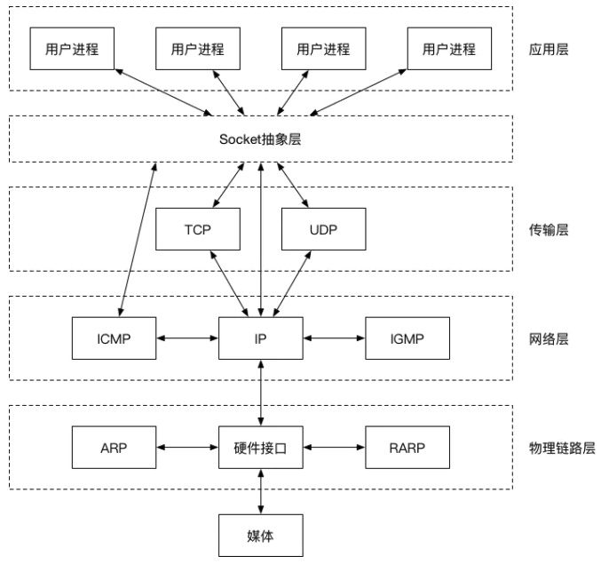
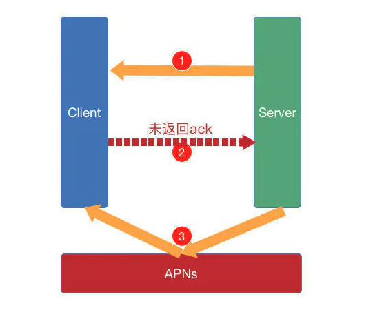

### Socket

网络上两个程序通过一个双向通信连接实现数据交互，这种双向通信的连接叫做Socket（套接字）。

网络模型中应用层与TCP/IP协议族通信的中间软件抽象层，是它的一组编程接口（API），也即对TCP/IP的封装。TCP/IP也要提供可供程序员做网络开发所用的接口，即Socket编程接口。




#### 要素

Socket是网络通信的基石，是支持TCP/IP协议的网络通信的基本操作单元，包含进行网络通信的必须的五种信息：

- 连接使用的协议
- 本地主机的IP地址
- 本地进程的协议端口
- 远程主机的IP地址
- 远程进程的协议端口


#### 特性

Socket可以支持不同的传输协议（TCP或UDP），当使用TCP协议进行连接时，该Socket连接就是一个TCP连接；同理，当使用UDP协议进行连接时，该Socket连接就是一个UDP连接。

 多个TCP连接或多个应用程序进程可能需要通过同一个TCP协议端口传输数据。为了区别不同的应用程序进程和连接，计算机操作系统为应用程序与TCP/IP协议交互提供了套接字（Socket）接口。应用层可以和传输层通过Socket接口，区分来自不同应用程序进程或网络连接的通信，实现数据传输的并发服务。


#### 连接

建立Socket连接至少需要一对套接字，分别运行于服务端（ServerSocket）和客户端（ClientSocket）。套接字直接的连接过程氛围三个步骤：

- #####  服务器监听

  服务端Socket始终处于等待连接状态，实时监听是否有客户端请求连接。

  

- ##### 客户端请求

  客户端Socket提出连接请求，指定服务端Socket的地址和端口号，这时就可以向对应的服务端提出Socket连接请求。

  

- ##### 连接确认

  当服务端Socket监听到客户端Socket提出的连接请求时作出响应，建立一个新的进程，把服务端Socket的描述发送给客户端，该描述得到客户端确认后就可建立起Socket连接。而服务端Socket则继续处于监听状态，继续接收其他客户端Socket的请求。


#### CocoaAsyncSocket介绍

[**CocoaAsyncSocket**](https://links.jianshu.com/go?to=https%3A%2F%2Fgithub.com%2Frobbiehanson%2FCocoaAsyncSocket)为Mac和iOS提供了易于使用和功能强大的异步套接字库，主要包含两个类:

- **GCDAsyncSocket**
   用GCD搭建的基于TCP/IP协议的socket网络库
- **GCDAsyncUdpSocket**
   用GCD搭建的基于UDP/IP协议的socket网络库.

#### 客户端

1. ##### 初始化

```
@property (nonatomic, strong) GCDAsyncSocket *clientSocket;

self.clientSocket = [[GCDAsyncSocket alloc] initWithDelegate:self delegateQueue:dispatch_get_main_queue()];
```

需要`delegate`和`delegate_queue`才能使GCDAsyncSocket调用您的委托方法。提供`delegateQueue`是一个新概念。`delegateQueue`要求必须是一个串行队列，使得委托方法在delegateQueue队列中执行。


##### 2.连接服务器

```
NSError *err = nil;
if (![self.clientSocket connectToHost:@"ip地址" onPort: "端口号" error:&err])  //异步！
{
    //  如果有错误，很可能是"已经连接"或"没有委托集"
    NSLog(@"I goofed: %@", err);
}
```

连接方法是异步的。这意味着当您调用connect方法时，它们会启动后台操作以连接到所需的主机/端口。

##### 3.发送数据

```
//  发送数据
- (void)sendData:(NSData *)data{
     // -1表示超时时间无限大
     // tag:消息标记
     [self.clientSocket writeData:data withTimeout:-1 tag:0];
}
```

通过调用`writeData: withTimeout: tag:`方法，即可发送数据给服务器。


##### 4.委托方法

###### 4.1连接成功会是执行的委托方法

```
// socket连接成功会执行该方法
- (void)socket:(GCDAsyncSocket*)sock didConnectToHost:(NSString*)host port:(UInt16)port{
    NSLog(@"--连接成功--");
    [sock readDataWithTimeout:-1 tag:0];
}
```

###### 4.2读取到了服务端数据委托方法

```
// 收到服务器发送的数据会执行该方法
- (void)socket:(GCDAsyncSocket *)sock didReadData:(NSData *)data withTag:(long)tag{
    NSString *serverStr = [[NSString alloc]initWithData:data encoding:NSUTF8StringEncoding];
    NSLog(@"服务端回包了--回包内容--%@---长度%lu",serverStr,(unsigned long)data.length);
    [sock readDataWithTimeout:-1 tag:0];
}
```

###### 4.3断开连接委托方法

```
// 断开连接会调取该方法
- (void)socketDidDisconnect:(GCDAsyncSocket*)sock withError:(NSError*)err{
    NSLog(@"--断开连接--");
    //  sokect断开连接时,需要清空代理和客户端本身的socket.
    self.clientSocket.delegate = nil;
    self.clientSocket = nil;
}
```


##### 5 、心跳包

**心跳包**就是在`客户端`和`服务器`间定时通知对方自己状态的一个自己定义的命令，按照一定的时间间隔发送，类似于心跳
 用来判断对方（设备，进程或其它网元）是否正常运行，采用定时发送简单的通讯包，如果在指定时间段内未收到对方响应，则判断对方已经离线。


```objectivec
@property(nonatomic, strong) NSTimer *heartbeatTimer;

- (void)beginSendHeartbeat{
    // 创建心跳定制器
    self.heartbeatTimer = [NSTimer scheduledTimerWithTimeInterval:5.0 target:self selector:@selector(sendHeartbeat:) userInfo:nil repeats:YES];
    [[NSRunLoop mainRunLoop] addTimer:self.heartbeatTimer forMode:NSRunLoopCommonModes];
}

- (void)sendHeartbeat:(NSTimer *)timer {
    if (timer != nil) {
        char heartbeat[4] = {0xab,0xcd,0x00,0x00}; // 心跳字节，和服务器协商
        NSData *heartbeatData = [NSData dataWithBytes:&heartbeat length:sizeof(heartbeat)];
        [self.clientSocket writeData:heartbeatData withTimeout:-1 tag:0];
    }
}
```


这个框架使用起来也十分简单，它基于Scoket往上进行了一层封装，提供了OC的接口给我们使用。至于使用方法，大家看看注释应该就能明白，这里唯一需要说的一点就是这个方法：

```
[gcdSocket readDataWithTimeout:-1 tag:110];
```

这个方法的作用就是去读取当前消息队列中的未读消息。**记住，这里不调用这个方法，消息回调的代理是永远不会被触发的。**而且必须是tag相同，如果tag不同，这个收到消息的代理也不会被处罚。


我们调用一次这个方法，只能触发一次读取消息的代理，如果我们调用的时候没有未读消息，它就会等在那，直到消息来了被触发。一旦被触发一次代理后，我们必须再次调用这个方法，否则，之后的消息到了仍旧无法触发我们读取消息的代理。就像我们在例子中使用的那样，在每次读取到消息之后我们都去调用:

```
//收到消息的回调
- (void)socket:(GCDAsyncSocket *)sock didReadData:(NSData *)data withTag:(long)tag
{
    NSString *msg = [[NSString alloc]initWithData:data encoding:NSUTF8StringEncoding];
    NSLog(@"收到消息：%@",msg);
    [self pullTheMsg];
}
//监听最新的消息
- (void)pullTheMsg
{
    //监听读数据的代理，只能监听10秒，10秒过后调用代理方法  -1永远监听，不超时，但是只收一次消息，
    //所以每次接受到消息还得调用一次
    [gcdSocket readDataWithTimeout:-1 tag:110];

}
```

除此之外，我们还需要说的是这个超时`timeout`
这里如果设置10秒，那么就只能监听10秒，10秒过后调用是否续时的代理方法:

```
-(NSTimeInterval)socket:(GCDAsyncSocket *)sock shouldTimeoutReadWithTag:(long)tag elapsed:(NSTimeInterval)elapsed bytesDone:(NSUInteger)length;
```

如果我们选择不续时，那么10秒到了还没收到消息，那么`Scoket`会自动断开连接。看到这里有些小伙伴要吐槽了，怎么一个方法设计的这么麻烦，当然这里这么设计是有它的应用场景的，我们后面再来细讲。


#### Tcp 粘包

##### 1. 什么是tcp粘包？

`TCP`是面向连接的，面向流的，提供高可靠性服务。收发两端（客户端和服务器端）都要有一一成对的socket，因此，发送端为了将多个发往接收端的包，更有效的发到对方，使用了优化方法`（Nagle算法）`，将多次间隔较小且数据量小的数据，合并成一个大的数据块，然后进行封包。这样，接收端，就难于分辨出来了,就会出现粘包现象


##### 2. TCP粘包解决方案

目前应用最广泛的是在消息的头部添加数据包长度，接收方根据消息长度进行接收；在一条TCP连接上，数据的流式传输在接收缓冲区里是有序的，其主要的问题就是第一个包的包尾与第二个包的包头共存接收缓冲区，所以根据长度读取是十分合适的；

###### 2.1 解决发送方粘包

 数据包中加头，头部信息为整个数据的长度`（最广泛最常用）`；

```
//  `方案三`发送方解决粘包的代码部分：
- (void)sendData:(NSData *)data{
        
        NSMutableData *sendData = [NSMutableData data];
        // 获取数据长度
        NSInteger datalength = data.length;
        //  NSInteger长度转 NSData
        NSData *lengthData = [NSData dataWithBytes:&datalength length:sizeof(datalength)];
        // 长度几个字节和服务器协商好。这里我们用的是4个字节存储长度信息
        NSData *newLengthData = [lengthData subdataWithRange:NSMakeRange(0, 4)];
        // 拼接长度信息
        [sendData appendData:newLengthData];
        //拼接数据
        [sendData appendData:data];
        // 发送加了长度信息的包
        [self.clientSocket writeData:[sendData copy] withTimeout:-1 tag:0];
}

```

###### 2.2解决接收方粘包

1. 解析数据包头部信息，根据长度来接收；`（最广泛最常用）`

   ```
   /**
    数据缓冲区
    */
   @property (nonatomic, strong) NSMutableData *dataBuffer;;
   
   //  读取客户端发送的数据,通过包头长度进行拆包
   - (void)socket:(GCDAsyncSocket *)sock didReadData:(NSData *)data withTag:(long)tag {
       
           //  数据存入缓冲区
           [self.dataBuffer appendData:data];
           
           // 如果长度大于4个字节，表示有数据包。4字节为包头，存储包内数据长度
           while (self.dataBuffer.length >= 4) {
               
               NSInteger  datalength = 0;
               // 获取包头，并获取长度
               [[self.dataBuffer subdataWithRange:NSMakeRange(0, 4)] getBytes:&datalength length:sizeof(datalength)];
               //  判断缓存区内是否有包
               if (self.dataBuffer.length >= (datalength+4)) {
                   // 获取去掉包头的数据
                   NSData *realData = [[self.dataBuffer subdataWithRange:NSMakeRange(4, datalength)] copy];
                   // 解析处理
                   [self handleData:realData socket:sock];
                   
                   // 移除已经拆过的包
                   self.dataBuffer = [NSMutableData dataWithData:[self.dataBuffer subdataWithRange:NSMakeRange(datalength+4, self.dataBuffer.length - (datalength+4))]];
               }else{
                   break;
               }
           }
           [sock readDataWithTimeout:-1 tag:0];
   }
   ```

   

2. 自定义数据格式：在数据中放入开始、结束标识；解析时根据格式抓取数据，缺点是数据内不能含有开始或结束标识

3. 短连接传输，建立一次连接只传输一次数据就关闭；（不推荐）

   

   

   当然除了优化算法，TCP和UDP都会因为下面两种情况造成粘包：

   - **发送端需要等缓冲区满才发送出去，造成粘包**
   - **接收方不及时接收缓冲区的包，造成多个包接收。**


[高仿微信聊天界面：基于CocoaAsyncSocket的即时通讯实现(IM 微信)](https://blog.csdn.net/weixin_42433480/article/details/87461720)


[iOS即时通讯，从入门到“放弃”？](https://www.jianshu.com/p/2dbb360886a8)


##### 谈谈什么是心跳？

简单的来说，**心跳就是用来检测TCP连接的双方是否可用。**那又会有人要问了，TCP不是本身就自带一个`KeepAlive`机制吗？
 **这里我们需要说明的是TCP的`KeepAlive`机制只能保证连接的存在，但是并不能保证客户端以及服务端的可用性.**

比如会有以下一种情况：某台服务器因为某些原因导致负载超高，CPU 100%，无法响应任何业务请求，但是使用 TCP 探针则仍旧能够确定连接状态，这就是典型的连接活着但业务提供方已死的状态。


这个时候心跳机制就起到作用了：

- 我们客户端发起心跳Ping（一般都是客户端），假如设置在10秒后如果没有收到回调，那么说明服务器或者客户端某一方出现问题，这时候我们需要主动断开连接(`PingPong`机制)。
- 服务端也是一样，会维护一个socket的心跳间隔，当约定时间内，没有收到客户端发来的心跳，我们会知道该连接已经失效，然后主动断开连接。

**其实做过IM的小伙伴们都知道，我们真正需要心跳机制的原因其实主要是在于国内运营商`NAT`超时。**


我们的设备经常是处在NAT设备的后面, 比如在大学里的校园网, 查一下自己分配到的IP, 其实是内网IP, 表明我们在NAT设备后面, 如果我们在寝室再接个路由器, 那么我们发出的数据包会多经过一次NAT.

国内移动无线网络运营商在链路上一段时间内没有数据通讯后, 会淘汰NAT表中的对应项, 造成链路中断。

**而国内的运营商一般NAT超时的时间为5分钟，所以通常我们心跳设置的时间间隔为3-5分钟。**


##### PingPong机制:

很多小伙伴可能又会感觉到疑惑了，那么我们在这心跳间隔的3-5分钟如果连接假在线（例如在地铁电梯这种环境下）。那么我们岂不是无法保证消息的即时性么？这显然是我们无法接受的，所以业内的解决方案是采用双向的`PingPong`机制。



当服务端发出一个`Ping`，客户端没有在约定的时间内返回响应的`ack`，则认为客户端已经不在线，这时我们`Server`端会主动断开`Scoket`连接，并且改由`APNS`推送的方式发送消息。


同样的是，当客户端去发送一个消息，因为我们迟迟无法收到服务端的响应ack包，则表明客户端或者服务端已不在线，我们也会显示消息发送失败，并且断开`Scoket`连接。

还记得我们之前`CocoaSyncSockt`的例子所讲的获取消息超时就断开吗？其实它就是一个`PingPong`机制的客户端实现。我们每次可以在发送消息成功后，调用这个超时读取的方法，如果一段时间没收到服务器的响应，那么说明连接不可用，则断开`Scoket`连接。


##### 重连机制:

理论上，我们自己主动去断开的`Scoket`连接（例如退出账号，APP退出到后台等等），不需要重连。其他的连接断开，我们都需要进行断线重连。
 一般解决方案是尝试重连几次，如果仍旧无法重连成功，那么不再进行重连。
 接下来的`WebScoket`的例子，我会封装一个重连时间指数级增长的一个重连方式，可以作为一个参考。


### SocketRocket

`WebScoket`最具代表性的一个第三方框架：**SocketRocket**

```
#import "TYHSocketManager.h"
#import "SocketRocket.h"

#define dispatch_main_async_safe(block)\
    if ([NSThread isMainThread]) {\
        block();\
    } else {\
        dispatch_async(dispatch_get_main_queue(), block);\
    }

static  NSString * Khost = @"127.0.0.1";
static const uint16_t Kport = 6969;


@interface TYHSocketManager()<SRWebSocketDelegate>
{
    SRWebSocket *webSocket;
    NSTimer *heartBeat;
    NSTimeInterval reConnectTime;
    
}

@end

@implementation TYHSocketManager

+ (instancetype)share
{
    static dispatch_once_t onceToken;
    static TYHSocketManager *instance = nil;
    dispatch_once(&onceToken, ^{
        instance = [[self alloc]init];
        [instance initSocket];
    });
    return instance;
}

//初始化连接
- (void)initSocket
{
    if (webSocket) {
        return;
    }
    
    
    webSocket = [[SRWebSocket alloc]initWithURL:[NSURL URLWithString:[NSString stringWithFormat:@"ws://%@:%d", Khost, Kport]]];
    
    webSocket.delegate = self;
    
    //设置代理线程queue
    NSOperationQueue *queue = [[NSOperationQueue alloc]init];
    queue.maxConcurrentOperationCount = 1;
    
    [webSocket setDelegateOperationQueue:queue];
    
    //连接
    [webSocket open];
    
    
}

//初始化心跳
- (void)initHeartBeat
{
    
    dispatch_main_async_safe(^{
        
        [self destoryHeartBeat];
        
        __weak typeof(self) weakSelf = self;
        //心跳设置为3分钟，NAT超时一般为5分钟
        heartBeat = [NSTimer scheduledTimerWithTimeInterval:3*60 repeats:YES block:^(NSTimer * _Nonnull timer) {
            NSLog(@"heart");
            //和服务端约定好发送什么作为心跳标识，尽可能的减小心跳包大小
            [weakSelf sendMsg:@"heart"];
        }];
        [[NSRunLoop currentRunLoop]addTimer:heartBeat forMode:NSRunLoopCommonModes];
    })
    
}

//取消心跳
- (void)destoryHeartBeat
{
    dispatch_main_async_safe(^{
        if (heartBeat) {
            [heartBeat invalidate];
            heartBeat = nil;
        }
    })
   
}


#pragma mark - 对外的一些接口

//建立连接
- (void)connect
{
    [self initSocket];
    
    //每次正常连接的时候清零重连时间
    reConnectTime = 0;
}

//断开连接
- (void)disConnect
{
    
    if (webSocket) {
        [webSocket close];
        webSocket = nil;
    }
}


//发送消息
- (void)sendMsg:(NSString *)msg
{
    [webSocket send:msg];
    
}

//重连机制
- (void)reConnect
{
    [self disConnect];
    
    //超过一分钟就不再重连 所以只会重连5次 2^5 = 64
    if (reConnectTime > 64) {
        return;
    }
    
    dispatch_after(dispatch_time(DISPATCH_TIME_NOW, (int64_t)(reConnectTime * NSEC_PER_SEC)), dispatch_get_main_queue(), ^{
        webSocket = nil;
        [self initSocket];
    });
    
    
    //重连时间2的指数级增长
    if (reConnectTime == 0) {
        reConnectTime = 2;
    }else{
        reConnectTime *= 2;
    }

}


//pingPong
- (void)ping{
    
    [webSocket sendPing:nil];
}


#pragma mark - SRWebSocketDelegate

- (void)webSocket:(SRWebSocket *)webSocket didReceiveMessage:(id)message
{
    NSLog(@"服务器返回收到消息:%@",message);
}


- (void)webSocketDidOpen:(SRWebSocket *)webSocket
{
    NSLog(@"连接成功");
    
    //连接成功了开始发送心跳
    [self initHeartBeat];
}

//open失败的时候调用
- (void)webSocket:(SRWebSocket *)webSocket didFailWithError:(NSError *)error
{
    NSLog(@"连接失败.....\n%@",error);
    
    //失败了就去重连
    [self reConnect];
}

//网络连接中断被调用
- (void)webSocket:(SRWebSocket *)webSocket didCloseWithCode:(NSInteger)code reason:(NSString *)reason wasClean:(BOOL)wasClean
{

    NSLog(@"被关闭连接，code:%ld,reason:%@,wasClean:%d",code,reason,wasClean);
    
    //如果是被用户自己中断的那么直接断开连接，否则开始重连
    if (code == disConnectByUser) {
        [self disConnect];
    }else{
        
        [self reConnect];
    }
    //断开连接时销毁心跳
    [self destoryHeartBeat];

}

//sendPing的时候，如果网络通的话，则会收到回调，但是必须保证ScoketOpen，否则会crash
- (void)webSocket:(SRWebSocket *)webSocket didReceivePong:(NSData *)pongPayload
{
    NSLog(@"收到pong回调");

}


//将收到的消息，是否需要把data转换为NSString，每次收到消息都会被调用，默认YES
//- (BOOL)webSocketShouldConvertTextFrameToString:(SRWebSocket *)webSocket
//{
//    NSLog(@"webSocketShouldConvertTextFrameToString");
//
//    return NO;
//}

```


需要说一下的是这个心跳机制是一个定时的间隔，往往我们可能会有更复杂实现，比如我们正在发送消息的时候，可能就不需要心跳。当不在发送的时候在开启心跳之类的。微信有一种更高端的实现方式，有兴趣的小伙伴可以看看：

[微信的智能心跳实现方式](https://link.jianshu.com/?t=http://www.52im.net/thread-120-1-1.html)

还有一点需要说的就是这个重连机制，demo中我采用的是2的指数级别增长，第一次立刻重连，第二次2秒，第三次4秒，第四次8秒...直到大于64秒就不再重连。而任意的一次成功的连接，都会重置这个重连时间。


最后一点需要说的是，这个框架给我们封装的`webscoket`在调用它的`sendPing`方法之前，一定要判断当前`scoket`是否连接，如果不是连接状态，程序则会`crash`。


### **WebSocket与Socket的关系**

Socket其实并不是一个协议，而是为了方便使用TCP或UDP而抽象出来的一层，是位于应用层和传输控制层之间的一组接口。

Socket是应用层与TCP/IP协议族通信的中间软件抽象层，它是一组接口。

在设计模式中，Socket其实就是一个门面模式，它把复杂的TCP/IP协议族隐藏在Socket接口后面，对用户来说，一组简单的接口就是全部，让Socket去组织数据，以符合指定的协议。当两台主机通信时，必须通过Socket连接，Socket则利用TCP/IP协议建立TCP连接。TCP连接则更依靠于底层的IP协议，IP协议的连接则依赖于链路层等更低层次。

WebSocket则是一个典型的应用层协议。Socket是传输控制层协议，WebSocket是应用层协议。


HTTP协议是非持久化的，单向的网络协议，在建立连接后只允许浏览器向服务器发出请求后，服务器才能返回相应的数据。当需要即时通讯时，通过轮询在特定的时间间隔（如1秒），由浏览器向服务器发送Request请求，然后将最新的数据返回给浏览器。这样的方法最明显的缺点就是需要不断的发送请求，而且通常HTTP request的Header是非常长的，为了传输一个很小的数据 需要付出巨大的代价，是很不合算的，占用了很多的宽带。

缺点：会导致过多不必要的请求，浪费流量和服务器资源，每一次请求、应答，都浪费了一定流量在相同的头部信息上

然而WebSocket的出现可以弥补这一缺点。在WebSocket中，只需要服务器和浏览器通过HTTP协议进行一个握手的动作，然后单独建立一条TCP的通信通道进行数据的传送。

**原理：**WebSocket同HTTP一样也是应用层的协议，但是它是一种双向通信协议，是建立在TCP之上的。

连接过程 —— 握手过程

1. 浏览器、服务器建立TCP连接，三次握手。这是通信的基础，传输控制层，若失败后续都不执行。

2. TCP连接成功后，浏览器通过HTTP协议向服务器传送WebSocket支持的版本号等信息。（开始前的HTTP握手）

3. 服务器收到客户端的握手请求后，同样采用HTTP协议回馈数据。

4. 当收到了连接成功的消息后，通过TCP通道进行传输通信。

  

#### **WebSocket与HTTP的关系**

相同点

- 都是一样基于TCP的，都是可靠性传输协议。
- 都是应用层协议。

不同点

- WebSocket是双向通信协议，模拟Socket协议，可以双向发送或接受信息。HTTP是单向的。
- WebSocket是需要握手进行建立连接的。

联系

- WebSocket在建立握手时，数据是通过HTTP传输的。但是建立之后，在真正传输时候是不需要HTTP协议的。


**WebSocket 机制**

WebSocket 是 HTML5 一种新的协议。它实现了浏览器与服务器全双工通信，能更好的节省服务器资源和带宽并达到实时通讯，它建立在 TCP 之上，同 HTTP 一样通过 TCP 来传输数据，但是它和 HTTP 最大不同是：

WebSocket 是一种双向通信协议，在建立连接后，WebSocket 服务器和 Browser/Client Agent 都能主动的向对方发送或接收数据，就像 Socket 一样；WebSocket 需要类似 TCP 的客户端和服务器端通过握手连接，连接成功后才能相互通信。


相对于传统 HTTP 每次请求-应答都需要客户端与服务端建立连接的模式，WebSocket 是类似 Socket 的 TCP 长连接的通讯模式，一旦 WebSocket 连接建立后，后续数据都以帧序列的形式传输。在客户端断开 WebSocket 连接或 Server 端断掉连接前，不需要客户端和服务端重新发起连接请求。在海量并发及客户端与服务器交互负载流量大的情况下，极大的节省了网络带宽资源的消耗，有明显的性能优势，且客户端发送和接受消息是在同一个持久连接上发起，实时性优势明显。