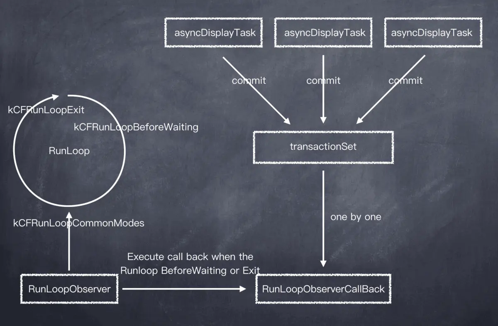

## YYKit里的部分	


### YYCache缓存

https://www.cnblogs.com/machao/p/7086675.html

#### YYMemoryCache

使用YYMemoryCache可以把数据缓存进内存之中，它内部会创建了一个YYMemoryCache对象，然后把数据保存进这个对象之中。

**但凡涉及到类似这样的操作，代码都需要设计成线程安全的。所谓的线程安全就是指充分考虑多线程条件下的增删改查操作。**


YYMemoryCache暴露出来的接口我们在此就略过了，我们都知道**要想高效的查询数据，使用字典是一个很好的方法。字典的原理跟哈希有关，总之就是把key直接映射成内存地址，然后处理冲突和和扩容的问题。**

YYMemoryCache内部封装了一个对象`_YYLinkedMap`，包含了下边这些属性：

```objc
@interface _YYLinkedMap : NSObject {
    @package
    CFMutableDictionaryRef _dic; // do not set object directly
    NSUInteger _totalCost;
    NSUInteger _totalCount;
    _YYLinkedMapNode *_head; // MRU, do not change it directly
    _YYLinkedMapNode *_tail; // LRU, do not change it directly
    BOOL _releaseOnMainThread;
    BOOL _releaseAsynchronously;
}
```

可以看出来，`CFMutableDictionaryRef _dic`将被用来保存数据。这里使用了CoreFoundation的字典，性能更好。字典里边保存着的是`_YYLinkedMapNode`对象。

```objc
/**
 A node in linked map.
 Typically, you should not use this class directly.
 */
@interface _YYLinkedMapNode : NSObject {
    @package
    __unsafe_unretained _YYLinkedMapNode *_prev; // retained by dic
    __unsafe_unretained _YYLinkedMapNode *_next; // retained by dic
    id _key;
    id _value;
    NSUInteger _cost;
    NSTimeInterval _time;
}
@end
```

但看上边的代码，就能知道使用了链表的知识。但是有一个疑问，单用字典我们就能很快的查询出数据，为什么还要实现链表这一数据结构呢？

**答案就是淘汰算法，YYMemoryCache使用了LRU淘汰算法，也就是当数据超过某个限制条件后，我们会从链表的尾部开始删除数据，直到达到要求为止。**

通过这种方式，就实现了类似数组的功能，是原本无序的字典成了有序的集合。


我们简单看一段把一个节点插入到最开始位置的代码：

```objc
- (void)bringNodeToHead:(_YYLinkedMapNode *)node {
    if (_head == node) return;
    
    if (_tail == node) {
        _tail = node->_prev;
        _tail->_next = nil;
    } else {
        node->_next->_prev = node->_prev;
        node->_prev->_next = node->_next;
    }
    node->_next = _head;
    node->_prev = nil;
    _head->_prev = node;
    _head = node;
}
```

如果有一列数据已经按顺序排好了，我使用了中间的某个数据，那么就要把这个数据插入到最开始的位置，这就是一条规则，越是最近使用的越靠前。

在设计上，YYMemoryCache还提供了是否异步释放数据这一选项，在这里就不提了，我们在来看看在YYMemoryCache中用到的锁的知识。

pthread_mutex_lock是一种互斥所：

```objc
pthread_mutex_init(&_lock, NULL); // 初始化
pthread_mutex_lock(&_lock); // 加锁
pthread_mutex_unlock(&_lock); // 解锁
pthread_mutex_trylock(&_lock) == 0 // 是否加锁，0:未锁住，其他值：锁住
```

在OC中有很多种锁可以用，pthread_mutex_lock就是其中的一种。YYMemoryCache有这样一种设置，每隔一个固定的时间就要处理数据，代码如下：

```objc
- (void)_trimRecursively {
    __weak typeof(self) _self = self;
    dispatch_after(dispatch_time(DISPATCH_TIME_NOW, (int64_t)(_autoTrimInterval * NSEC_PER_SEC)), dispatch_get_global_queue(DISPATCH_QUEUE_PRIORITY_LOW, 0), ^{
        __strong typeof(_self) self = _self;
        if (!self) return;
        [self _trimInBackground];
        [self _trimRecursively];
    });
}
```

上边的代码中，每隔_autoTrimInterval时间就会在后台尝试处理数据，然后再次调用自身，这样就实现了一个类似定时器的功能。这一个小技巧可以学习一下。

```
- (void)_trimInBackground {
    dispatch_async(_queue, ^{
        [self _trimToCost:self->_costLimit];
        [self _trimToCount:self->_countLimit];
        [self _trimToAge:self->_ageLimit];
    });
}
```

可以看出处理数据，做了三件事，他们内部的实现基本是一样的，我们选取第一个方法来看看代码：

```objc
- (void)_trimToCost:(NSUInteger)costLimit {
    BOOL finish = NO;
    pthread_mutex_lock(&_lock);
    if (costLimit == 0) {
        [_lru removeAll];
        finish = YES;
    } else if (_lru->_totalCost <= costLimit) {
        finish = YES;
    }
    pthread_mutex_unlock(&_lock);
    if (finish) return;
    
    NSMutableArray *holder = [NSMutableArray new];
    while (!finish) {
        if (pthread_mutex_trylock(&_lock) == 0) {
            if (_lru->_totalCost > costLimit) {
                _YYLinkedMapNode *node = [_lru removeTailNode];
                if (node) [holder addObject:node];
            } else {
                finish = YES;
            }
            pthread_mutex_unlock(&_lock);
        } else {
            usleep(10 * 1000); //10 ms
        }
    }
    if (holder.count) {
        dispatch_queue_t queue = _lru->_releaseOnMainThread ? dispatch_get_main_queue() : YYMemoryCacheGetReleaseQueue();
        dispatch_async(queue, ^{
            [holder count]; // release in queue
        });
    }
}
```

这段代码很经典，可以直接拿来用，我们在某个处理数据的类中，可以直接使用类似这样的代码。如果锁正在使用，那么可以使用`usleep(10 * 1000); //10 ms`等待一小段时间。

上边的代码把需要删除的数据，首先添加到一个数组中，然后使用`[holder count]; // release in queue`释放了资源。

**当某个变量在出了自己的作用域之后，正常情况下就会被自动释放。**


我个人对这些函数的总结是：

- **每个函数只实现先单一功能，函数组合使用形成新的功能**
- **对于类内部的私有方法，前边添加`_`**
- **使用预处理stmt对数据库进行了优化，避免不必要的开销**
- **健壮的错误处理机制**
- **可以说是使用iOS自带sqlite3的经典代码，在项目中可以直接拿来用**

这也许就是函数的魅力，有了这些函数，那么在给接口中的函数写逻辑的时候就会变得很简单。

**建议大家一定要读读YYKVStorage这个类的源码，这是一个类的典型设计。它内部使用了两种方式保存数据：一种是保存到数据库中，另一种是直接写入文件。当数据较大时，使用文件写入性能更好，反之数据库更好。**


#### YYDiskCache


#### YYCache

当我们读到YYCache的时候，感觉一下子就轻松了很多，YYCache就是对YYMemoryCache和YYDiskCache的综合运用，创建YYCache对象后，就创建了一个YYMemoryCache对象和一个YYDiskCache对象。

唯一新增的特性就是可以根据name来创建YYCache，内部会根据那么来创建一个path，本质上还是使用path定位的。


### YYAsyncLayer异步绘制

https://www.jianshu.com/p/154451e4bd42

YYAsyncLayer 是 ibireme 写的一个异步绘制的轮子，虽然代码加起来才 300 行左右，但质量比较高，涉及到很多优化思维，值得学习。





#### UIKit 替代方案：CoreAnimation 或 CoreGraphics

当然，首选优化方案是 CoreAnimation 框架。CALayer 的大部分属性都是由 GPU 绘制的 (硬件层面)，不需要 CPU (软件层面) 做任何绘制。CA 框架下的 `CAShapeLayer` (多边形绘制)、`CATextLayer`(文本绘制)、`CAGradientLayer` (渐变绘制) 等都有较高的效率，非常实用。

再来看一下 CoreGraphics 框架，实际上它是依托于 CPU 的软件绘制。在实现`CALayerDelegate` 协议的 `-drawLayer:inContext:` 方法时（等同于`UIView` 二次封装的 `-drawRect:`方法），需要分配一个内存占用较高的上下文`context`，与此同时，CALayer 或者其子类需要创建一个等大的寄宿图`contents`。当基于 CPU 的软件绘制完成，还需要通过 IPC (进程间通信) 传递给设备显示系统。值得注意的是：当重绘时需要抹除这个上下文重新分配内存。

不管是创建上下文、重绘带来的内存重新分配、IPC 都会带来性能上的较大开销。所以 CoreGraphics 的性能比较差，日常开发中要尽量避免直接在主线程使用。通常情况下，直接给 `CALayer` 的 `contents` 赋值 `CGImage` 图片或者使用 `CALayer` 的衍生类就能实现大部分需求，还能充分利用硬件支持，图像处理交给 GPU 当然更加放心。


#### 多核设备带来的可能性

通过以上说明，可以了解 CoreGraphics 较为糟糕的性能。然而可喜的是，市面上的设备都已经不是单核了，这就意味着可以通过后台线程处理耗时任务，主线程只需要负责调度显示。

ps：关于多核设备的线程性能问题，后面分析源码会讲到

CoreGraphics 框架可以通过图片上下文将绘制内容制作为一张位图，并且这个操作可以在非主线程执行。那么，当有 n 个绘制任务时，可以开辟多个线程在后台异步绘制，绘制成功拿到位图回到主线程赋值给 CALayer 的寄宿图属性。

这就是 YYAsyncLayer 框架的核心思想，该框架还有其他的亮点后文慢慢阐述。

虽然多个线程异步绘制会消耗大量的内存，但是对于性能敏感界面来说，只要工程师控制好内存峰值，可以极大的提高交互流畅度。优化很多时候就是空间换时间，所谓鱼和熊掌不可兼得。这也说明了一个问题，实际开发中要做有针对性的优化，不可盲目跟风。


#### YYSentinel

```objc
.h
@interface YYSentinel : NSObject
@property (readonly) int32_t value;
- (int32_t)increase;
@end

.m
@implementation YYSentinel { int32_t _value; }
- (int32_t)value { return _value; }
- (int32_t)increase { return OSAtomicIncrement32(&_value); }
@end
```

**一看便知，该类扮演的是计数的角色**，值得注意的是，`-increase`方法是使用 `OSAtomicIncrement32()` 方法来对`value`执行自增。

`OSAtomicIncrement32()`是原子自增方法，线程安全。在日常开发中，若需要保证整形数值变量的线程安全，可以使用 OSAtomic 框架下的方法，它往往性能比使用各种“锁”更为优越，并且代码优雅。


#### YYTransaction

YYTransaction 貌似和系统的 CATransaction 很像，他们同为“事务”，但实际上很不一样。通过 CATransaction 的嵌套用法猜测 CATransaction 对任务的管理是使用的一个栈结构，而 YYTransaction 是使用的集合来管理任务。

**YYTransaction 做的事情就是记录一系列事件，并且在合适的时机调用这些事件。**至于为什么这么做，需要先了解 YYTransaction 做了些什么，最终你会恍然大悟😁。


#### YYAsyncLayer

```objc
@interface YYAsyncLayer : CALayer
@property BOOL displaysAsynchronously;
@end
```

YYAsyncLayer 继承自 CALayer，对外暴露了一个方法可开闭是否异步绘制。

**重写绘制方法**

```objc
- (void)setNeedsDisplay {
    [self _cancelAsyncDisplay];
    [super setNeedsDisplay];
}
- (void)display {
    super.contents = super.contents;
    [self _displayAsync:_displaysAsynchronously];
}
```

可以看到两个方法，`-_cancelAsyncDisplay`是取消绘制，稍后解析实现逻辑；`-_displayAsync`是异步绘制的核心方法。

#### YYAsyncLayerDelegate 代理

```objc
@protocol YYAsyncLayerDelegate <NSObject>
@required
- (YYAsyncLayerDisplayTask *)newAsyncDisplayTask;
@end
```


```objc
@interface YYAsyncLayerDisplayTask : NSObject
@property (nullable, nonatomic, copy) void (^willDisplay)(CALayer *layer);
@property (nullable, nonatomic, copy) void (^display)(CGContextRef context, CGSize size, BOOL(^isCancelled)(void));
@property (nullable, nonatomic, copy) void (^didDisplay)(CALayer *layer, BOOL finished);
@end
```

`YYAsyncLayerDisplayTask`是绘制任务管理类，可以通过`willDisplay`和`didDisplay`回调将要绘制和结束绘制时机，最重要的是`display`，需要实现这个代码块，在代码块里面写业务绘制逻辑。


这个代理实际上就是框架和业务交互的桥梁，不过这个设计笔者个人认为有一些冗余，这里如果直接通过代理方法与业务交互而不使用中间类可能看起来更舒服。


#### 异步绘制的核心逻辑

实际上核心代码：

```objc
- (void)_displayAsync:(BOOL)async {
    ...
    dispatch_async(YYAsyncLayerGetDisplayQueue(), ^{
        UIGraphicsBeginImageContextWithOptions(size, opaque, scale);
        CGContextRef context = UIGraphicsGetCurrentContext();
        task.display(context, size, isCancelled);
        UIImage *image = UIGraphicsGetImageFromCurrentImageContext();
        UIGraphicsEndImageContext();
        dispatch_async(dispatch_get_main_queue(), ^{
            self.contents = (__bridge id)(image.CGImage);
        });
    }];
    ...
}
```

**此时就很清晰了，在异步线程创建一个位图上下文，调用`task`的`display`代码块进行绘制（业务代码），然后生成一个位图，最终进入主队列给`YYAsyncLayer`的`contents`赋值`CGImage`由 GPU 渲染过后提交到显示系统。**


#### 及时的结束无用的绘制

针对同一个`YYAsyncLayer`，很有可能新的绘制请求到来时，当前的绘制任务还未完成，而当前的绘制任务是无用的，会继续消耗过多的 CPU (GPU) 资源。当然，这种场景主要是出现在列表界面快速滚动时，由于视图的复用机制，导致重新绘制的请求非常频繁。

为了解决这个问题，作者使用了大量的判断来及时的结束无用的绘制，可以看看源码或者是上文贴出的异步绘制核心逻辑代码，会发现一个频繁的操作：

```objc
YYSentinel *sentinel = _sentinel;
int32_t value = sentinel.value;
BOOL (^isCancelled)(void) = ^BOOL() {
  return value != sentinel.value;
};
```

这就是`YYSentinel`计数类起作用的时候了，这里用一个局部变量`value`来保持当前绘制逻辑的计数值，保证其他线程改变了全局变量`_sentinel`的值也不会影响当前的`value`；若当前`value`不等于最新的`_sentinel .value`时，说明当前绘制任务已经被放弃，就需要及时的做返回逻辑。

何时改变这个计数？

```csharp
- (void)setNeedsDisplay {
    [self _cancelAsyncDisplay];
    [super setNeedsDisplay];
}
- (void)_cancelAsyncDisplay {
    [_sentinel increase];
}
```

很明显，在提交重绘请求时，计数器加一。


#### 异步线程的管理

笔者去除了判断 YYDispatchQueuePool 库是否存在的代码，实际上那就是作者提取的队列管理封装，思想和以下代码一样。

```objc
static dispatch_queue_t YYAsyncLayerGetDisplayQueue() {
//最大队列数量
#define MAX_QUEUE_COUNT 16
//队列数量
    static int queueCount;
//使用栈区的数组存储队列
    static dispatch_queue_t queues[MAX_QUEUE_COUNT];
    static dispatch_once_t onceToken;
    static int32_t counter = 0;
    dispatch_once(&onceToken, ^{
//要点 1 ：串行队列数量和处理器数量相同
        queueCount = (int)[NSProcessInfo processInfo].activeProcessorCount;
        queueCount = queueCount < 1 ? 1 : queueCount > MAX_QUEUE_COUNT ? MAX_QUEUE_COUNT : queueCount;
//要点 2 ：创建串行队列，设置优先级
        if ([UIDevice currentDevice].systemVersion.floatValue >= 8.0) {
            for (NSUInteger i = 0; i < queueCount; i++) {
                dispatch_queue_attr_t attr = dispatch_queue_attr_make_with_qos_class(DISPATCH_QUEUE_SERIAL, QOS_CLASS_USER_INITIATED, 0);
                queues[i] = dispatch_queue_create("com.ibireme.yykit.render", attr);
            }
        } else {
            for (NSUInteger i = 0; i < queueCount; i++) {
                queues[i] = dispatch_queue_create("com.ibireme.yykit.render", DISPATCH_QUEUE_SERIAL);
                dispatch_set_target_queue(queues[i], dispatch_get_global_queue(DISPATCH_QUEUE_PRIORITY_DEFAULT, 0));
            }
        }
    });
//要点 3 ：轮询返回队列
    int32_t cur = OSAtomicIncrement32(&counter);
    if (cur < 0) cur = -cur;
    return queues[(cur) % queueCount];
#undef MAX_QUEUE_COUNT
}
```

##### 要点 1 ：串行队列数量和处理器数量相同

首先要明白，**并发** 和 **并行** 的区别：
 并行一定并发，并发不一定并行。在单核设备上，CPU通过频繁的切换上下文来运行不同的线程，速度足够快以至于我们看起来它是‘并行’处理的，然而我们只能说这种情况是并发而非并行。

例如：你和两个人一起百米赛跑，你一直在不停的切换跑道，而其他两人就在自己的跑道上，最终，你们三人同时到达了终点。我们把跑道看做任务，那么，其他两人就是并行执行任务的，而你只能的说是并发执行任务。

所以，实际上一个 n 核设备同一时刻最多能 **并行** 执行 n 个任务，也就是最多有 n 个线程是相互不竞争 CPU 资源的。

当你开辟的线程过多，超过了处理器核心数量，实际上某些并行的线程之间就可能竞争同一个处理器的资源，频繁的切换上下文也会消耗处理器资源。

**所以，笔者认为：超过处理器核心数量的线程没有处理速度上的优势，只是在业务上便于管理，并且能最大化的利用处理器资源。**

而串行队列中只有一个线程，该框架中，作者使用和处理器核心相同数量的串行队列来轮询处理异步任务，有效的减少了线程调度操作。


##### 要点 2 ：创建串行队列，设置优先级

在 8.0 以上的系统，队列的优先级为 `QOS_CLASS_USER_INITIATED`，低于用户交互相关的`QOS_CLASS_USER_INTERACTIVE`。

在 8.0 以下的系统，通过`dispatch_set_target_queue()`函数设置优先级为`DISPATCH_QUEUE_PRIORITY_DEFAULT`(第二个参数如果使用串行队列会强行将我们创建的所有线程串行执行任务)。

可以猜测主队列的优先级是大于或等于`QOS_CLASS_USER_INTERACTIVE`的，让这些串行队列的优先级低于主队列，避免框架创建的线程和主线程竞争资源。

关于两种类型优先级的对应关系是这样的：

```objc
 *  - DISPATCH_QUEUE_PRIORITY_HIGH:         QOS_CLASS_USER_INITIATED
 *  - DISPATCH_QUEUE_PRIORITY_DEFAULT:      QOS_CLASS_DEFAULT
 *  - DISPATCH_QUEUE_PRIORITY_LOW:          QOS_CLASS_UTILITY
 *  - DISPATCH_QUEUE_PRIORITY_BACKGROUND:   QOS_CLASS_BACKGROUND
```


##### 要点 3 ：轮询返回队列

使用原子自增函数`OSAtomicIncrement32()`对局部静态变量`counter`进行自增，然后通过取模运算轮询返回队列。

注意这里使用了一个判断：`if (cur < 0) cur = -cur;`，当`cur`自增越界时就会变为负数最大值（在二进制层面，是用正整数的反码加一来表示其负数的）。

##### 为什么要使用 n 个串行队列实现并发

可能有人会有疑惑，为什么这里需要使用 n 个串行队列来调度，而不用一个并行队列。

主要是因为并行队列无法精确的控制线程数量，很有可能创建过多的线程，导致 CPU 线程调度过于频繁，影响交互性能。

可能会想到用信号量 (dispatch_semaphore_t) 来控制并发，然而这样只能控制并发的任务数量，而不能控制线程数量，并且使用起来不是很优雅。而使用串行队列就很简单了，我们可以很明确的知道自己创建的线程数量，一切皆在掌控之中。

以上就是 YYKit 对线程处理的核心思想。

