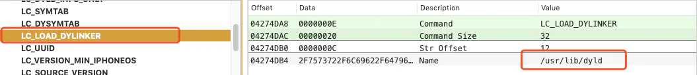

## dyld


### Mach-O

https://www.jianshu.com/p/4ab0e06c5ec9


### dyld

[dyld背后的故事&源码分析](https://juejin.cn/post/6844903782833192968)

#### dyld存在的意义

要弄清楚其合理性所在。先从可执行文件是如何由源码生成的说起。

```c
#include<stdio.h>

int main()
{
	printf("Hello World\n");
	return 0;
}
```

 假设这段代码源文件为hello.c，我们输入最简单的命令：`$gcc hello.c` `$./a.out`，那么终端会输出：Hello World，在这个过程中，事实上经过了四个步骤：预处理、编译、汇编和链接。我们来具体看每一步都做了些什么。


 **预编译**的主要处理规则如下：

1. 删除所有#define，并将所有宏定义展开
2. 将被包含的文件插入到预编译指令(#include)所在位置（这个过程是递归的）
3. 删除所有注释：// 、/* */等
4. 添加行号和文件名标识，以便于编译时编译器产生调试用的行号信息及编译时能够显示警告和错误的所在行号
5. 保留所有的#pragma编译器指令，因为编译器须要使用它们

结合上述规则，当我们无法判断宏定义是否正确或者头文件是否包含时可以查看预编译后的文件来确定问题，预编译的过程相当于如下命令：
 `$gcc -E hello.c -o hello.i` 或
 `$cpp hello.c > hello.i`


 **编译**的过程就是把预处理完的文件进行一系列词法分析、语法分析、语义分析及优化后生产相应的汇编代码文件，这个过程往往是我们整个程序构建的核心部分，也是最复杂的部分之一，编译的具体步骤涉及到编译原理等内容，这里就不展开了。我们使用命令：
 `$gcc -S hello.c -o hello.s`
 可以得到汇编输出文件hello.s。

 对于 C 语言的代码来说，这个预编译和编译的程序是 ccl，但是对于 C++ 来说，对应的程序是 ccplus；Objective-C 的是 ccobjc；Java 是 jcl。所以实际上 gcc 这个命令只是这些后台程序的包装，它会根据不同的参数要求去调用预编译编译程序 ccl、汇编器 as、链接器 ld。


 **汇编器**是将汇编代码转变成机器可以执行的指令，每一个汇编语句几乎都对应一条机器指令。所以汇编器的汇编过程相对于编译器来讲比较简单，它没有复杂的语法，也没有语义，也不需要做指令优化，只是根据汇编指令和机器指令的对照表一一翻译就可以了，我们使用命令：
 `$as hello.s -o hello.o` 或
 `$gcc -c hello.s -o hello.o`
 来完成汇编，输出**目标文件**（Object File）：hello.o。


 **链接**是让很多人费解的一个过程，为什么汇编器不直接输出可执行文件而是一个目标文件呢？链接过程到底包含了什么内容？为什么要链接？


 这就要扯一下计算机程序开发的历史了，最早的时候程序员是在纸带上用机器语言通过打孔来实现程序的，连汇编语言都没有，每当程序修改的时候，修改的指令后面的位置要相应的发生移动，程序员要人工计算每个子程序或跳转的目标地址，这个过程叫**重定位**。很显然这样修改程序的代价随着程序的增大会变得高不可攀，并且很容易出错，于是有先驱发明了汇编语言，汇编语言使用接近人类的各种符号和标记来帮助记忆，更重要的是，这种符号使得人们从具体的指令地址中逐步解放出来，当人们使用这种符号命名子程序或者跳转目标以后，不管目标指令之前修改了多少指令导致目标指令的地址发生了变化，汇编器在每次汇编程序的时候都会重新计算目标指令的地址，然后把所有引用到该指令的指令修正到正确的地址，这个过程不需要人工参与。

 有了汇编语言，生产力极大地提高了，随之而来的是软件的规模与日俱增，代码量快速膨胀，导致人们开始考虑将不同功能的代码以一定的方式组织起来，使得更加容易阅读和理解，更便于日后修改和复用。自然而然的，我们开始习惯用若干个变量和函数组成一个模块（比如类），然后用目录结构来组织这些源代码文件，在一个程序被多个模块分割以后，这些模块最终如何组合成一个单一的程序是须要解决的问题。这个问题归根结底是模块之间如何通信的问题，也就是访问函数需要知道函数的地址，访问变量需要知道变量的地址，这两个问题都是通过模块间符号的引用的方式来解决。这个模块间符号引用拼接的过程就是**链接**。


 **链接**的主要内容就是把各个模块之间相互引用的部分处理好，使得各个模块之间能够正确地衔接。本质上跟前面描述的“程序员人工调整地址”没什么区别，只不过现代的高级语言的诸多特性和功能，使得编译器、链接器更为复杂，功能更强大。**链接**过程包括了**地址和空间分配**、**符号决议**（也叫“符号/地址绑定”，“决议”更倾向于静态链接，而“绑定”更倾向于动态链接，即适用范围的区别）和**重定位**，链接器将经过汇编器编译成的所有目标文件和**库**进行**链接**形成最终的可执行文件，而最常见的库就是**运行时库（RunTime Library）**，它是支持程序运行的基本函数的集合。**库**其实就是一组最常用的代码编译成目标文件后的打包存放。

 知道了可执行文件是如何生成的，我们再来看看它又是如何被装载进系统中运行起来的。

### 

#### 2.可执行文件的装载与动态链接。

#### 装载

 装载与动态链接其实内容特别多，很多细节需要对计算机底层有非常扎实的理解，鉴于目前我的能力尚浅，这里只做粗略的介绍，推荐有兴趣的同学购买《程序员的自我修养--链接、装载与库》这本书了解更多细节。

 可执行文件(程序)是一个静态的概念，在运行之前它只是硬盘上的一个文件；而进程是一个动态的概念，它是程序运行时的一个过程，我们知道每个程序被运行起来后，它会拥有自己独立的**虚拟地址空间**，这个地址空间大小的上限是由计算机的硬件（CPU的位数）决定的，比如32位的处理器理论最大虚拟空间地址为0~2^32-1。即0x00000000~0xFFFFFFFF，当然，我们的程序运行在系统上时是不可能任意使用全部的虚拟空间的，操作系统为了达到监控程序运行等一系列目的，进程的虚拟空间都在操作系统的掌握之中，且在操作系统中会同时运行着多个进程，它们彼此之间的虚拟地址空间是隔离的，如果进程访问了操作系统分配给该进程以外的地址空间，会被系统当做非法操作而强制结束进程。

 将硬盘上的可执行文件映射到虚拟内存中的过程就是**装载**，但内存是昂贵且稀有的，所以将程序执行时所需的指令和数据全部装载到内存中显然是行不通的，于是人们研究发现了程序运行时是有**局部性原**理的，可以只将最常用的部分驻留在内存中，而不太常用的数据存放在磁盘里，这也是**动态装载**的基本原理。**覆盖装入**和**页映射**就是利用了局部性原理的两种经典动态装载方法，前者在发明虚拟内存之前使用比较广泛 ，现在基本已经淘汰，主要使用**页映射**。装载的过程也可以理解为进程建立的过程，操作系统只需要做以下三件事情：

1. 创建一个独立的虚拟地址空间
2. 读取可执行文件头，并且建立虚拟空间与可执行文件的映射关系
3. 将CPU的指令寄存器设置成可执行文件的入口地址，启动运行


#### 动态链接

 前面我们在生成可执行文件时说的链接是静态链接。最后一步是将经过汇编后的所有目标文件与库进行链接形成可执行文件，这里的提到的库，包括了很多**运行时库**。运行时库通常是支持程序运行的基本函数的集合，也就意味着每个进程都会用到它，如果每一个可执行文件都将其打包进自己的可执行文件，都用静态链接的方式，虽然原理上更容易理解，但是这种方式对计算机的内存和磁盘的空间浪费非常严重！在现在的Linux系统中，一个普通的程序会使用到的C语言静态库至少在1M以上，如果系统中有2000个这样的程序在运行，就要浪费将近2G的空间。为了解决这个问题，把运行时库的链接过程推迟到了运行时在进行，这就是**动态链**接（**Dynamic Linking**）的基本思想。动态链接的好处有以下几点：

1. 解决了共享的目标文件存在多个副本浪费磁盘和内存空间的问题
2. 减少物理页面的换入换出，还增加了CPU的缓存命中率，因为不同进程间的数据和指令访问都集中在了同一个共享模块上
3. 系统升级只需要替换掉对应的共享模块，当程序下次启动时新版本的共享模块会被自动装载并链接起来，程序就无感的对接到了新版本。
4. 更方便程序**插件**（Plug-in）的制作，为程序带来更好的可扩展性和兼容性。

 至此，终于说回了我们今天的主角：**dyld**,现在咱们知道了它存在的意义——动态加载的支持。


#### 动态链接的步骤

 现在，我们理解了为什么需要动态链接，dyld作为苹果的动态链接器，但本质上dyld也是一个共享对象：




上图是dyld在系统中的路径，在iPhone中只有获取root权限（也就是越狱）的用户才能访问，后面在逆向实战中会给大家演示。
 既然dyld也是一个共享对象，而普通共享对象的重定位工作又是由dyld来完成的，虽然也可以依赖于其他共享对象，但被依赖的共享对象还是要由dyld来负责链接和装载。那么dyld的重定向由谁来完成呢？dyld是否可以依赖其他的共享对象呢？这是一个“鸡生蛋，蛋生鸡”的问题，为了解决这个问题，**动态链接器**需要有些特殊性：


- 动态链接器本身不依赖其他任何共享对象
- 动态链接器本身所需要的全局和静态变量的重定位工作由它本身完成

上述第一个条件在编写动态链接器时可以人为的控制，第二个条件要求动态链接器在启动时必须有一段代码可以在获得自身的重定位表和符号表的同时又不能用到全局和静态变量，甚至不能调用函数，这样的启动代码被称为**自举**（**Bootstrap**）。当操作系统将进程控制权交给动态链接器时，自举代码开始执行，它会找到动态链接器本身的重定位入口（具体过程和原理暂未深究），进而完成其自身的重定位，在此之后动态链接器中的代码才可以开始使用自己的全局、静态变量和各种函数了。

 完成基本的自举以后，动态链接器将可执行文件和链接器本身的符号表合并为一个，称为**全局符号表**。然后链接器开始寻找可执行文件所依赖的共享对象，如果我们把依赖关系看作一个图的话，那么这个装载过程就是一个图的遍历过程，链接器可能会使用深度优先或者广度优先也可能其他的算法来遍历整个图，比较常见的算法都是广度优先的。

 每当一个新的共享对象被装载进来，它的符号表会被合并到全局符号表中，装载完毕后，链接器开始重新遍历可执行文件和共享对象的重定位表，将每个需要重新定位的位置进行修正，这个过程与静态链接的重定位原理基本相同。重定位完成之后，动态链接器会开始共享对象的初始化过程，但不会开始可执行文件的初始化工作，这将由程序初始化部分的代码负责执行。当完成了重定位和初始化之后，所有的准备工作就宣告完成了，这时动态链接器就如释重负，将进程的控制权交给程序的入口并且开始执行。


#### 源码分析


https://www.jianshu.com/p/be413358cd45

https://juejin.cn/post/6844903782833192968

https://www.jianshu.com/p/693683967718

1.共享缓存库
 在iOS or Mac系统中，几乎所有的程序都会用到动态库，而动态库在加载的时候都需要用dyld（位于/usr/lib/dyld）程序进行链接。很多系统库几乎都是每个程序都要用到的，如果在每个程序运行的时候在一个一个将这些动态库都加载进来，不仅耗费内存,而且耗时。为了降低内存，提高性能,苹果引入了共享缓存库,用来存储系统的库。
 Mac下的共享缓存库位置:/private/var/db/dyld/
 iOS下的共享缓存库位置:/System/Library/Caches/com.apple.dyld/”
 文件名都是以“dyld_shared_cache_”开头，再加上这个dyld缓存文件所支持的指令集。

2.PIC技术(位置独立代码)
 我们都知道C语言是静态的,也就是说,在编译的时候就已经确定了函数的地址。而系统的函数由于共享缓存库的存在,必须是dyld加载的时候(运行时)才能确定,这明显存在矛盾。为了解决这个问题,苹果针对Mach-O文件提供了一种PIC技术,即在MatchO的_Data段中添加懒加载表(Lazy Symbol Pointers)和非懒加载表(Non-Lazy Symbol Pointers)这两个表,让系统的函数在编译的时候先指向懒加载表(Lazy Symbol Pointers)或非懒加载表(Non-Lazy Symbol Pointers)中的符号地址,这两个表中的符号的地址的指向在编译的时候并没有指向任何地方,app启动,被dyld加载到内存,就进行链接, 给这2个表赋值动态缓存库的地址进行符号绑定。


