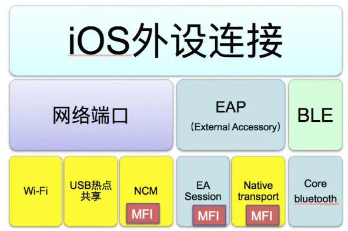
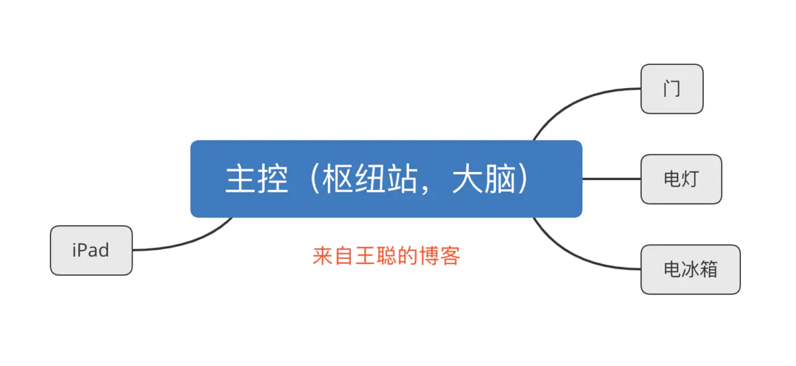

## iOS 连接外设的几种方式

### 一、直接连接的方式

https://www.jianshu.com/p/23806ad32d50

一般iOS开发者做APP开发大部分时候都是通过Http(s)请求跟后台服务器打交道，做一些信息展示和用户交互。

很少涉及到去跟外部硬件设备连接的开发。随着近年来车联网和物联网的兴起，智能家居和智能硬件的逐步火热，越来越多的app被开发出来，用来跟硬件设备进行来连接，获取硬件相关信息展示或者发送指令控制硬件来提供服务。故本文就针对iOS的app如何跟外部设备进行连接通信这个问题跟大家交流一下。

总的来说可以分为三大类：

#### 1、网络端口

**第一类是通过网络端口，建立Socket使用TCP/IP协议族进行通信，天然支持多通道**，想要几个通道就建几个socket就行了。

##### wifi、热点共享

优点是：简单，不需要集成MFi芯片，只要对应的硬件有无线网卡，然后手机和硬件连接到同一个局域网中就可以使用socket通过网络协议通信了。

缺点也很明显：（1)无线连接信号容易受到干扰，不太稳定，容易断开；（2）如果硬件使用的场合没有公共wifi，就需要手机自建热点共享，硬件进行热点接入，操作步骤较多，对用户来说学习使用成本较高，并且热点共享要求手机本身的数据移动网络是稳定的，在没有移动数据网络信号的地方，热点无法建立。

##### NCM

使用网络端口的第三种方式是NCM，就是把USB端口虚拟成标准的网络端口，然后手机和外设就能通过有线网络直连了，可以理解成手机和外设通过一跟网线连起来了，然后就可以用socket通过TCP，UDP进行通信了。

它的优点是：有线连接，非常稳定，带宽足够；也不依赖移动网络信号；

但是它的缺点就是：需要集成MFI芯片并进行MFI认证，有一定门槛。更变态的是这么好的一种方式，目前苹果只提到可以在它自己的CarPlay使用，其他硬件并没有说禁止或者允许使用。如果硬件使用NCM跟iOS系统的App通信，可能通过MFI认证是有风险的。

#### 2、EAP

**iOS App连接外部硬件的第二大类是EAP，全拼是External Accessory Protocol，外部设备协议**。

这个是苹果推荐使用的外设连接方式。需要外设集成MFI芯片进行MFI认证。

手机端开发相对简单，只要集成 iOS系统提供的一个框架ExternalAccessory.framework，并且在info.plist中配置好协议字符串(Supported external accessory protocols），当iOS 设备通过USB线或者蓝牙连接到对应硬件时，iOS系统会把符合MFI认证要求的外设抽象成了一个流对象，App通过指定的协议字符串来创建一个EASession类的实例来访问到该流对象，就能通过NSInputStream和NSOutputStream跟硬件件进行通信了。

它有两种模式，一种是叫EASession的模式，它带宽相对较低，但是允许同时通过多个协议字符串创建多个会话，也就是说直接支持多个通道；

另外一种是Native Transport的模式，这种模式的优点是带宽足够大，理论值是100MB以上，但是不支持多通道，如果业务层需要支持多数据通道的话需要App自己进行通道的复用与拆分，并且Native Transport需要iPhone工作在USB host模式，硬件需要支持USB 模式切换。

#### 3、蓝牙 BLE

**第三大类就是BLE，低功耗蓝牙，是iOS7.0以后才支持的连接方式**。

它的优点是不需要集成MFI芯片做认证，功耗低，手机端开发也相对简单，集成iOS系统提供的CoreBluetooth.framework就行。

缺点是：带宽很低，一般适合于只需要传输少量数据的场景。比如前两年非常火爆的各种所谓智能硬件，像智能水杯，智能体重计，运动手环等，都是采用这种连接方式。

#### 总结一下

**图中带MFI字样的表示该连接方式需要硬件集成MFi芯片，做MFi认证**。

关于苹果的MFI认证，对iOS开发中来说其实是一个比较陌生并且繁琐的topic，原因如下：

（1）网上鲜有资料，Google基本上查不到。 因为MFi认证是由硬件生产商主导进行的，苹果首先对硬件生产商的实力（质量，信誉，生产规模）有很苛刻的要求，满足要求的才有进行MFI认证的资格。满足MFi认证资格要求的硬件生产商，提交了MFi产品计划后才能得到苹果MFi开发的官方文档，这个文档是带水印的，不允许外泄；

（2）MFi认证周期很长，过程也很复杂；

（3）苹果官方沟通渠道很窄，电话打不通，邮件回复不及时。

### 二、间接连接的方式

项目中用到了iPad、iPhone驱动硬件来工作，也就是智能硬件的实现。

下面简单说下原理，详细说下socket，wifi通信，数据处理接收，发送，以及数据解析代码。

首先，来说下通信。

因为硬件部件比较多，我们采取的是，iPad、iPhone与主控板进行交换数据，主控板来与各硬件部件进行通信。

看图：

其中，主控与零部件间及时通讯，零部件实时把状态上报给主控。

**当然，iPad、iPhone与主控板也是及时通讯，主控需要每秒都上报给iPad、iPhone各个硬件的当前状态，以供iPad、iPhone可以实时监控各零部件并且显示不同的状态，比如“ipad、iPhone上实时显示电冰箱的温度”。**

涉及到：

> 1. 与主控建立连接，
>
> 2. 并保持长链接，实时接收解析主控发来的零部件状态，
> 3. 以及iPad、iPhone给主控发指令来驱动硬件动作，比如“iPad、iPhone发送指令让电灯关闭”。

### 2、iOS中的WiFi与硬件通信

https://www.jianshu.com/p/bcb104f8b8e9

