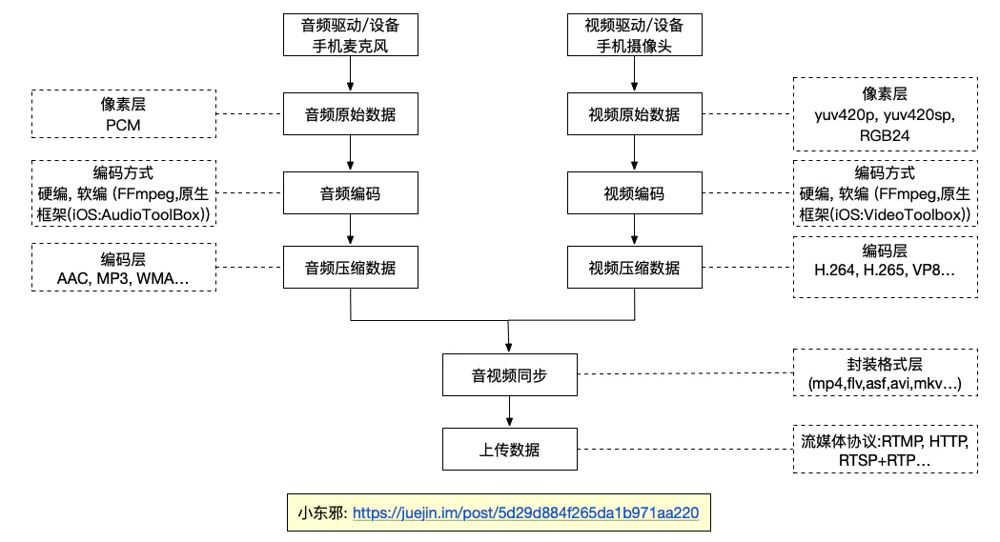
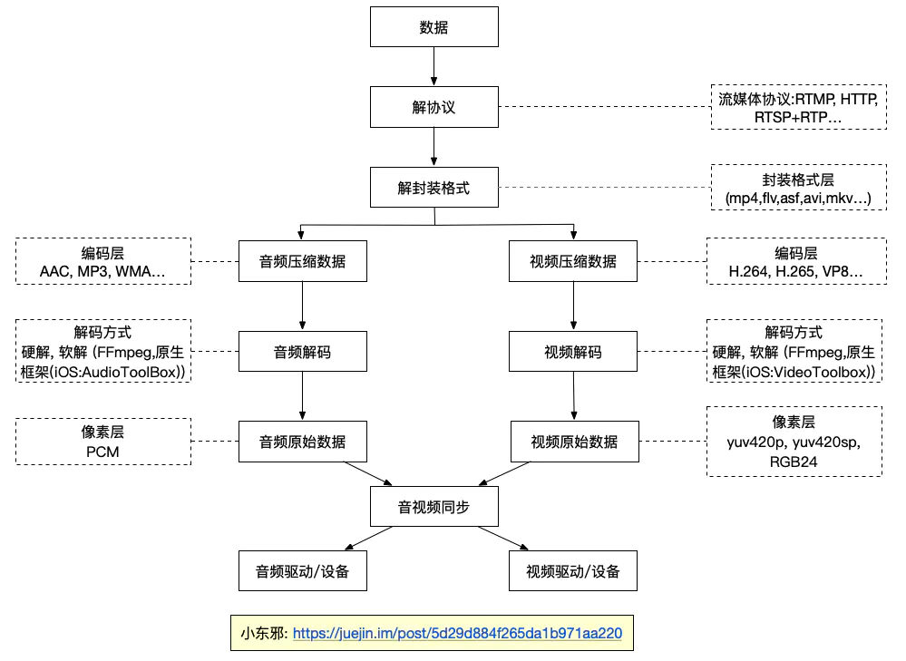

## 音视频基础

https://juejin.cn/post/6844903889007820813

https://www.jianshu.com/p/bd42bacbe4cc


### 1. 采集

采集是推流的第一个环节，是原始的音视频数据的来源.采集的原始数据类型为音频数据PCM，视频数据YUV,RGB...。


#### 音频采集

采集来源

- 内置麦克风
- 外置具有麦克风功能的设备(相机，话筒...)
- 系统自带相册


音频主要参数

- 采样率(samplerate): 模拟信号数字化的过程,每秒钟采集的数据量,采样频率越高,数据量越大,音质越好。
- 声道数(channels): 即单声道或双声道 (iPhone无法直接采集双声道，但可以模拟,即复制一份采集到的单声道数据.安卓部分机型可以)
- 位宽: 每个采样点的大小,位数越多,表示越精细,音质越好,一般是8bit或16bit.
- 数据格式: iOS端设备采集的原始数据为线性PCM类型音频数据
- 其他: 还可以设置采样值的精度,每个数据包有几帧数据,每帧数据占多少字节等等.


音频帧

音频与视频不同,视频每一帧就是一张图片,音频是流式,本身没有明确的帧的概念,实际中为了方便,取2.5ms~60ms为单位的数据为一帧音频.


计算

数据量（字节 / 秒）=（采样频率（Hz）* 采样位数（bit）* 声道数）/ 8

单声道的声道数为1，立体声的声道数为2. 字节B，1MB=1024KB = 1024*1024B


#### 视频采集

采集来源

- 摄像头
- 屏幕录制
- 外置带摄像头采集功能的设备(相机，DJI无人机，OSMO...)
- 系统自带相册


视频主要参数

- 图像格式: YUV, RGB (即红黄蓝三种颜色混合组成各种颜色).
- 分辨率: 当前设备屏幕支持的最大分辨率
- 帧率: 一秒钟采集的帧数
- 其他: 白平衡,对焦,曝光,闪光灯等等


计算 (RGB)

1帧数据量 = 分辨率(width * height) * 每个像素的所占字节数(一般是3个字节)


假设要上传的视频是1080P 30fps(分辨率:1920*1080), 声音是48kHz,那么每秒钟数据量如下:

```
video = 1920 * 1080 * 30 * 3 = 186624000B = 186.624 MB
audio = (48000 * 16 * 2) / 8 = 192000B = 0.192 MB 
```


### 2. 处理

我们可以对原始数据加以处理,对原始操作处理只能在编码之前,因为编码后的数据只能用于传输. 

比如可 以对图像处理

- 美颜
- 水印
- 滤镜
- 裁剪
- 旋转

对音频处理

- 混音
- 消除回声
- 降噪
- ...

目前流行的有很多大型框架专门用来处理视频,音频,如OpenGL, OpenAL, GPUImage...

以上的各种处理网上均有开源的库可以实现,

基本原理就是,我们拿到原始的音视频帧数据,将其送给开源库,处理完后再拿到处理好的音视频继续我们自己的流程.

当然很多开源库仍需要根据项目需求略微更改并封装.


### 3.编码


#### 有损压缩 VS 无损压缩

- 有损压缩

  - 视频利用人眼的视觉特性, 以一定的客观失真换取数据的压缩,比如人眼对亮度识别的阈值,视觉阈值,对亮度和色度的敏感度不同,以至于可以在编码时引入适量误差,不会被察觉出来.
  - 音频利用了人类对图像或声波中的某些频率成分不敏感的特性，允许压缩过程中损失一定的信息；去除声音中冗余成分的方法实现。冗余成分指的是音频中不能被人耳朵察觉的信号，它们对声音的音色，音调等信息没有任何帮助。重构后的数据与原来的数据有所不同，但不影响人对原始资料表达的信息造成误解。

  有损压缩适用于重构信号不一定非要和原始信号完全相同的场合。

  

- 无损压缩

  - 视频的空间冗余,时间冗余,结构冗余,熵冗余等,即图像的各个像素间存在很强的关联性,消除这些冗余不会导致信息丢失
  - 音频压缩格式则是利用数据的统计冗余进行压缩，可完全恢复原始数据而不引起任何失真，但压缩率是受到数据统计冗余度的理论限制，一般为2:1到5:1。

正因为有着上面的压缩方法,视频数据量可以极大的压缩,有利于传输和存储.


#### 视频编码

主要作用 : 是将视频像素数据压缩成为视频码流，从而降低视频的数据量。如果视频不经过压缩编码的话，体积通常是非常大的，一部电影可能就要上百G的空间。

`注意`:最影响视频质量的是其视频编码数据和音频编码数据，跟封装格式没有多大关系.


原理：编码是如何做到将很大的数据量变小的呢? 主要原理如下

- 空间冗余: 图像相邻像素之间有很强的相关性
- 时间冗余: 视频序列的相邻图像之间内容相似
- 编码冗余: 不同像素值出现的概率不同
- 视觉冗余: 人的视觉系统对某些细节不敏感
- 知识冗余: 规律性的结构可由先前知识和背景知识得到


压缩编码的方法

- 变换编码 (了解即可，具体请谷歌)

  将空间域描述的图像信号变换成频率域，然后对变换后的系数进行编码处理。一般来说，图像在空间上具有较强的相关性，变换频率域可以实现去除相关与能量集中。常用的正交变换有离散傅里叶变换，离散余弦变换等等。

- 熵编码 (了解即可，具体请谷歌)

  熵编码是因编码后的平均码长接近信源熵值而得名。熵编码多用可变字长编码（VLC，Variable Length Coding）实现。其基本原理是对信源中出现概率大的符号赋予短码，对于出现概率小的符号赋予长码，从而在统计上获得较短的平均码长。可变字长编码通常有霍夫曼编码、算术编码、游程编码等。

- 运动估计和运动补偿 (重要)

  运动估计和运动补偿是消除图像序列时间方向相关性的有效手段。上面介绍的变换编码，熵编码都是在以一帧图像的基础上进行的，通过这些方法可以消除图像内部各像素在空间上的相关性。实际上图像信号除了空间上的相关性外，还有时间上的相关性。例如对于像新闻联播这种背景静止，画面主体运动较小的数字视频，每一幅画面之间的区别很小，画面之间的相关性很大。对于这种情况我们没有必要对每一帧图像单独进行编码，而是可以只对相邻视频帧中变化的部分进行编码，从而进一步减小数据量，这方面的工作是由运动估计和运动补偿来实现的。


压缩数据类型

正因为运动估计与运动补偿，所以编码器将输入的每一帧图像根据参考图像分成了三种类型：I帧，P帧，B帧。

- I帧: 只使用本帧内的数据进行编码，在编码过程中不需要进行运动估计和运动补偿。
- P帧: 在编码过程中使用前面的I帧或P帧作为参考图像的运动补偿，实际是对当前图像与参考图像的差值进行编码。
- B帧: 在编码过程中使用前面的I帧或P帧和后面的I帧或P帧进行预测。由此可见，每个P帧利用一帧图像为参考图像。而B帧需要两帧图像作为参考。


- 编码器

  经过数十年的发展，编码器的功能已经十分强大，种类繁多，下面介绍最主流的一些编码器。

  - H.264

  与旧标准相比，它能够在更低带宽下提供优质视频（换言之，只有 MPEG-2，H.263 或 MPEG-4 第 2 部分的一半带宽或更少），也不增加太多设计复杂度使得无法实现或实现成本过高。

  - H.265/HEVC

  高效率视频编码（High Efficiency Video Coding，简称HEVC）是一种视频压缩标准，被视为是 ITU-T H.264/MPEG-4 AVC 标准的继任者。HEVC 被认为不仅提升视频质量，同时也能达到 H.264/MPEG-4 AVC 两倍之压缩率（等同于同样画面质量下比特率减少了 50%）.

  - VP8

  VP8 是一个开放的视频压缩格式，最早由 On2 Technologies 开发，随后由 Google 发布。

  - VP9

  VP9 的开发从 2011 年第三季开始，目标是在同画质下，比 VP8 编码减少 50%的文件大小，另一个目标则是要在编码效率上超越 HEVC 编码。

#### 

##### MPEG

```
一种视频压缩方式，它采用了帧间压缩，仅存储连续帧之间有差别的地方 ，从而达到较大的压缩比
```


##### H.264

```
H.264/AVC:一种视频压缩方式,采用事先预测和与MPEG中的P-B帧一样的帧预测方法压缩，它可以根据需要产生适合网络情况传输的视频流,还有更高的压缩比，有更好的图象质量

注意1:如果是从单个画面清晰度比较，MPEG4有优势；从动作连贯性上的清晰度，H.264有优势

注意2:由于264的算法更加复杂，程序实现烦琐，运行它需要更多的处理器和内存资源。因此，运行264对系统要求是比较高的。

注意3:由于264的实现更加灵活，它把一些实现留给了厂商自己去实现，虽然这样给实现带来了很多好处，但是不同产品之间互通成了很大的问题，造成了通过A公司的编码器编出的数据，必须通过A公司的解码器去解这样尴尬的事情

```


##### H.265

```
H.265/HEVC:一种视频压缩方式,基于H.264，保留原来的某些技术，同时对一些相关的技术加以改进，以改善码流、编码质量、延时和算法复杂度之间的关系，达到最优化设置。

H.265 是一种更为高效的编码标准，能够在同等画质效果下将内容的体积压缩得更小，传输时更快更省带宽

I帧:(关键帧)保留一副完整的画面，解码时只需要本帧数据就可以完成（因为包含完整画面）

P帧:(差别帧)保留这一帧跟之前帧的差别，解码时需要用之前缓存的画面叠加上本帧定义的差别，生成最终画面。（P帧没有完整画面数据，只有与前一帧的画面差别的数据）

B帧:(双向差别帧)保留的是本帧与前后帧的差别，解码B帧，不仅要取得之前的缓存画面，还要解码之后的画面，通过前后画面的与本帧数据的叠加取得最终的画面。B帧压缩率高，但是解码时CPU会比较累

帧内（Intraframe）压缩:当压缩一帧图像时，仅考虑本帧的数据而不考虑相邻帧之间的冗余信息,帧内一般采用有损压缩算法

帧间（Interframe）压缩:时间压缩（Temporal compression），它通过比较时间轴上不同帧之间的数据进行压缩。帧间压缩一般是无损的

muxing（合成）：将视频流、音频流甚至是字幕流封装到一个文件中(容器格式（FLV，TS）)，作为一个信号进行传输。

```


#### 音频编码


原理

数字音频压缩编码在保证信号在听觉方面不产生失真的前提下，对音频数据信号进行尽可能的压缩。数字音频压缩编码采取去除声音中冗余成分的方法实现。冗余成分指的是音频中不能被人耳朵察觉的信号，它们对声音的音色，音调等信息没有任何帮助。

冗余信号包含人耳听觉范围外的音频信号以及被掩蔽掉的音频信号灯。例如，人耳能察觉的声音频率为20Hz~20kHz,出此之外的其他频率人耳无法察觉，都为冗余信号。此外，根据人耳听觉的生理和心理学现象。当一个强音信号与一个弱音信号同时存在时，弱音信号将被强音信号所掩蔽而听不见，这样弱音信号就可以视为冗余信号不用传送。这就是人耳听觉的掩蔽效应。


压缩编码方法

- 频谱掩蔽

一个频率的声音能量小于某个阈值之后，人耳就会听不到，这个阈值称为最小可闻阈。当有另外能量较大的声音出现的时候，该声音频率附近的阈值会提高很多，即所谓的掩蔽效应

人耳对2KHz～5KHz的声音最敏感，而对频率太低或太高的声音信号都很迟钝，当有一个频率为0.2KHz、强度为60dB的声音出现时，其附近的阈值提高了很多。

- 时域掩蔽

当强音信号和弱音信号同时出现时，还存在时域掩蔽效应，前掩蔽，同时掩蔽，后掩蔽。前掩蔽是指人耳在听到强信号之前的短暂时间内，已经存在的弱信号会被掩蔽而听不到。

```
- 前掩蔽是指人耳在听到强信号之前的短暂时间内，已经存在的弱信号会被掩蔽而听不到
- 同时掩蔽是指当强信号与弱信号同时存在时，弱信号会被强信号所掩蔽而听不到。
- 后掩蔽是指当强信号消失后，需经过较长的一段时间才能重新听见弱信号，称为后掩蔽。这些被掩蔽的弱信号即可视为冗余信号。
```


### 4. 封装编码数据

封装就是把编码器生成的音频,视频同步以生成我们肉眼可见,耳朵可听并且看到的与听到的是同步的视频文件.即封装后生成一个容器,来存放音频和视频流以及一些其他信息(比如字幕, metadata等).

#### 格式

- AVI(.AVI):
  - 优点是图像质量好。由于无损AVI可以保存 alpha 通道，经常被我们使用
  - 缺点太多，体积过于庞大，而且更加糟糕的是压缩标准不统一，
- MOV(.MOV): 美国Apple公司开发的一种视频格式，默认的播放器是苹果的QuickTime。
- MPEG(.MPG,.MPEG,MPE,.DAT,.VOB,.ASF,.3GP,.MP4):
- WMV(.WMV,.ASF)
- Real Video(.RM,.RMBV): 根据不同的网络传输速率制定出不同的压缩比率，从而实现在低速率的网络上进行影像数据实时传送和播放
- Flash Video(.FLV):由 Adobe Flash 延伸出来的的一种流行网络视频封装格式。随着视频网站的丰富，这个格式已经非常普及。


`TS` : 一种流媒体封装格式，流媒体封装有一个好处，就是不需要加载索引再播放，大大减少了首次载入的延迟，如果片子比较长，mp4文件的索引相当大，影响用户体验

- `为什么要用TS`:这是因为两个TS片段可以无缝拼接，播放器能连续播放

  

`FLV`: 一种流媒体封装格式,由于它形成的文件极小、加载速度极快，使得网络观看视频文件成为可能,因此FLV格式成为了当今主流视频格式


#### 将编码数据合成流

在移动端我们需要借助FFmpeg框架,正如上面介绍的,FFmpeg不仅可以做编解码,还可以合成视频流,像常用的.flv流,.asf流.

最后, 合成好的数据即可用于写文件或者在网络上传播


### 5. 将数据通过RTMP协议传输


`直播协议选择`：

- 即时性要求较高或有互动需求的可以采用`RTMP`,`RTSP`
- 对于有回放或跨平台需求的，推荐使用`HLS`


RTMP优点

- CDN 支持良好，主流的 CDN 厂商都支持
- 协议简单，在各平台上实现容易

缺点

- 基于 TCP ，传输成本高，在弱网环境丢包率高的情况下问题显著
- 不支持浏览器推送
- Adobe 私有协议，Adobe 已经不再更新


RTMP协议是一个互联网TCP/IP五层体系结构中应用层的协议。RTMP协议中基本的数据单元称为消息（Message）。当RTMP协议在互联网中传输数据的时候，消息会被拆分成更小的单元，称为消息块（Chunk）。


消息是RTMP协议中基本的数据单元。不同种类的消息包含不同的Message Type ID，代表不同的功能。RTMP协议中一共规定了十多种消息类型，分别发挥着不同的作用。


RTMP协议规定，播放一个流媒体有两个前提步骤

- 第一步，建立一个网络连接（NetConnection）
- 第二步，建立一个网络流（NetStream）。

其中，网络连接代表服务器端应用程序和客户端之间基础的连通关系。网络流代表了发送多媒体数据的通道。服务器和客户端之间只能建立一个网络连接，但是基于该连接可以创建很多网络流。


播放一个RTMP协议的流媒体需要经过以下几个步骤：

- 握手
- 建立连接
- 建立流
- 播放

RTMP连接都是以握手作为开始的。建立连接阶段用于建立客户端与服务器之间的“网络连接”；建立流阶段用于建立客户端与服务器之间的“网络流”；播放阶段用于传输视音频数据。


##### HLS协议

`HLS`:由Apple公司定义的用于实时流传输的协议,HLS基于HTTP协议实现，传输内容包括两部分，一是M3U8描述文件，二是TS媒体文件。可实现流媒体的直播和点播，主要应用在iOS系统

- HLS是`以点播的技术方式`来实现直播
- HLS是`自适应码率流播`，客户端会根据网络状况自动选择不同码率的视频流，条件允许的情况下使用高码率，网络繁忙的时候使用低码率，并且自动在二者间随意切
   换。这对移动设备网络状况不稳定的情况下保障流畅播放非常有帮助。
- 实现方法是服务器端提供多码率视频流，并且在列表文件中注明，播放器根据播放进度和下载速度自动调整。


`HLS与RTMP对比`:HLS主要是延时比较大，RTMP主要优势在于延时低

- HLS协议的小切片方式会生成大量的文件，存储或处理这些文件会造成大量资源浪费
- 相比使用RTSP协议的好处在于，一旦切分完成，之后的分发过程完全不需要额外使用任何专门软件，普通的网络服务器即可，大大降低了CDN边缘服务器的配置要求，可以使用任何现成的CDN,而一般服务器很少支持RTSP。


`HTTP-FLV`:基于HTTP协议流式的传输媒体内容。

- 相对于RTMP，HTTP更简单和广为人知，内容延迟同样可以做到1~3秒，打开速度更快，因为HTTP本身没有复杂的状态交互。所以从延迟角度来看，HTTP-FLV要优于RTMP。

`RTSP`:实时流传输协议,定义了一对多应用程序如何有效地通过IP网络传送多媒体数据.

`RTP`:实时传输协议,RTP是建立在UDP协议上的，常与RTCP一起使用，其本身并没有提供按时发送机制或其它服务质量（QoS）保证，它依赖于低层服务去实现这一过程。

`RTCP`:RTP的配套协议,主要功能是为RTP所提供的服务质量（QoS）提供反馈，收集相关媒体连接的统计信息，例如传输字节数，传输分组数，丢失分组数，单向和双向网络延迟等等。


### 6. 解析并解码视频流


到这里为止,完整的推流过程已经介绍完成,下面的过程即为逆向过程-拉流.

因为接收端拿到编码的视频流最终还是想将视频渲染到屏幕上, 将音频通过扬声器等输出设备播出, 所以接着上面的步骤,

接收端可以通过RTMP协议拿到视频流数据,然后需要利用FFmpeg parse数据, 因为我们需要将数据中的音频跟视频分开,分离出音视频数据后需要分别对它们做解码操作.解码的视频即为YUV/RGB等格式,解码后的音频即为线性PCM数据.

需要注意的是,我们解码出来的数据并不能够直接使用,因为,手机端如果想要播放解码出来的数据是需要将其放入特定的数据结构中,

在iOS中,视频数据需要放入CMSampleBufferRef中, 而该数据结构又由CMTime, CMVideoFormatDes, CMBlockBuffer组成,所以我们需要提供它所需要的信息才能组成系统能够播放的格式.


`硬解码`：用GPU来解码，减少CPU运算

- 优点：播放流畅、低功耗，解码速度快，
   　  *   缺点：兼容不好

`软解码`：用CPU来解码

- 优点：兼容好
   　  *   缺点：加大CPU负担，耗电增加、没有硬解码流畅，解码速度相对慢


### 7. 音视频同步并播放

当我们拿到解码后的音视频帧时,首先要考虑的问题就是如何同步音视频,在网络正常的情况下是不需要做音视频同步操作,因为我们parse到的音视频数据里本身带着它们在采集时的时间戳,只要我们在合理时间内拿到音视频帧,将它们分别送给屏幕与扬声器即可实现同步播放.但是考虑到网络波动,所以可能丢失一些帧或延迟后才能获取,当这种情况出现时就会造成声音视频不同步,因此需要对音视频做同步处理.

我们可以这样理解: 有一把尺子 一只蚂蚁（视频）跟着一个标杆（音频）走， 标杆是匀速的 蚂蚁或快或慢，慢了你就抽它 让它跑起来，快了就拽它。这样音视频就能同步了。 这里最大的问题就是音频是匀速的，视频是非线性的。

分别获得音视频的PTS后，我们有三个选择：视频同步音频(计算音视频PTS之差，来判定视频是否有延迟)、音频同步视频（根据音视频PTS差值调整音频取的样值，即改变音频缓冲区的大小）和音频视频同步外部时钟（同前一个），因为调整音频范围过大，会造成令用户不适的尖锐声，所以通常我们选择第一种。

我们的策略是通过比较前一个 PTS 和当前的 PTS 来预测下一帧的 PTS。与此同时，我们需要同步视频到音频。我们将创建一个 audio clock 作为内部变量来跟踪音频现在播放的时间点，video thread 将用这个值来计算和判断视频是播快了还是播慢了。

现在假设我们有一个 get_audio_clock 函数来返回我们 audio clock，那当我们拿到这个值，我们怎么去处理音视频不同步的情况呢？如果只是简单的尝试跳到正确的 packet 来解决并不是一个很好的方案。我们要做的是调整下一次刷新的时机：如果视频播慢了我们就加快刷新，如果视频播快了我们就减慢刷新。既然我们调整好了刷新时间，接下来用 frame_timer 跟设备的时钟做一下比较。frame_timer 会一直累加在播放过程中我们计算的延时。换而言之，这个 frame_timer 就是播放下一帧的应该对上的时间点。我们简单的在 frame_timer 上累加新计算的 delay，然后和系统时间比较，并用得到的值来作为时间间隔去刷新。


##### 推流:



##### 拉流:

