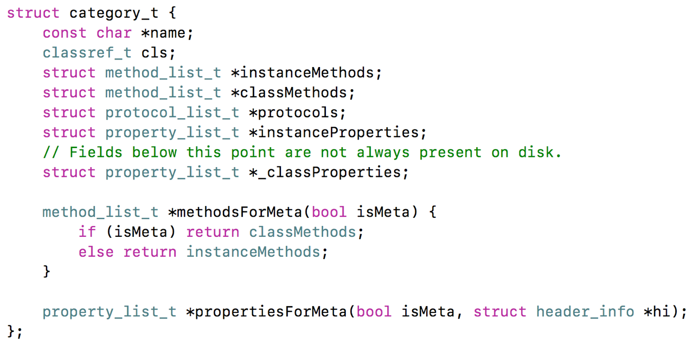

### Category

定义在objc-runtime-new.h中



#


#### Category的加载处理过程

1、通过Runtime加载某个类的所有Category数据

2、把所有Category的方法、属性、协议数据，合并到一个大数组中

      后面参与编译的Category数据，会在数组的前面（后编译，先调用）

3、将合并后的分类数据（方法、属性、协议），插入到类原来数据的前面

```
源码解读顺序
objc-os.mm
_objc_init
map_images
map_images_nolock

objc-runtime-new.mm
_read_images
remethodizeClass
attachCategories
attachLists
realloc、memmove、 memcpy
```

部分关键源码（方法有删减）

```objective-c
objc-runtime-new.mm

//重组类的方法
static void remethodizeClass(Class cls)
{
    category_list *cats;
    bool isMeta;
    isMeta = cls->isMetaClass();

    // Re-methodizing: check for more categories
    if ((cats = unattachedCategoriesForClass(cls, false/*not realizing*/))) {
        if (PrintConnecting) {
            _objc_inform("CLASS: attaching categories to class '%s' %s", 
                         cls->nameForLogging(), isMeta ? "(meta)" : "");
        }
        
      //添加分类方法
        attachCategories(cls, cats, true /*flush caches*/);        
        free(cats);
    }
}
  
//添加分类方法
static void 
attachCategories(Class cls, category_list *cats, bool flush_caches)
{
    if (!cats) return;
    if (PrintReplacedMethods) printReplacements(cls, cats);

    bool isMeta = cls->isMetaClass();

    // fixme rearrange to remove these intermediate allocations
  	
  	//方法数组  
  	/* 二维数组
  	  [ 
  	  	[method_t,method_t], 分类1的方法列表
  	  	[method_t,method_t] ,分类2的方法列表
  	  ]
  	*/
    method_list_t **mlists = (method_list_t **)
        malloc(cats->count * sizeof(*mlists));
   
  //属性数组
  	/* 二维数组
  		[ 
  	  	[property_t,property_t], 分类1的属性列表
  	  	[property_t,property_t] ,分类2的属性列表
  	  ]
  	*/
    property_list_t **proplists = (property_list_t **)
        malloc(cats->count * sizeof(*proplists));
   
  //协议数组
    /* 二维数组
  		[ 
  	  	[protocol_t,protocol_t], 分类1的协议列表
  	  	[protocol_t,protocol_t] ,分类2的协议列表
  	  ]
  	*/
    protocol_list_t **protolists = (protocol_list_t **)
        malloc(cats->count * sizeof(*protolists));

    // Count backwards through cats to get newest categories first
    int mcount = 0;
    int propcount = 0;
    int protocount = 0;
    int i = cats->count;
    bool fromBundle = NO;
    while (i--) {
      	//取出某个分类
        auto& entry = cats->list[i];
				//entry.cat中就包含 category_t *cat;  再判断是元类
      	//就可以取出分类中的（对象/类）方法列表
        method_list_t *mlist = entry.cat->methodsForMeta(isMeta);
        if (mlist) {
            mlists[mcount++] = mlist;
            fromBundle |= entry.hi->isBundle();
        }

        property_list_t *proplist = 
            entry.cat->propertiesForMeta(isMeta, entry.hi);
        if (proplist) {
            proplists[propcount++] = proplist;
        }

        protocol_list_t *protolist = entry.cat->protocols;
        if (protolist) {
            protolists[protocount++] = protolist;
        }
    }
		
  	//得到类对象里面的数据
  	//参考类的结构，类中有 class_rw_t 
    auto rw = cls->data();

    prepareMethodLists(cls, mlists, mcount, NO, fromBundle);
  	//将所有分类方法列表附加到类对象的方法列表中
    rw->methods.attachLists(mlists, mcount);
    free(mlists);
    if (flush_caches  &&  mcount > 0) flushCaches(cls);
		//将所有分类属性列表附加到类对象的属性列表中
    rw->properties.attachLists(proplists, propcount);
    free(proplists);
		//将所有分类协议列表附加到类对象的协议列表中
    rw->protocols.attachLists(protolists, protocount);
    free(protolists);
}

/*

  参数：	addedLists
	  	[ 
  	  	[method_t,method_t], 分类1的方法（属性、协议）列表
  	  	[method_t,method_t] ,分类2的方法（属性、协议）列表
  	  ]
  	  addedCount ： 方法个数
*/
void attachLists(List* const * addedLists, uint32_t addedCount) {
        if (addedCount == 0) return;

        if (hasArray()) {
            // many lists -> many lists
            uint32_t oldCount = array()->count;
            uint32_t newCount = oldCount + addedCount;
          	//重新分配内存 newCount 
            setArray((array_t *)realloc(array(), array_t::byteSize(newCount)));
            array()->count = newCount;

          	// array()->lists 原来的方法列表
          	//将方法列表后移addCount位置
            memmove(array()->lists + addedCount, array()->lists, 
                    oldCount * sizeof(array()->lists[0]));
          	// addedLists 所有分类方法列表
          	//将分类方法加到类方法列表的最前端
            memcpy(array()->lists, addedLists, 
                   addedCount * sizeof(array()->lists[0]));
          //所以类和分类中有同名方法，优先调用分类中的方法（多个分类时最后编译的分类方法放到前面）
        }
        else if (!list  &&  addedCount == 1) {
            // 0 lists -> 1 list
            list = addedLists[0];
        } 
        else {
            // 1 list -> many lists
            List* oldList = list;
            uint32_t oldCount = oldList ? 1 : 0;
            uint32_t newCount = oldCount + addedCount;
          	
            setArray((array_t *)malloc(array_t::byteSize(newCount)));
            array()->count = newCount;
            if (oldList) array()->lists[addedCount] = oldList;
            memcpy(array()->lists, addedLists, 
                   addedCount * sizeof(array()->lists[0]));
        }
    }

```


##### Category的实现原理

- Category编译之后的底层结构是struct  category_t，里面存储着分类的对象方法、类方法、属性、协议信息

- 在程序运行的时候，runtime会将Category的数据，合并到类信息中（类对象、元类对象中）

##### Category和Class  Extension的区别是什么？

- Class  Extension在编译的时候，它的数据就已经包含在类信息中

- Category是在运行时，才会将数据合并到类信息中

  
