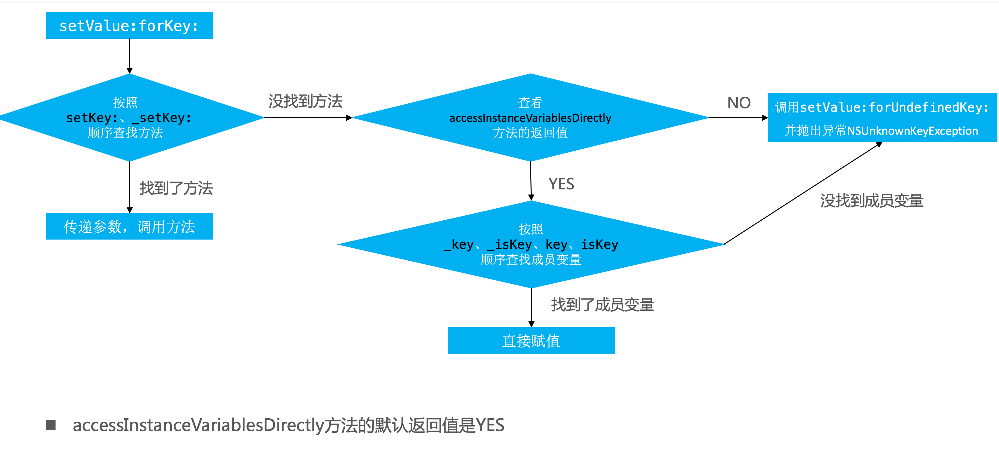
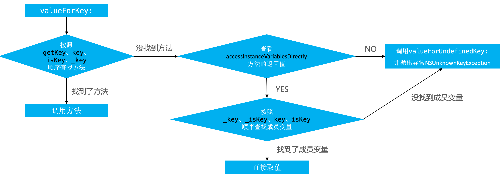

##### KVC的全称是Key-Value  Coding，俗称“键值编码”，可以通过一个key来访问某个属性

##### 常见的API有

- -(void)setValue:(id)value forKeyPath:(NSString *)keyPath;

- -(void)setValue:(id)value forKey:(NSString *)key;

- -(id)valueForKeyPath:(NSString *)keyPath;

- -(id)valueForKey:(NSString *)key;

#### 赋值与取值

###### 通过KVC会触发KVO吗？

会

[iOS KVC底层原理、应用场景](https://blog.csdn.net/qq_27909209/article/details/81106631)