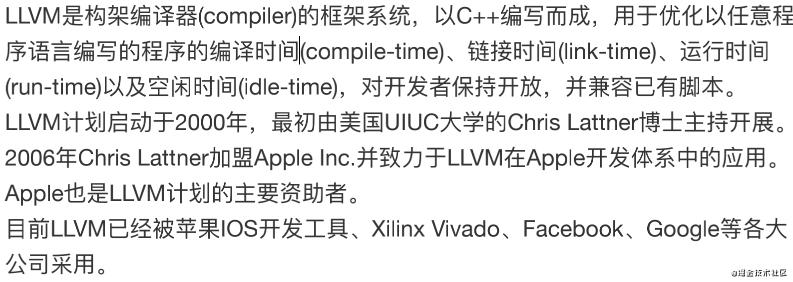
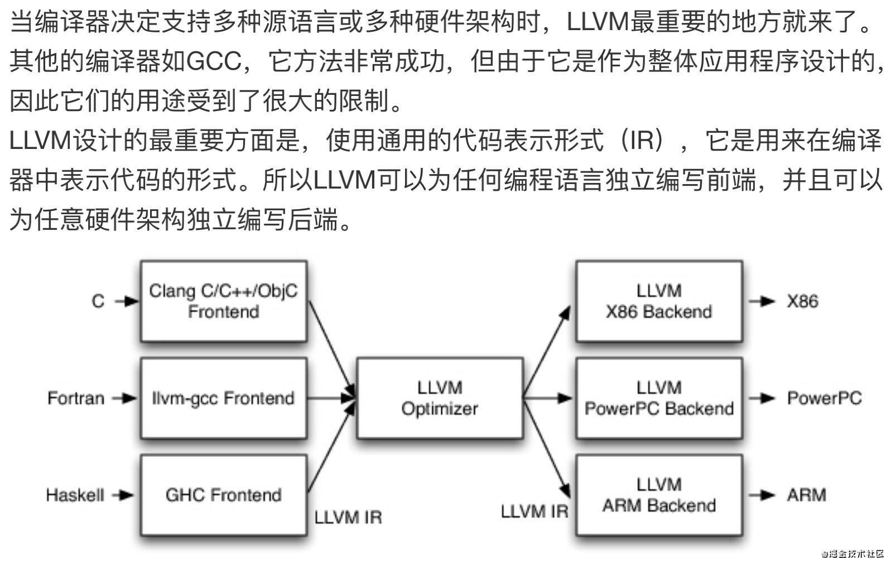
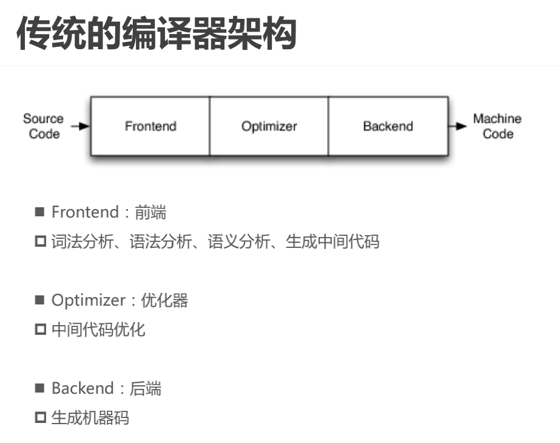
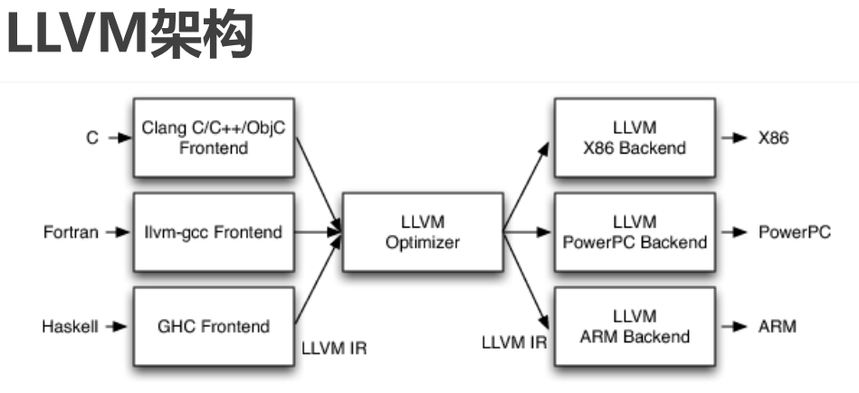
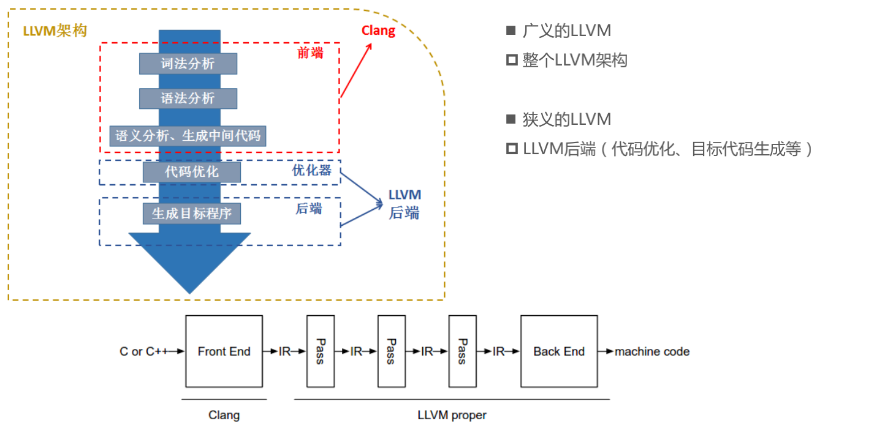
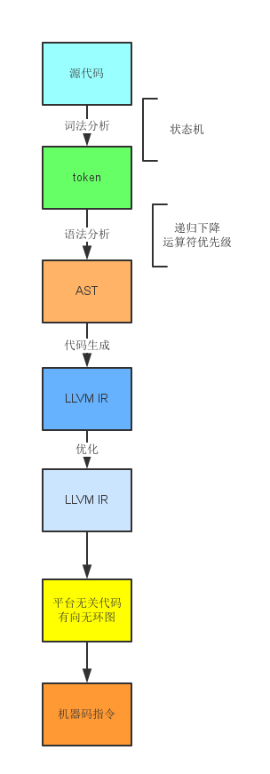

### LLVM

官网：https://llvm.org/


#### LLVM介绍




#### LLVM的设计




###### LLVM项目是模块化、可重用的编译器以及工具链技术的集合








>不同的前端后端使用统一的中间代码LLVM Intermediate Representation (LLVM IR) 
>
>如果需要支持一种新的编程语言，那么只需要实现一个新的前端
>
>如果需要支持一种新的硬件设备，那么只需要实现一个新的后端
>
>优化阶段是一个通用的阶段，它针对的是统一的LLVM IR，不论是支持新的编程语言，还是支持新的硬件设备，都不需要对优化阶段做修改
>
>相比之下，GCC的前端和后端没分得太开，前端后端耦合在了一起。所以GCC为了支持一门新的语言，或者为了支持一个新的目标平台，就变得特别困难
>
>LLVM现在被作为实现各种静态和运行时编译语言的通用基础结构（GCC家族、Java、.NET、Python、Ruby、Scheme、Haskell、D等）


#### Clang

>LLVM项目的一个子项目
>
>基于LLVM架构的C/C++/Objective-C编译器前端
>
>官网：http://clang.llvm.org/


##### 相比于GCC，Clang具有如下优点

>编译速度快：在某些平台上，Clang的编译速度显著的快过GCC（Debug模式下编译OC速度比GGC快3倍）
>
>占用内存小：Clang生成的AST所占用的内存是GCC的五分之一左右
>
>模块化设计：Clang采用基于库的模块化设计，易于 IDE 集成及其他用途的重用
>
>诊断信息可读性强：在编译过程中，Clang 创建并保留了大量详细的元数据 (metadata)，有利于调试和错误报告
>
>设计清晰简单，容易理解，易于扩展增强


#### **Clang与LLVM**



LLVM整体架构，前端用的是clang，广义的LLVM是指整个LLVM架构，一般狭义的LLVM指的是LLVM后端（包含代码优化和目标代码生成）。


**源代码（c/c++）经过clang--> 中间代码(经过一系列的优化，优化用的是Pass) --> 机器码**


对于整个LLVM的框架来说，包含了Clang，因为Clang是LLVM的框架的一部分，是它的一个C/C++的前端。Clang使用了LLVM中的一些功能，目前知道的就是针对中间格式代码的优化，或许还有一部分生成代码的功能。从源代码角度来讲，clang是基于LLVM的一个工具。而功能的角度来说，LLVM可以认为是一个编译器的后端，而clang是一个编译器的前端，他们的关系更加的明了，一个编译器前端想要程序最终变成可执行文件，是缺少不了对编译器后端的介绍的。


#### OC源文件的编译过程

用Xcode创建一个Test项目，然后cd到main.m的上一路径。
命令行查看编译的过程:$ clang -ccc-print-phases main.m

```
$ clang -ccc-print-phases main.m 

0: input, "main.m", objective-c
1: preprocessor, {0}, objective-c-cpp-output
2: compiler, {1}, ir
3: backend, {2}, assembler
4: assembler, {3}, object
5: linker, {4}, image
6: bind-arch, "x86_64", {5}, image
```

> 0.找到main.m文件
> 1.预处理器，处理include、import、宏定义
> 2.编译器编译，编译成IR中间代码
> 3.后端，生成目标代码
> 4.汇编
> 5.链接其他动态库静态库
> 6.编译成适合某个架构的代码

或者

>0:输入文件，找到源文件；
>
>1:预处理阶段：包括宏的替换和头文件的导入等
>
>2:编绎阶段：进行词法分析、语法分析和语义分析，最终生成中间代码（IR）
>
>3:后端代码生成器：生成机器语言，并且进行机器相关的代码优化；LLVM会对一个个的pass进行优化，每个pass做一些事情，最终生成汇编代码；
>
>4:生成目标文件；
>
>5:链接：链接动态库和静态库，生成可执行文件；
>
>6:通过不同的架构，生成对应的可执行文件。


#### LLVM编译工具链编译流程：




LLVM编译一个源文件的过程：

**预处理 -> 词法分析 -> Token -> 语法分析 -> AST -> 代码生成 -> LLVM IR -> 优化 -> 生成汇编代码 -> Link -> 目标文件**


完全需要我们手工，或者依靠其他工具如lex, yacc来做的事情，是从源代码到token的词法分析和从token到AST的语法分析；词法分析的输出是将源代码解析成一个个的token。这些token就是有类型和值的一些小单元，比如是关键字，还是数字，还是标识符，从AST转LLVM开始，LLVM就开始提供一系列的工具帮助我们快速开发。从IR(中间指令代码)到DAG(有向无环图)再到机器指令，针对常用的平台，LLVM有完善的后端。也就是说，我们只要完成了到IR这一步，后面的工作我们就享有和Clang一样的先进生产力了。