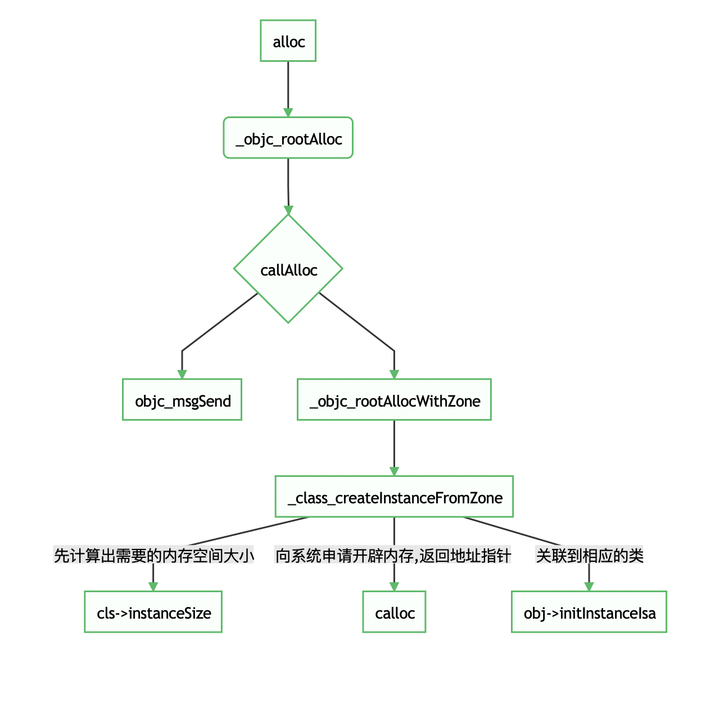

### 的创建 : [alloc]init] 与new


源码分析：[objc4-779.1](https://opensource.apple.com/release/macos-1015.html)


#### 1、alloc调用的流程

```objective-c
NSObject.mm
  
+ (id)alloc {
    return _objc_rootAlloc(self);
}
```


```objective-c
// Base class implementation of +alloc. cls is not nil.
// Calls [cls allocWithZone:nil].
id 
_objc_rootAlloc(Class cls)
{
    return callAlloc(cls, false/*checkNil*/, true/*allocWithZone*/);
}
```


```objective-c
// Call [cls alloc] or [cls allocWithZone:nil], with appropriate 
// shortcutting optimizations.
static ALWAYS_INLINE id
callAlloc(Class cls, bool checkNil, bool allocWithZone=false)
{
  
   //编译器优化 slowpath fastpath 	是为了告诉编译器，if中的条件是大概率(fastpath)还是小概率(slowpath)事件
#if __OBJC2__	//// 会进入 __OBJC2__  因为现在OC版本就是2.0
    if (slowpath(checkNil && !cls)) return nil;
  	// 该类是否实现了allocWithZone方法，否，会调用_objc_rootAllocWithZone
    if (fastpath(!cls->ISA()->hasCustomAWZ())) {
        return _objc_rootAllocWithZone(cls, nil);
    }
#endif

    // No shortcuts available.
    if (allocWithZone) {// 由参数看出allocWithZone为false，所以不会走这里
        return ((id(*)(id, SEL, struct _NSZone *))objc_msgSend)(cls, @selector(allocWithZone:), nil);
    }
  
		// 如果已经开辟过内存了，就会来到这里
  	//重复 objc_msgSend -> alloc，回到到第一个方法
  	//所以 一定会走 _objc_rootAllocWithZone方法
    return ((id(*)(id, SEL))objc_msgSend)(cls, @selector(alloc));
}


//编译器优化 slowpath fastpath
// x 很可能不为 0，希望编译器进行优化
#define fastpath(x) (__builtin_expect(bool(x), 1))
// x 很可能为 0，希望编译器进行优化
#define slowpath(x) (__builtin_expect(bool(x), 0))
```


```objective-c
objc-runtime-new.mm
  
NEVER_INLINE
id
_objc_rootAllocWithZone(Class cls, malloc_zone_t *zone __unused)
{
    // allocWithZone under __OBJC2__ ignores the zone parameter
    return _class_createInstanceFromZone(cls, 0, nil,
                                         OBJECT_CONSTRUCT_CALL_BADALLOC);
}
```


##### `_class_createInstanceFromZone` 这里是 alloc 核心方法

```objective-c
static ALWAYS_INLINE id
_class_createInstanceFromZone(Class cls, size_t extraBytes, void *zone,
                              int construct_flags = OBJECT_CONSTRUCT_NONE,
                              bool cxxConstruct = true,
                              size_t *outAllocatedSize = nil)
{
    ASSERT(cls->isRealized());

    // Read class's info bits all at once for performance
    bool hasCxxCtor = cxxConstruct && cls->hasCxxCtor();
    bool hasCxxDtor = cls->hasCxxDtor();
    bool fast = cls->canAllocNonpointer();
    size_t size;	// 声明内存空间大小
		
	  //先计算出需要的内存空间
    size = cls->instanceSize(extraBytes);	 // 获取内存大小
    if (outAllocatedSize) *outAllocatedSize = size;	// outAllocatedSize没传默认是nil

  
  	//向系统申请开启内存，返回地址指针
    id obj;
    if (zone) {	// zone是nil
        obj = (id)malloc_zone_calloc((malloc_zone_t *)zone, 1, size);
    } else {
      // alloc 开辟内存的地方
      // 分配内存空间，calloc( )函数会默认的把申请出来的空间初始化为0或者nil
        obj = (id)calloc(1, size);
    }
    if (slowpath(!obj)) {	// 判断是否分配成功
        if (construct_flags & OBJECT_CONSTRUCT_CALL_BADALLOC) {
            return _objc_callBadAllocHandler(cls);
        }
        return nil;
    }
		
  	//关联到相应的类
    if (!zone && fast) {
        obj->initInstanceIsa(cls, hasCxxDtor);// 初始化实例的isa指针为cls类对象
    } else {
        // Use raw pointer isa on the assumption that they might be
        // doing something weird with the zone or RR.
        obj->initIsa(cls);
    }

    if (fastpath(!hasCxxCtor)) {
        return obj;	// 返回该实例地址
    }

    construct_flags |= OBJECT_CONSTRUCT_FREE_ONFAILURE;
    return object_cxxConstructFromClass(obj, cls, construct_flags);
}
```


```objective-c
	//系统分配空间 16个字节

	size_t instanceSize(size_t extraBytes) const {
        if (fastpath(cache.hasFastInstanceSize(extraBytes))) {
            return cache.fastInstanceSize(extraBytes);
        }

        size_t size = alignedInstanceSize() + extraBytes;
        // CF requires all objects be at least 16 bytes.
        if (size < 16) size = 16;
        return size;
    }

    
    size_t fastInstanceSize(size_t extra) const
    {
        ASSERT(hasFastInstanceSize(extra));

        if (__builtin_constant_p(extra) && extra == 0) {
            return _flags & FAST_CACHE_ALLOC_MASK16;
        } else {
            size_t size = _flags & FAST_CACHE_ALLOC_MASK;
            // remove the FAST_CACHE_ALLOC_DELTA16 that was added
            // by setFastInstanceSize
            return align16(size + extra - FAST_CACHE_ALLOC_DELTA16);
        }
    }
    
    //十六进制对齐算法
    static inline size_t align16(size_t x) {
    		return (x + size_t(15)) & ~size_t(15);
		}
```




### 总结：

> 1、类调用了alloc方法后，底层会调用_objc_rootAlloc方法，再调用callAlloc方法；
>
> 2、在callAlloc方法中，判断是否分配过空间，没有就会调用_objc_rootAllocWithZone，
>
> 3、在 _objc_rootAllocWithZone中调用 _class_createInstanceFromZone方法
>
> 4、在 _class_createInstanceFromZone方法中，先计算出需要的内存空间（为了保持内存对齐，需要分配了16个字节的空间），再向系统申请空间，然后返回空间地址的指针，最后关联isa，实例的isa指向类


### 2、init

直接返回了 obj 没有做其他操作

```objective-c
// Replaced by CF (throws an NSException)
+ (id)init {
    return (id)self;
}

- (id)init {
    return _objc_rootInit(self);
}

id
_objc_rootInit(id obj)
{
    // In practice, it will be hard to rely on this function.
    // Many classes do not properly chain -init calls.
    return obj;
}

```


#### 3、new

相当于 alloc 方法 加上 init 方法

```objective-c
+ (id)new {
    return [callAlloc(self, false/*checkNil*/) init];
}
```


