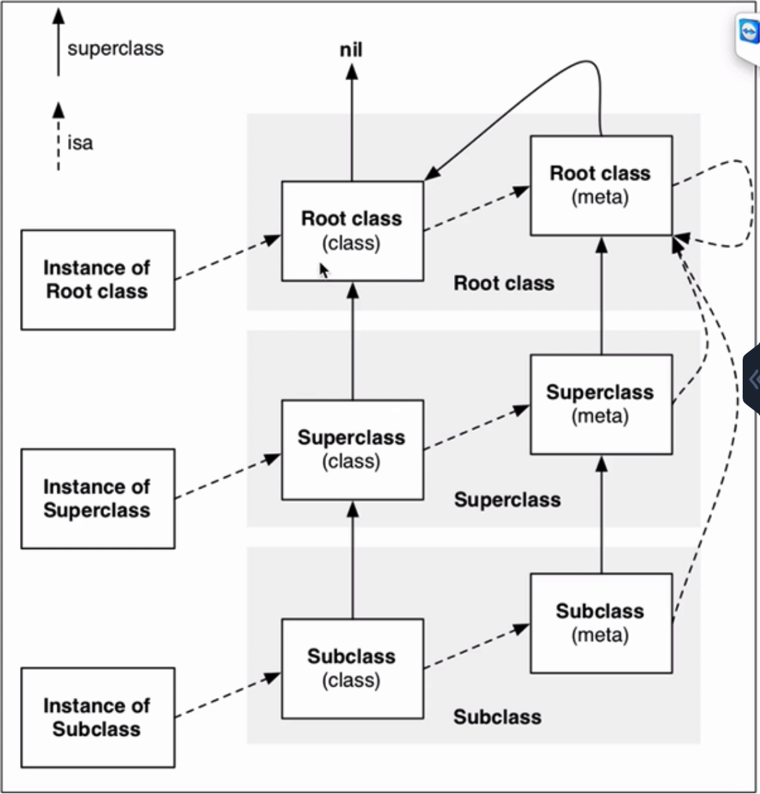

OC对象分为：实例对象、类对象、元类对象

```
实例对象
NSObject *obj1 = [[NSObject alloc]init];
```

```
类对象，内存中只要一份
Class objectClass1 = [obj1 class];
Class objectClass2 = object_getClass(obj1);
Class objectClass3 = [NSObject class];

//class方法返回的一直是类对象
Class objectClass3 = [[NSObject class]class];
```

```
元类对象 meta-class
Class objMetaClass = object_getClass(objectClass1);

//是否是元类对象
BOOL isMetaClass = class_isMetaCLass(objMetaClass)
```

每个类只有一个类对象，也只有一个元类对象

元类对象和类对象内存结构是一样的，但用途不一样

主要包括：isa 指针、superclass指针、类的类方法信息

类对象主要包括：

isa指针、superclass指针、属性信息、对象方法信息、协议信息、成员变量信息

成员变量值的信息保存在实例对象中

1、Class   objc_getClass(const char  *aClassName)

     传入字符串类名，返回对应的类对象

2、Class  object_getClass(id obj)

传入的obj可能是instance对象、class对象、meta-class对象

返回值：

        如果是instance对象，返回class对象
    
        如果是class对象，返回meta-class对象
    
        如果是meta-class对象，返回NSObject(基类)的meta-class对象

3、- （Class）class    、 +（Class)class

返回的就是类对象

```
-（Class）{
    return self->isa;
 }

+ (class){
    return self;
}
```

**isa**  、**superclass**总结



- 实例对象(instance)的isa指向类对象（class）

- 类对象(class)的isa指向元类对象（meta-class）

- 元类对象(meta-class)的isa指向基类的元类(meta-class)

- 类对象的(class)superclass指向父类的类对象(class)，如果没有父类，superclass指针为nil

- 元类(meta-class)的superclass指向父类的元类(meta-class)，基类的meta-class的superclass指向基类的class

- instance调用对象方法的轨迹：isa找到类对象class,方法不存在，就通过superclass找父类

对象的isa指向哪里？

instance对象的isa指向class对象

class 对象的isa指向meta-class对象

meta-class对象的isa指向基类的meta-class对象

OC的类信息存放在哪里？

对象方法、属性、成员变量、协议信息，存放在class对象中

类方法存放在meta-class对象中

成员变量的具体值，存放在instance对象
