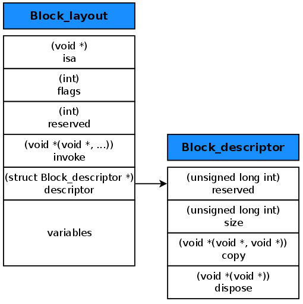
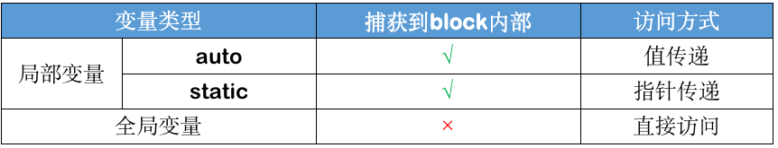
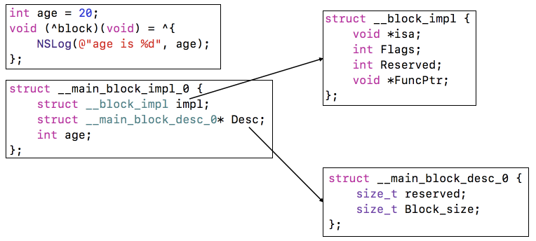

### block

block本质上也是一个OC对象，它内部也有一个isa指针

block是封装了函数调用以及函数调用环境的OC对象

block的底层如图



##### block的变量捕获（capture）



```objective-c
补充：
通常情况下，局部变量自带auto，但大都隐藏不写
int age = 20; 等同于 auto int age = 20;

auto 修饰的变量，只是变量的值被block捕获而已，外界再修改变量，block内部无法同步；

static修饰的变量，该变量的内存地址被block捕获，外界修改变量时，block内部访问的是同一地址，所以也会被修改

全局变量：写在方法外面的变量；block不用捕获，可直接拿到地址访问
```

##### auto变量的捕获



```objective-c
补充：
如果age被static修饰，即： static int age = 20;
则在block内部:
struct _ _main_block_impl_0{
    int *age;
}
//捕获age的地址
```

##### 对Self的捕获

```objective-c
对于self来说，block会将self捕获到block内部
self是局部变量
每个方法都有默认的两个参数,
以Person类为例，Person类中有test方法
  - (void)test{
  	NSLog(@"test");
	}

	等同于
  - (void)test(Person *self ,SEL _cmd) {
  	NSLog(@"test");
	}

 转成C++时：
   void test(Person *self , SEL _cmd){
   NSLog(@"test");
 }
 
```


#### 查看源码

```objective-c
void (^block)(void) =  ^(){
    NSLog(@"this is a block!");
};

终端：
xcrun  -sdk  iphoneos  clang  -arch  arm64  -rewrite-objc main.m

block的C++代码：
  
void (*block)(void) = ((void (*)())&__main_block_impl_0((void *)__main_block_func_0, &__main_block_desc_0_DATA));


简化：

void (*block)(void) = &__main_block_impl_0(
                            __main_block_func_0,
                            &__main_block_desc_0_DATA
                        );
```

###### __main_block_impl_0

```objective-c
struct __main_block_impl_0 {
     struct __block_impl impl;
     struct __main_block_desc_0* Desc;
    // 构造函数（类似于OC的init方法），返回结构体对象
     __main_block_impl_0(void *fp, struct __main_block_desc_0 *desc, int flags=0) {
     impl.isa = &_NSConcreteStackBlock;
     impl.Flags = flags;
     impl.FuncPtr = fp;
     Desc = desc;
     }
 };
```

###### __block_impl impl

```objective-c
struct __block_impl {
 void *isa;
 int Flags;
 int Reserved;
 void *FuncPtr;
};
```

###### __main_block_desc_0

```objective-c
static struct __main_block_desc_0 {
 size_t reserved;
 size_t Block_size;//内存大小描述
} __main_block_desc_0_DATA
```

```objective-c
补充：
1、__main_block_impl_0中__block_impl存放的是一些变量信息，其中存在isa，所以可以判断block的本质其实就是OC对象

2、初始化
__main_block_impl_0(void *fp, struct __main_block_desc_0 *desc, int flags=0) {
    impl.isa = &_NSConcreteStackBlock;
    impl.Flags = flags;
    impl.FuncPtr = fp;
    Desc = desc;
}

对应上面的初始化我们可以看出第一个参数传递的是执行方法（函数地址），第二个参数为描述信息
```

