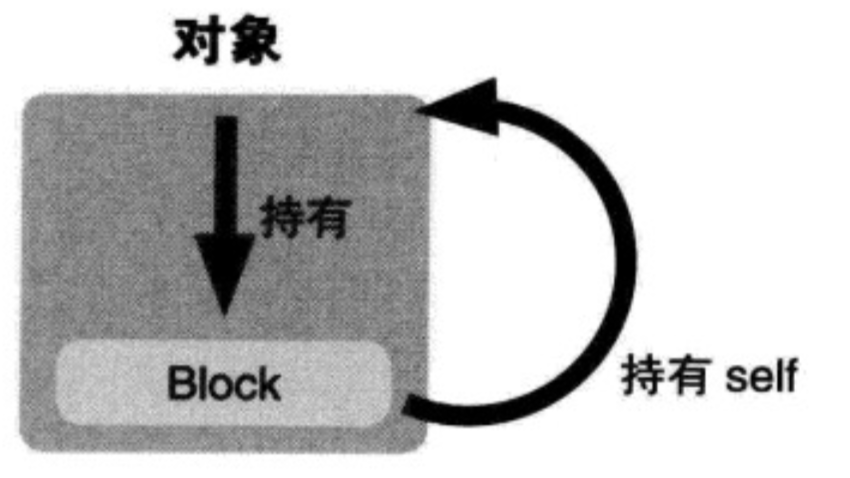
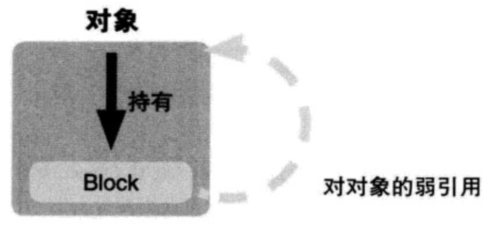
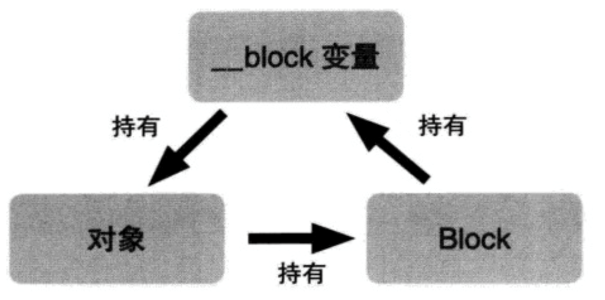
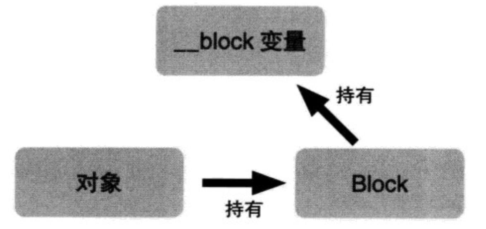

##### block循环引用问题

在auto变量为OC对象的时候，在没有修饰符修饰的时候Block内部会强引用OC对象，而对象如果也持有Block的时候就会造成相互引用，也就是循环引用的问题。

有两个弱引用修饰符__weak和__unsafe_unretained

```
1、 __weak：不会产生强引用，指向的对象销毁时，会自动让指针置为nil
2、__unsafe_unretained：不会产生强引用，不安全，指向的对象销毁时，指针存储的地址值不变
```



```
__weak typeof(self) weakSelf = self;
self.block = ^{
    printf("%p",weakSelf);
};


__unsafe __unretained id weakSelf = self;
self.block = ^{
    NSLog(@"%p",weakSelf);
};
```



##### 还有一种方式：用__block解决（必须要调用block）

```
__block id weakSelf = self;
self.block = ^{
    printf("%p",weakSelf);
    weakSelf = nil;
};

self.block();
```




