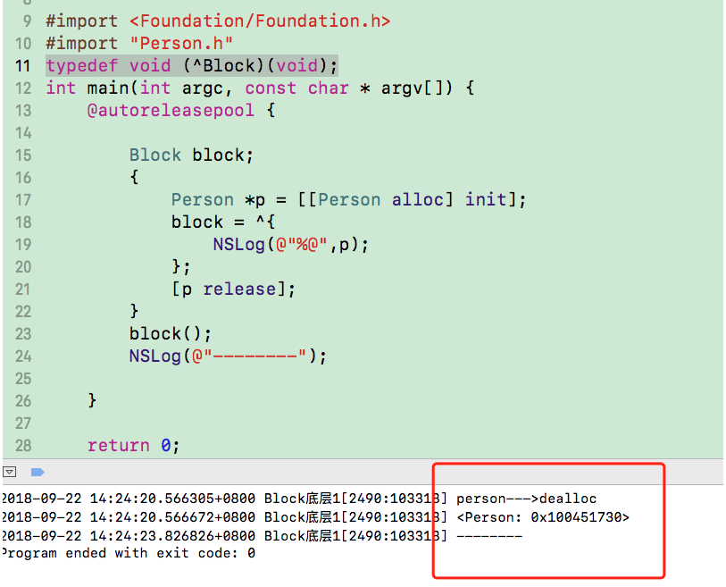
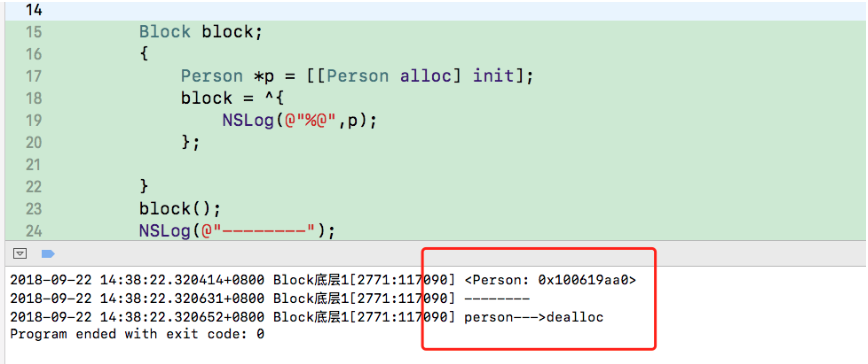

### block的copy

#### 在ARC环境下，编译器会根据情况自动将栈上的block复制到堆上，比如以下情况

1、block作为函数返回值时
2、将block赋值给__strong指针时
3、block作为Cocoa API中方法名含有usingBlock的方法参数时
4、block作为GCD API的方法参数时

```
MRC下block属性的建议写法
@property (copy, nonatomic) void (^block)(void);

ARC下block属性的建议写法
@property (strong, nonatomic) void (^block)(void);
@property (copy, nonatomic) void (^block)(void);
```


#### 对象类型的auto变量

1、当block内部访问了对象类型的auto变量时，如果block是在栈上，将不会对auto变量产生强引用

2、如果block被拷贝到堆上

会调用block内部的copy函数，

copy函数内部会调用_Block_object_assign函数，

_Block_object_assign函数会根据auto变量的修饰符（__strong、__weak、__unsafe_unretained）做出相应的操作，形成强引用（retain）或者弱引用

3、如果block从堆上移除

会调用block内部的dispose函数，

dispose函数内部会调用_Block_object_dispose函数，

_Block_object_dispose函数会自动释放引用的auto变量（release）

4、在多个block相互嵌套的时候，auto属性的释放取决于最后的那个强引用什么时候释放

```

```

##### MRC

```
MRC环境下，是先打印 dealloc，然后在打印 p 的
```

#### ARC

```
ARC环境下，是先打印p，然后在打印dealloc的
```

###### 当Block内部访问了auto变量时，如果block是在栈上，将不会对auto变量产生强引用,因为当Block在栈上的时候，他自己都不能保证自己什么时候被释放，所以block也就不会对自动变量进行强引用了``

```
在ARC环境下如果我们对自动变量进行一些修饰符，那么block对auto变量是进行怎么引用呢 我们还是老方法，把main文件转化为c++文件，我们找到__main_block_func_0执行函数，

当不用修饰符修饰的时：Person *p = __cself->p; // bound by copy

当使用__strong修饰时：Person *strongP = __cself->strongP; // bound by copy

当使用__weak修饰的时:Person *__weak weakP = __cself->weakP; // bound by copy 
我们运行 xcrun -sdk iphoneos clang -arch arm64 -rewrite-objc main.m出错了，
我们需要支持ARC，指定运行时系统版本，xcrun -sdk iphoneos clang -arch arm64 -rewrite-objc -fobjc-arc -fobjc-runtime=ios-8.0.0 main.m
```
