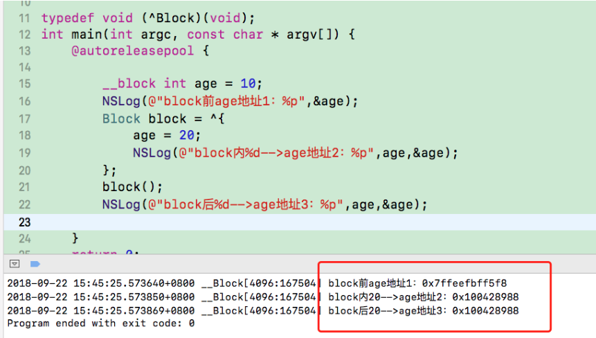

##### block的修饰符

##### --block

```
__block可以用于解决block内部无法修改auto变量值的问题

__block不能修饰全局变量、静态变量（static）

编译器会将__block变量包装成一个对象
```



```
根据内存地址变化可见，__block所起到的作用就是只要观察到该变量被 block 所持有，就将“外部变量”在栈中的内存地址放到了堆中。
```

我们把`main`函数转化为C++代码，然后在age使用`__Block`前后，对Block结构体进行分析


在`__Block`所起到的作用就是只要观察到该变量被 block 所持有之后，`age`其实变成了OC对象，里面含有`isa`指针

##### __block的内存管理

1、_当block在栈上时，并不会对__block变量产生强引用

2、当block被copy到堆时

会调用block内部的copy函数

copy函数内部会调用_Block_object_assign函数

_Block_object_assign函数会对__block变量形成强引用（retain）


3、当block从堆中移除时，

会调用block内部的dispose函数，

dispose函数内部会调用_Block_object_dispose函数，

_Block_object_dispose函数会自动释放引用的__block变量（release)


###### 在--block修饰的变量被包裹成OC对象后，内部的forward指针

```
struct __Block_byref_age_0 {
  void *__isa;
  __Block_byref_age_0 *__forwarding;
  int __flags;
  int __size;
  int age;
}
```


```
总结

1、在ARC环境下，Block被引用的时候，会被Copy一次，由栈区copy到了堆

2、在Block被copy的时候，Block内部被引用的变量也同样被copy一份到了堆上面

3、被__Block修饰的变量，在被Block引用的时候，会变成结构体也就是OC对象，里面的__forwarding也会由栈copy道对上面

4、栈上__block变量结构体中__forwarding的指针指向堆上面__block变量结构体，堆上__block变量结构体中__forwarding指针指向自己

5、当block从堆中移除时，会调用block内部的dispose函数，dispose函数内部会调用_Block_object_dispose函数，_Block_object_dispose函数会自动释放引用的__block变量（release)
```


