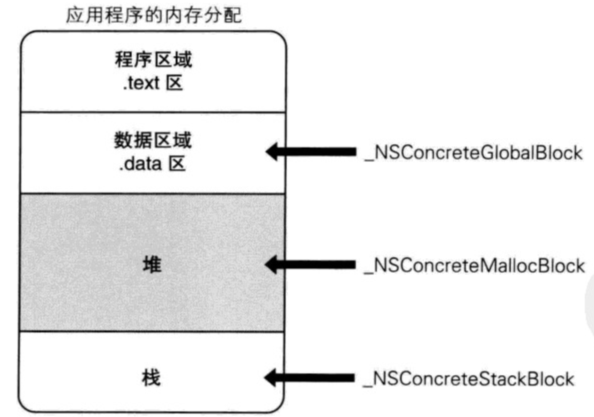
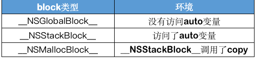
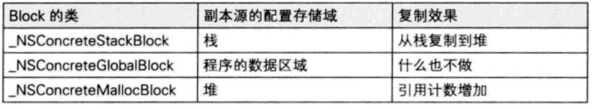

### block的类型


##### block本质上就是OC对象

```objective-c
void (^block)(int ,int )  = ^(int a, int b){
	 NSLog(@"this is a block !");
};

NSLog(@"%@",[block class]);
NSLog(@"%@",[[block class] superclass]);
NSLog(@"%@",[[[block class] superclass] superclass]);
NSLog(@"%@",[[[[block class] superclass] superclass] superclass]);

打印：
__NSMallocBlock__
__NSMallocBlock
NSBlock
NSObject
 
  说明： 
  __NSMallocBlock__ ： __NSMallocBlock : NSBlock : NSObject
    block是对象，isa是继承与NSObject
```


##### block有3种类型，可以通过调用class方法或者isa指针查看具体类型，最终都是继承自NSBlock类型

```objective-c
__NSGlobalBlock__ （ _NSConcreteGlobalBlock ）
__NSStackBlock__  （ _NSConcreteStackBlock ）
__NSMallocBlock__ （ _NSConcreteMallocBlock ）
```



```
补充：
程序区域：主要存放函数的二进制代码等(代码段)

数据区域：全局变量和静态变量的存储是放在一起的，初始化的全局变量和静态变量存放在一块区域，未初始化的全局变量和静态变量在相邻的另一块区域，程序结束后有系统释放

堆区域： 由程序员分配和释放，如果程序员不释放，程序结束时，可能会由操作系统回收 ，比如在iOS 中 alloc 都是存放在堆中

栈区域：由编译器自动分配并释放，存放函数的参数值，局部变量等。
栈空间分静态分配和动态分配两种。静态分配是编译器完成的，比如自动变量(auto)的分配。动态分配由alloca函数完成
```


##### block的类型



```
补充：
GlobalBlock 、StatckBlock 的销毁管理由系统处理
MallocBlock的销毁由开发人员处理
```

每一种类型的block调用copy后的结果如下所示


