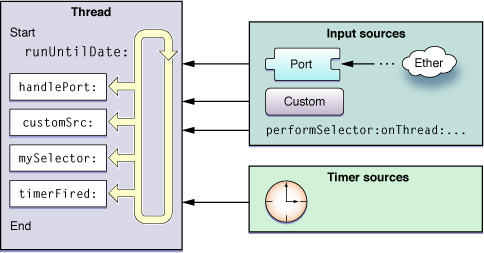
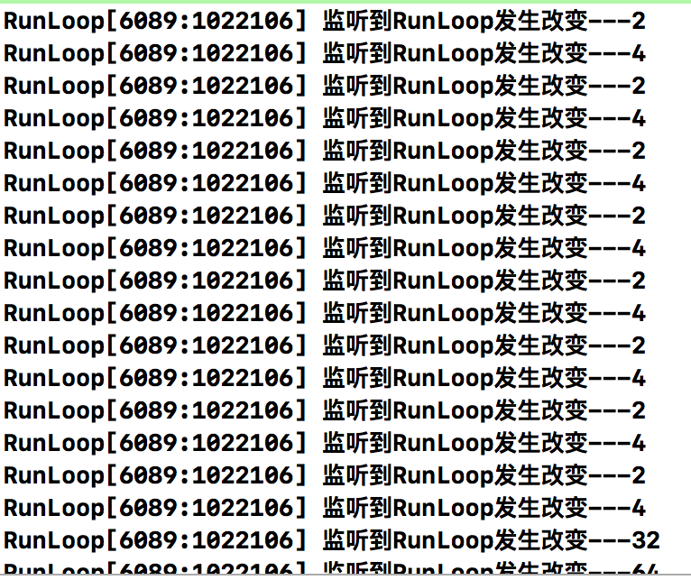
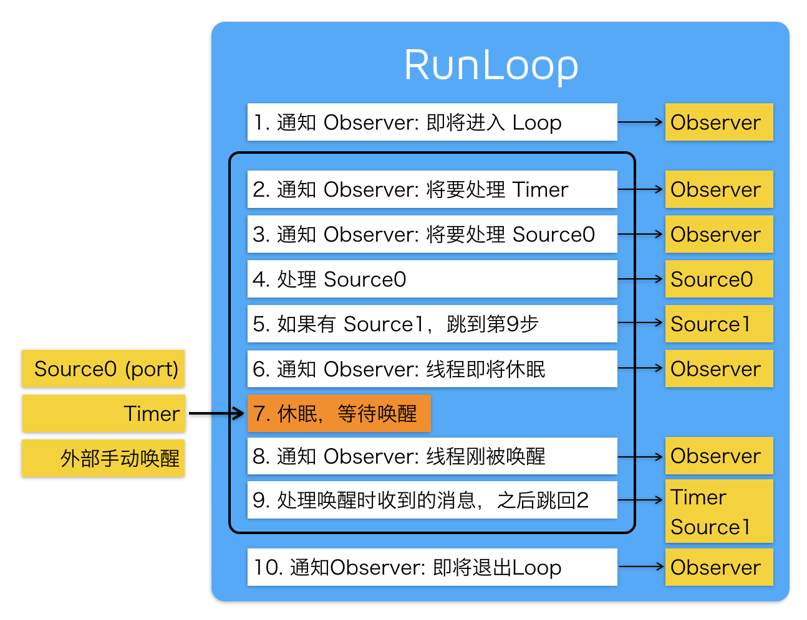

#### 

## RunLoop详尽总结

[runloop源码](https://opensource.apple.com/tarballs/CF/)

推荐两篇文章：

[iOS 多线程：『RunLoop』详尽总结](https://bujige.net/blog/iOS-Complete-learning-RunLoop.html)

[深入理解RunLoop](https://blog.ibireme.com/2015/05/18/runloop/)

RunLoop实际上是一个对象，这个对象在循环中用来处理程序运行过程中出现的各种事件（比如说触摸事件、UI刷新事件、定时器事件、Selector事件），从而保持程序的持续运行；而且在没有事件处理的时候，会进入睡眠模式，从而节省CPU资源，提高程序性能。

RunLoop和线程是息息相关的，我们知道线程的作用是用来执行特定的一个或多个任务，但是在默认情况下，线程执行完之后就会退出，就不能再执行任务了。这时我们就需要采用一种方式来让线程能够处理任务，并不退出。所以，我们就有了RunLoop。

1. 一条线程对应一个RunLoop对象，每条线程都有唯一一个与之对应的RunLoop对象。
2. 我们只能在当前线程中操作当前线程的RunLoop，而不能去操作其他线程的RunLoop。
3. RunLoop对象在第一次获取RunLoop时创建，销毁则是在线程结束的时候。
4. 主线程的RunLoop对象系统自动帮助我们创建好了(原理如下)，而子线程的RunLoop对象需要我们主动创建。

**主线程的RunLoop原理**

```objective-c
main.m
int main(int argc, char * argv[]) {
    @autoreleasepool {
        return UIApplicationMain(argc, argv, nil, NSStringFromClass([AppDelegate class]));
    }
}

其中UIApplicationMain函数内部帮我们开启了主线程的RunLoop，UIApplicationMain内部拥有一个无线循环的代码。
上边的代码中开启RunLoop的过程可以简单的理解为如下代码：
int main(int argc, char * argv[]) {        
    BOOL running = YES;
    do {
        // 执行各种任务，处理各种事件
        // ......
    } while (running);

    return 0;
}

从上边可看出，程序一直在do-while循环中执行，所以UIApplicationMain函数一直没有返回，我们在运行程序之后程序不会马上退出，会保持持续运行状态。
```

苹果官方给出的RunLoop模型图



**RunLoop就是线程中的一个循环，RunLoop在循环中会不断检测，通过Input sources（输入源）和Timer sources（定时源）两种来源等待接受事件；然后对接受到的事件通知线程进行处理，并在没有事件的时候进行休息。**

#### RunLoop相关类

Core Foundation框架下关于RunLoop的5个类，只有弄懂这几个类的含义，我们才能深入了解RunLoop运行机制。

1. CFRunLoopRef：代表RunLoop的对象
2. CFRunLoopModeRef：RunLoop的运行模式
3. CFRunLoopSourceRef：就是RunLoop模型图中提到的输入源/事件源
4. CFRunLoopTimerRef：就是RunLoop模型图中提到的定时源
5. CFRunLoopObserverRef：观察者，能够监听RunLoop的状态改变

先来看一张表示这5个类的关系图

一个RunLoop对象（CFRunLoopRef）中包含若干个运行模式（CFRunLoopModeRef）。而每一个运行模式下又包含若干个输入源（CFRunLoopSourceRef）、定时源（CFRunLoopTimerRef）、观察者（CFRunLoopObserverRef）。

- 每次RunLoop启动时，只能指定其中一个运行模式（CFRunLoopModeRef），这个运行模式（CFRunLoopModeRef）被称作CurrentMode。
- 如果需要切换运行模式（CFRunLoopModeRef），只能退出Loop，再重新指定一个运行模式（CFRunLoopModeRef）进入。
- 这样做主要是为了分隔开不同组的输入源（CFRunLoopSourceRef）、定时源（CFRunLoopTimerRef）、观察者（CFRunLoopObserverRef），让其互不影响 。

#### CFRunLoopRef

CFRunLoopRef就是Core Foundation框架下RunLoop对象类。我们可通过以下方式来获取RunLoop对象：

- Core Foundation
  - `CFRunLoopGetCurrent(); // 获得当前线程的RunLoop对象`
  - `CFRunLoopGetMain(); // 获得主线程的RunLoop对象`

当然，在Foundation框架下获取RunLoop对象类的方法如下：

- Foundation
  - `[NSRunLoop currentRunLoop]; // 获得当前线程的RunLoop对象`
  - `[NSRunLoop mainRunLoop]; // 获得主线程的RunLoop对象`

#### 

#### CFRunLoopModeRef

系统默认定义了多种运行模式（CFRunLoopModeRef），如下：

1. **kCFRunLoopDefaultMode**：App的默认运行模式，通常主线程是在这个运行模式下运行
2. **UITrackingRunLoopMode**：跟踪用户交互事件（用于 ScrollView 追踪触摸滑动，保证界面滑动时不受其他Mode影响）
3. UIInitializationRunLoopMode：在刚启动App时第进入的第一个 Mode，启动完成后就不再使用
4. GSEventReceiveRunLoopMode：接受系统内部事件，通常用不到
5. **kCFRunLoopCommonModes**：伪模式，不是一种真正的运行模式（后边会用到）

其中**kCFRunLoopDefaultMode**、**UITrackingRunLoopMode**、**kCFRunLoopCommonModes**是我们开发中需要用到的模式，具体使用方法我们在  **CFRunLoopTimerRef**  中结合CFRunLoopTimerRef来演示说明。

#### 

#### CFRunLoopTimerRef

CFRunLoopTimerRef是定时源（RunLoop模型图中提到过），理解为基于时间的触发器，基本上就是NSTimer。

演示下CFRunLoopModeRef和CFRunLoopTimerRef结合的使用用法，加深理解。

```objective-c
1.新建一个iOS项目，在Main.storyboard中拖入一个Text View。
2.在ViewController.m文件中加入以下代码

- (void)viewDidLoad {
    [super viewDidLoad];

    // 定义一个定时器，约定两秒之后调用self的run方法
    NSTimer *timer = [NSTimer timerWithTimeInterval:2.0 target:self selector:@selector(run) userInfo:nil repeats:YES];

    // 将定时器添加到当前RunLoop的NSDefaultRunLoopMode下
    [[NSRunLoop currentRunLoop] addTimer:timer forMode:NSDefaultRunLoopMode];
}

- (void)run
{
    NSLog(@"---run");
}
```

然后运行，这时候我们发现如果我们不对模拟器进行任何操作的话，定时器会稳定的每隔2秒调用run方法打印。

但是当我们拖动Text View滚动时，我们发现：run方法不打印了，也就是说NSTimer不工作了。而当我们松开鼠标的时候，NSTimer就又开始正常工作了。

这是因为：

- 当我们不做任何操作的时候，RunLoop处于NSDefaultRunLoopMode下。
- 而当我们拖动Text View的时候，RunLoop就结束NSDefaultRunLoopMode，切换到了UITrackingRunLoopMode模式下，这个模式下没有添加NSTimer，所以我们的NSTimer就不工作了。
- 但当我们松开鼠标的时候，RunLoop就结束UITrackingRunLoopMode模式，又切换回NSDefaultRunLoopMode模式，所以NSTimer就又开始正常工作了。

那难道我们就不能在这两种模式下让NSTimer都能正常工作吗？

当然可以，这就用到了我们之前说过的**伪模式（kCFRunLoopCommonModes）**，这其实不是一种真实的模式，而是一种标记模式，意思就是可以在打上Common Modes标记的模式下运行。

```objective-c
具体做法就是讲添加语句改为
[[NSRunLoop currentRunLoop] addTimer:timer forMode:NSRunLoopCommonModes];

既然讲到了NSTimer，这里顺便讲下NSTimer中的`scheduledTimerWithTimeInterval`方法和RunLoop的关系。添加下面的代码：

[NSTimer scheduledTimerWithTimeInterval:2.0 target:self selector:@selector(run) userInfo:nil repeats:YES];

这句代码调用了scheduledTimer返回的定时器，NSTimer会自动被加入到了RunLoop的NSDefaultRunLoopMode模式下。这句代码相当于下面两句代码：

NSTimer *timer = [NSTimer timerWithTimeInterval:2.0 target:self selector:@selector(run) userInfo:nil repeats:YES];
[[NSRunLoop currentRunLoop] addTimer:timer forMode:NSDefaultRunLoopMode];
```

#### CFRunLoopSourceRef

CFRunLoopSourceRef是事件源（RunLoop模型图中提到过），CFRunLoopSourceRef有两种分类方法。

- 第一种按照官方文档来分类（就像RunLoop模型图中那样）：
  - Port-Based Sources（基于端口）
  - Custom Input Sources（自定义）
  - Cocoa Perform Selector Sources
- 第二种按照函数调用栈来分类：
  - Source0 ：非基于Port
  - Source1：基于Port，通过内核和其他线程通信，接收、分发系统事件

这两种分类方式其实没有区别，只不过第一种是通过官方理论来分类，第二种是在实际应用中通过调用函数来分类。

##### CFRunLoopObserverRef

CFRunLoopObserverRef是观察者，用来监听RunLoop的状态改变

CFRunLoopObserverRef可以监听的状态改变有以下几种：

```objective-c
typedef CF_OPTIONS(CFOptionFlags, CFRunLoopActivity) {
    kCFRunLoopEntry = (1UL << 0),               // 即将进入Loop：1
    kCFRunLoopBeforeTimers = (1UL << 1),        // 即将处理Timer：2    
    kCFRunLoopBeforeSources = (1UL << 2),       // 即将处理Source：4
    kCFRunLoopBeforeWaiting = (1UL << 5),       // 即将进入休眠：32
    kCFRunLoopAfterWaiting = (1UL << 6),       // 即将从休眠中唤醒：64
    kCFRunLoopExit = (1UL << 7),              // 即将从Loop中退出：128
    kCFRunLoopAllActivities = 0x0FFFFFFFU       // 监听全部状态改变  
};
```

通过代码来监听下RunLoop中的状态改变

```objective-c
- (void)viewDidLoad {
    [super viewDidLoad];

    // 创建观察者
    CFRunLoopObserverRef observer = CFRunLoopObserverCreateWithHandler(CFAllocatorGetDefault(), kCFRunLoopAllActivities, YES, 0, ^(CFRunLoopObserverRef observer, CFRunLoopActivity activity) {
        NSLog(@"监听到RunLoop发生改变---%zd",activity);
    });

    // 添加观察者到当前RunLoop中
    CFRunLoopAddObserver(CFRunLoopGetCurrent(), observer, kCFRunLoopDefaultMode);

    // 释放observer，最后添加完需要释放掉
    CFRelease(observer);
}
```



**可以看到RunLoop的状态在不断的改变，最终变成了状态 32，也就是即将进入睡眠状态，说明RunLoop之后就会进入睡眠状态。**

#### RunLoop原理



在每次运行开启RunLoop的时候，所在线程的RunLoop会自动处理之前未处理的事件，并且通知相关的观察者。

具体的顺序如下：

1. 通知观察者RunLoop已经启动
2. 通知观察者即将要开始的定时器
3. 通知观察者任何即将启动的非基于端口的源
4. 启动任何准备好的非基于端口的源
5. 如果基于端口的源准备好并处于等待状态，立即启动；并进入步骤9
6. 通知观察者线程进入休眠状态
7. 将线程置于休眠知道任一下面的事件发生：
   - 某一事件到达基于端口的源
   - 定时器启动
   - RunLoop设置的时间已经超时
   - RunLoop被显示唤醒
8. 通知观察者线程将被唤醒
9. 处理未处理的事件
   - 如果用户定义的定时器启动，处理定时器事件并重启RunLoop。进入步骤2
   - 如果输入源启动，传递相应的消息
   - 如果RunLoop被显示唤醒而且时间还没超时，重启RunLoop。进入步骤2
10. 通知观察者RunLoop结束。

#### RunLoop实战应用

##### 1.NSTimer的使用

NSTimer的使用方法在讲解`CFRunLoopTimerRef`类的时候详细讲解过，具体参考上边  **CFRunLoopTimerRef**。

##### 2. ImageView推迟显示

有时候，我们会遇到这种情况：  
当界面中含有UITableView，而且每个UITableViewCell里边都有图片。这时候当我们滚动UITableView的时候，如果有一堆的图片需要显示，那么可能会出现卡顿的现象。

怎么解决这个问题呢？

这时候，我们应该推迟图片的显示，也就是ImageView推迟显示图片。有两种方法：

###### a. 监听UIScrollView的滚动

因为UITableView继承自UIScrollView，所以我们可以通过监听UIScrollView的滚动，实现UIScrollView相关delegate即可。

###### b. 利用PerformSelector设置当前线程的RunLoop的运行模式

利用`performSelector`方法为UIImageView调用`setImage:`方法，并利用`inModes`将其设置为RunLoop下NSDefaultRunLoopMode运行模式。代码如下：

```objective-c
[self.imageView performSelector:@selector(setImage:) withObject:[UIImage imageNamed:@"tupian"] afterDelay:4.0 inModes:NSDefaultRunLoopMode];
```

##### 3. 后台常驻线程（很常用）

```objective-c
- (void)viewDidLoad {
    [super viewDidLoad];

    // 创建线程，并调用run1方法执行任务
    self.thread = [[NSThread alloc] initWithTarget:self selector:@selector(run1) object:nil];
    // 开启线程
    [self.thread start];    
}

- (void) run1
{
    // 这里写任务
    NSLog(@"----run1-----");

    // 添加下边两句代码，就可以开启RunLoop，之后self.thread就变成了常驻线程，可随时添加任务，并交于RunLoop处理
    [[NSRunLoop currentRunLoop] addPort:[NSPort port] forMode:NSDefaultRunLoopMode];
    [[NSRunLoop currentRunLoop] run];

    // 测试是否开启了RunLoop，如果开启RunLoop，则来不了这里，因为RunLoop开启了循环。
    NSLog(@"未开启RunLoop");
}

运行之后发现打印了——run1——-，而未开启RunLoop则未打印。
```

这时，我们就开启了一条常驻线程，下边我们来试着添加其他任务，除了之前创建的时候调用了run1方法，我们另外在点击的时候调用run2方法。

那么，我们在touchesBegan中调用PerformSelector，从而实现在点击屏幕的时候调用run2方法。具体代码如下：

```objective-c
- (void)touchesBegan:(NSSet<UITouch *> *)touches withEvent:(UIEvent *)event
{   
    // 利用performSelector，在self.thread的线程中调用run2方法执行任务
    [self performSelector:@selector(run2) onThread:self.thread withObject:nil waitUntilDone:NO];
}

- (void) run2
{
    NSLog(@"----run2------");
}
```

经过运行测试，除了之前打印的**——run1——-**，每当我们点击屏幕，都能调用**——run2———**。

补充：

4. ##### 自动释放池

Timer和Source也是一些变量，需要占用一部分存储空间，所以要释放掉，如果不释放掉，就会一直积累，占用的内存也就越来越大，这显然不是我们想要的。

那么什么时候释放，怎么释放呢？

 RunLoop内部有一个自动释放池，**当RunLoop开启时，就会自动创建一个自动释放池，当RunLoop在休息之前会释放掉自动释放池的东西，然后重新创建一个新的空的自动释放池**，当RunLoop被唤醒重新开始跑圈时，Timer,Source等新的事件就会放到新的自动释放池中，**当RunLoop退出的时候也会被释放**。
 注意：只有主线程的RunLoop会默认启动。也就意味着会自动创建自动释放池，子线程需要在线程调度方法中手动添加自动释放池。

