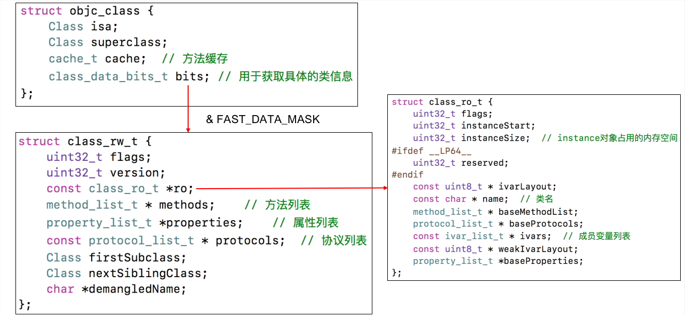

#### 02-Class的结构

###### Class的结构



```
1、class类中只要有isa指针、superClass、cache方法缓存、bits具体的类信息

2、bits & FAST_DATA_MASK 指向一个新的结构体Class_rw_t，里面包含着methods方法列表、properties属性列表、protocols协议列表、class_ro_t类的初始化信息等一些类信息
```

###### **Class_rw_t**

 `Class_rw_t`里面的`methods方法列表`、`properties属性列表`都是二维数组，是**可读可写**的，包含`类的初始内容`，`分类的内容`


###### **class_ro_t**

`class_ro_t`里面的baseMethodList，baseProtocols，Ivars，baseProperties是一维数组，是**只读**的，包含类的初始化内容


##### **method_t**

`method_t`是对方法的封装

```
struct method_t{
    SEL name;//函数名
    const char *types;//编码（返回值类型，参数类型）
    IMP imp;//指向函数的指针（函数地址）
}
```

**IMP**  代表函数的具体实现

```
typedef id _Nullable (*IMP)(id _Nonnull, SEL _Nonnull, ...); 

第一个参数是指向self的指针(如果是实例方法，则是类实例的内存地址；如果是类方法，则是指向元类的指针)，第二个参数是方法选择器(selector)
```

**SEL**    SEL代表方法名，一般叫做选择器，底层结构跟`char *`类似

- 可以通过`@selector()`和`sel_registerName()`获得
- 可以通过`sel_getName()`和`NSStringFromSelector()`转成字符串
- 不同类中相同名字的方法，所对应的方法的选择器是相同的
- 具体实现`typedef struct objc_selector *SEL`

```
typedef  struct  objc_selector *SEL;
```

**types**

types包含了函数返回值，参数编码的字符串

结构为：返回值 参数1 参数2...参数N

iOS中提供了一个叫做`@encode`的指令，可以将具体的类型表示成字符串编码


```
 "i24@0:8i16f20"

 0id 8SEL 16int 20float  == 24

- (int)test:(int)age height:(float)height

每一个方法都有两个默认参数self和_msg 我们可以查到id类型为@，SEL类型为:

1、第一个参数i返回值
2、第二个参数@ 是id 类型的self
3、第三个参数:是SEL 类型的_msg
4、第四个参数i 是Int age
5、第五个参数f 是float height

其中加载的数字其实是跟所占字节有关
1、24 总共占有多少字节
2、@0 是id 类型的self的起始位置为0
3、:8 是因为id 类型的self占字节为8，所以SEL 类型的_msg的起始位置为8
```
