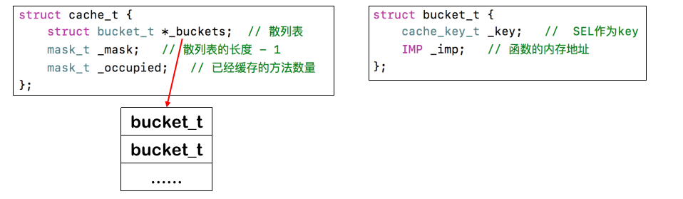
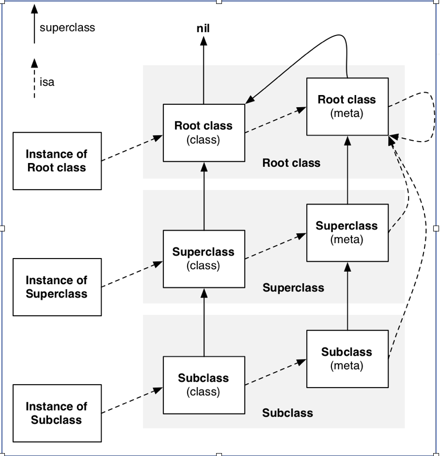
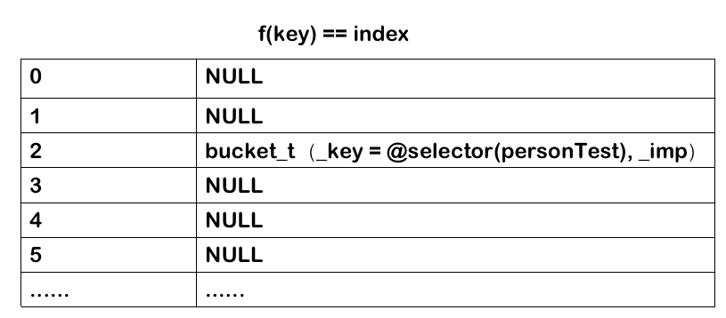

#### 03-方法缓存


`Class`内部结构中有个方法缓存（cache_t），用`散列表（哈希表）`来缓存曾经调用过的方法，可以提高方法的查找速度



缓存查找
objc-cache.mm
bucket_t * cache_t::find(cache_key_t k, id receiver)


`cache_t`结构体里面有三个元素

- `buckets`  散列表，是一个数组，数组里面的每一个元素就是一个`bucket_t`,`bucket_t`里面存放两个
  - `_key`  SEL作为key
  - `_imp`  函数的内存地址
  
- `_mask`  散列表的长度

- `_occupied`已经缓存的方法数量





```
这张图片是我们方法产找路径，如果我们的一个类有多个父类，需要调用父类方法，他的查找路径为

1、先遍历自己所有的方法

2、如果在自己类中找不到方法，则遍历父类所有方法，没有查找到调用方法之前，一直重复该动作 
如果每一次方法调用都是走这样的步骤，对于系统级方法来说，其实还是比较消耗资源的，为了应对这个情况,出现了方法缓存，
调用过的方法，都放在缓存列表中，下次查找方法的时候，现在缓存中查找，如果缓存中查找不到，然后在执行上面的方法查找流程。
```

#### 散列表

**散列表结构**




散列表的结构大概就像上面那样，数组的下标是通过`@selector(方法名)&_mask`来求得，具体每一个数组的元素是一个结构体,里面包含两个元素`_imp`和`@selector(方法名)作为的key`


一个值`与&上一个_mask`，得出的结果一定小于等于`_mask`值，而`_mask`值为数组长度-1，所以任何时候，也不会越界。


其实这就是散列表的算法，也有一些其他的算法，`取余`,一个值`取余`和`&`的效果是相同的。


- 初始`_mask`是多少？ 
  
   初始`_mask`我简单了尝试了一下，第一次可能给3


- 随着方法的增加，方法数量超过`_mask`值了怎么办 ？
  
   随着方法的增多，方法数量肯定会超过`_mask`，这个时候会清空缓存散列表，然后`_mask`*2，再然后 还是增加两倍


- 如果两个值`&_mask`的值相同了怎么办 ？
  
   如果两个值`&_mask`的值相同时，第二个`&`减一，直到找到空值，如果减到0还没有找到空位置，那就放在最大位置


- 在没有存放`cach_t`的数组位置怎么处理？
  - 在没有占用时，会在空位置的值为`NULL`


**源码查看** 在`objc-cache.mm`文件中查找`bucket_t * cache_t::find(cache_key_t k, id receiver)`方法。

```objective-c
//缓存方法查找
bucket_t * cache_t::find(SEL s, id receiver)
{
    assert(s != 0);

    bucket_t *b = buckets();
    mask_t m = mask();
    mask_t begin = cache_hash(s, m);
    mask_t i = begin;
    do {
        if (b[i].sel() == 0  ||  b[i].sel() == s) {
            return &b[i];
        }
    } while ((i = cache_next(i, m)) != begin);

    // hack
    Class cls = (Class)((uintptr_t)this - offsetof(objc_class, cache));
    cache_t::bad_cache(receiver, (SEL)s, cls);
}

//缓存空间扩展
void cache_t::expand()
{
    cacheUpdateLock.assertLocked();
    
    uint32_t oldCapacity = capacity();
  	//新空间大小是老空间的两倍
    uint32_t newCapacity = oldCapacity ? oldCapacity*2 : INIT_CACHE_SIZE;

    if ((uint32_t)(mask_t)newCapacity != newCapacity) {
        // mask overflow - can't grow further
        // fixme this wastes one bit of mask
        newCapacity = oldCapacity;
    }

    reallocate(oldCapacity, newCapacity);
}

//什么时候扩展缓存空间
static void cache_fill_nolock(Class cls, SEL sel, IMP imp, id receiver)
{
    cacheUpdateLock.assertLocked();

    // Never cache before +initialize is done
  	// 如果有缓存，直接取imp，并且返回
    if (!cls->isInitialized()) return;

    // Make sure the entry wasn't added to the cache by some other thread 
    // before we grabbed the cacheUpdateLock.
    if (cache_getImp(cls, sel)) return;

    cache_t *cache = getCache(cls);

    // Use the cache as-is if it is less than 3/4 full
    // 如果newOccupied大于capacity的3/4，则需要扩容
    mask_t newOccupied = cache->occupied() + 1;
    mask_t capacity = cache->capacity();
    if (cache->isConstantEmptyCache()) {
        // Cache is read-only. Replace it.
        cache->reallocate(capacity, capacity ?: INIT_CACHE_SIZE);
    }
    else if (newOccupied <= capacity / 4 * 3) {
        // Cache is less than 3/4 full. Use it as-is.
    }
    else {
        // Cache is too full. Expand it.
        cache->expand();
    }

    // Scan for the first unused slot and insert there.
    // There is guaranteed to be an empty slot because the 
    // minimum size is 4 and we resized at 3/4 full.
    bucket_t *bucket = cache->find(sel, receiver);
    if (bucket->sel() == 0) cache->incrementOccupied();
    bucket->set<Atomic>(sel, imp);
}

//扩展缓存空间
void cache_t::reallocate(mask_t oldCapacity, mask_t newCapacity)
{
    bool freeOld = canBeFreed();
		
    bucket_t *oldBuckets = buckets();
    bucket_t *newBuckets = allocateBuckets(newCapacity);

    // Cache's old contents are not propagated. 
    // This is thought to save cache memory at the cost of extra cache fills.
    // fixme re-measure this

    assert(newCapacity > 0);
    assert((uintptr_t)(mask_t)(newCapacity-1) == newCapacity-1);

    setBucketsAndMask(newBuckets, newCapacity - 1);

    //释放旧空间缓存
    if (freeOld) {
        cache_collect_free(oldBuckets, oldCapacity);
        cache_collect(false);
    }
}
```

###### **计算index值**

```objective-c
mask_t begin = cache_hash(k, m);

这个方式是计算下标的,点击进入查看具体实现，就是@selector(方法名)&_mask

static inline mask_t cache_hash(SEL sel, mask_t mask) 
{
    return (mask_t)(uintptr_t)sel & mask;
}
```


###### **当两个值求的下标相同时**

```objective-c

(i = cache_next(i, m)) != begin

具体实现为

#if __arm__  ||  __x86_64__  ||  __i386__
#define CACHE_END_MARKER 1
static inline mask_t cache_next(mask_t i, mask_t mask) {
    return (i+1) & mask;
}

#elif __arm64__
#define CACHE_END_MARKER 0
static inline mask_t cache_next(mask_t i, mask_t mask) {
    return i ? i-1 : mask;
}

X86的是i+1,即往后移一位
arm64是i-1,即往前移一位
```


**Class中的Cache主要是为了在消息发送的过程中，进行方法的缓存，加快调用效率，其中使用了动态扩容的方法，当容量达到最大值的3/4时，开始2倍扩容，扩容时会完全抹除旧的buckets，并且创建新的buckets代替，之后把最近一次临界的imp和key缓存进来，经典的LRU算法案例~**。


**第一次调用后就会缓存起来，方便下次快速调用；**

**如果调用是父类的方法时，会把父类的方法缓存到当前消息接收者(自己)的缓存列表中；
 简单来说就是：通过消息接收者调用成功的所有方法都会缓存一份到自己缓存列表中，方便以后快速调用提升效率;
 注意：这并不代表父类缓存中就没有这个方法的缓存，这两者不影响；**

