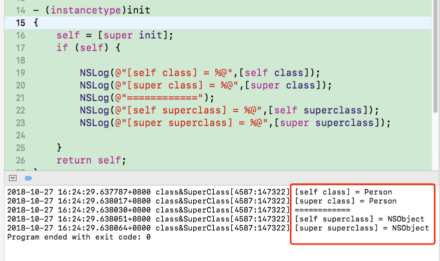

#### Class&SuperClass


```objective-c
@interface Person : NSObject 
@end

@implementation Person
 - (inst ancetype)init
{
  if(self = [super init]){
    NSLog(@"[self class] = %@",[self class]);
    // objc_msgSend(self , @selector(class))
		NSLog(@"[super class] = %@",[super superClass]);
		NSLog(@"============");
		NSLog(@"[self superclass] = %@",[self superclass]);
		NSLog(@"[super superclass] = %@",[super superclass]);
  }
}

@end

```




要想知道为什么会出现这种打印结果，我们首先需要知道`self`、`super`、`class`、`superclass`、都代表了什么意思

我们还是我们还是在源码中查找一下,我们搜索`NSObject`，然后在`.mm`文件中找到了一些实现

```objective-c
+ (id)self {
    return (id)self;
}

- (id)self {
    return self;
}

+ (Class)class {
    return self;
}

- (Class)class {
    return object_getClass(self);
}

+ (Class)superclass {
    return self->superclass;
}

- (Class)superclass {
    return [self class]->superclass;
}
```

- 1、`+self`和`-self`都是返回的`self`
- 2、`+Class`返回的是`self`；`-Class`调用的是`object_getClass(self)`，实例对象返回类对象，类对象返回元类对象
- 3、`+superclass`如果是实例对象，返回实例对象的父类，如果是类对象返回类对象的父类；`-superclass`返回类对象的父类


```objective-c
object_getClass的实现为
Class object_getClass(id obj)
{
    if (obj) return obj->getIsa();
    else return Nil;
}

但是我们好像没有找到`super`，这时候我们可以重新写一个继承自`person`的`student`类，然后重写里面的方法，然后转化为c++，我们来查看里面的实现

((void (*)(__rw_objc_super *, SEL))(void *)objc_msgSendSuper)((__rw_objc_super){(id)self, (id)class_getSuperclass(objc_getClass("Student"))}, sel_registerName("test"));

其中__rw_objc_super为结构体
struct __rw_objc_super { 
    struct objc_object *object; 
    struct objc_object *superClass; 
    __rw_objc_super(struct objc_object *o, struct objc_object *s) : object(o), superClass(s) {} 
};
```

我们可以把上面代码转化为

```objective-c
struct objc_super {
    __unsafe_unretained _Nonnull id receiver; // 消息接收者
    __unsafe_unretained _Nonnull Class super_class; // 消息接收者的父类
};

struct objc_super arg = {self, [MJPerson class]};

objc_msgSendSuper(arg, @selector(run));

我们在源码中查找objc_msgSendSuper，其中有句解释是这样的message and the superclass at which to start searching for the method implementation.，翻译过来就是消息从父类中开始搜索
```

我们知道`class`其实是`NSObject`中实现的，

`[self class]`只不过是从子类中开始查找，

`[super class]`是从父类中开始查找，

她们都是调用的`- (Class)class`，`-class`实例对象返回类对象，类对象返回元类对象。

`[self class]`和`[super class]`的消息接受者都是`self`。所以`[self class]`和`[super class]`打印的是相同的。


**总结**

- 1、`self`和`super`的消息接受者都是`self`，只不过他们查找方法的开始地方不一样,`self`是从自己开始查找方法，`super`是从父类中开始查找方法
- 2、`-class`实例对象返回类对象，类对象返回元类对象；`-superclass`返回类对象的父类
- 3、`+Class`返回的是`self`；`+superclass`如果是实例对象，返回实例对象的父类，如果是类对象返回类对象的父类；
