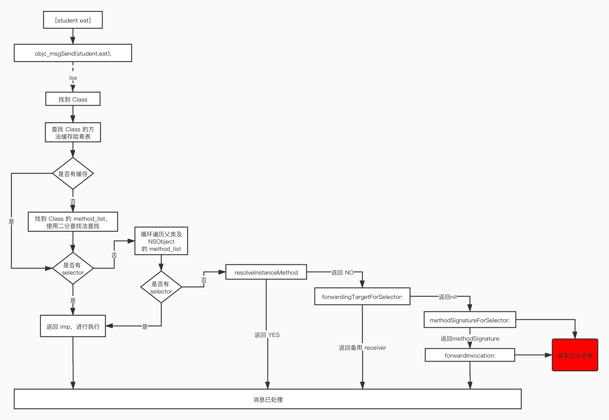

### objc_msgSend执行流程

OC中的方法调用，其实都是转化为`objc_msgSend`函数的调用，

`objc_msgSend`的执行流程可以分为3大阶段

- 1、消息发送
- 2、动态方法解析
- 3、消息转发

##### 1、消息发送


```
1、首先判断消息接受者receiver是否为nil，如果为nil直接退出消息发送

2、如果存在消息接受者receiverClass，首先在消息接受者receiverClass的cache中查找方法，如果找到方法，直接调用。如果找不到，往下进行

3、没有在消息接受者receiverClass的cache中找到方法，则从receiverClass的class_rw_t中查找方法，如果找到方法，执行方法，并把该方法缓存到receiverClass的cache中；如果没有找到，往下进行

4、没有在receiverClass中找到方法，则通过superClass指针找到superClass，也是现在缓存中查找，如果找到，执行方法，并把该方法缓存到receiverClass的cache中；如果没有找到，往下进行

5、没有在消息接受者superClass的cache中找到方法，则从superClass的class_rw_t中查找方法，如果找到方法，执行方法，并把该方法缓存到receiverClass的cache中；如果没有找到，重复4、5步骤。如果找不到了superClass了，往下进行

6、如果在最底层的superClass也找不到该方法，则要转到动态方法解析

补充：
1、如果是从class_rw_t中查找方法时：
    已经排序的，二分查找
    没有排序的，遍历查找

2、receiver通过isa指针找到receiverClass
   receiverClass通过superclass指针找到superClass
```

消息发送流程是我们平时最经常使用的流程，其他的像`动态方法解析`和`消息转发`其实是补救措施。

#### 2、动态方法解析


- 开发者可以实现以下方法，来动态添加方法实现
  
  - +resolveInstanceMethod:
  - +resolveClassMethod:

- 动态解析过后，会重新走“消息发送”的流程，从receiverClass的cache中查找方法这一步开始执行

如果一个类，只有方法的声明，没有方法的实现，会出现最常见错误：`unrecognized selector sent to instance 0x100559b60`

**动态方法解析1**

动态方法解析需要调用`resolveInstanceMethod`或者`resolveClassMethod`一个对应实例方法，一个对应类方法。

以`resolveInstanceMethod`为例

```objective-c
- (void)other{
    NSLog(@"%s",__func__);
}

+ (BOOL)resolveInstanceMethod:(SEL)sel{
    if (sel == @selector(test)) {
        //获取其他方法
        Method method = class_getInstanceMethod(self, @selector(other));
        //动态添加test的方法
        class_addMethod(self, sel,method_getImplementation(method),  method_getTypeEncoding(method));
    }

    return [super resolveInstanceMethod:sel];
}
@end
```

**动态方法解析2**

用method_t验证

```objective-c
struct method_t {
    SEL sel;
    char *types;
    IMP imp;
};

+ (BOOL)resolveInstanceMethod:(SEL)sel{

    if (sel == @selector(test)) {
        //获取其他方法
        struct method_t *method = (struct method_t*)class_getInstanceMethod(self, @selector(other));
        //动态添加test的方法
        class_addMethod(self, sel, method->imp, method->types);
        return  YES;
    }
    return [super resolveInstanceMethod:sel];
}
```

**动态方法解析3**

用C语言验证

```objective-c
void c_other(id self, SEL _cmd)
{
    NSLog(@"c_other - %@ - %@", self, NSStringFromSelector(_cmd));
}

+ (BOOL)resolveInstanceMethod:(SEL)sel{

    if (sel == @selector(test)) {

        class_addMethod(self, sel, (IMP)c_other, "v16@0:8");
        return YES;
    }

    return [super resolveInstanceMethod:sel];
}
```

#### 3、消息转发

如果方法一个方法在`消息发送阶段`没有找到相关方法，也没有进行`动态方法解析`，这个时候就会走到消息转发阶段了。


- 调用`forwardingTargetForSelector`，返回值不为nil时，会调用`objc_msgSend(返回值, SEL)`
- 调用`methodSignatureForSelector`,返回值不为nil，调用`forwardInvocation:`方法；返回值为nil时，调用`doesNotRecognizeSelector:`方法
- 开发者可以在forwardInvocation:方法中自定义任何逻辑
- 以上方法都有对象方法、类方法2个版本（前面可以是加号+，也可以是减号-）

**forwardingTargetForSelector**

```
@interface Person : NSObject
- (void)test;
@end


@interface Student : NSObject
- (void)test;
@end

#import "Student.h"
@implementation Student
- (void)test{
    NSLog(@"%s",__func__);
}
@end

#import "Person.h"
main(){
    Person *p = [[Person alloc]init];
    [p test];
}
```

调用person的test方法，由于未实现，就会报错：`unrecognized selector sent to instance 0x100747a50`

此时在Person.m中添加这个方法

```
- (id)forwardingTargetForSelector:(SEL)aSelector{
    if (aSelector == @selector(test)) {
        return [[Student alloc]init];
    }
    return nil;
}

调用forwardingTargetForSelector，返回值不为nil时，会调用objc_msgSend(返回值, SEL)，结果就是调用了objc_msgSend(Student,test)
```

**methodSignatureForSelector（方法签名）**

当`forwardingTargetForSelector`返回值为nil，或者都没有调用该方法的时候，系统会调用`methodSignatureForSelector`方法。

调用`methodSignatureForSelector`,返回值不为nil，调用`forwardInvocation:`方法；返回值为nil时，调用`doesNotRecognizeSelector:`方法

```
对于方法签名的生成方式

1、[NSMethodSignature signatureWithObjCTypes:"i@:i"]
2、[[[Student alloc]init] methodSignatureForSelector:aSelector];

实现方法签名以后我们还要实现forwardInvocation方法，当调用person的test的方法的时候，就会走到这个方法中
```

NSInvocation封装了一个方法调用，包括：方法调用者、方法名、方法参数

- anInvocation.target 方法调用者
- anInvocation.selector 方法名
- [anInvocation getArgument:NULL atIndex:0]

```objective-c
- (void)forwardInvocation:(NSInvocation *)anInvocation
{
    anInvocation.target = [[Student alloc]init];
    [anInvocation invoke];
}
```


补充：

一个完整的方法执行流程




源码解析：

```objective-c
objc-msg-arm64.s
  END_ENTRY _objc_msgSend
...

objc-runtime-new.mm


IMP _class_lookupMethodAndLoadCache3(id obj, SEL sel, Class cls)
{
    return lookUpImpOrForward(cls, sel, obj, 
                              YES/*initialize*/, NO/*cache*/, YES/*resolver*/);
}

//查找方法
IMP lookUpImpOrForward(Class cls, SEL sel, id inst, 
                       bool initialize, bool cache, bool resolver)
{
    IMP imp = nil;
    bool triedResolver = NO;

    runtimeLock.assertUnlocked();

    // Optimistic cache lookup
  	//是否要缓存查找
    if (cache) {
        imp = cache_getImp(cls, sel);
        if (imp) return imp;
    }

    // runtimeLock is held during isRealized and isInitialized checking
    // to prevent races against concurrent realization.

    // runtimeLock is held during method search to make
    // method-lookup + cache-fill atomic with respect to method addition.
    // Otherwise, a category could be added but ignored indefinitely because
    // the cache was re-filled with the old value after the cache flush on
    // behalf of the category.

    runtimeLock.lock();
    checkIsKnownClass(cls);

    if (!cls->isRealized()) {
        cls = realizeClassMaybeSwiftAndLeaveLocked(cls, runtimeLock);
        // runtimeLock may have been dropped but is now locked again
    }
	
  	//当前类是否初始化过
    if (initialize && !cls->isInitialized()) {
        cls = initializeAndLeaveLocked(cls, inst, runtimeLock);
        // runtimeLock may have been dropped but is now locked again

        // If sel == initialize, class_initialize will send +initialize and 
        // then the messenger will send +initialize again after this 
        // procedure finishes. Of course, if this is not being called 
        // from the messenger then it won't happen. 2778172
    }


 retry:    
    runtimeLock.assertLocked();

    // Try this class's cache.
		//缓存查找
    imp = cache_getImp(cls, sel);
    if (imp) goto done;

    // Try this class's method lists.
  	//找到当前类的方法列表
    {
        Method meth = getMethodNoSuper_nolock(cls, sel);
        if (meth) {
	         	//如果找到方法，就填充到当前类的方法缓存中去
            log_and_fill_cache(cls, meth->imp, sel, inst, cls);
            imp = meth->imp;
            goto done;
        }
    }

    // Try superclass caches and method lists.
  	//如果当前类的方法列表没有找到方法，就通过superClass去父类方法中找
    {
        unsigned attempts = unreasonableClassCount();
        for (Class curClass = cls->superclass;
             curClass != nil;
             curClass = curClass->superclass)
        {
            // Superclass cache.
          	//先从父类的方法缓存中找
            imp = cache_getImp(curClass, sel);
            if (imp) {
                if (imp != (IMP)_objc_msgForward_impcache) {
                    // Found the method in a superclass. Cache it in this class.
                  	//如果找到方法，就填充到当前类的方法缓存中去
                    log_and_fill_cache(cls, imp, sel, inst, curClass);
                    goto done;
                }else {
                    // Found a forward:: entry in a superclass.
                    // Stop searching, but don't cache yet; call method 
                    // resolver for this class first.
                    break;
                }
            }
            
            // Superclass method list.
          	//从父类的方法列表中查找方法
            Method meth = getMethodNoSuper_nolock(curClass, sel);
            if (meth) {
              	//如果找到方法，就填充到当前类的方法缓存中去
                log_and_fill_cache(cls, meth->imp, sel, inst, curClass);
                imp = meth->imp;
                goto done;
            }
        }
    }

    // No implementation found. Try method resolver once.
		// 是否解析过  是否尝试动过态解析
    if (resolver  &&  !triedResolver) {
        runtimeLock.unlock();
        resolveMethod(cls, sel, inst);
        runtimeLock.lock();
        // Don't cache the result; we don't hold the lock so it may have 
        // changed already. Re-do the search from scratch instead.
      	//尝试动态解析标志置为YES,重复 retry 进行方法查找
        triedResolver = YES;
        goto retry;
    }

    // No implementation found, and method resolver didn't help. 
    // Use forwarding.
  	//消息转发阶段
    imp = (IMP)_objc_msgForward_impcache;
    cache_fill(cls, sel, imp, inst);

 done:
    runtimeLock.unlock();

    return imp;
}


static method_t *
getMethodNoSuper_nolock(Class cls, SEL sel)
{
    runtimeLock.assertLocked();

    assert(cls->isRealized());
    // fixme nil cls? 
    // fixme nil sel?
		//遍历cls类的方法列表  class_rw_t -> methods
    for (auto mlists = cls->data()->methods.beginLists(), 
              end = cls->data()->methods.endLists(); 
         mlists != end;
         ++mlists)
    {
        method_t *m = search_method_list(*mlists, sel);
        if (m) return m;
    }

    return nil;
}

//查找方法
static method_t *search_method_list(const method_list_t *mlist, SEL sel)
{
    int methodListIsFixedUp = mlist->isFixedUp();
    int methodListHasExpectedSize = mlist->entsize() == sizeof(method_t);
    
    if (__builtin_expect(methodListIsFixedUp && methodListHasExpectedSize, 1)) {
      	//查找排好序的方法列表
        return findMethodInSortedMethodList(sel, mlist);
    } else {
        // Linear search of unsorted method list
      	//未排好序的，就线性查找
        for (auto& meth : *mlist) {
            if (meth.name == sel) return &meth;
        }
    }
    return nil;
}


static method_t *findMethodInSortedMethodList(SEL key, const method_list_t *list)
{
    assert(list);

    const method_t * const first = &list->first;
    const method_t *base = first;
    const method_t *probe;
    uintptr_t keyValue = (uintptr_t)key;
    uint32_t count;
    //二分查找
    for (count = list->count; count != 0; count >>= 1) {
        probe = base + (count >> 1);
        
        uintptr_t probeValue = (uintptr_t)probe->name;
        
        if (keyValue == probeValue) {
            // `probe` is a match.
            // Rewind looking for the *first* occurrence of this value.
            // This is required for correct category overrides.
            while (probe > first && keyValue == (uintptr_t)probe[-1].name) {
                probe--;
            }
            return (method_t *)probe;
        }
        
        if (keyValue > probeValue) {
            base = probe + 1;
            count--;
        }
    }
    
    return nil;
}
```


```objective-c
// 动态方法解析部分

static void resolveMethod(Class cls, SEL sel, id inst)
{
    runtimeLock.assertUnlocked();
    assert(cls->isRealized());
		
  	//根据是类对象还是元类对象调用 resolveInstanceMethod 或 resolveClassMethod
    if (! cls->isMetaClass()) {
        // try [cls resolveInstanceMethod:sel]
        resolveInstanceMethod(cls, sel, inst);
    } 
    else {
        // try [nonMetaClass resolveClassMethod:sel]
        // and [cls resolveInstanceMethod:sel]
        resolveClassMethod(cls, sel, inst);
        if (!lookUpImpOrNil(cls, sel, inst, 
                            NO/*initialize*/, YES/*cache*/, NO/*resolver*/)) 
        {
            resolveInstanceMethod(cls, sel, inst);
        }
    }
}


static void resolveInstanceMethod(Class cls, SEL sel, id inst)
{
    runtimeLock.assertUnlocked();
    assert(cls->isRealized());

    if (! lookUpImpOrNil(cls->ISA(), SEL_resolveInstanceMethod, cls, 
                         NO/*initialize*/, YES/*cache*/, NO/*resolver*/)) 
    {
        // Resolver not implemented.
        return;
    }
		
  	// 给cls 发送 sel 消息
    BOOL (*msg)(Class, SEL, SEL) = (typeof(msg))objc_msgSend;
    bool resolved = msg(cls, SEL_resolveInstanceMethod, sel);

    // Cache the result (good or bad) so the resolver doesn't fire next time.
    // +resolveInstanceMethod adds to self a.k.a. cls
    IMP imp = lookUpImpOrNil(cls, sel, inst, 
                             NO/*initialize*/, YES/*cache*/, NO/*resolver*/);


}


static void resolveClassMethod(Class cls, SEL sel, id inst)
{
    runtimeLock.assertUnlocked();
    assert(cls->isRealized());
    assert(cls->isMetaClass());

    if (! lookUpImpOrNil(cls, SEL_resolveClassMethod, inst, 
                         NO/*initialize*/, YES/*cache*/, NO/*resolver*/)) 
    {
        // Resolver not implemented.
        return;
    }

    Class nonmeta;
    {
        mutex_locker_t lock(runtimeLock);
        nonmeta = getMaybeUnrealizedNonMetaClass(cls, inst);
        // +initialize path should have realized nonmeta already
        if (!nonmeta->isRealized()) {
            _objc_fatal("nonmeta class %s (%p) unexpectedly not realized",
                        nonmeta->nameForLogging(), nonmeta);
        }
    }
    BOOL (*msg)(Class, SEL, SEL) = (typeof(msg))objc_msgSend;
    bool resolved = msg(nonmeta, SEL_resolveClassMethod, sel);

    // Cache the result (good or bad) so the resolver doesn't fire next time.
    // +resolveClassMethod adds to self->ISA() a.k.a. cls
    IMP imp = lookUpImpOrNil(cls, sel, inst, 
                             NO/*initialize*/, YES/*cache*/, NO/*resolver*/);

   
}
```


```objective-c
//消息转发阶段

由于苹果不开源，参考下面伪代码
  
  int __forwarding__(void *frameStackPointer, int isStret) {
    id receiver = *(id *)frameStackPointer;
    SEL sel = *(SEL *)(frameStackPointer + 8);
    const char *selName = sel_getName(sel);
    Class receiverClass = object_getClass(receiver);

    // 调用 forwardingTargetForSelector:
    if (class_respondsToSelector(receiverClass, @selector(forwardingTargetForSelector:))) {
        id forwardingTarget = [receiver forwardingTargetForSelector:sel];
        if (forwardingTarget && forwardingTarget != receiver) {
            return objc_msgSend(forwardingTarget, sel, ...);
        }
    }

    // 调用 methodSignatureForSelector 获取方法签名后再调用 forwardInvocation
    if (class_respondsToSelector(receiverClass, @selector(methodSignatureForSelector:))) {
        NSMethodSignature *methodSignature = [receiver methodSignatureForSelector:sel];
        if (methodSignature && class_respondsToSelector(receiverClass, @selector(forwardInvocation:))) {
            NSInvocation *invocation = [NSInvocation _invocationWithMethodSignature:methodSignature frame:frameStackPointer];

            [receiver forwardInvocation:invocation];

            void *returnValue = NULL;
            [invocation getReturnValue:&value];
            return returnValue;
        }
    }

    if (class_respondsToSelector(receiverClass,@selector(doesNotRecognizeSelector:))) {
        [receiver doesNotRecognizeSelector:sel];
    }

    // The point of no return.
    kill(getpid(), 9);
}
    
```

