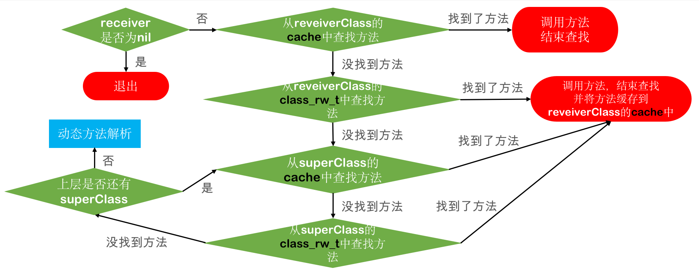
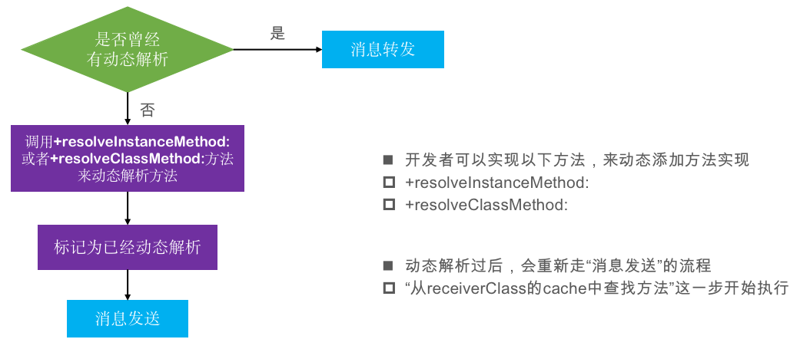
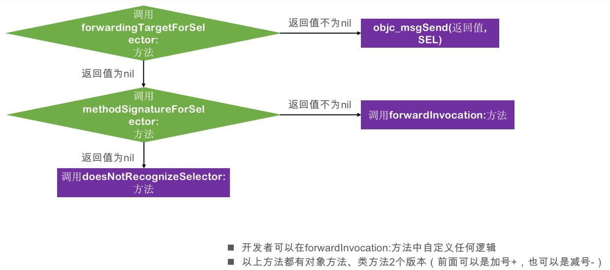

#### objc_msgSend执行流程

OC中的方法调用，其实都是转化为`objc_msgSend`函数的调用，

`objc_msgSend`的执行流程可以分为3大阶段

- 1、消息发送
- 2、动态方法解析
- 3、消息转发


##### 1、消息发送




```
1、首先判断消息接受者receiver是否为nil，如果为nil直接退出消息发送

2、如果存在消息接受者receiverClass，首先在消息接受者receiverClass的cache中查找方法，如果找到方法，直接调用。如果找不到，往下进行

3、没有在消息接受者receiverClass的cache中找到方法，则从receiverClass的class_rw_t中查找方法，如果找到方法，执行方法，并把该方法缓存到receiverClass的cache中；如果没有找到，往下进行

4、没有在receiverClass中找到方法，则通过superClass指针找到superClass，也是现在缓存中查找，如果找到，执行方法，并把该方法缓存到receiverClass的cache中；如果没有找到，往下进行

5、没有在消息接受者superClass的cache中找到方法，则从superClass的class_rw_t中查找方法，如果找到方法，执行方法，并把该方法缓存到receiverClass的cache中；如果没有找到，重复4、5步骤。如果找不到了superClass了，往下进行

6、如果在最底层的superClass也找不到该方法，则要转到动态方法解析

补充：
1、如果是从class_rw_t中查找方法时：
    已经排序的，二分查找
    没有排序的，遍历查找
    
2、receiver通过isa指针找到receiverClass
   receiverClass通过superclass指针找到superClass

```

消息发送流程是我们平时最经常使用的流程，其他的像`动态方法解析`和`消息转发`其实是补救措施。


#### 2、动态方法解析




- 开发者可以实现以下方法，来动态添加方法实现
  
  - +resolveInstanceMethod:
  - +resolveClassMethod:

- 动态解析过后，会重新走“消息发送”的流程，从receiverClass的cache中查找方法这一步开始执行


如果一个类，只有方法的声明，没有方法的实现，会出现最常见错误：`unrecognized selector sent to instance 0x100559b60`


**动态方法解析1**

动态方法解析需要调用`resolveInstanceMethod`或者`resolveClassMethod`一个对应实例方法，一个对应类方法。


以`resolveInstanceMethod`为例

```
- (void)other{
    NSLog(@"%s",__func__);
}

+ (BOOL)resolveInstanceMethod:(SEL)sel{
    if (sel == @selector(test)) {
        //获取其他方法
        Method method = class_getInstanceMethod(self, @selector(other));
        //动态添加test的方法
        class_addMethod(self, sel,method_getImplementation(method),  method_getTypeEncoding(method));
    }

    return [super resolveInstanceMethod:sel];
}
@end
```

**动态方法解析2**

用method_t验证

```
struct method_t {
    SEL sel;
    char *types;
    IMP imp;
};

+ (BOOL)resolveInstanceMethod:(SEL)sel{

    if (sel == @selector(test)) {
        //获取其他方法
        struct method_t *method = (struct method_t*)class_getInstanceMethod(self, @selector(other));
        //动态添加test的方法
        class_addMethod(self, sel, method->imp, method->types);
        return  YES;
    }
    return [super resolveInstanceMethod:sel];
}
```

**动态方法解析3**

用C语言验证

```
void c_other(id self, SEL _cmd)
{
    NSLog(@"c_other - %@ - %@", self, NSStringFromSelector(_cmd));
}

+ (BOOL)resolveInstanceMethod:(SEL)sel{

    if (sel == @selector(test)) {

        class_addMethod(self, sel, (IMP)c_other, "v16@0:8");
        return YES;
    }

    return [super resolveInstanceMethod:sel];
}
```


#### 3、消息转发

如果方法一个方法在`消息发送阶段`没有找到相关方法，也没有进行`动态方法解析`，这个时候就会走到消息转发阶段了。




- 调用`forwardingTargetForSelector`，返回值不为nil时，会调用`objc_msgSend(返回值, SEL)`
- 调用`methodSignatureForSelector`,返回值不为nil，调用`forwardInvocation:`方法；返回值为nil时，调用`doesNotRecognizeSelector:`方法
- 开发者可以在forwardInvocation:方法中自定义任何逻辑
- 以上方法都有对象方法、类方法2个版本（前面可以是加号+，也可以是减号-）


