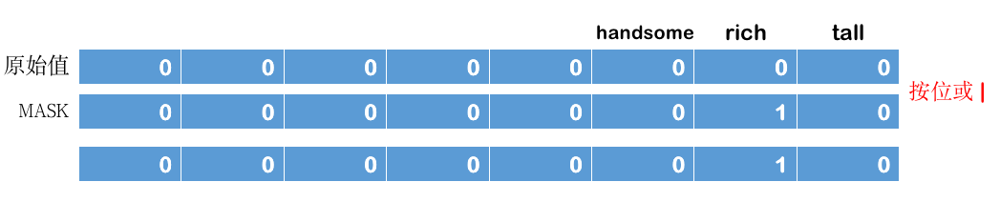

##### 位域

案例：

先创建一个`Person`类,类中有三个`BOOL`类型的属性:`tall , rich ,handsome`

然后通过`class_getInstanceSize`查看这个类对象占用多少字节,发现打印输出是:16.

因为3个`BOOL`类型的属性占用3个字节,`isa`指针占用8个字节,一共占用11个字节,再内存对齐以后,就是16个字节.

这样我们就会发现一个问题,三个`BOOL`类型的属性占用了3个字节,其实`BOOL`类型属性本质就是`0 或 1`,只占一位,也就是说3个`BOOL`属性放在一个字节就可以搞定.

比如说有一个字节的内存`0x0000 0000`我们用最后3位分别存放`tall`,`rich`,`handsom`


将Person中的三个属性删除，手动添加setter、getter方法

```
Person.h
/**
 普通写法
 @property(nonatomic ,assign)BOOL tall;
 @property(nonatomic ,assign)BOOL rich;
 @property(nonatomic ,assign)BOOL handsome;
 */

- (void)setTall:(BOOL)tall;
- (BOOL)tall;

- (void)setRich:(BOOL)rich;
- (BOOL)rich;

- (void)setHandsome:(BOOL)handsome;
- (BOOL)handsome;
```

```
Person.m

#define PersonTallMask 0b00000001
#define PersonRichMask 0b00000010
#define PersonHandsomeMask 0b00000100

@interface Person ()
{
    struct{
        char tall;
        char rich;
        char handsome;
    }_tallRichHandsome;
}
@end


- (void)setTall:(BOOL)tall
{
 if (tall) {
 _tallRichHandsome.tall |= PersonTallMask;
 }else{
 _tallRichHandsome.tall &= ~PersonTallMask;
 }
}
- (BOOL)tall
{
 return !!(_tallRichHandsome.tall & PersonTallMask);
}

- (void)setRich:(BOOL)rich
{
 if (rich) {
 _tallRichHandsome.rich |= PersonRichMask;
 }else{
 _tallRichHandsome.rich &= ~PersonRichMask;
 }
}
- (BOOL)rich
{
 return !!(_tallRichHandsome.rich & PersonRichMask);
}

- (void)setHandsome:(BOOL)handsome
{
 if (handsome) {
 _tallRichHandsome.handsome |= PersonHandsomeMask;
 }else{
 _tallRichHandsome.handsome &= ~PersonHandsomeMask;
 }
}
- (BOOL)handsome
{
 return !!(_tallRichHandsome.handsome & PersonHandsomeMask);
}
```

###### 使用：

```

    Person *p = [[Person alloc]init];
    p.tall = NO;
    p.rich = YES;
    p.handsome = NO;

    NSLog(@"%s p.tall = %d , p.rich = %d, p.handsome = %d",__func__,p.tall,p.rich,p.handsome);

打印结果：
    p.tall = 0 , p.rich = 1, p.handsome = 0
```

##### 解释说明：

###### 1、取值

###### 用 &运算符， 按位与 是两个为 1 ,结果才为1.

如果我们想要获取某一位的值,只需要把那一位设置成1,其他位设置为0,就可以取出特定位的值.


所以我们只需要在`getter`方法中按位与一个特定的值即可

比如我们想要获取`tall`, 只需按位与`0b 0000 0001`;

获取`rich`,就按位与`0b 0000 0010`

```
- (BOOL)tall
{
 return !!(_tallRichHandsome.tall & PersonTallMask);
}

_tallRichHandsome.tall 与 PersonTallMask 的结果不是BOOL类型，
通过 两次取反，就能获得真是布尔值
```

###### 2、赋值

如果赋值`YES`,就使用 按位或运算符(`|`).按位或表示一个为 1 ,结果就为 1

目标位设置为1，就能设置该值为YES



比如原始值为`0b 0000 0000`,要设置rich为YES,其他不变， 就 或上 `0b 0000 0010`，就能得到

`0b 0000 0010`,rich这位上就是YES了

如果赋值`NO`,就把目标位设置为 0 ,其他位全设置`YES`


比如原始值为`0b 0000 0111`, 要把tall也设置为NO,其他不变，

结果就是`0b0000 0110`,

那就应该把目标位设置为`0`,其他位设置为`1`,掩码就应该是`0b1111 1110`,然后再按位与`&`

要得到掩码`0b 1111 1110`, 就是 第一步取tall的值时掩码 `0b 0000 0001`取反 ~

就能得到`0b 1111 1110`了

```
- (void)setRich:(BOOL)rich
{
 if (rich) {
     _tallRichHandsome.rich |= PersonRichMask;
 }else{
     _tallRichHandsome.rich &= ~PersonRichMask;
 }
}
```

##### 优化1：

```
移位
#define PersonTallMask (1<<0)   //1 左移 0 位
#define PersonRichMask (1<<1)   //1 左移 1 位
#define PersonHandsomeMask (1<<2)   //1 左移 2 位

等同于
#define PersonTallMask 0b00000001
#define PersonRichMask 0b00000010
#define PersonHandsomeMask 0b00000100
```

##### 优化2：

```
使用共用体代替struct

{
    union{
        char bits;

        struct{
            char tall;//位域 占1位
            char rich;
            char handsome;
        };

    }_tallRichHandsome;
}

代替
{
    struct{
        char tall;
        char rich;
        char handsome;
    }_tallRichHandsome;
}

其中 union中的struct 无作用，仅仅用来增加可读性，表示bits的第一位代表tall,第二位代表rich,第三位代表handsome
```

至此setter、getter方法改写为

```
- (void)setTall:(BOOL)tall
{
    if (tall) {
        _tallRichHandsome.bits |= PersonTallMask;
    }else{
        _tallRichHandsome.bits &= ~PersonTallMask;
    }
}
- (BOOL)tall
{
    return !!(_tallRichHandsome.bits & PersonTallMask);
}

- (void)setRich:(BOOL)rich
{
    if (rich) {
        _tallRichHandsome.bits |= PersonRichMask;
    }else{
        _tallRichHandsome.bits &= ~PersonRichMask;
    }
}
- (BOOL)rich
{
    return !!(_tallRichHandsome.bits & PersonRichMask);
}

- (void)setHandsome:(BOOL)handsome
{
    if (handsome) {
        _tallRichHandsome.bits |= PersonHandsomeMask;
    }else{
        _tallRichHandsome.bits &= ~PersonHandsomeMask;
    }
}
- (BOOL)handsome
{
    return !!(_tallRichHandsome.bits & PersonHandsomeMask);
}

```


#### 共用体

union中可以定义多个成员，`union的大小由最大的成员的大小决定`；

union成员共享同一块大小的内存，一次只能使用其中的一个成员； 

对union某一个成员赋值，会覆盖其他成员的值（但前提是成员所占字节数相同，当成员所占字节数不同时只会覆盖相应字节上的值，比如对char成员赋值就不会把整个int成员覆盖掉，因为char只占一个字节，而int占四个字节）；

 union量的存放顺序是所有成员都从低地址开始存放的。


苹果官方文档上面有很多地方运用到了位运算

```
typedef NS_ENUM(NSInteger, LXDAuthorizationType)
{
LXDAuthorizationTypeNone = 0,
LXDAuthorizationTypePush = 1 << 0,  ///<    推送授权
LXDAuthorizationTypeLocation = 1 << 1,  ///<    定位授权
LXDAuthorizationTypeCamera = 1 << 2,    ///<    相机授权
LXDAuthorizationTypePhoto = 1 << 3,     ///<    相册授权
LXDAuthorizationTypeAudio = 1 << 4,  ///<    麦克风授权
LXDAuthorizationTypeContacts = 1 << 5,  ///<    通讯录授权
};
```


可以参考这样的设计

```
typedef enum {
    OptionsOne = 1<<0,   // 0b0001
    OptionsTwo = 1<<1,   // 0b0010
    OptionsThree = 1<<2, // 0b0100
    OptionsFour = 1<<3   // 0b1000
} Options

- (void)setOptions:(Options)options
{
    if (options & OptionsOne) {
        NSLog(@"包含了OptionsOne");
    }

    if (options & OptionsTwo) {
        NSLog(@"包含了OptionsTwo");
    }

    if (options & OptionsThree) {
        NSLog(@"包含了OptionsThree");
    }

    if (options & OptionsFour) {
        NSLog(@"包含了OptionsFour");
    }
}


调用上面方法
[self setOptions: OptionsOne | OptionsFour];
```


