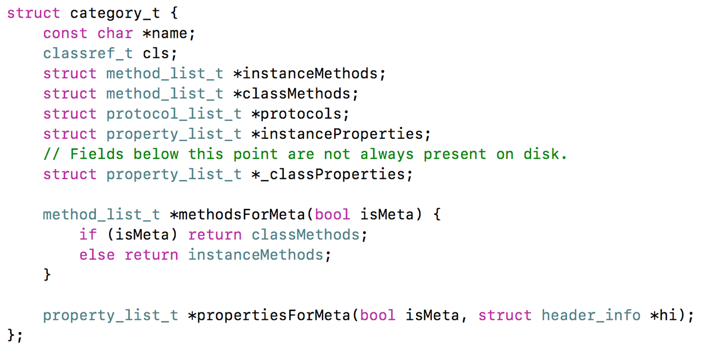

## 关联对象

#### Category能否添加成员变量？如果可以，如何给Category添加成员变量？

不能直接给Category添加成员变量，但是可以间接实现Category有成员变量的效果


由分类的底层结构可以看出，分类可以添加属性，分类中没有存储成员变量的地方



##### 利用关联对象方法，在分类中增加属性（分类中的属性，是不会自动生成setter方法和getter方法），重写setter方法和getter方法


```objective-c
@interface MJPerson (Test)
@property (copy, nonatomic) NSString *name;
@end

#import "MJPerson+Test.h"
#import <objc/runtime.h>

@implementation MJPerson (Test)

- (void)setName:(NSString *)name
{
    objc_setAssociatedObject(self, @selector(name), name, OBJC_ASSOCIATION_COPY_NONATOMIC);
}

- (NSString *)name
{
    // 隐式参数
    // _cmd == @selector(name)
    return objc_getAssociatedObject(self, _cmd);
}

外界可直接调用name属性，与类中属性无异
```

##### 关联对象的方法会不会与Category中的方法一样，在运行时的时候把方法合并到原来类的数据里面?

不是的，会分开存储，不会影响原来类、分类的结构

关联对象并不是存储在被关联对象本身内存中

关联对象存储在全局的统一的一个AssociationsManager中


#### 关联对象提供了以下API

```objective-c

添加关联对象
void objc_setAssociatedObject(id object, const void * key,
                                id value, objc_AssociationPolicy policy)

获得关联对象
id objc_getAssociatedObject(id object, const void * key)

移除所有的关联对象
void objc_removeAssociatedObjects(id object)

```

#### Key的设置

```objective-c
1
static void *MyKey = &MyKey;
objc_setAssociatedObject(obj, MyKey, value, OBJC_ASSOCIATION_RETAIN_NONATOMIC)
objc_getAssociatedObject(obj, MyKey)

2
static char MyKey;
objc_setAssociatedObject(obj, &MyKey, value, OBJC_ASSOCIATION_RETAIN_NONATOMIC)
objc_getAssociatedObject(obj, &MyKey)

3
使用属性名作为key
objc_setAssociatedObject(obj, @"property", value, OBJC_ASSOCIATION_RETAIN_NONATOMIC);
objc_getAssociatedObject(obj, @"property");

4
使用get方法的@selecor作为key
objc_setAssociatedObject(obj, @selector(getter), value, OBJC_ASSOCIATION_RETAIN_NONATOMIC)
objc_getAssociatedObject(obj, @selector(getter))

 //(在外面把里面的全局变量的值改掉 加上static 只有当前文件才能用)
```

#### 策略

```objective-c
objc_AssociationPolicy  与之对应的修饰符

OBJC_ASSOCIATION_ASSIGN--------------------------- assign
OBJC_ASSOCIATION_RETAIN_NONATOMIC----------------- strong, nonatomic
OBJC_ASSOCIATION_COPY_NONATOMIC------------------- copy, nonatomic
OBJC_ASSOCIATION_RETAIN--------------------------- strong, atomic
OBJC_ASSOCIATION_COPY----------------------------- copy, atomic

//没有weak，关联对象没有弱引用效果的。
```


### 关联对象的原理

实现关联对象技术的核心对象有

AssociationsManager

AssociationsHashMap

ObjectAssociationMap

ObjcAssociation

###### objc4源码解读：objc-references.mm


```objective-c
class AssociationsManager{
    static AssociationsHashMap *_map;
}

class AssociationsHashMap: public unordered_map<disguised_ptr_t, ObjectAssociationMap>

class ObjectAssociationMap : public std::map<void *, ObjcAssociation>

class ObjcAssociation{
    uintptr_t _policy;
    id _value;
}
```


结构解析：


