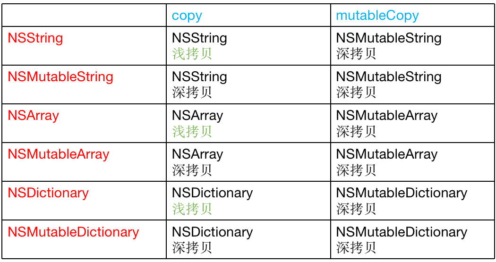

#### Copy&Strong


为什么要使用`copy`？

- 1、拷贝的目的：产生一个副本对象，跟源对象互不影响
  - 修改了源对象，不会影响副本对象
  - 修改了副本对象，不会影响源对象
- 2、iOS提供了2个拷贝方法
  - 1、copy，不可变拷贝，产生不可变副本
  - 2、mutableCopy，可变拷贝，产生可变副本
- 3、深拷贝和浅拷贝
  - 1、深拷贝：内容拷贝，产生新的对象
  - 2、浅拷贝：指针拷贝，没有产生新的对象


#### NSString & NSMutableString

```objective-c
对不可变字符串进行copy&mutableCopy操作

void test1()
{
    NSString *str1 = [NSString stringWithFormat:@"test"];
    NSString *str2 = [str1 copy]; // 返回的是NSString
    NSMutableString *str3 = [str1 mutableCopy]; // 返回的是NSMutableString
    NSLog(@"%p %p %p", str1, str2, str3);
}

根据打印的地址可以看出不可变字符串在copy时是浅拷贝，只拷贝了指针没有拷贝对象；mutableCopy则是深拷贝，产生了新的对象
补充： 如果str1的字符串比较短，有可能会采用TaggedPointer，不会是对象类型 
```

```objective-c
对可变字符串进行copy&mutableCopy操作

void test2()
{
    NSMutableString *str1 = [[NSMutableString alloc] initWithFormat:@"test"]; // 1
    NSString *str2 = [str1 copy]; // 深拷贝
    NSMutableString *str3 = [str1 mutableCopy]; // 深拷贝
    NSLog(@"%p %p %p", str1, str2, str3);
}

根据打印的地址可以看出对于可变字符串不论是copy还是mutableCopy都是深拷贝
```


#### NSArray & NSMutableArray

```objective-c
对不可变数组进行copy&mutableCopy操作
void test3()
{
    NSArray *array1 = [[NSArray alloc] initWithObjects:@"a", @"b", nil];
    NSArray *array2 = [array1 copy]; // 浅拷贝
    NSMutableArray *array3 = [array1 mutableCopy]; // 深拷贝

    NSLog(@"%p %p %p", array1, array2, array3);
}

根据打印的地址可以看出不可变数组在copy时是浅拷贝，只拷贝了指针没有拷贝对象；mutableCopy则是深拷贝，产生了新的对象
```

```objective-c
对可变数组进行copy&mutableCopy操作

void test4()
{
    NSMutableArray *array1 = [[NSMutableArray alloc] initWithObjects:@"a", @"b", nil];
    NSArray *array2 = [array1 copy]; // 深拷贝
    NSMutableArray *array3 = [array1 mutableCopy]; // 深拷贝

    NSLog(@"%p %p %p", array1, array2, array3);
}

根据打印的地址可以看出对于可变数组不论是copy还是mutableCopy都是深拷贝
```


#### NSDictionary & NSMutableDictionary

```objective-c
对不可变字典进行copy&mutableCopy操作
void test5()
{
    NSDictionary *dict1 = [[NSDictionary alloc] initWithObjectsAndKeys:@"jack", @"name", nil];
    NSDictionary *dict2 = [dict1 copy]; // 浅拷贝
    NSMutableDictionary *dict3 = [dict1 mutableCopy]; // 深拷贝

    NSLog(@"%p %p %p", dict1, dict2, dict3);
}

根据打印的地址可以看出不可变字典在copy时是浅拷贝，只拷贝了指针没有拷贝对象；mutableCopy则是深拷贝，产生了新的对象
```

```objective-c
对可变字典进行copy&mutableCopy
void test6()
{
    NSMutableDictionary *dict1 = [[NSMutableDictionary alloc] initWithObjectsAndKeys:@"jack", @"name", nil];
    NSDictionary *dict2 = [dict1 copy]; // 深拷贝
    NSMutableDictionary *dict3 = [dict1 mutableCopy]; // 深拷贝

    NSLog(@"%p %p %p", dict1, dict2, dict3);

}

根据打印的地址可以看出对于可变数组不论是copy还是mutableCopy都是深拷贝
```


对普通的类对象进行copy实现？

`若想令自己所写的对象具有拷贝功能，则需实现 NSCopying 协议。如果自定义的对象分为可变版本与不可变版本，那么就要同时实现 NSCopying 与 NSMutableCopying 协议。`

- 1、需声明该类遵从 NSCopying 协议
- 2、实现 NSCopying 协议`- (id)copyWithZone:(NSZone *)zone;`
- 3、在`- (id)copyWithZone:(NSZone *)zone;`方法中对类对象进行重新赋值


```objective-c
@interface Dog : NSObject<NSCopying>
@property (nonatomic,assign) int age;
@property (nonatomic,copy) NSString *name;
@end

- (id)copyWithZone:(NSZone *)zone{
    Dog *d = [[self class]allocWithZone:zone];
    d.age = _age;
    d.name = _name;
    return d;
}

- (void)setName:(NSString *)name {
    if (_name != name) {
        //[_name release];//MRC
        _name = [name copy];
    }
}
```


#### 总结：




#### Strong

```objective-c
@property (strong, nonatomic) NSString *strStrong;
@property (copy, nonatomic) NSString *strCopy;

NSString *str = @"abc";
self.strCopy = str;
self.strStrong = str;

NSLog(@"\nstr=%@  内存地址 = %p 指针地址=%p \nstrong=%@  内存地址=%p 指针地址=%p \ncopy = %@   内存地址=%p 指针地址=%p",
str,str,&str,
self.strStrong,self.strStrong,&_strStrong,
self.strCopy,self.strCopy,&_strCopy);


NSString *str = @"abc";
self.strCopy = str;
self.strStrong = str;

NSLog(@"\nstr = %@  内存地址=%p 指针地址=%p \nstrong=%@   内存地址=%p 指针地址=%p \ncopy=%@   内存地址=%p 指针地址=%p",
str,str,&str,
self.strStrong,self.strStrong,&_strStrong,
self.strCopy,self.strCopy,&_strCopy);


str = @"123";
NSLog(@"\nstr     = %@   内存地址 = %p 指针地址 = %p \nstrong  = %@   内存地址 = %p 指针地址 = %p \ncopy    = %@   内存地址 = %p 指针地址 = %p",
str,str,&str,
self.strStrong,self.strStrong,&_strStrong,
self.strCopy,self.strCopy,&_strCopy);

结论：源对象为不可变字符串而言，不论使用copy还是strong属性，所对应的值是不发生变化，strong和copy并没有开辟新的内存，即并不是深拷贝。此时，使用copy或是strong，并没有对数据产生影响
```


```objective-c
可变字符串
NSMutableString *str = [[NSMutableString alloc] initWithString:@"abc"];
self.strCopy = str;
self.strStrong = str;

NSLog(@"\n str = %@  内存地址 = %p 指针地址 = %p \n strong  = %@   内存地址 = %p 指针地址 = %p \ncopy    = %@   内存地址 = %p 指针地址 = %p",
str,str,&str,
self.strStrong,self.strStrong,&_strStrong,
self.strCopy,self.strCopy,&_strCopy);

[str appendString:@"123"];
NSLog(@"\n str=%@  内存地址=%p 指针地 =%p \n strong=%@   内存地址=%p 指针地址=%p \n copy=%@  内存地址=%p 指针地址=%p",
str,str,&str,
self.strStrong,self.strStrong,&_strStrong,
self.strCopy,self.strCopy,&_strCopy);


结论：数据源为可变字符串而言，使用copy申明属性，会开辟一块新的内存空间存放值，源数据不论怎么变化，都不会影响copy属性中的值，属于深拷贝；使用strong申明属性，不会开辟新的内存空间，只会引用到源数据内存地址，因此源数据改变，则strong属性也会改变，属于浅拷贝
```

**在实际开发中，不希望源数据改变影响到属性中的值，使用copy来申明。**


