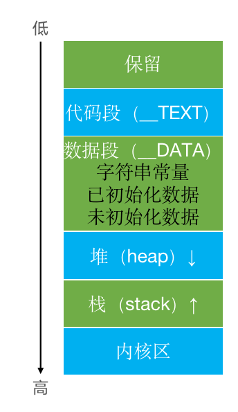
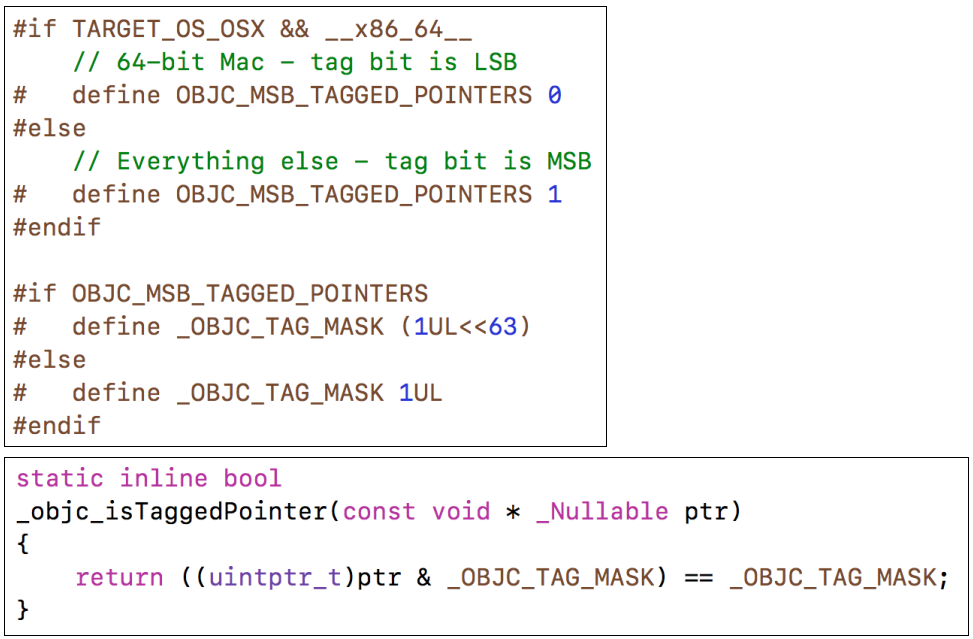

### Tagged Pointer


##### iOS程序的内存布局



- 代码段：编译之后的代码
- 数据段
  - 字符串常量：比如NSString *str = @"123"
  - 已初始化数据：已初始化的全局变量、静态变量等
  - 未初始化数据：未初始化的全局变量、静态变量等
- 堆：通过alloc、malloc、calloc等动态分配的空间，分配的内存空间地址越来越大
- 栈：函数调用开销，比如局部变量。分配的内存空间地址越来越小


```objective-c
int a = 10;
int b;
int main(int argc, char * argv[]) {
    @autoreleasepool {
        static int c = 20;
        static int d;
        int e;
        int f = 20;
        NSString *str = @"123";
        NSObject *obj = [[NSObject alloc] init];
        NSLog(@"\n&a=%p\n&b=%p\n&c=%p\n&d=%p\n&e=%p\n&f=%p\nstr=%p\nobj=%p\n",
&a, &b, &c, &d, &e, &f, str, obj);

        return UIApplicationMain(argc, argv, nil,NSStringFromClass([AppDelegate class]));
    }
}


/*
str = 0x105604068    //字符串常量
&a  = 0x105604d98    //已初始化的全局变量、静态变量
&c  = 0x105604d9c    //已初始化的全局变量、静态变量
&b  = 0x105604e64    //未初始化的全局变量、静态变量
&d  = 0x105604e60    //未初始化的全局变量、静态变量
obj = 0x608000012210 // 堆
&e  = 0x7ffeea5fcff4 // 栈
&f  = 0x7ffeea5fcff0 // 栈
*/
```


##### Tagged Pointer

- 从64bit开始，iOS引入了Tagged Pointer技术，用于优化`NSNumber`、`NSDate`、`NSString`等`小对象`的存储
- 在没有使用Tagged Pointer之前， NSNumber等对象需要动态分配内存、维护引用计数等，NSNumber指针存储的是堆中NSNumber对象的地址值
- 使用Tagged Pointer之后，NSNumber指针里面存储的数据变成了：`Tag + Data`，也就是将数据直接存储在了指针中
- 当指针不够存储数据时，才会使用动态分配内存的方式来存储数据
- `objc_msgSend`能识别`Tagged Pointer`，比如NSNumber的intValue方法，直接从指针提取数据，节省了以前的调用开销
- 如何判断一个指针是否为Tagged Pointer？
  - iOS平台，最高有效位是1（第64bit）
  - Mac平台，最低有效位是1


判断是否是Tagged Pointer代码


```objective-c
int main(int argc, const char * argv[]) {
@autoreleasepool {

    NSNumber *number1 = @4;
    NSNumber *number2 = @5;
    NSNumber *number3 = @(0xFFFFFFFFFFFFFFF);

    NSLog(@"\nnumber1=%p\nnumber2=%p\nnumber3=%p", number1, number2, number3);

    }
    return 0;
}
```


```objective-c
思考：这两段代码打印结果有什么区别？

dispatch_queue_t queue = dispatch_get_global_queue(0, 0);

for (int i = 0; i < 100; i++) {
    dispatch_async(queue, ^{
        self.name = [NSString stringWithFormat:@"abcdefghijk"];
    });
}

dispatch_queue_t queue = dispatch_get_global_queue(0, 0);

    for (int i = 0; i < 100; i++) {
    dispatch_async(queue, ^{
        self.name = [NSString stringWithFormat:@"abc"];
    });
}
```


```objective-c
NSString *str1 = [NSString stringWithFormat:@"abc"];
NSString *str2 = [NSString stringWithFormat:@"abcdefghijk"];
NSLog(@"\n[str1 class]=%@\n[str2 class]=%@",[str1 class],[str2 class]);

根据打印发现str1是NSTaggedPointerString类型，是不通过set方法找对象的。

我们也可以在源码中找到相关实现，

1、在NSObject.mm中查找retain方法的实现
- (id)retain {
    return ((id)self)->rootRetain();
}
2、点击进入rootRetain方法，我们可以在里面找到if (isTaggedPointer()) return (id)this;也就是说如果是TaggedPointer类型，直接返回，不需要根据指针查找。
```


