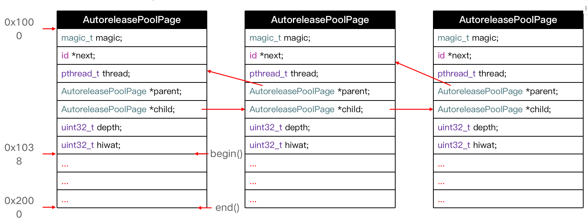
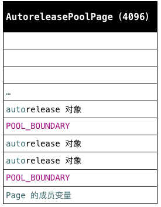
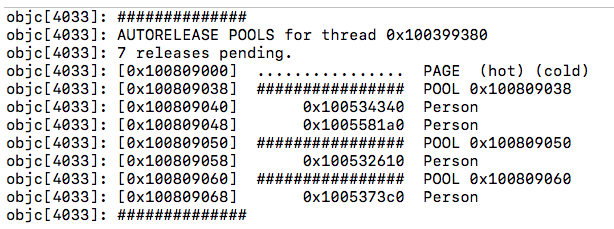
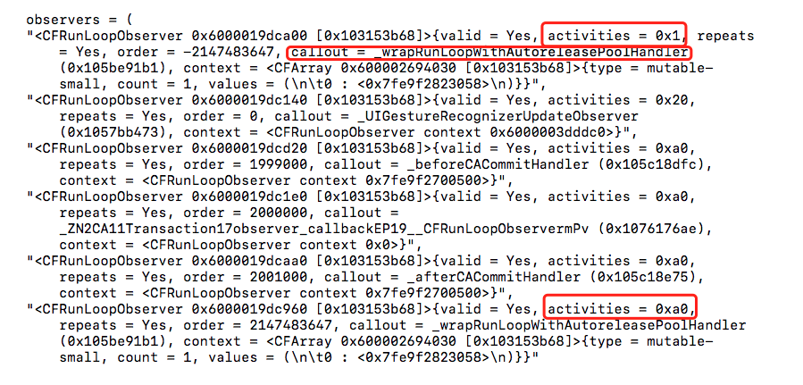

## autoreleasePool


#### autoreleasePool自动释放池

```objective-c
int main(int argc, const char * argv[]) {
    @autoreleasepool {
        Person *p = [[[Person alloc]init] autorelease];
    }
        return 0;
}
```

通过 xcrun -sdk iphoneos clang -arch arm64 -rewrite-objc main.m 命令将 main.m 转成 C++ 代码

```objective-c
int main(int argc, const char * argv[]) {
    /* @autoreleasepool */ { __AtAutoreleasePool __autoreleasepool; 

    Person *p = ((Person *(*)(id, SEL))(void *)objc_msgSend)((id)((Person *(*)(id, SEL))(void *)objc_msgSend)((id)((Person *(*)(id, SEL))(void *)objc_msgSend)((id)objc_getClass("Person"), sel_registerName("alloc")), sel_registerName("init")), sel_registerName("autorelease"));

    }
    return 0;
}

会发现 @autoreleasepool 被转成__AtAutoreleasePool __autoreleasepool;
```

而__AtAutoreleasePool我们全局查找发现他是一个结构体

```objective-c
struct __AtAutoreleasePool {
    __AtAutoreleasePool() {	// 构造函数，在创建结构体的时候调用
      	atautoreleasepoolobj = objc_autoreleasePoolPush();
    }
    ~__AtAutoreleasePool() {	// 析构函数，在结构体销毁的时候调用
      objc_autoreleasePoolPop(atautoreleasepoolobj);
    }
    void * atautoreleasepoolobj;
};
```

下面这段代码构造函数，在创建结构体的时候调用

```objective-c
__AtAutoreleasePool() { // 构造函数，在创建结构体的时候调用
    atautoreleasepoolobj = objc_autoreleasePoolPush();
}
```

下面这段代码析构函数，在结构体销毁的时候调用

```objective-c
~__AtAutoreleasePool() { // 析构函数，在结构体销毁的时候调用
    objc_autoreleasePoolPop(atautoreleasepoolobj);
}
```

```objective-c
@autoreleasepool {
    Person *p = [[[Person alloc]init] autorelease];
}

上面这段代码其实就是这个样子

atautoreleasepoolobj = objc_autoreleasePoolPush();
Person *person = [[[Person alloc] init] autorelease];
objc_autoreleasePoolPop(atautoreleasepoolobj);
```

对于`objc_autoreleasePoolPush`和`objc_autoreleasePoolPop` 的实现我们可以在[runtime源码](https://opensource.apple.com/source/objc4/)中查找相关实现

```objective-c
objc_autoreleasePoolPush(void)
{
    return AutoreleasePoolPage::push();
}

void
objc_autoreleasePoolPop(void *ctxt)
{
    AutoreleasePoolPage::pop(ctxt);
}
```

我们研究可以发现，`push()`函数和`pop(ctxt)`函数都是有`AutoreleasePoolPage`类来调用的。


##### AutoreleasePoolPage

对于`AutoreleasePoolPage`类，我们查看成员变量，对于一些静态常亮我们就不过多的探究，我们就来查看一下成员变量。

```objective-c
class AutoreleasePoolPage 
{
    magic_t const magic;//用于数据校验
    id *next;//栈顶地址
    pthread_t const thread;//所在的线程
    AutoreleasePoolPage * const parent;//父对象
    AutoreleasePoolPage *child;//子对象
    uint32_t const depth;//page的序号？
    uint32_t hiwat;
    // ...
}
```

- 1、每个`AutoreleasePoolPage对象`占用`4096`字节内存，除了用来存放它内部的成员变量，剩下的空间用来存放autorelease对象的地址
- 2、所有的`AutoreleasePoolPage`对象通过`双向链表`的形式连接在一起
- 3、调用push方法会将一个`POOL_BOUNDARY`入栈，并且返回其存放的内存地址
- 4、调用pop方法时传入一个`POOL_BOUNDARY`的内存地址，会从最后一个入栈的对象开始发送release消息，直到遇到这个`POOL_BOUNDARY`
- 5、`id *next`指向了下一个能存放`autorelease对象地址`的区域
- 6、`AutoreleasePoolPage`  空间被占满时，会以链表的形式新建链接一个  `AutoreleasePoolPage`  对象，然后将`新的autorelease对象的地址`存在`child`指针





##### push()函数实现

```objective-c
static inline void *push() 
{
    id *dest;
    if (DebugPoolAllocation) {
        // Each autorelease pool starts on a new pool page.
        dest = autoreleaseNewPage(POOL_BOUNDARY);
    } else {
        dest = autoreleaseFast(POOL_BOUNDARY);
    }
    assert(dest == EMPTY_POOL_PLACEHOLDER || *dest == POOL_BOUNDARY);
    return dest;
}
```

- 1、在`DebugPoolAllocation`线程池满了以后，会调用`autoreleaseNewPage(POOL_BOUNDARY)`来创建一个新的线程池。
- 2、线程池没有满的时候调用`autoreleaseFast`函数，以栈的形式压入线程池中。

```objective-c
static inline id *autoreleaseFast(id obj)
{
    AutoreleasePoolPage *page = hotPage();
    if (page && !page->full()) {
        return page->add(obj);
    } else if (page) {
        return autoreleaseFullPage(obj, page);
    } else {
        return autoreleaseNoPage(obj);
    }
}
```

- 有 hotPage 并且当前 page 不满，调用 page->add(obj) 方法将对象添加至 AutoreleasePoolPage 的栈中
- 有 hotPage 并且当前 page 已满，调用 autoreleaseFullPage 初始化一个新的页，调用 page->add(obj) 方法将对象添加至 AutoreleasePoolPage 的栈中
- 无 hotPage，调用 autoreleaseNoPage 创建一个 hotPage，调用 page->add(obj) 方法将对象添加至 AutoreleasePoolPage 的栈中


##### pop()函数

```objective-c
// 简化后
static inline void pop(void *token) 
{   
    AutoreleasePoolPage *page;
    id *stop;
    page = pageForPointer(token);
    stop = (id *)token;
    // 1.根据 token，也就是上文的占位 POOL_BOUNDARY 释放 `autoreleased` 对象
    page->releaseUntil(stop);

    // hysteresis: keep one empty child if page is more than half full
    // 2.释放 `Autoreleased` 对象后，销毁多余的 page。
    if (page->lessThanHalfFull()) {
        page->child->kill();
    }
    else if (page->child->child) {
        page->child->child->kill();
    }
}
```

来到 releaseUntil(...) 内部：

```objective-c
// 简化后
void releaseUntil(id *stop) 
{
    // 1.
    while (this->next != stop) {
        AutoreleasePoolPage *page = hotPage();
        // 2.
        while (page->empty()) {
        page = page->parent;
        setHotPage(page);
    }
    // 3.
    if (obj != POOL_BOUNDARY) {
        objc_release(obj);
        }
    }
    // 4.
    setHotPage(this);
}
```

- 1、外部循环挨个遍历 autoreleased 对象，直到遍历到 stop 这个  `POOL_BOUNDARY`  。
- 2、如果当前  `hatPage`  没有  `POOL_BOUNDARY`，将  `hatPage`  设置为父节点。
- 3、给当前  `autoreleased`  对象发送`release`消息。
- 4、再次配置  `hatPage`。

```objective-c
代码大概就是这样

int main(int argc, const char * argv[]) {
@autoreleasepool {//r1 = push()
    Person *p1 = [[[Person alloc]init] autorelease];
    Person *p2 = [[[Person alloc]init] autorelease];
    @autoreleasepool {//r2 = push()
        Person *p3 = [[[Person alloc]init] autorelease];
        @autoreleasepool {//r3 = push()
        Person *p4 = [[[Person alloc]init] autorelease];
        }//pop(r3)
    }//pop(r2)
}//pop(r1)

    return 0;
}

每次 Push 后，都会先添加一个 POOL_BOUNDARY 来占位，是为了对应一次 Pop 的释放
例如图中的 page 就需要两次 Pop 然后完全的释放
```




有一个私有变量，我们可以打印线程池内容`extern void _objc_autoreleasePoolPrint(void);`

```objective-c
int main(int argc, const char * argv[]) {
	@autoreleasepool {//r1 = push()
		Person *p1 = [[[Person alloc]init] autorelease];
		Person *p2 = [[[Person alloc]init] autorelease];
		@autoreleasepool {//r2 = push()
			Person *p3 = [[[Person alloc]init] autorelease];
			@autoreleasepool {//r3 = push()
					Person *p4 = [[[Person alloc]init] autorelease];
					_objc_autoreleasePoolPrint();
				}//pop(r3)
		}//pop(r2)
	}//pop(r1)

	return 0;
}
```



##### `_objc_autoreleasePoolPrint`源码

```objective-c
void 
_objc_autoreleasePoolPrint(void)
{
    AutoreleasePoolPage::printAll();
}

 static void printAll()
    {        
        _objc_inform("##############");
        _objc_inform("AUTORELEASE POOLS for thread %p", pthread_self());

        AutoreleasePoolPage *page;
        ptrdiff_t objects = 0;
        for (page = coldPage(); page; page = page->child) {
            objects += page->next - page->begin();
        }
        _objc_inform("%llu releases pending.", (unsigned long long)objects);

        if (haveEmptyPoolPlaceholder()) {
            _objc_inform("[%p]  ................  PAGE (placeholder)", 
                         EMPTY_POOL_PLACEHOLDER);
            _objc_inform("[%p]  ################  POOL (placeholder)", 
                         EMPTY_POOL_PLACEHOLDER);
        }
        else {
            for (page = coldPage(); page; page = page->child) {
                page->print();
            }
        }

        _objc_inform("##############");
    }
```


### AutoreleasePool 和 Runloop

```objective-c
- (void)viewDidLoad {
    [super viewDidLoad];

    Person *p = [[[Person alloc]init] autorelease];
    NSLog(@"%s",__func__);
}
- (void)viewWillAppear:(BOOL)animated
{
    [super viewWillAppear:animated];
    NSLog(@"%s", __func__);
}
- (void)viewDidAppear:(BOOL)animated
{
    [super viewDidAppear:animated];
    NSLog(@"%s", __func__);
}
```

在MRC下，这段代码的打印顺序

```objective-c
- [ViewController viewDidLoad]
- [ViewController viewWillAppear:]
- [Person dealloc]
- [ViewController viewDidAppear:]
```

在ARC环境下打印结果为

```
- [ViewController viewDidLoad]
- [Person dealloc]
- [ViewController viewWillAppear:]
- [ViewController viewDidAppear:]
```


我们可以猜测在ARC环境下，编译器会帮我们做一些操作，就是在`viewDidLoad`结束之前帮我们`release`

```objective-c
- (void)viewDidLoad {
    [super viewDidLoad];
    Person *p = [[Person alloc]init];
    NSLog(@"%s",__func__);
    [p release];
}
```


我们打印一下当前RunLoop`[NSRunLoop currentRunLoop]`

```
- (void)viewDidLoad {
    [super viewDidLoad];
    
    Person *p = [[[Person alloc]init] autorelease];
   	
 		NSLog(@"%@", [NSRunLoop mainRunLoop]);
}
```



```objective-c
RunLoop的状态枚举
typedef CF_OPTIONS(CFOptionFlags, CFRunLoopActivity) {
    kCFRunLoopEntry = (1UL << 0),              // 1
    kCFRunLoopBeforeTimers = (1UL << 1),       // 2
    kCFRunLoopBeforeSources = (1UL << 2),      // 4
    kCFRunLoopBeforeWaiting = (1UL << 5),      // 32
    kCFRunLoopAfterWaiting = (1UL << 6),       // 64
    kCFRunLoopExit = (1UL << 7),               // 128
    kCFRunLoopAllActivities = 0x0FFFFFFFU
};
```


**具体步骤**

- 1、iOS在主线程的Runloop中注册了2个Observer
- 2、第1个Observer监听了`kCFRunLoopEntry`事件，会调用`objc_autoreleasePoolPush()`
- 3、第2个Observer监听了kCFRunLoopBeforeWaiting事件，会调用`objc_autoreleasePoolPop()`、`objc_autoreleasePoolPush() `监听了`kCFRunLoopBeforeExit`事件，会调用`objc_autoreleasePoolPop()`

`autoreleased 对象是在 runloop 的即将进入休眠时进行释放的`


