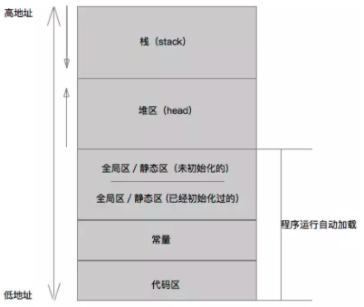

## 内存管理

摘录： https://mp.weixin.qq.com/s/nPFvhRCVLwR879-trVu8aw

#### 地址空间

每个区域实际上都存储相应的内容，其中代码区、常量区、静态区这三个区域都是自动加载，并且在进程结束之后被系统释放，开发者并不需要进行关注。

栈区一般存放局部变量、临时变量，由编译器自动分配和释放，每个线程运行时都对应一个栈。而堆区用于动态内存的申请，由程序员分配和释放。一般来说，栈区由于被系统自动管理，速度更快，但是使用起来并不如堆区灵活。

对于 Swift 来说，值类型存于栈区，引用类型存于堆区。值类型典型的有 struct、enum 以及 tuple 都是值类型。而比如 Int、Double、Array，Dictionary 等其实都是用结构体实现的，也是值类型。而 class、closure 都是引用类型，也就是说 Swift 中我们如果遇到类和闭包，就要留个心眼，考虑一下他们的引用情况。

##### 

#### 引用计数

堆区需要程序员进行管理，如何管理、记录、回收就是一个很值得思考的问题。iOS 采用的是引用计数（Reference Counting）的方式，将资源被引用的次数保存起来，当被引用次数变为零时就将其空间释放回收。

对于早期 iOS 来说，使用的是 MRC（Mannul Reference Counting）手动管理引用计数，通过插入 `retain`、`release` 等方法来管理对象的生命周期。但由于 MRC 维护起来实在是太麻烦了，2011 年的 WWDC 大会上提出了 ARC（Automatic Reference Counting）自动管理引用计数，通过编译器的静态分析，自动插入引入计数的管理逻辑，从而避免繁杂的手动管理。

引用计数只是垃圾回收中的一种，除此之外还有标记-清除算法（Mark Sweep GC）、可达性算法（Tracing GC）等。相比之下，引用计数由于只记录了对象的被引用次数，实际上只是一个局部的信息，而缺乏全局信息，因此可能产生循环引用的问题，于是在代码层面就需要格外注意。

那么为什么 iOS 还要采用引用计数呢？首先使用引用计数，对象生命周期结束时，可以立刻被回收，而不需要等到全局遍历之后再回首。其次，在内存不充裕的情况下，tracing GC 算法的延迟更大，效率反而更低，由于 iPhone 整体内存偏小，所以引用计数算是一种更为合理的选择。

