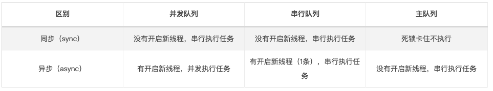
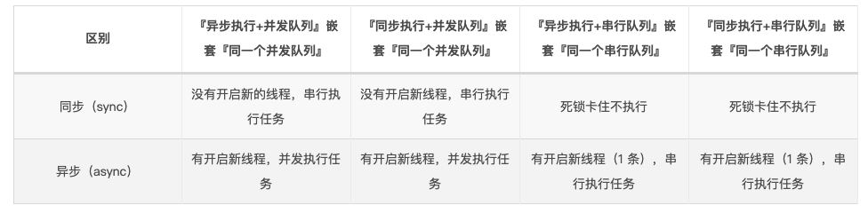

##### GCD

官方源码：https://opensource.apple.com/tarballs/libdispatch/

详尽内容参考：

###### [iOS 多线程：『GCD』详尽总结](https://bujige.net/blog/iOS-Complete-learning-GCD.html)

**1. GCD 简介**  
**2. GCD 任务和队列**  
**3. GCD 的使用步骤**  
**4. GCD 的基本使用**（六种组合不同区别，队列嵌套情况区别，相互关系形象理解）  
**5. GCD 线程间的通信**  
**6. GCD 的其他方法**（栅栏方法：dispatch_barrier_async、延时执行方法：dispatch_after、一次性代码（只执行一次）：dispatch_once、快速迭代方法：dispatch_apply、队列组：dispatch_group、信号量：dispatch_semaphore）

#### 1.什么是 GCD？

```objective-c
Grand Central Dispatch（GCD） 是 Apple 开发的一个多核编程的较新的解决方法。它主要用于优化应用程序以支持多核处理器以及其他对称多处理系统。它是一个在线程池模式的基础上执行的并发任务。在 Mac OS X 10.6 雪豹中首次推出，也可在 iOS 4 及以上版本使用。
```

```objective-c
因为使用 GCD 有很多好处啊，具体如下：

GCD 可用于多核的并行运算；
GCD 会自动利用更多的 CPU 内核（比如双核、四核）；
GCD 会自动管理线程的生命周期（创建线程、调度任务、销毁线程）；
程序员只需要告诉 GCD 想要执行什么任务，不需要编写任何线程管理代码。
GCD 拥有以上这么多的好处，而且在多线程中处于举足轻重的地位。那么我们就很有必要系统地学习一下 GCD 的使用方法。
```

#### 2.GCD任务队列

**任务**：就是执行操作的意思，换句话说就是你在线程中执行的那段代码。在 GCD 中是放在 block 中的。

执行任务有两种方式：**『同步执行』** 和 **『异步执行』**。

两者的主要区别是：**是否等待队列的任务执行结束，以及是否具备开启新线程的能力。**

```
同步执行（sync）：
同步添加任务到指定的队列中，在添加的任务执行结束之前，会一直等待，直到队列里面的任务完成之后再继续执行。
只能在当前线程中执行任务，不具备开启新线程的能力。

异步执行（async）：
异步添加任务到指定的队列中，它不会做任何等待，可以继续执行任务。
可以在新的线程中执行任务，具备开启新线程的能力。

注意：异步执行（async）虽然具有开启新线程的能力，但是并不一定开启新线程。这跟任务所指定的队列类型有关。
```

**队列（Dispatch Queue）**：这里的队列指执行任务的等待队列，即用来存放任务的队列。

队列是一种特殊的线性表，采用 FIFO（先进先出）的原则，即新任务总是被插入到队列的末尾，而读取任务的时候总是从队列的头部开始读取。每读取一个任务，则从队列中释放一个任务。

在 GCD 中有两种队列：**『串行队列』** 和 **『并发队列』**。两者都符合 FIFO（先进先出）的原则。两者的主要区别是：**执行顺序不同，以及开启线程数不同。**

```objective-c
串行队列（Serial Dispatch Queue）：
每次只有一个任务被执行。让任务一个接着一个地执行。（只开启一个线程，一个任务执行完毕后，再执行下一个任务）

并发队列（Concurrent Dispatch Queue）：
可以让多个任务并发（同时）执行。（可以开启多个线程，并且同时执行任务）

注意：并发队列 的并发功能只有在异步（dispatch_async）方法下才有效。
```

#### 3. GCD 的使用步骤

GCD 的使用步骤其实很简单，只有两步：

1. 创建一个队列（串行队列或并发队列）；
2. 将任务追加到任务的等待队列中，然后系统就会根据任务类型执行任务（同步执行或异步执行）。

下边来看看队列的创建方法 / 获取方法，以及任务的创建方法。

##### 3.1 队列的创建方法 / 获取方法

可以使用 `dispatch_queue_create` 方法来创建队列。该方法需要传入两个参数：

- 第一个参数表示队列的唯一标识符，用于 DEBUG，可为空。队列的名称推荐使用应用程序 ID 这种逆序全程域名。
- 第二个参数用来识别是串行队列还是并发队列。`DISPATCH_QUEUE_SERIAL`  表示串行队列，`DISPATCH_QUEUE_CONCURRENT`  表示并发队列。

```objective-c
// 串行队列的创建方法
dispatch_queue_t queue = dispatch_queue_create("net.bujige.testQueue", DISPATCH_QUEUE_SERIAL);

// 并发队列的创建方法
dispatch_queue_t queue = dispatch_queue_create("net.bujige.testQueue", DISPATCH_QUEUE_CONCURRENT);
```

对于串行队列，GCD 提供了的一种特殊的串行队列：**『主队列（Main Dispatch Queue）』**。

- 所有放在主队列中的任务，都会放到主线程中执行。
- 可使用  `dispatch_get_main_queue()`  方法获得主队列。

```objective-c
// 主队列的获取方法
dispatch_queue_t queue = dispatch_get_main_queue();
```

对于并发队列，GCD 默认提供了 **『全局并发队列（Global Dispatch Queue）』**。

- 可以使用  `dispatch_get_global_queue`  方法来获取全局并发队列。需要传入两个参数。第一个参数表示队列优先级，一般用  `DISPATCH_QUEUE_PRIORITY_DEFAULT`。第二个参数暂时没用，用  `0`  即可。

```objective-c
// 全局并发队列的获取方法
dispatch_queue_t queue = dispatch_get_global_queue(DISPATCH_QUEUE_PRIORITY_DEFAULT, 0);
```

##### 3.2 任务的创建方法

```objective-c
GCD 提供了同步执行任务的创建方法 dispatch_sync 和异步执行任务创建方法 dispatch_async。

// 同步执行任务创建方法
dispatch_sync(queue, ^{
    // 这里放同步执行任务代码
});
// 异步执行任务创建方法
dispatch_async(queue, ^{
    // 这里放异步执行任务代码
});
```

虽然使用 GCD 只需两步，但是既然我们有两种队列（串行队列 / 并发队列），两种任务执行方式（同步执行 / 异步执行），那么我们就有了四种不同的组合方式。这四种不同的组合方式是：

1. 同步执行 + 并发队列
2. 异步执行 + 并发队列
3. 同步执行 + 串行队列
4. 异步执行 + 串行队列
5. 同步执行+ 主队列
6. 异步执行+ 主队列



注意：从上边可看出： **『主线程』** 中调用 **『主队列』+『同步执行』** 会导致死锁问题。  
这是因为 **主队列中追加的同步任务** 和 **主线程本身的任务** 两者之间相互等待，阻塞了 **『主队列』**，最终造成了主队列所在的线程（主线程）死锁问题。  
而如果我们在 **『其他线程』** 调用 **『主队列』+『同步执行』**，则不会阻塞 **『主队列』**，自然也不会造成死锁问题。最终的结果是：**不会开启新线程，串行执行任务**。

##### 3.4 队列嵌套情况下，不同组合方式区别



```objective-c
dispatch_queue_t queue = dispatch_queue_create("test.queue", DISPATCH_QUEUE_SERIAL);
dispatch_async(queue, ^{    // 异步执行 + 串行队列
    dispatch_sync(queue, ^{  // 同步执行 + 当前串行队列
        // 追加任务 1
        [NSThread sleepForTimeInterval:2];  // 模拟耗时操作
        NSLog(@"1---%@",[NSThread currentThread]); // 打印当前线程
    });
});

执行上面的代码会导致 串行队列中追加的任务 和 串行队列中原有的任务 两者之间相互等待，阻塞了『串行队列』，最终造成了串行队列所在的线程（子线程）死锁问题。
```

#### 4. GCD 的基本使用

##### 4.1 同步执行 + 并发队列

```objective-c
/**
 * 同步执行 + 并发队列
 * 特点：在当前线程中执行任务，不会开启新线程，执行完一个任务，再执行下一个任务。
 */
- (void)syncConcurrent {
    NSLog(@"currentThread---%@",[NSThread currentThread]);  
    NSLog(@"syncConcurrent---begin");

    dispatch_queue_t queue = dispatch_queue_create("net.bujige.testQueue", DISPATCH_QUEUE_CONCURRENT);

    dispatch_sync(queue, ^{
        // 追加任务 1
        [NSThread sleepForTimeInterval:2]; // 模拟耗时操作
        NSLog(@"1---%@",[NSThread currentThread]); // 打印当前线程
    });

    dispatch_sync(queue, ^{
        // 追加任务 2
        [NSThread sleepForTimeInterval:2];// 模拟耗时操作
        NSLog(@"2---%@",[NSThread currentThread]); // 打印当前线程
    });

    dispatch_sync(queue, ^{
        // 追加任务 3
        [NSThread sleepForTimeInterval:2]; // 模拟耗时操作
        NSLog(@"3---%@",[NSThread currentThread]);// 打印当前线程
    });

    NSLog(@"syncConcurrent---end");
}

打印：
[16332:4171500] currentThread—-{number = 1, name = main}
[16332:4171500] syncConcurrent—-begin
[16332:4171500] 1—-{number = 1, name = main}
[16332:4171500] 2—-{number = 1, name = main}
[16332:4171500] 3—-{number = 1, name = main}
[16332:4171500] syncConcurrent—-end
```

```objective-c
从 同步执行 + 并发队列 中可看到：

所有任务都是在当前线程（主线程）中执行的，没有开启新的线程（同步执行不具备开启新线程的能力）。

所有任务都在打印的 syncConcurrent---begin 和 syncConcurrent---end 之间执行的（同步任务 需要等待队列的任务执行结束）。

任务按顺序执行的。
按顺序执行的原因：虽然 并发队列 可以开启多个线程，并且同时执行多个任务。
但是因为本身不能创建新线程，只有当前线程这一个线程（同步任务 不具备开启新线程的能力），所以也就不存在并发。而且当前线程只有等待当前队列中正在执行的任务执行完毕之后，才能继续接着执行下面的操作（同步任务 需要等待队列的任务执行结束）。
所以任务只能一个接一个按顺序执行，不能同时被执行。
```

##### 4.2 异步执行 + 并发队列

```objective-c
/**
 * 异步执行 + 并发队列
 * 特点：可以开启多个线程，任务交替（同时）执行。
 */
- (void)asyncConcurrent {
    NSLog(@"currentThread---%@",[NSThread currentThread]); 
    NSLog(@"asyncConcurrent---begin");

    dispatch_queue_t queue = dispatch_queue_create("net.bujige.testQueue", DISPATCH_QUEUE_CONCURRENT);

    dispatch_async(queue, ^{
        // 追加任务 1
        [NSThread sleepForTimeInterval:2];// 模拟耗时操作
        NSLog(@"1---%@",[NSThread currentThread]);// 打印当前线程
    });

    dispatch_async(queue, ^{
        // 追加任务 2
        [NSThread sleepForTimeInterval:2];// 模拟耗时操作
        NSLog(@"2---%@",[NSThread currentThread]); // 打印当前线程
    });

    dispatch_async(queue, ^{
        // 追加任务 3
        [NSThread sleepForTimeInterval:2]; // 模拟耗时操作
        NSLog(@"3---%@",[NSThread currentThread]); // 打印当前线程
    });

    NSLog(@"asyncConcurrent---end");
}

打印：
[17232:4187114] currentThread—-{number = 1, name = main}
[17232:4187114] asyncConcurrent—-begin
[17232:4187114] asyncConcurrent—-end[17232:4187204] 2—-{number = 3, name = (null)}
[17232:4187202] 3—-{number = 5, name = (null)}
[17232:4187203] 1—-{number = 4, name = (null)}
```

```objective-c
在 异步执行 + 并发队列 中可以看出：

除了当前线程（主线程），系统又开启了 3 个线程，并且任务是交替/同时执行的。（异步执行 具备开启新线程的能力。且 并发队列 可开启多个线程，同时执行多个任务）。

所有任务是在打印的 syncConcurrent---begin 和 syncConcurrent---end 之后才执行的。
说明当前线程没有等待，而是直接开启了新线程，在新线程中执行任务（异步执行 不做等待，可以继续执行任务）。
```

##### 4.3 同步执行 + 串行队列

```objective-c
/**
 * 同步执行 + 串行队列
 * 特点：不会开启新线程，在当前线程执行任务。任务是串行的，执行完一个任务，再执行下一个任务。
 */
- (void)syncSerial {
    NSLog(@"currentThread---%@",[NSThread currentThread]);  
    NSLog(@"syncSerial---begin");

    dispatch_queue_t queue = dispatch_queue_create("net.bujige.testQueue", DISPATCH_QUEUE_SERIAL);

    dispatch_sync(queue, ^{
        // 追加任务 1
        [NSThread sleepForTimeInterval:2];// 模拟耗时操作
        NSLog(@"1---%@",[NSThread currentThread]);// 打印当前线程
    });
    dispatch_sync(queue, ^{
        // 追加任务 2
        [NSThread sleepForTimeInterval:2]; // 模拟耗时操作
        NSLog(@"2---%@",[NSThread currentThread]);// 打印当前线程
    });
    dispatch_sync(queue, ^{
        // 追加任务 3
        [NSThread sleepForTimeInterval:2];// 模拟耗时操作
        NSLog(@"3---%@",[NSThread currentThread]);// 打印当前线程
    });

    NSLog(@"syncSerial---end");
}

打印：
[17285:4197645] currentThread—-{number = 1, name = main}
[17285:4197645] syncSerial—-begin
[17285:4197645] 1—-{number = 1, name = main}
[17285:4197645] 2—-{number = 1, name = main}
[17285:4197645] 3—-{number = 1, name = main}
[17285:4197645] syncSerial—-end
```

```objective-c
在 同步执行 + 串行队列 可以看到：

所有任务都是在当前线程（主线程）中执行的，并没有开启新的线程（同步执行 不具备开启新线程的能力）。
所有任务都在打印的 syncConcurrent---begin 和 syncConcurrent---end 之间执行（同步任务 需要等待队列的任务执行结束）。
任务是按顺序执行的（串行队列 每次只有一个任务被执行，任务一个接一个按顺序执行）。
```

##### 4.4 异步执行 + 串行队列

```objective-c
/**
 * 异步执行 + 串行队列
 * 特点：会开启新线程，但是因为任务是串行的，执行完一个任务，再执行下一个任务。
 */
- (void)asyncSerial {
    NSLog(@"currentThread---%@",[NSThread currentThread]);  
    NSLog(@"asyncSerial---begin");

    dispatch_queue_t queue = dispatch_queue_create("net.bujige.testQueue", DISPATCH_QUEUE_SERIAL);

    dispatch_async(queue, ^{
        // 追加任务 1
        [NSThread sleepForTimeInterval:2];// 模拟耗时操作
        NSLog(@"1---%@",[NSThread currentThread]);// 打印当前线程
    });
    dispatch_async(queue, ^{
        // 追加任务 2
        [NSThread sleepForTimeInterval:2]; // 模拟耗时操作
        NSLog(@"2---%@",[NSThread currentThread]); // 打印当前线程
    });
    dispatch_async(queue, ^{
        // 追加任务 3
        [NSThread sleepForTimeInterval:2];// 模拟耗时操作
        NSLog(@"3---%@",[NSThread currentThread]); // 打印当前线程
    });

    NSLog(@"asyncSerial---end");
}

打印：
[17313:4203018] currentThread—-{number = 1, name = main}
[17313:4203018] asyncSerial—-begin
[17313:4203018] asyncSerial—-end
[17313:4203079] 1—-{number = 3, name = (null)}
[17313:4203079] 2—-{number = 3, name = (null)}
[17313:4203079] 3—-{number = 3, name = (null)}
```

```objective-c
在 异步执行 + 串行队列 可以看到：

开启了一条新线程（异步执行 具备开启新线程的能力，串行队列 只开启一个线程）。
所有任务是在打印的 syncConcurrent---begin 和 syncConcurrent---end 之后才开始执行的（异步执行 不会做任何等待，可以继续执行任务）。
任务是按顺序执行的（串行队列 每次只有一个任务被执行，任务一个接一个按顺序执行）。
```

##### 4.5 同步执行 + 主队列

`同步执行 + 主队列` 在不同线程中调用结果也是不一样，在主线程中调用会发生死锁问题，而在其他线程中调用则不会。

###### 4.5.1 在主线程中调用 『同步执行 + 主队列』

```objective-c
/**
 * 同步执行 + 主队列
 * 特点(主线程调用)：互等卡主不执行。
 * 特点(其他线程调用)：不会开启新线程，执行完一个任务，再执行下一个任务。
 */
- (void)syncMain {

    NSLog(@"currentThread---%@",[NSThread currentThread]);  
    NSLog(@"syncMain---begin");

    dispatch_queue_t queue = dispatch_get_main_queue();

    dispatch_sync(queue, ^{
        // 追加任务 1
        [NSThread sleepForTimeInterval:2];  // 模拟耗时操作
        NSLog(@"1---%@",[NSThread currentThread]); // 打印当前线程
    });

    dispatch_sync(queue, ^{
        // 追加任务 2
        [NSThread sleepForTimeInterval:2]; // 模拟耗时操作
        NSLog(@"2---%@",[NSThread currentThread]); // 打印当前线程
    });

    dispatch_sync(queue, ^{
        // 追加任务 3
        [NSThread sleepForTimeInterval:2];  // 模拟耗时操作
        NSLog(@"3---%@",[NSThread currentThread]); // 打印当前线程
    });

    NSLog(@"syncMain---end");
}

打印：
[17371:4213562] currentThread—-{number = 1, name = main}
[17371:4213562] syncMain—-begin
(lldb)
```

```objective-c
在主线程中使用 同步执行 + 主队列 可以惊奇的发现：

追加到主线程的任务 1、任务 2、任务 3 都不再执行了，而且 syncMain---end 也没有打印，在 XCode 9 及以上版本上还会直接报崩溃。这是为什么呢？

这是因为我们在主线程中执行 syncMain 方法，相当于把 syncMain 任务放到了主线程的队列中。而 同步执行 会等待当前队列中的任务执行完毕，才会接着执行。那么当我们把 任务 1 追加到主队列中，任务 1 就在等待主线程处理完 syncMain 任务。而syncMain 任务需要等待 任务 1 执行完毕，才能接着执行。

那么，现在的情况就是 syncMain 任务和 任务 1 都在等对方执行完毕。这样大家互相等待，所以就卡住了，所以我们的任务执行不了，而且 syncMain---end 也没有打印。
```

###### 4.5.2 在其他线程中调用『同步执行 + 主队列』

```objective-c
// 使用 NSThread 的 detachNewThreadSelector 方法会创建线程，并自动启动线程执行 selector 任务
[NSThread detachNewThreadSelector:@selector(syncMain) toTarget:self withObject:nil];

打印：
[17482:4237818] currentThread—-{number = 3, name = (null)}
[17482:4237818] syncMain—-begin
[17482:4237594] 1—-{number = 1, name = main}
[17482:4237594] 2—-{number = 1, name = main}
[17482:4237594] 3—-{number = 1, name = main}
[17482:4237818] syncMain—-end
```

```objective-c
在其他线程中使用 同步执行 + 主队列 可看到：

所有任务都是在主线程（非当前线程）中执行的，没有开启新的线程（所有放在主队列中的任务，都会放到主线程中执行）。
所有任务都在打印的 syncConcurrent---begin 和 syncConcurrent---end 之间执行（同步任务 需要等待队列的任务执行结束）。
任务是按顺序执行的（主队列是 串行队列，每次只有一个任务被执行，任务一个接一个按顺序执行）。

为什么现在就不会卡住了呢？

因为syncMain 任务 放到了其他线程里，而 任务 1、任务 2、任务3 都在追加到主队列中，这三个任务都会在主线程中执行。
syncMain 任务 在其他线程中执行到追加 任务 1 到主队列中，因为主队列现在没有正在执行的任务，所以，会直接执行主队列的 任务1，等 任务1 执行完毕，再接着执行 任务 2、任务 3。所以这里不会卡住线程，也就不会造成死锁问题。
```

##### 4.6 异步执行 + 主队列

```objective-c
/**
 * 异步执行 + 主队列
 * 特点：只在主线程中执行任务，执行完一个任务，再执行下一个任务
 */
- (void)asyncMain {
    NSLog(@"currentThread---%@",[NSThread currentThread]);  
    NSLog(@"asyncMain---begin");

    dispatch_queue_t queue = dispatch_get_main_queue();

    dispatch_async(queue, ^{
        // 追加任务 1
        [NSThread sleepForTimeInterval:2]; // 模拟耗时操作
        NSLog(@"1---%@",[NSThread currentThread]); // 打印当前线程
    });

    dispatch_async(queue, ^{
        // 追加任务 2
        [NSThread sleepForTimeInterval:2];// 模拟耗时操作
        NSLog(@"2---%@",[NSThread currentThread]);// 打印当前线程
    });

    dispatch_async(queue, ^{
        // 追加任务 3
        [NSThread sleepForTimeInterval:2]; // 模拟耗时操作
        NSLog(@"3---%@",[NSThread currentThread]);// 打印当前线程
    });

    NSLog(@"asyncMain---end");
}

打印：
[17521:4243690] currentThread—-{number = 1, name = main}
[17521:4243690] asyncMain—-begin
[17521:4243690] asyncMain—-end
[17521:4243690] 1—-{number = 1, name = main}
[17521:4243690] 2—-{number = 1, name = main}
[17521:4243690] 3—-{number = 1, name = main}
```

```objective-c
在 异步执行 + 主队列 可以看到：

所有任务都是在当前线程（主线程）中执行的，并没有开启新的线程（虽然 异步执行 具备开启线程的能力，但因为是主队列，所以所有任务都在主线程中）。
所有任务是在打印的 syncConcurrent---begin 和 syncConcurrent---end 之后才开始执行的（异步执行不会做任何等待，可以继续执行任务）。
任务是按顺序执行的（因为主队列是 串行队列，每次只有一个任务被执行，任务一个接一个按顺序执行）。
```

### 5. GCD 线程间的通信

```objective-c
/**
 * 线程间通信
 */
- (void)communication {
    // 获取全局并发队列
    dispatch_queue_t queue = dispatch_get_global_queue(DISPATCH_QUEUE_PRIORITY_DEFAULT, 0);
    // 获取主队列
    dispatch_queue_t mainQueue = dispatch_get_main_queue();

    dispatch_async(queue, ^{
        // 异步追加任务 1
        [NSThread sleepForTimeInterval:2]; // 模拟耗时操作
        NSLog(@"1---%@",[NSThread currentThread]); // 打印当前线程

        // 回到主线程
        dispatch_async(mainQueue, ^{
            // 追加在主线程中执行的任务
            [NSThread sleepForTimeInterval:2]; // 模拟耗时操作
            NSLog(@"2---%@",[NSThread currentThread]); // 打印当前线程
        });
    });
}

打印
[17573:4253201] 1—-{number = 3, name = (null)}
[17573:4253108] 2—-{number = 1, name = main}

可以看到在其他线程中先执行任务，执行完了之后回到主线程执行主线程的相应操作。
```
