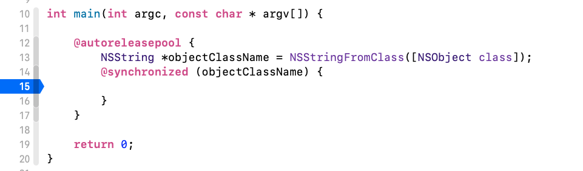
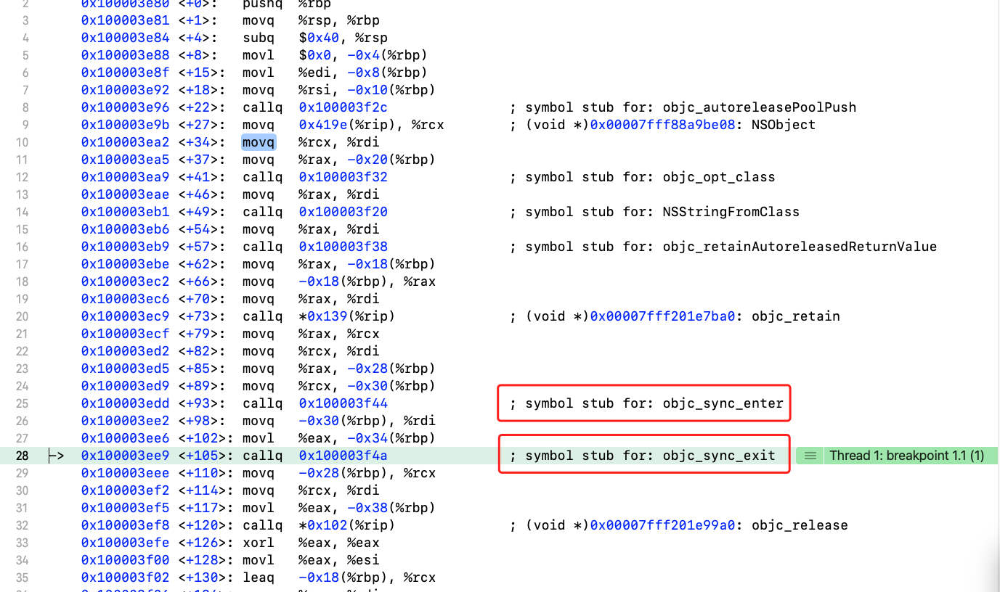
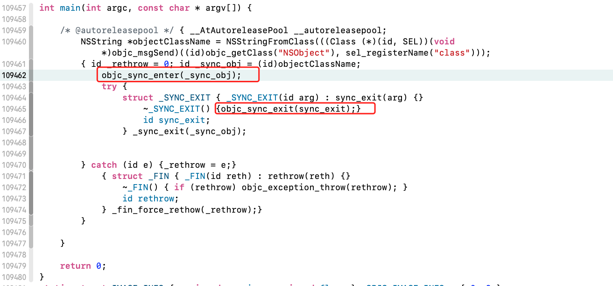

## 关于synchronized锁

http://yulingtianxia.com/blog/2015/11/01/More-than-you-want-to-know-about-synchronized/

https://juejin.cn/post/6892672477382737928


### 1、@synchronized分析

利用代码分析



打开汇编，方式如下： Xcode -> Debug -> Debug Workflow -> Always Show Disassembly




>查看汇编的代码我们发现了两上函数`objc_sync_enter`和`objc_sync_exit`,我们猜想，这个会不会就是@synchronized的加锁和解锁呢？


#### clang的方式分析

下面我们通过clang将main.m文件编绎成main.cpp文件



**我们发现了两上函数`objc_sync_enter`和`objc_sync_exit`,说明了确实是这两个函数对@synchronized进行了加锁和解锁。**


接着在源码库中找出这两个函数

```c
// Begin synchronizing on 'obj'. 
// Allocates recursive mutex associated with 'obj' if needed.
// Returns OBJC_SYNC_SUCCESS once lock is acquired.  
int objc_sync_enter(id obj)
{
    int result = OBJC_SYNC_SUCCESS;

    if (obj) {
        SyncData* data = id2data(obj, ACQUIRE);
        assert(data);
        data->mutex.lock();
    } else {
        // @synchronized(nil) does nothing
        if (DebugNilSync) {
            _objc_inform("NIL SYNC DEBUG: @synchronized(nil); set a breakpoint on objc_sync_nil to debug");
        }
        objc_sync_nil();
    }

    return result;
}


```

**SyncData* data = id2data(obj, ACQUIRE);
根据obj得到一个SyncData的实例data; data->mutex.lock();函数进行加锁;
objc_sync_nil();对 obj为空的处理**


**objc_sync_nil()**

```c
#   define BREAKPOINT_FUNCTION(prototype)                             \
    OBJC_EXTERN __attribute__((noinline, used, visibility("hidden"))) \
    prototype { asm(""); }

//针对obj为空的情况直接不处理。
```


##### objc_sync_exit()

```c
// End synchronizing on 'obj'. 
// Returns OBJC_SYNC_SUCCESS or OBJC_SYNC_NOT_OWNING_THREAD_ERROR
int objc_sync_exit(id obj)
{
    int result = OBJC_SYNC_SUCCESS;
    
    if (obj) {
        SyncData* data = id2data(obj, RELEASE); 
        if (!data) {
            result = OBJC_SYNC_NOT_OWNING_THREAD_ERROR;
        } else {
            bool okay = data->mutex.tryUnlock();
            if (!okay) {
                result = OBJC_SYNC_NOT_OWNING_THREAD_ERROR;
            }
        }
    } else {
        // @synchronized(nil) does nothing
    }
	

    return result;
}
```

**拿到`obj`的`SyncData`并解锁`data->mutex.tryUnlock()`.**


##### SyncData的数据结构

```c
//
// Allocate a lock only when needed.  Since few locks are needed at any point
// in time, keep them on a single list.
//


typedef struct alignas(CacheLineSize) SyncData {
    struct SyncData* nextData;
    DisguisedPtr<objc_object> object;
    int32_t threadCount;  // number of THREADS using this block
    recursive_mutex_t mutex;
} SyncData;
```

**`nextData`指向下一个`SyncData`,说明@synchronized锁的对象是采用链表的形式存储的；**

**`threadCount` 记录当前有多少个线程使用了@synchronized;***

**由`mutex`可知，@synchronized所加的锁是`recursive_mutex_t`类型的互斥锁。**


##### SyncData的获取方法'id2data'函数分析，这个方法特别长

```c
static SyncData* id2data(id object, enum usage why)
{
    spinlock_t *lockp = &LOCK_FOR_OBJ(object);
    SyncData **listp = &LIST_FOR_OBJ(object);
    SyncData* result = NULL;

  
#if SUPPORT_DIRECT_THREAD_KEYS
    // Check per-thread single-entry fast cache for matching object
    bool fastCacheOccupied = NO;
  
  // 当查询到object对应的SyncData的data存在时的分析		
    SyncData *data = (SyncData *)tls_get_direct(SYNC_DATA_DIRECT_KEY);	
    if (data) {
        fastCacheOccupied = YES;

        if (data->object == object) {
            // Found a match in fast cache.
            uintptr_t lockCount;
            result = data;
          //拿到objc对应SyncData当前锁的数量lockCount
            lockCount = (uintptr_t)tls_get_direct(SYNC_COUNT_DIRECT_KEY);
            if (result->threadCount <= 0  ||  lockCount <= 0) {
                _objc_fatal("id2data fastcache is buggy");
            }

            switch(why) {
            case ACQUIRE: {
                lockCount++;	//在ACQUIRE情况下进行加加，
                tls_set_direct(SYNC_COUNT_DIRECT_KEY, (void*)lockCount);
                break;
            }
            case RELEASE:
                lockCount--;	//在RELEASE情况下进行减减；并保存。
                tls_set_direct(SYNC_COUNT_DIRECT_KEY, (void*)lockCount);
                if (lockCount == 0) {
                    // remove from fast cache
                    tls_set_direct(SYNC_DATA_DIRECT_KEY, NULL);
                    // atomic because may collide with concurrent ACQUIRE
                    OSAtomicDecrement32Barrier(&result->threadCount);
                }
                break;
            case CHECK:
                // do nothing
                break;
            }

            return result;
        }
    }
#endif
		//当查询到有缓存的情况下的分析
    // Check per-thread cache of already-owned locks for matching object
    SyncCache *cache = fetch_cache(NO);
    if (cache) {
        unsigned int i;
        for (i = 0; i < cache->used; i++) {
            SyncCacheItem *item = &cache->list[i];
            if (item->data->object != object) continue;

            // Found a match.
            result = item->data;
            if (result->threadCount <= 0  ||  item->lockCount <= 0) {
                _objc_fatal("id2data cache is buggy");
            }
            //拿到objc对应SyncData当前缓存的锁的数量lockCount
            switch(why) {
            case ACQUIRE:
                item->lockCount++;	//在ACQUIRE情况下进行加加，
                break;
            case RELEASE:
                item->lockCount--;	//在RELEASE情况下进行减减；并更新缓存.
                if (item->lockCount == 0) {
                    // remove from per-thread cache
                    cache->list[i] = cache->list[--cache->used];
                    // atomic because may collide with concurrent ACQUIRE
                    OSAtomicDecrement32Barrier(&result->threadCount);
                }
                break;
            case CHECK:
                // do nothing
                break;
            }

            return result;
        }
    }

    // Thread cache didn't find anything.
    // Walk in-use list looking for matching object
    // Spinlock prevents multiple threads from creating multiple 
    // locks for the same new object.
    // We could keep the nodes in some hash table if we find that there are
    // more than 20 or so distinct locks active, but we don't do that now.
    
  	//当没有查询到也没有缓存时的分析
    lockp->lock();

    {
    //  首先进行加锁；
		//	遍历整个链表，打到尾结点；
		//	如果没有找到尾结点，将objcet的数据记录到result中;
		//	最后goto done.
        SyncData* p;
        SyncData* firstUnused = NULL;
        for (p = *listp; p != NULL; p = p->nextData) {
            if ( p->object == object ) {
                result = p;
                // atomic because may collide with concurrent RELEASE
                OSAtomicIncrement32Barrier(&result->threadCount);
                goto done;
            }
            if ( (firstUnused == NULL) && (p->threadCount == 0) )
                firstUnused = p;
        }
    
        // no SyncData currently associated with object
        if ( (why == RELEASE) || (why == CHECK) )
            goto done;
    
        // an unused one was found, use it
        if ( firstUnused != NULL ) {
            result = firstUnused;
            result->object = (objc_object *)object;
            result->threadCount = 1;
            goto done;
        }
    }

    // Allocate a new SyncData and add to list.
    // XXX allocating memory with a global lock held is bad practice,
    // might be worth releasing the lock, allocating, and searching again.
    // But since we never free these guys we won't be stuck in allocation very often.
  
  	//创建一个新的SyncData并保存到list中,threadCount=1。
    posix_memalign((void **)&result, alignof(SyncData), sizeof(SyncData));
    result->object = (objc_object *)object;
    result->threadCount = 1;
    new (&result->mutex) recursive_mutex_t(fork_unsafe_lock);
    result->nextData = *listp;
    *listp = result;
    
 done:	//将上面步骤得到的result存到暂存和缓存中,并返回result。
    lockp->unlock();
    if (result) {
        // Only new ACQUIRE should get here.
        // All RELEASE and CHECK and recursive ACQUIRE are 
        // handled by the per-thread caches above.
        if (why == RELEASE) {
            // Probably some thread is incorrectly exiting 
            // while the object is held by another thread.
            return nil;
        }
        if (why != ACQUIRE) _objc_fatal("id2data is buggy");
        if (result->object != object) _objc_fatal("id2data is buggy");

#if SUPPORT_DIRECT_THREAD_KEYS
        if (!fastCacheOccupied) {
            // Save in fast thread cache
            tls_set_direct(SYNC_DATA_DIRECT_KEY, result);
            tls_set_direct(SYNC_COUNT_DIRECT_KEY, (void*)1);
        } else 
#endif
        {
            // Save in thread cache
            if (!cache) cache = fetch_cache(YES);
            cache->list[cache->used].data = result;
            cache->list[cache->used].lockCount = 1;
            cache->used++;
        }
    }

    return result;
}

```


### 总结：

**`@synchronized`维护了一个hash表，hash表中保存了每条线程使用@synchronized的情况，用`threadCount`记录线程数，用`lockCount`记录每个线程下的加锁数量。所以@synchronized才能支持多线程和嵌套使用。**


### 2、@synchronized(id)参数问题


##### 如下代码执行后会出现什么问题?

```objective-c
- (void)lg_crash{
    for (int i = 0; i < 200000; i++) {
        dispatch_async(dispatch_get_global_queue(0, 0), ^{
            _testArray = [NSMutableArray array];
        });
    }
}
```

>- **以上代码实现了在多线程中多次对_testArray进行初始化；**
>
>- **_testArray = [NSMutableArray array];本质是调用setter方法；而setter 方法需要对旧值的releae，对新值的retain;在多线程操作_testArray的setter方法，而不保证线程安全的情况下就会出现对同一个旧值进行了多次的release，从而导致野指针的出现，从而导致程序崩溃。**


##### 那么我们作出如下修改后会怎么样呢？

```objective-c
- (void)lg_crash{
    for (int i = 0; i < 200000; i++) {
        dispatch_async(dispatch_get_global_queue(0, 0), ^{
            @synchronized (_testArray) {
                _testArray = [NSMutableArray array];
            }
        });
    }
}
```

>**如上面分析的，_testArray在某个时刻可能会变为nil，所以通过之前对@synchronized原理的分析，加上多线程下的处理，当我们在使用@synchronized的过程中，需要对_testArray先加锁再解锁，而当_testArray变为nil时，多线程下的操作会导致@synchronized传入的参数为nil而调用objc_sync_nil函数，也就没有了加锁的效果了，从而导致崩溃的出现。**


##### 所以我们在使用@synchronized确保多线程数据安全的时候，要保证传入的绝对不能如上例子为nil的情况。修改成如下则不会再有问题：

```objective-c
- (void)lg_crash{
    for (int i = 0; i < 200000; i++) {
        dispatch_async(dispatch_get_global_queue(0, 0), ^{
            @synchronized (self) {
                _testArray = [NSMutableArray array];
            }
        });
    }
}
```

