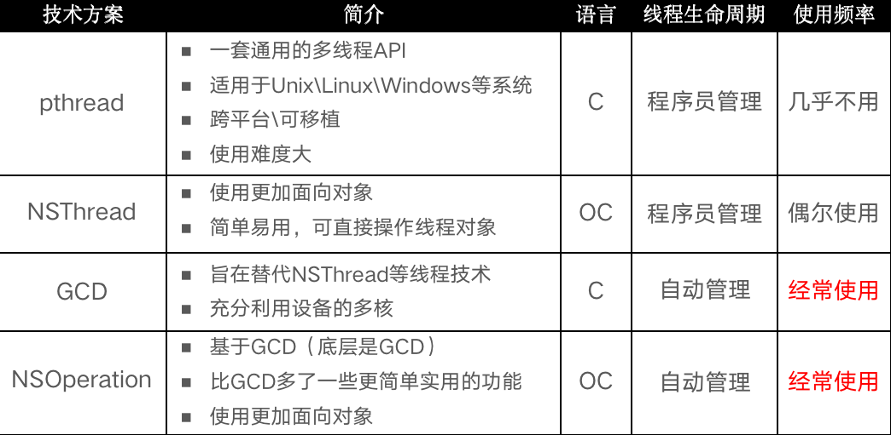
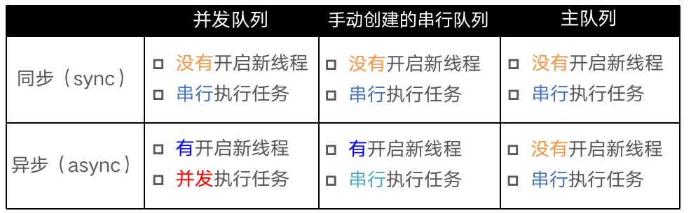

##### iOS中的常见多线程方案




#### 容易混淆的术语

```
同步和异步主要影响：能不能开启新的线程

同步：在当前线程中执行任务，不具备开启新线程的能力
异步：在新的线程中执行任务，具备开启新线程的能力
```

```
并发和串行主要影响：任务的执行方式

并发：多个任务并发（同时）执行
串行：一个任务执行完毕后，再执行下一个任务
```





注意：

使用sync函数往当前串行队列中添加任务，会卡住当前的串行队列（产生死锁）
