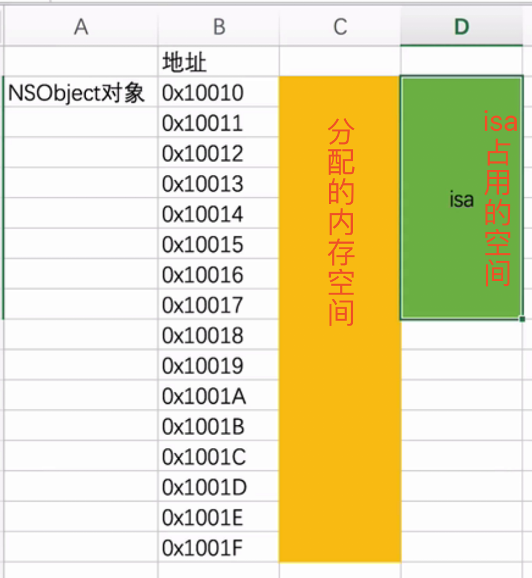

一个对象占多少内存？

苹果开源代码

##### opensource.apple.com/tarballs

Mac插件：[Go2AShell]([https://zipzapmac.com/Go2Shell](https://zipzapmac.com/Go2Shell)

可在Finder上快速打开在命令行中的此文件的位置

一个.m文件编译成c++代码

简单写法：

clang -rewrite-objc main.m -o main.cpp

编译成iPhone环境上

xcrun -sdk iphoneos clang -arch arm64 -rewrite-objc OC源文件 -o 输出的cpp文件

如：

xcrun -sdk iphoneos clang -arch arm64 -rewrite-objc mian.m -o main-arm64.cpp

NSObject 底层实现

```
@interface NSObject{
    Class isa;
}
@end

本质是：
struct NSObject_IMP{
    Class isa;
};

Class是一个指向结构体的指针
typedef struct objc_class *Class;
```

获取一个实例对象的大小

```
NSObject *obj = [[NSObject alloc]init];

获得NSObject实例对象的成员变量所占用的大小
// #import <objc/runtime.h>
class_getInstanceSize([NSObject class])
// 8 个字节

获得obj指针指向内存的大小
//#import <malloc/malloc.h>
  malloc_size((__bridge const void *)obj);
//16个字节
```



问：一个NSObject对象占用多少内存？

系统分配了16个字节给NSObject对象

但NSObject对象内部只使用了8个字节的空间（64bit环境下，可以通过class_getInstanceSize函数获得）

补充：

1、实时查看内存数据

Xcode ->  Debug -> Debug Workflow  -> View Memory

2、lldb指令

print   p   ： 打印

po : 打印对象

读取内存

memory read/数量格式字节数   内存地址

x/数量格式字节数  内存地址（x/3xw   0x10010）

格式：x 是16进制  f是浮点   d 是10进制

字节大小 ： b: byte 1字节 

                    h: half word   2字节
    
                    w: word  4字节
    
                    g: giant word  8字节

eg:

memory  read  0x10341a920

x/3xg     0x10341a920

x/4dw    0x10341a920

修改内存中的值

memory write  内存地址   数值

menory  write  0x000100     5 


```
struct Student_IMP{
    Class isa;
    int _no;
    int _age;
};

@interface Student : NSObject
{
    @public
    int _no;
    int _age;
}
@end
@implementation Student

@end

int main(int argc,const char *argv[]){
    @autoreleasepool{
        Student *stu = [[Student alloc]init];
        stu->_no = 4;
        stu->_age = 5;
        
        struct Student_IMP *stuImp = (__bridge struct Student_IMP *)stu;
        NSLog(@"no is %d, age is %d",stuImp->_no,stuImp->age);
        //no is 4, age is 5
        //表明Student这个类的结构，就是Student_IMP这个结构体


        NSLog(@"%zd",class_getInstanceSize([Student class]));    //16
        NSLog(@"%zd",malloc_size((__bridge const void *)stu));    //16
        
        //isa 8个字节， _no 4个字节    _age 4个字节
      
        //iOS系统会分配16个字节给一个类，刚好两个（_no ,_age）占用了剩下空闲的8个字节，就不需要再申请内存了
       
         //结构体大小都是最大成员大小的的整数倍（ 16*n ）
    }
    return 0;
}


```

结构体也有自己的对齐方式，结构体大小都是最大成员大小的的整数倍

iOS系统分配内存时，都是16 * N，便于CPU快速访问


创建一个实例对象，至少需要多少内存

```
#import <objc.runtime.h>
class_getInstanceSize([NSObject class])
```

创建一个实例对象，实际分配多少内存

```
#import <malloc/malloc.h>
malloc_size((__bridge const void *)obj)
```


