## 加密

引：https://www.jianshu.com/p/f2ffb1542279

### 一 、加密解密

**加密**是将明文信息改变为难以读取的密文内容，使之不可读的过程。**解密**是通过特殊的对象，将密文还原为正常可读的内容的过程。而在这个过程中，我们所使用的方法，就是加密解密算法。

#### 对称加密算法

对称加密就是加密和解密使用的都是同一套密钥

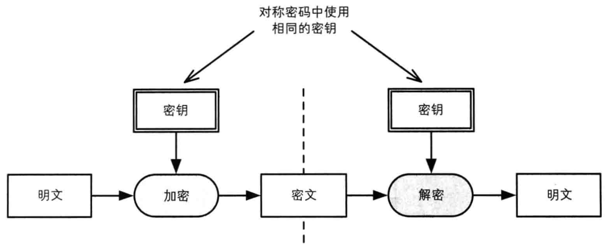

常见的对称密码算法有：

- **DES**：Data Encryption Standard）是最常见的对称密码算法，DES是一种将64bit明文加密成64bit密文的对称密码算法，密钥长度是56bit；规格上来说，密钥长度是64bit，但每隔7bit会设置一个用于错误检查的bit，因此密钥长度实质上是56bit；

  由于DES每次只能加密64bit的数据，遇到比较大的数据，需要对DES加密进行迭代（反复）
  目前已经可以在短时间内被破解，所以不建议使用

- **3DES** : 将DES重复3次所得到的一种密码算法，也叫做3重DES
  目前还被一些银行等机构使用，但处理速度不高，安全性逐渐暴露出问题

- **AES**:取代DES成为新标准的一种对称密码算法

  AES的密钥长度有128、192、256bit三种
  在2000年时选择Rijindael算法作为AES的实现
  目前AES，已经逐步取代DES、3DES，成为首选的对称密码算法

#### 秘钥配送问题

如下图，在使用对称密码时，一定会遇到密钥配送问题
假设，Alice将使用对称密码加密过的消息发给了Bob
只有将密钥发送给Bob，Bob才能完成解密
在发送密钥过程中，可能会被Eve窃取密钥，最后Eve也能完成解密

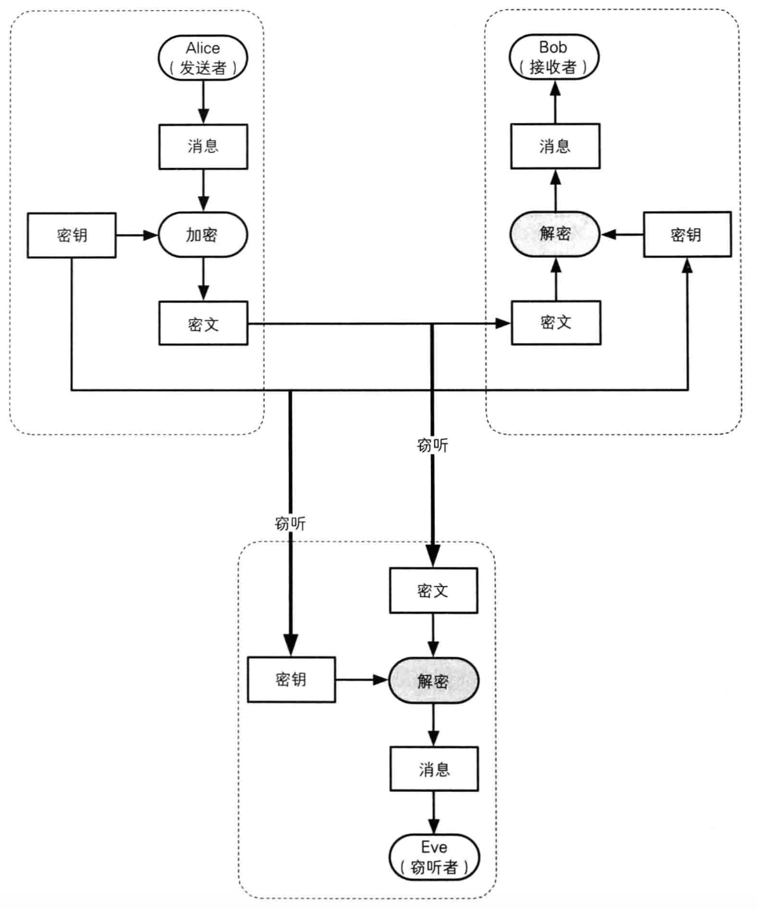

#### 非对称加密算法

加密和解密使用的不是同一个密钥，即为非对称加密算法，也称公开密钥加密

公钥密码中，密钥分为加密密钥、解密密钥2种，它们并不是同一个密钥
公钥密码也被称为非对称密码（Asymmetric Cryptography）

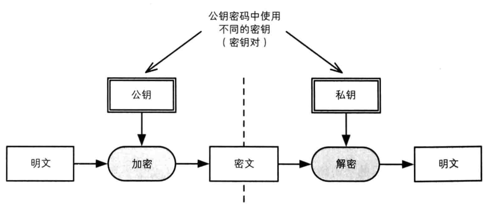

在公钥密码中
 **加密密钥**，一般是公开的，因此该密钥称为**公钥**（public key）
 **解密密钥**，由消息接收者自己保管的，不能公开，因此也称为**私钥**（private key）
 公钥和私钥是一 一对应的，是不能单独生成的，一对公钥和密钥统称为密钥对（key pair）

>- 由公钥加密的密文，必须使用与该公钥对应的私钥才能解密
>- 由私钥加密的密文，必须使用与该私钥对应的公钥才能解密

#### 解决秘钥配送问题

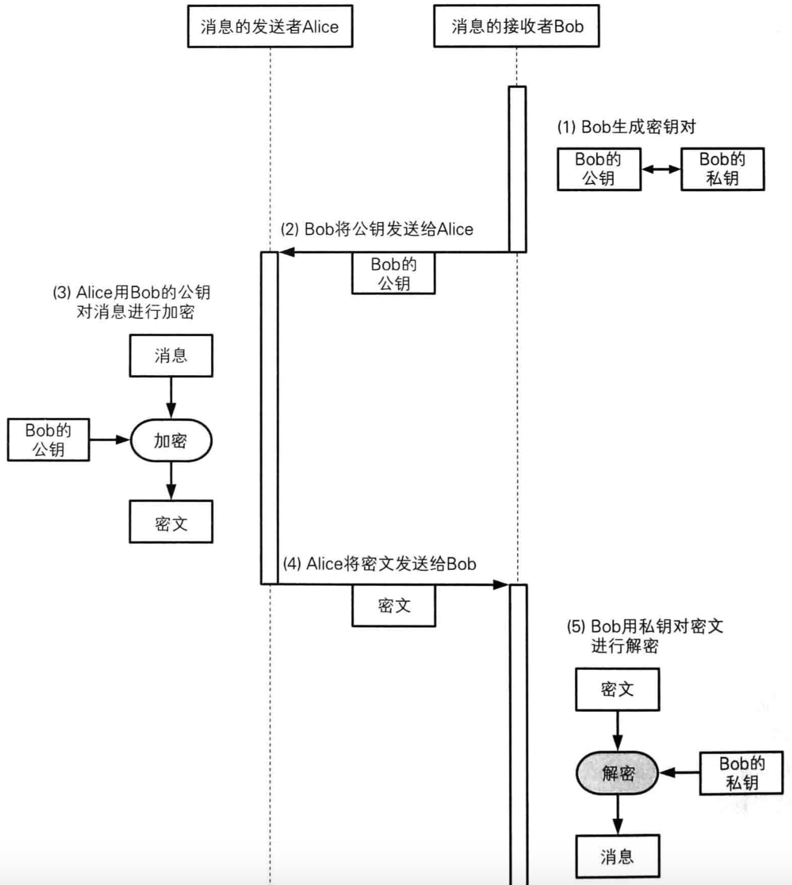

上图解析：

1、 Bob生成一个公钥一个密钥
 2、 Bob将公钥发送给Alice,密钥自己保存，公钥是公开出来的，所有人都可以知道，不怕被窃取
 3 、Alice用Bob的公钥对消息加密
 4、 Alice将加密的消息发送给Bob
 5 、Bob用自己的私钥解密消息。
 这其中如果有第三者窃听，只有第2步和第4步能够监听数据，由于Bob公钥是公开的谁都可以获取，那么第二步也不用担心被谁获取，第4步如果数据被第三者截获，那么他看到的也是加密后的数据，由于他没有Bob的私钥，那么他也无法知道消息的真实内容。而且他即使篡改密文消息也无任何意义。

#### 混合密码系统

虽然非对称加密解决了密钥配送问题，但是它的加解密速度较慢，下面我们总结一下对称和非对称加密的优缺点：

| 加密算法   | 优点               | 缺点                       |
| ---------- | ------------------ | -------------------------- |
| 对称加密   | 加密解密速度比较快 | 不能很好地解决密钥配送问题 |
| 非对称加密 | 加密解密速度比较慢 | 能很好地解决密钥配送问题   |

**混合密码**系统，是将对称密码和公钥密码的优势相结合的方法
1 它解决了公钥密码速度慢的问题
2 并通过公钥密码解决了对称密码的密钥配送问题

- ###### 混合密码-加密

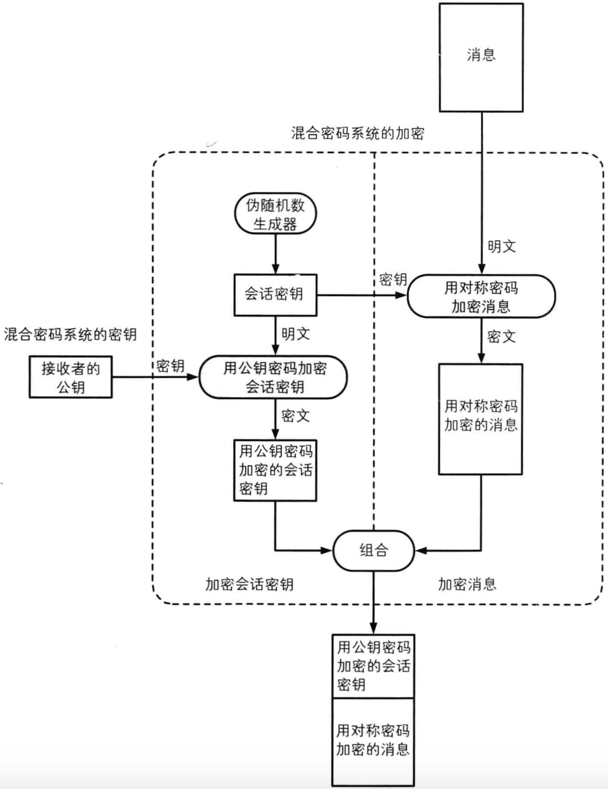

###### 会话密钥（session key）

为本次通信随机生成的临时密钥
作为对称密码的密钥，用于加密消息，提高速度

###### 加密步骤（发送消息）

首先，消息发送者要拥有消息接收者的公钥
生成会话密钥，作为对称密码的密钥，加密消息
用消息接收者的公钥，加密会话密钥
将前2步生成的加密结果，一并发给消息接收者

发送出去的内容包括
**用会话密钥加密的消息（加密方法：对称密码）**
**用公钥加密的会话密钥（加密方法：公钥密码）**

- ###### 混合密码-解密

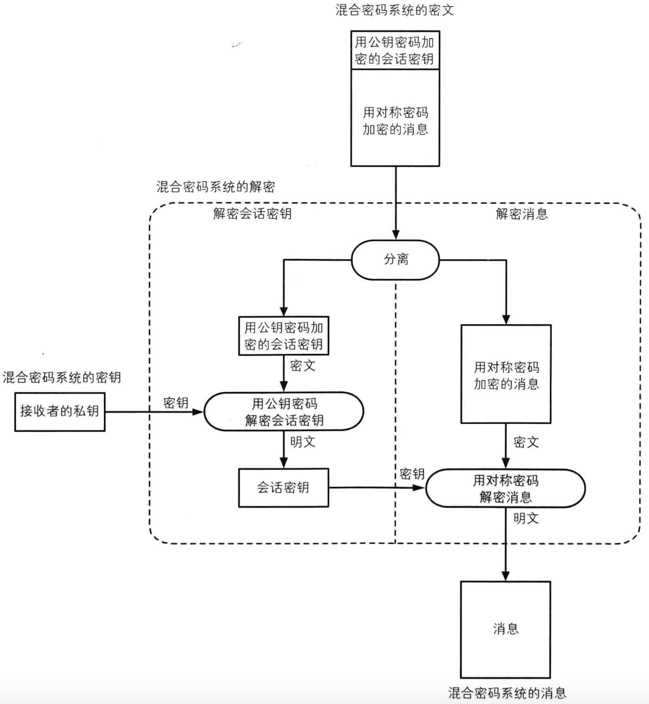

###### 解密步骤（收到消息）

1 消息接收者用自己的私钥解密出会话密钥
2 再用第1步解密出来的会话密钥，解密消息

**发送过程，加密过程**
 1.Bob先生成一对公钥、私钥
 2.Bob把公钥共享给Alice
 3.Alice随机生成一个会话密钥（临时密钥）
 4.Alice用会话密钥加密需要发送的消息（使用的是对称密码加密）
 5.Alice用Bob的公钥加密会话密钥（使用的是公钥密码加密，也就是非对称密码加密）
 6.Alice把第4、5步的加密结果，一并发送给Bob

**接收过程，解密过程**
1.Bob利用自己的私钥解密会话密钥（使用的是公钥密码解密，也就是非对称密码解密）
2.Bob利用会话密钥解密发送过来的消息（使用的是对称密码解密）

上面的加密算法解决了数据传输的安全问题，那么**数据的完整性**是没法验证的，就是我这个数据有没有被改过，因为公钥大家都能获取，如果有中间人拦截了消息，并改动了内容。那么我们如何验证这个消息有没有变动呢?

### 二 、单项散列函数

单向散列函数，又称单向Hash函数、杂凑函数，就是把任意长的输入消息串变化成固定长的输出串且由输出串难以得到输入串的一种函数。这个输出串称为该消息的散列值。一般用于产生消息摘要，密钥加密等

单向散列函数，可以根据根据消息内容计算出散列值
散列值的长度和消息的长度无关，无论消息是1bit、10M、100G，单向散列函数都会计算出固定长度的散列值。

#### 单项散列函数的特点

- 根据任意长度的消息，计算出固定长度的散列值
- 计算速度快，能快速计算出散列值
- 消息不同，散列值也不同
- 具备单向性

单向散列函数，又被称为消息摘要函数（message digest function），哈希函数输出的散列值，也被称为消息摘要（message digest）、指纹（fingerprint）

#### 常见的几种单项散列函数

**MD4、MD5**
产生128bit的散列值，MD就是Message Digest的缩写，目前已经不安全
Mac终端上默认可以使用md5命令

**SHA-1**
产生160bit的散列值，目前已经不安全

**SHA-2**
SHA-256、SHA-384、SHA-512，散列值长度分别是256bit、384bit、512bit

**SHA-3**
全新标准

##### 单项散列函数如何防篡改的

不同的数据生成的散列值是不一样的，只要你对一个文件改动过，那么它的散列值就会发生变化，要想确定我们的数据有没有发生变化，只要对比两次散列值相不相同就可以了，我们常常做的登录功能，在保存用户密码的时候就采用单项散列函数生成的值来进行保存，防止第三方人员串改密码。

数据防篡改的技术我们知道了，在数据传输的过程中，我们对数据生成一个散列值，和发送的数据一并发给接收者，当接收者收到这个数据的时候，它拿接收到的数据重新生成散列值，然后跟接收到的散列值进行比较，就可以判断这个数据有没有被人改过。

到此我们通过混合密码技术解决的传输数据的保密性，通过单项散列函数确定数据的一致性，但是还是没有解决中间人截获篡改的问题，因为散列函数中间人也可以重新生成一次，接下来我们就要讲数字签名了，他可以对消息发送者的真实性进行认证。

### 三、数字签名

数字签名（又称公钥数字签名）是只有信息的发送者才能产生的别人无法伪造的一段数字串，这段数字串同时也是对信息的发送者发送信息真实性的一个有效证明。它是一种类似写在纸上的普通的物理签名，但是使用了公钥加密领域的技术来实现的，用于鉴别数字信息的方法。一套数字签名通常定义两种互补的运算，一个用于签名，另一个用于验证。数字签名是非对称密钥加密技术与数字摘要技术的应用。

说白了就是用用消息发送者的私钥进行签名就是数字签名

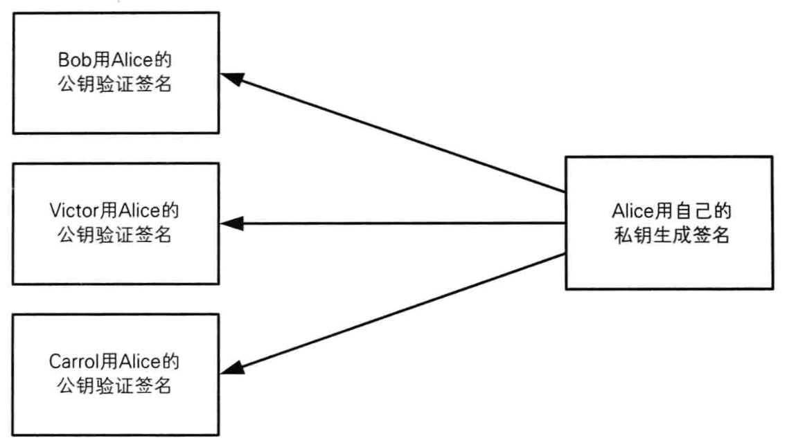

在数字签名中，任何人都可以使用公钥验证签名
在数字签名技术中，有以下2种行为
**生成签名**
由消息的发送者完成，通过“签名密钥”生成

**验证签名**
由消息的接收者完成，通过“验证密钥”验证

数字签名由于是消息发送者的私钥进行签名，消息发送者的私钥只有他自己拥有，别人是没有的，从而我们通过私钥进行签名，别人通过消息发送者的公钥就能确定消息发送者的真实身份。

 接下来我们看一下数字签名和公钥密码的对比:

|            | 私钥                 | 公钥                         |
| ---------- | -------------------- | ---------------------------- |
| 公钥密码   | 接收者解密时使用     | 发送者加密是使用             |
| 数字签名   | 签名者生成签名时使用 | 验证着验证签名时使用         |
| 谁持有密钥 | 个人持有             | 只要有需要，任何人都可以持有 |

##### 数字签名过程：

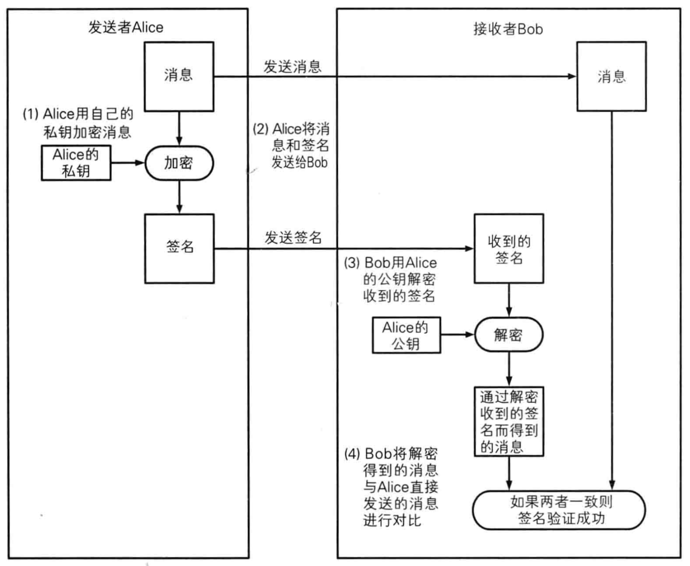

上图Alice将要发送的消息用自己的私钥加密，发送给Bob,Bob用Alice的公钥解密消息，这里其实有一个不好的点，就是如果Alice如果发送的消息比较大，比如发1GB的视频文件，那这个签名过程就太慢了，本身非对称加密的速度就是比较慢的，

下面我们来看一个改进版的:

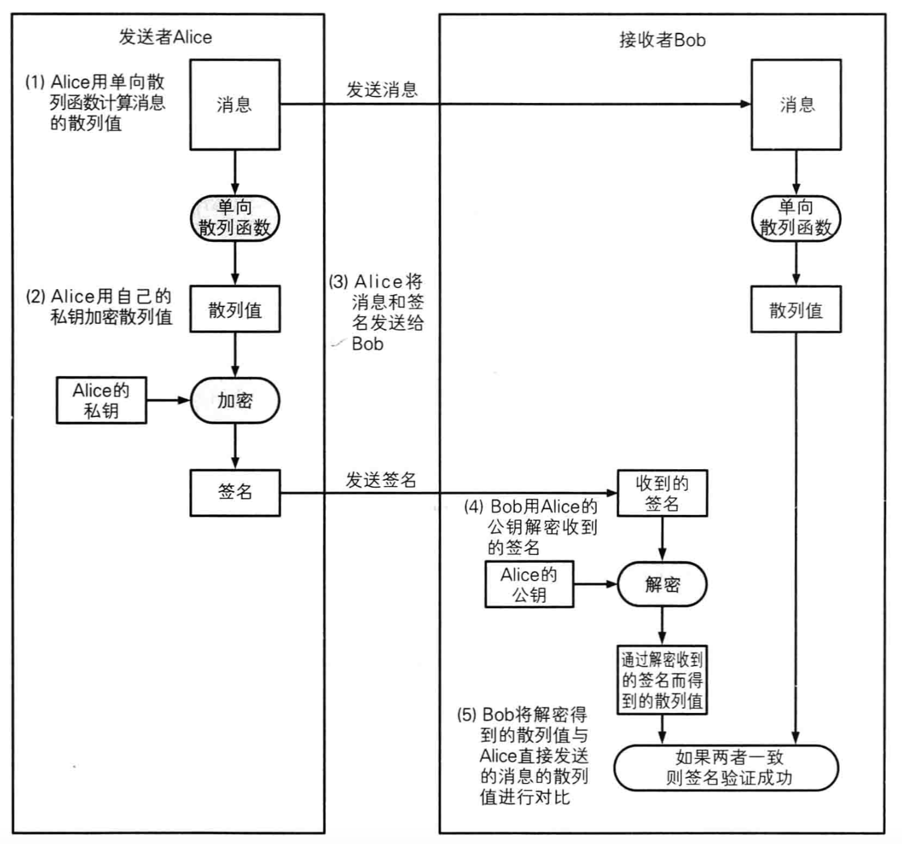

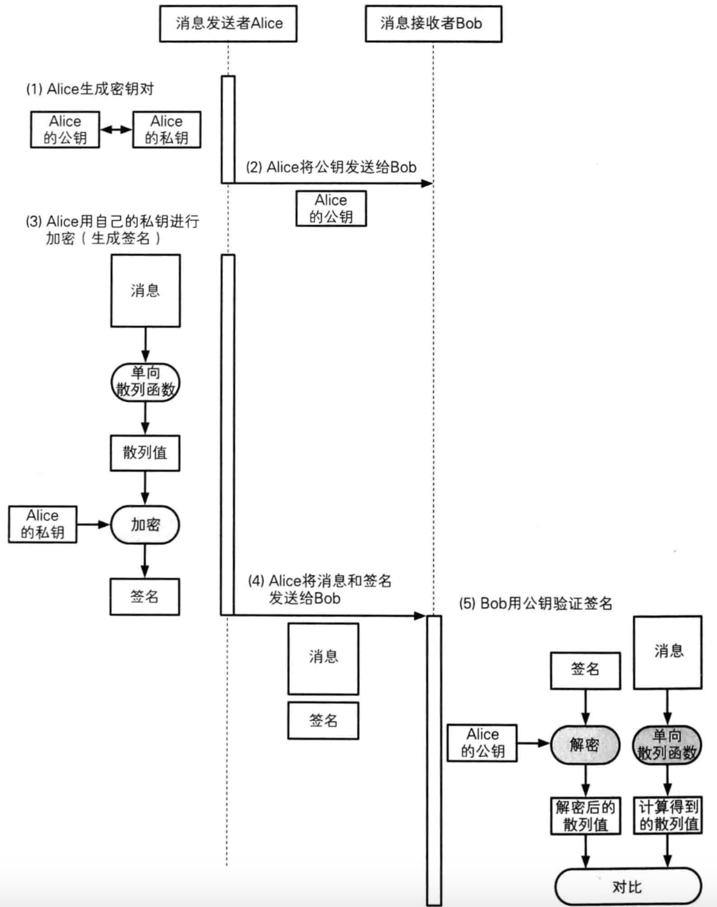

这里我们将要发送的消息先生成固定大小的散列值，然后再签名，这样签名文件就小的多了，然后我们将消息和签名一同发送该Bob,然后Bob再用公钥解密 对比等。下面有关数字签名的一些点进行一下说明：
**1 如果有人篡改了文件内容或者签名内容，会是什么结果？**
 结果是：签名验证失败，证明内容会篡改

**2 数字签名不能保证机密性？**
 数字签名的作用不是为了保证机密性，仅仅是为了能够识别内容有没有被篡改

**3 数字签名的作用**

- 确认消息的完整性
- 识别消息是否被篡改
- 防止消息发送人否认

数字签名是能确定消息发送者，前提是你要确定你获取的公钥是确定是消息发送者的，如果你拿到的公钥是中间人伪造的，那么你就无法验证消息发送者的真实性了，就如下图：

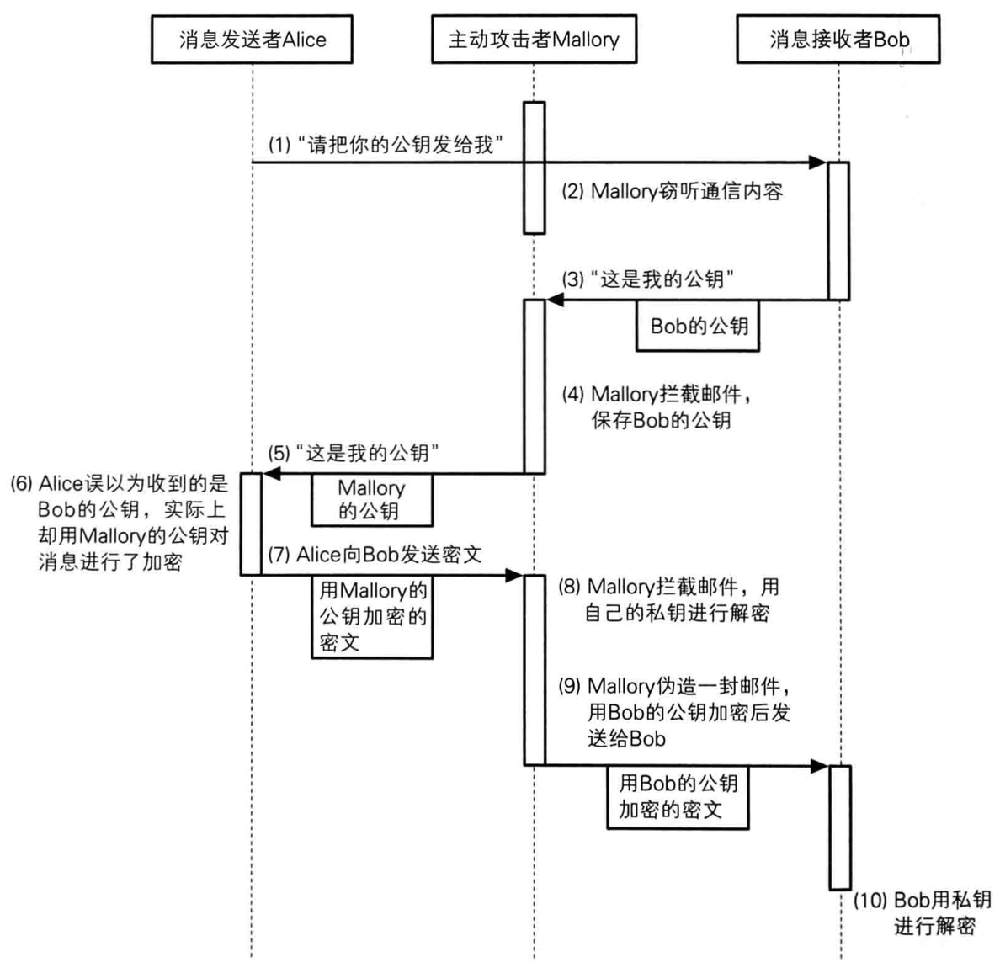

A问B要公钥，M从监听到了中间，B给A发的公钥被M拦截了并保存，M把他自己的公钥给了A，A以为这个公钥是B的，A用公钥加密发消息给B，M拦截然后用自己的私钥解密，修改消息内容后，然后用保存的公钥加密把消息发送给B，B解密消息。A,和B都以为是正常通信的，但消息确实不是那个消息了，那么如何确定公钥合法，也就是如何确定这个公钥就是B的呢，接下来就是我们要讲的证书了，我们引入一个第三方权威机构来认正，说这个公钥就是B的。接下来我们来看一下。

### 四 、证书

CA是证书的签发机构，它是公钥基础设施（Public Key Infrastructure，PKI）的核心。CA是负责签发证书、认证证书、管理已颁发证书的机关。

CA 拥有一个证书（内含公钥和私钥）。网上的公众用户通过验证 CA 的签字从而信任 CA ，任何人都可以得到 CA 的证书（含公钥），用以验证它所签发的证书,密码学中的证书，全称叫公钥证书（Public-key Certificate，PKC），跟驾驶证类似 里面有姓名、邮箱等个人信息，以及此人的公钥； 并由认证机构（Certificate Authority，CA）施加数字签名。

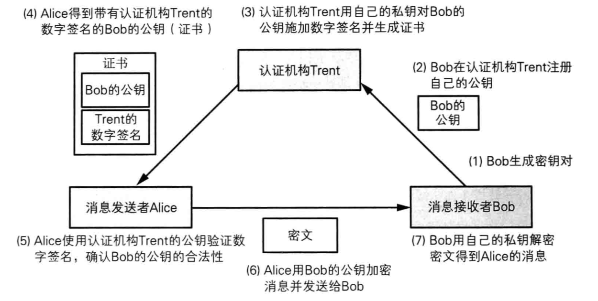

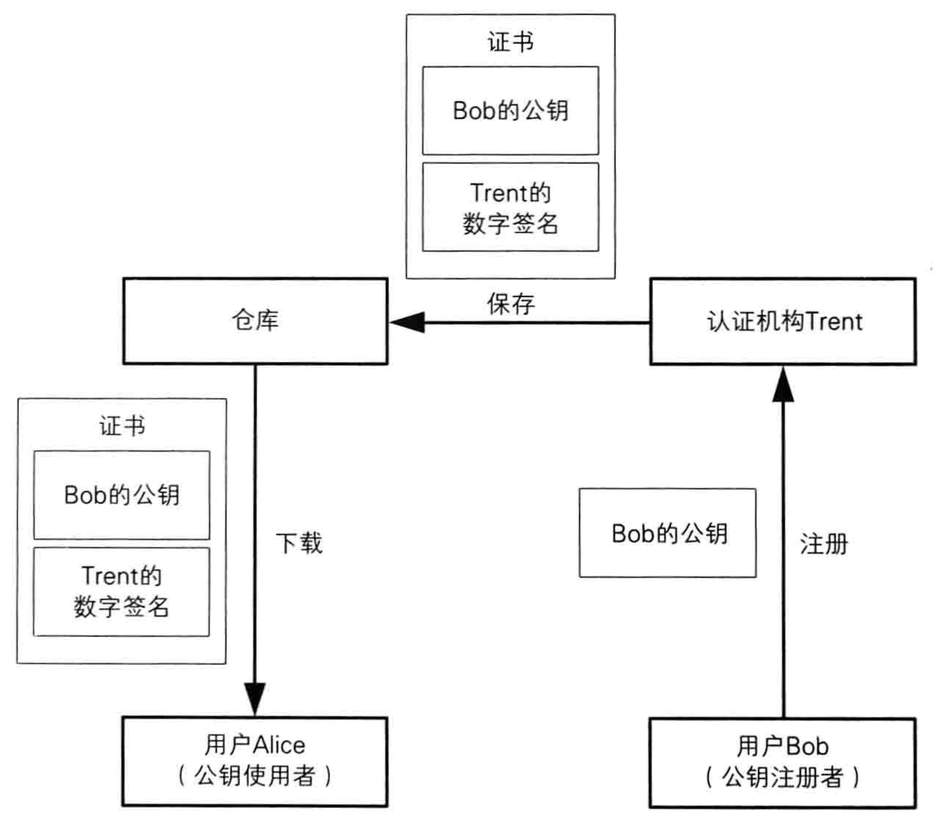

图已经表示的很清楚了，消息发送者先向CA机构 注册自己的证书，那么任何拿到消息发送者的公钥都可以向CA进行验证公钥的真实性。

