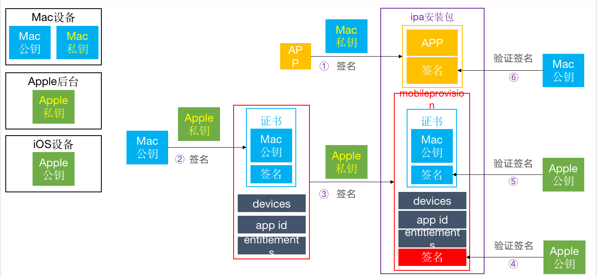
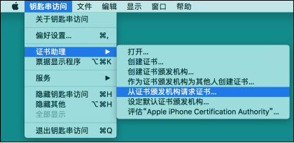
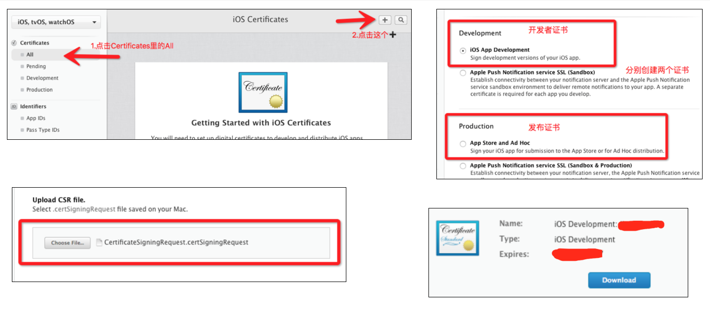
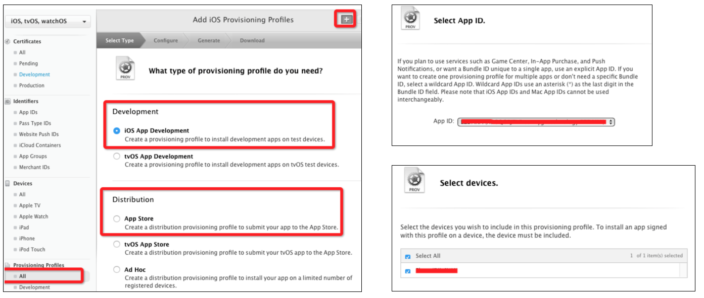
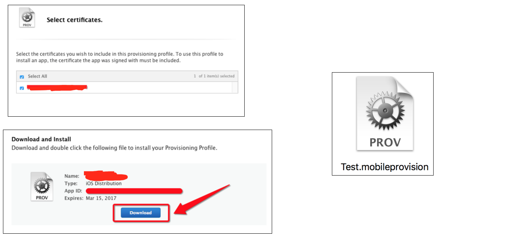

## iOS签名机制

首先我们要知道iOS签名机制的作用是什么？
**保证安装到用户手机上的APP都是经过Apple官方允许的**

不管是真机调试，还是发布APP，开发者都需要经过一系列复杂的步骤：
 **1 生成CertificateSigningRequest.certSigningRequest文件**
 **2 获得ios_development.cer\ios_distribution.cer证书文件**
 **3 注册device、添加App ID**
 **4 获得.mobileprovision文件**

>1、 我们在自己的电脑上生成一对公钥和私钥，操作就是我们通过钥匙串去生成CertificateSigningRequest.certSigningRequest文件
> 2、 用我们mac上的私钥对App进行签名。
> 3、把我们的公钥文件上传到Apple后台
> 4、 apple后台用它的私钥对我们的公钥进行签名
> 5、 让我们选这设备列表 appid 权限等
> 6、 再次对我们选着的这几项以及第四步生成的签名，再用Apple后台的私钥进行签名，生成描述文件mobileprovision
> 7、 当我们app安装到手机或运行的时候，首先我们的手机都内置了Apple后台的公钥
> 8、 首先那手机里的Apple后台公钥验证mobileprovision文件，完事后会拿到第六步的几个信息，接着再用apple公钥验证第四步的信息，这步验证完成它就那到了我们开发时电脑上的公钥
> 9、 用Mac公钥对App进行签名验证。

下面我们讲一下几个证书的具体作用是什么

##### 1 生成Mac设备的公私钥

CertificateSigningRequest.certSigningRequest文件
就是Mac设备的公钥

##### 2 获得证书

ios_development.cer、ios_distribution.cer文件
利用Apple后台的私钥，对Mac设备的公钥进行签名后的证书文件

##### 3、 生成mobileprovision

总结：

1、.cerSigningRequest文件 ： Mac公钥

2、.cer文件：利用Apple私钥（CA）,对Mac公钥生成了数字签名

3、.mobileprovision : 	利用Apple私钥，对【.cer证书 + devices + AppID + entitlements】进行数字签名