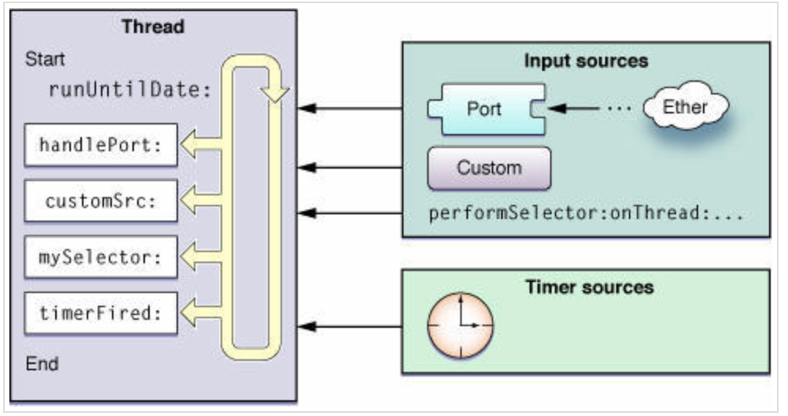
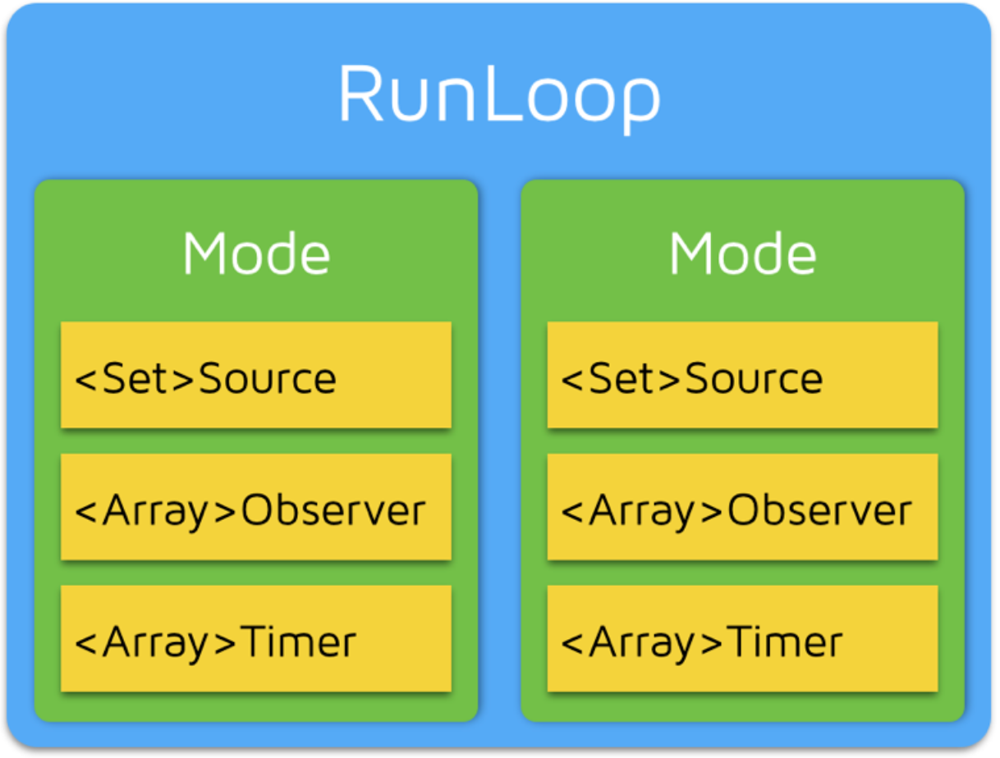
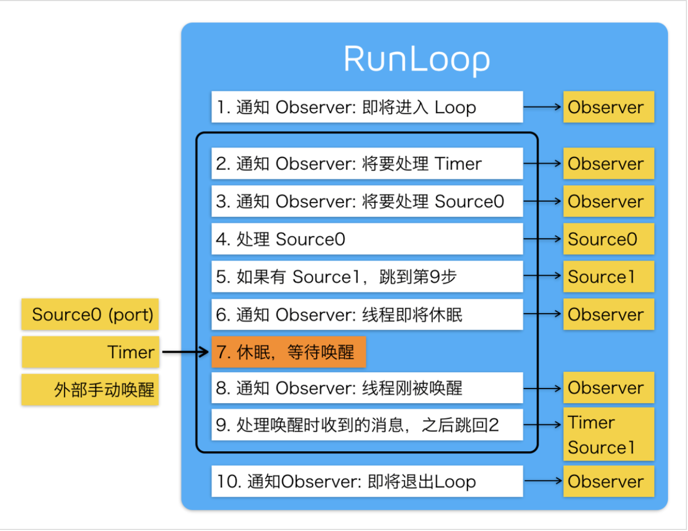

Runloop

[ 深入理解RunLoop](https://blog.ibireme.com/2015/05/18/runloop/)

https://juejin.im/post/5c36e369f265da61682b92bb

[ iOS 多线程：『RunLoop』详尽总结](https://bujige.net/blog/iOS-Complete-learning-RunLoop.html)

#### 1. RunLoop简介

RunLoop实际上是一个对象，这个对象在循环中用来处理程序运行过程中出现的各种事件（比如说触摸事件、UI刷新事件、定时器事件、Selector事件），从而保持程序的持续运行；而且在没有事件处理的时候，会进入睡眠模式，从而节省CPU资源，提高程序性能。

##### 1.1 RunLoop和线程

RunLoop和线程是息息相关的，我们知道线程的作用是用来执行特定的一个或多个任务，但是在默认情况下，线程执行完之后就会退出，就不能再执行任务了。这时我们就需要采用一种方式来让线程能够处理任务，并不退出。所以，我们就有了RunLoop。

1. 一条线程对应一个RunLoop对象，每条线程都有唯一一个与之对应的RunLoop对象。
2. 我们只能在当前线程中操作当前线程的RunLoop，而不能去操作其他线程的RunLoop。
3. RunLoop对象在第一次获取RunLoop时创建，销毁则是在线程结束的时候。
4. 主线程的RunLoop对象系统自动帮助我们创建好了(原理如下)，而子线程的RunLoop对象需要我们主动创建。

##### 1.2 默认情况下主线程的RunLoop原理

我们在启动一个iOS程序的时候，系统会调用创建项目时自动生成的main.m的文件。main.m文件如下所示：

```
int main(int argc, char * argv[]) {
    @autoreleasepool {
        return UIApplicationMain(argc, argv, nil, NSStringFromClass([AppDelegate class]));
    }
}
```

其中`UIApplicationMain`函数内部帮我们开启了主线程的RunLoop，`UIApplicationMain`内部拥有一个无线循环的代码。上边的代码中开启RunLoop的过程可以简单的理解为如下代码：

```
int main(int argc, char * argv[]) {        
    BOOL running = YES;
    do {
        // 执行各种任务，处理各种事件
        // ......
    } while (running);

    return 0;
}
```

从上边可看出，程序一直在do-while循环中执行，所以UIApplicationMain函数一直没有返回，我们在运行程序之后程序不会马上退出，会保持持续运行状态。

下图是苹果官方给出的RunLoop模型图



从上图中可以看出，RunLoop就是线程中的一个循环，RunLoop在循环中会不断检测，通过Input sources（输入源）和Timer sources（定时源）两种来源等待接受事件；然后对接受到的事件通知线程进行处理，并在没有事件的时候进行休息。

#### 2. RunLoop相关类

下面我们来了解一下Core Foundation框架下关于RunLoop的5个类，只有弄懂这几个类的含义，我们才能深入了解RunLoop运行机制。

1. CFRunLoopRef：代表RunLoop的对象
2. CFRunLoopModeRef：RunLoop的运行模式
3. CFRunLoopSourceRef：就是RunLoop模型图中提到的输入源/事件源
4. CFRunLoopTimerRef：就是RunLoop模型图中提到的定时源
5. CFRunLoopObserverRef：观察者，能够监听RunLoop的状态改变

 一个RunLoop对象（CFRunLoopRef）中包含若干个运行模式（CFRunLoopModeRef）。而每一个运行模式下又包含若干个输入源（CFRunLoopSourceRef）、定时源（CFRunLoopTimerRef）、观察者（CFRunLoopObserverRef）。

- 每次RunLoop启动时，只能指定其中一个运行模式（CFRunLoopModeRef），这个运行模式（CFRunLoopModeRef）被称作CurrentMode。

- 如果需要切换运行模式（CFRunLoopModeRef），只能退出Loop，再重新指定一个运行模式（CFRunLoopModeRef）进入。

- 这样做主要是为了分隔开不同组的输入源（CFRunLoopSourceRef）、定时源（CFRunLoopTimerRef）、观察者（CFRunLoopObserverRef），让其互不影响 。

##### 2.1 CFRunLoopRef

CFRunLoopRef就是Core Foundation框架下RunLoop对象类。我们可通过以下方式来获取RunLoop对象：

- Core Foundation
  - `CFRunLoopGetCurrent(); // 获得当前线程的RunLoop对象`
  - `CFRunLoopGetMain(); // 获得主线程的RunLoop对象`

当然，在Foundation框架下获取RunLoop对象类的方法如下：

- Foundation
  - `[NSRunLoop currentRunLoop]; // 获得当前线程的RunLoop对象`
  - `[NSRunLoop mainRunLoop]; // 获得主线程的RunLoop对象`

##### 2.2 CFRunLoopModeRef

系统默认定义了多种运行模式（CFRunLoopModeRef），如下：

1. **kCFRunLoopDefaultMode**：App的默认运行模式，通常主线程是在这个运行模式下运行
2. **UITrackingRunLoopMode**：跟踪用户交互事件（用于 ScrollView 追踪触摸滑动，保证界面滑动时不受其他Mode影响）
3. UIInitializationRunLoopMode：在刚启动App时第进入的第一个 Mode，启动完成后就不再使用
4. GSEventReceiveRunLoopMode：接受系统内部事件，通常用不到
5. **kCFRunLoopCommonModes**：伪模式，不是一种真正的运行模式（后边会用到）

其中**kCFRunLoopDefaultMode**、**UITrackingRunLoopMode**、**kCFRunLoopCommonModes**是我们开发中需要用到的模式，具体使用方法我们在**2.3 CFRunLoopTimerRef**中结合CFRunLoopTimerRef来演示说明。

##### 2.3 CFRunLoopTimerRef

CFRunLoopTimerRef是定时源（RunLoop模型图中提到过），理解为基于时间的触发器，基本上就是NSTimer（哈哈，这个理解就简单了吧）。

下面我们来演示下CFRunLoopModeRef和CFRunLoopTimerRef结合的使用用法，从而加深理解。

```
// 用来展示CFRunLoopModeRef和CFRunLoopTimerRef的结合使用
- (void)showDemo1
{
    NSTimer *timer = [NSTimer timerWithTimeInterval:2.0 target:self selector:@selector(run) userInfo:nil repeats:YES];

// 将定时器添加到当前RunLoop的NSDefaultRunLoopMode下,一旦RunLoop进入其他模式，定时器timer就不工作了
    [[NSRunLoop currentRunLoop] addTimer:timer forMode:NSDefaultRunLoopMode];

// 将定时器添加到当前RunLoop的UITrackingRunLoopMode下，只在拖动情况下工作
//    [[NSRunLoop currentRunLoop] addTimer:timer forMode:UITrackingRunLoopMode];
// 将定时器添加到当前RunLoop的NSRunLoopCommonModes下，定时器就会跑在被标记为Common Modes的模式下
//    [[NSRunLoop currentRunLoop] addTimer:timer forMode:NSRunLoopCommonModes];

// 调用了scheduledTimer返回的定时器，已经自动被加入到了RunLoop的NSDefaultRunLoopMode模式下
    [NSTimer scheduledTimerWithTimeInterval:2.0 target:self selector:@selector(run) userInfo:nil repeats:YES];
}``
```

- 当我们不做任何操作的时候，RunLoop处于NSDefaultRunLoopMode下。
- 而当我们拖动Text View的时候，RunLoop就结束NSDefaultRunLoopMode，切换到了UITrackingRunLoopMode模式下，这个模式下没有添加NSTimer，所以我们的NSTimer就不工作了。
- 但当我们松开鼠标的时候，RunLoop就结束UITrackingRunLoopMode模式，又切换回NSDefaultRunLoopMode模式，所以NSTimer就又开始正常工作了。

那难道我们就不能在这两种模式下让NSTimer都能正常工作吗？

当然可以，这就用到了我们之前说过的**伪模式（kCFRunLoopCommonModes）**，这其实不是一种真实的模式，而是一种标记模式，意思就是可以在打上Common Modes标记的模式下运行。

```
NSTimer *timer = [NSTimer timerWithTimeInterval:2.0 target:self selector:@selector(run) userInfo:nil repeats:YES];
[[NSRunLoop currentRunLoop] addTimer:timer forMode:NSDefaultRunLoopMode];

等价于

[NSTimer scheduledTimerWithTimeInterval:2.0 target:self selector:@selector(run) userInfo:nil repeats:YES];
//调用了scheduledTimer返回的定时器，NSTimer会自动被加入到了RunLoop的NSDefaultRunLoopMode模式下
```

##### 2.4 CFRunLoopSourceRef

CFRunLoopSourceRef是事件源（RunLoop模型图中提到过），CFRunLoopSourceRef有两种分类方法。

- 第一种按照官方文档来分类（就像RunLoop模型图中那样）：
  - Port-Based Sources（基于端口）
  - Custom Input Sources（自定义）
  - Cocoa Perform Selector Sources
- 第二种按照函数调用栈来分类：
  - Source0 ：非基于Port
  - Source1：基于Port，通过内核和其他线程通信，接收、分发系统事件

这两种分类方式其实没有区别，只不过第一种是通过官方理论来分类，第二种是在实际应用中通过调用函数来分类。

##### 2.5 CFRunLoopObserverRef

CFRunLoopObserverRef是观察者，用来监听RunLoop的状态改变

CFRunLoopObserverRef可以监听的状态改变有以下几种：

```
typedef CF_OPTIONS(CFOptionFlags, CFRunLoopActivity) {
    kCFRunLoopEntry = (1UL << 0),               // 即将进入Loop：1
    kCFRunLoopBeforeTimers = (1UL << 1),        // 即将处理Timer：2    
    kCFRunLoopBeforeSources = (1UL << 2),       // 即将处理Source：4
    kCFRunLoopBeforeWaiting = (1UL << 5),       // 即将进入休眠：32
    kCFRunLoopAfterWaiting = (1UL << 6),        // 即将从休眠中唤醒：64
    kCFRunLoopExit = (1UL << 7),                // 即将从Loop中退出：128
    kCFRunLoopAllActivities = 0x0FFFFFFFU       // 监听全部状态改变  
};
```

```
//用来展示CFRunLoopObserverRef使用
- (void)showDemo2
{
   // 创建观察者
    CFRunLoopObserverRef observer = CFRunLoopObserverCreateWithHandler(CFAllocatorGetDefault(), kCFRunLoopAllActivities, YES, 0, ^(CFRunLoopObserverRef observer, CFRunLoopActivity activity) {
        NSLog(@"监听到RunLoop发生改变---%zd",activity);
    });

    // 添加观察者到当前RunLoop中
    CFRunLoopAddObserver(CFRunLoopGetCurrent(), observer, kCFRunLoopDefaultMode);

    // 释放observer
    CFRelease(observer);
}

打印：
RunLoopDemo[2661:135034] 监听到RunLoop发生改变---2
RunLoopDemo[2661:135034] 监听到RunLoop发生改变---4
RunLoopDemo[2661:135034] 监听到RunLoop发生改变---2
RunLoopDemo[2661:135034] 监听到RunLoop发生改变---4
RunLoopDemo[2661:135034] 监听到RunLoop发生改变---2
RunLoopDemo[2661:135034] 监听到RunLoop发生改变---4
RunLoopDemo[2661:135034] 监听到RunLoop发生改变---2
RunLoopDemo[2661:135034] 监听到RunLoop发生改变---4
RunLoopDemo[2661:135034] 监听到RunLoop发生改变---2
RunLoopDemo[2661:135034] 监听到RunLoop发生改变---4
RunLoopDemo[2661:135034] 监听到RunLoop发生改变---32
RunLoopDemo[2661:135034] 监听到RunLoop发生改变---64
```

可以看到RunLoop的状态在不断的改变，最终变成了状态 32，也就是即将进入睡眠状态，说明RunLoop之后就会进入睡眠状态。

#### 3. RunLoop原理

好了，五个类都讲解完了，下边开始放大招了。这下我们就可以来理解RunLoop的运行逻辑了。



在每次运行开启RunLoop的时候，所在线程的RunLoop会自动处理之前未处理的事件，并且通知相关的观察者。

具体的顺序如下：

1. 通知观察者RunLoop已经启动
2. 通知观察者即将要开始的定时器
3. 通知观察者任何即将启动的非基于端口的源
4. 启动任何准备好的非基于端口的源
5. 如果基于端口的源准备好并处于等待状态，立即启动；并进入步骤9
6. 通知观察者线程进入休眠状态
7. 将线程置于休眠知道任一下面的事件发生：
   - 某一事件到达基于端口的源
   - 定时器启动
   - RunLoop设置的时间已经超时
   - RunLoop被显示唤醒
8. 通知观察者线程将被唤醒
9. 处理未处理的事件
   - 如果用户定义的定时器启动，处理定时器事件并重启RunLoop。进入步骤2
   - 如果输入源启动，传递相应的消息
   - 如果RunLoop被显示唤醒而且时间还没超时，重启RunLoop。进入步骤2
10. 通知观察者RunLoop结束。

### 4. 后台常驻线程（很常用）

我们在开发应用程序的过程中，如果后台操作特别频繁，经常会在子线程做一些耗时操作（下载文件、后台播放音乐等），我们最好能让这条线程永远常驻内存。

那么怎么做呢？

添加一条用于常驻内存的强引用的子线程，在该线程的RunLoop下添加一个Sources，开启RunLoop。

```
- (void)showDemo4
{
    // 创建线程，并调用run1方法执行任务
    self.thread = [[NSThread alloc] initWithTarget:self selector:@selector(run1) object:nil];
    [self.thread start];
}

- (void)run1
{
    // 这里写任务
    NSLog(@"run1---%@",[NSThread currentThread]);
    [[NSRunLoop currentRunLoop]addPort:[NSPort port] forMode:NSDefaultRunLoopMode];
    [[NSRunLoop currentRunLoop] run];

    // 测试是否开启了RunLoop，如果开启RunLoop，则来不了这里，因为RunLoop开启了循环。
    NSLog(@"-------------");
}

打印：
run1---<NSThread: 0x604000271a00>{number = 3, name = (null)}
```

这时，我们就开启了一条常驻线程，下边我们来试着添加其他任务，除了之前创建的时候调用了run1方法，我们另外在点击的时候调用run2方法。
