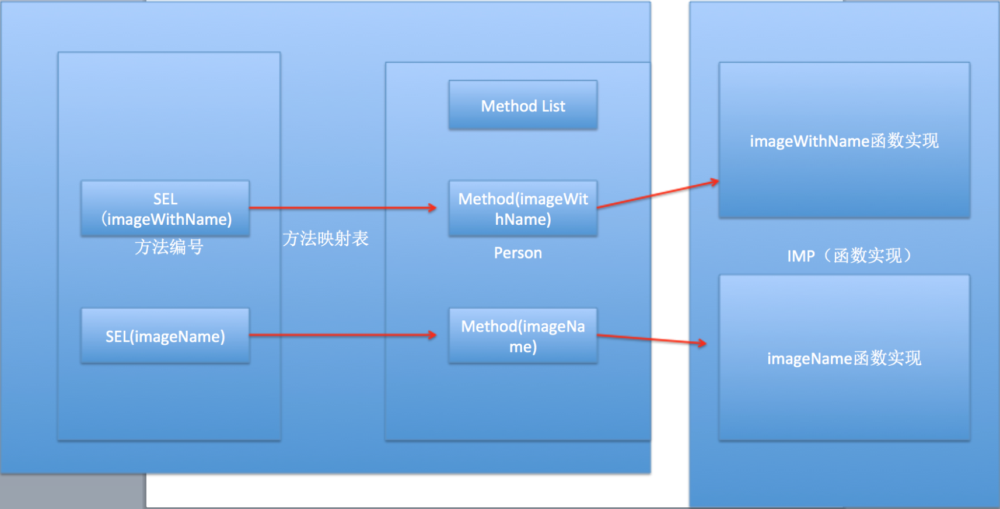
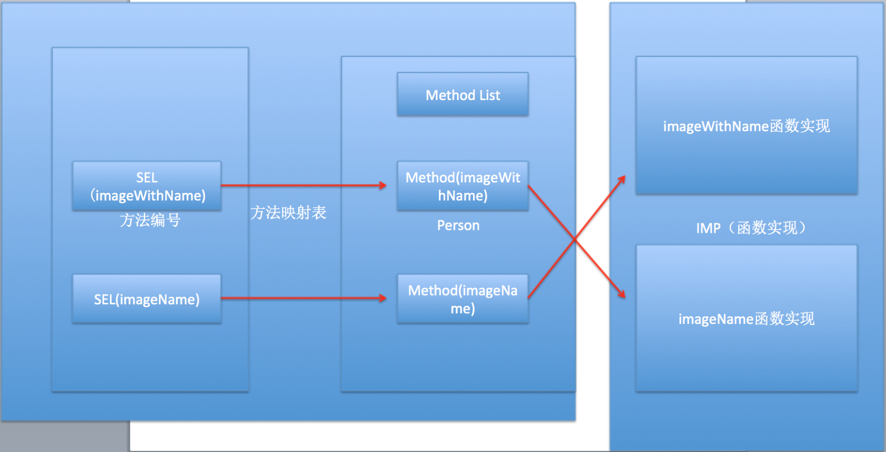

#### 方法交换

- `开发使用场景`:系统自带的方法功能不够，给系统自带的方法扩展一些功能，并且保持原有的功能。
- `方式一`:继承系统的类，重写方法.
- `方式二`:使用runtime,交换方法.


交换之前:




交换之后：




```
#import <UIKit/UIKit.h>
@interface UIImage (MBImage)

+ (UIImage *)mb_imageNamed:(NSString *)name;

@end

#import "UIImage+MBImage.h"
#import <objc/message.h>
@implementation UIImage (MBImage)

+ (void)load
{
    //获取方法名
    Method imageNamed =  class_getClassMethod(self, @selector(imageNamed:));
    
    Method mb_imageNamed =  class_getClassMethod(self, @selector(mb_imageNamed:));
    
    //调用时，两个方法交换
    method_exchangeImplementations(imageNamed, mb_imageNamed);
}

+ (UIImage *)mb_imageNamed:(NSString *)name
{
    UIImage *image = [UIImage mb_imageNamed:name];//此时方法交换，会调用imageNamed:
    if (image == nil) {
        NSLog(@"图片加载失败");
    }else{
        NSLog(@"图片加载成功");
    }
    return image;
}

@end

```


