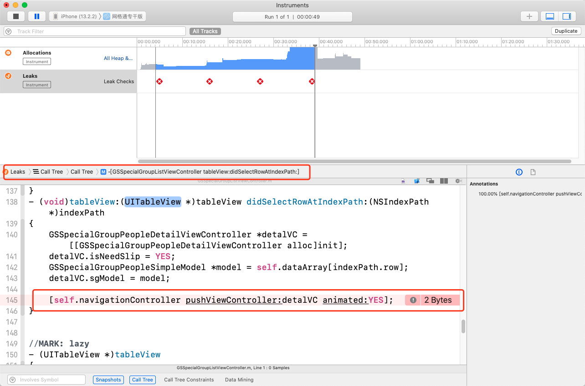
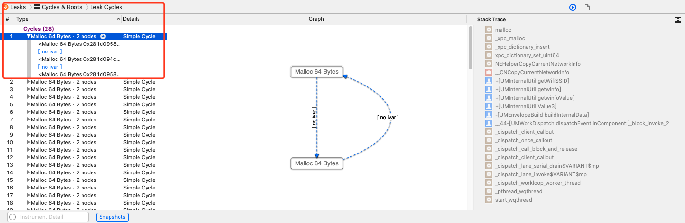
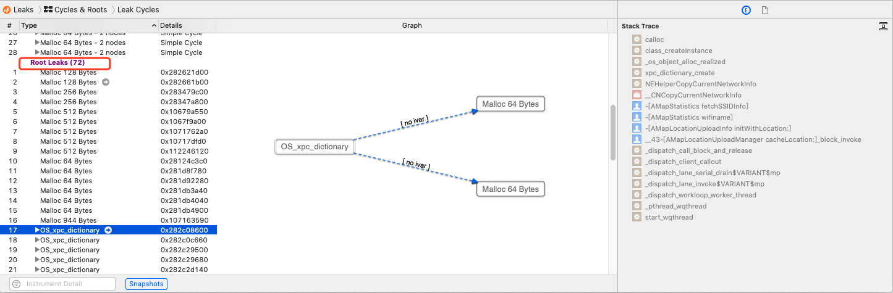
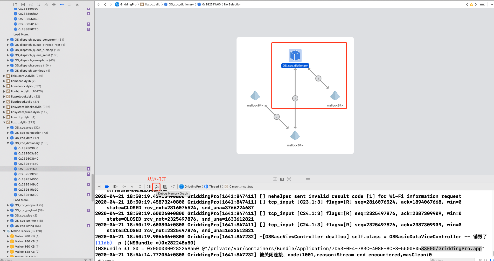

### Leaks：内存泄漏


打开Instruments中的Leaks，选择好设备及应用，开始运行，

绿色勾表示运行正常，没有内存泄露，如果有泄露，会自动显示红色

```
注意：显示红色x并不代表一定就有内存泄露，而且并不一定每次操作都能看到正确定位内存泄露部分。因为ARC 时代更常见的内存泄露是循环引用导致的Abandoned memory，而 Leaks 工具只负责检测 Leaked memory，应用有限。
```


#### **CallTree 模式**


然后双击方法名，会自动跳到代码部分。




#### Cycles & Reboots模式

有两种问题

- Cycles




- Root Leaks



目前没看出是什么原因导致的，只知道是Cycles 或 Root Leaks

双击右侧方法，如果是自己写的就能跳进去


通过**Debug Memory Graph**定位

Xcode -> BuildSettings -> Build Options -> Debug Information Format  -> Debug 设置 DWARF with dSYM File




刚好对应Cycles & Reboots模式下的Root Leaks

出问题的是libxpc.dylib库，貌似是系统的


##### 如何解决，未知？


引用**MLeaksFinder**检测

**MLeaksFinder**

https://github.com/Tencent/MLeaksFinder

或者

**PLeakSniffer**

https://github.com/music4kid/PLeakSniffer


