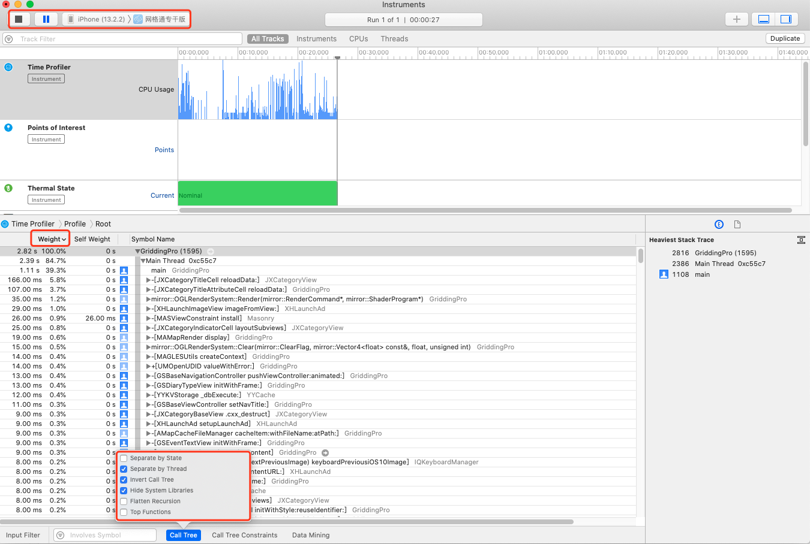
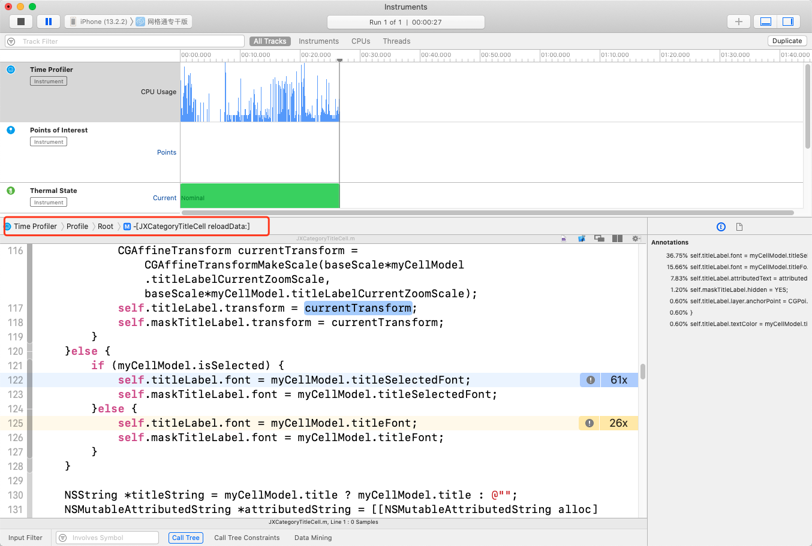

## TimeProfiler：各个方法执行的时间

从Instruments中选择TimePrifiler,然后选择好设备及监测应用

CallTree中勾选

**Separate by Thread**：每个线程应该分开考虑。只有这样你才能揪出那些大量占用CPU的"重"线程；

**Hide System Libraries**：勾选此项会显示app的代码

**Invert Call Tree**：从上到下跟踪堆栈，表中的方法将从第0帧开始取样，也就是说 FuncA { FunB { FunC } }  勾选此项后堆栈以C->B-A 把调用层级最深的C显示在最外面

**找出哪一行的 Weight 列上有最大的百分比**

通过不断展开箭头，找出最后的方法,双击打开方法

定位到方法后，就知道耗时最多的地方，就可以做改进了。