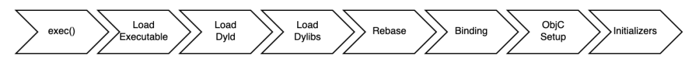

### 启动流程


App 的启动主要包括三个阶段：

1. main() 函数执行前；
2. main() 函数执行后；
3. 首屏渲染完成后。


**main() 函数执行前**

在 main() 函数执行前，系统主要会做下面几件事情：

- 加载可执行文件（App 的.o 文件的集合）；
- 加载动态链接库，进行 rebase 指针调整和 bind 符号绑定；
- Objc 运行时的初始处理，包括 Objc 相关类的注册、category 注册、selector 唯一性检查等；
- 初始化，包括了执行 +load() 方法、attribute((constructor)) 修饰的函数的调用、创建 C++ 静态全局变量。


这个阶段对于启动速度优化来说，可以做的事情包括：

- 减少动态库加载。每个库本身都有依赖关系，苹果公司建议使用更少的动态库，并且建议在使用动态库的数量较多时，尽量将多个动态库进行合并。数量上，苹果公司最多可以支持 6 个非系统动态库合并为一个。
- 减少加载启动后不会去使用的类或者方法。
- +load() 方法里的内容可以放到首屏渲染完成后再执行，或使用 +initialize() 方法替换掉。因为，在一个 +load() 方法里，进行运行时方法替换操作会带来 4 毫秒的消耗。不要小看这 4 毫秒，积少成多，执行 +load() 方法对启动速度的影响会越来越大。
- 控制 C++ 全局变量的数量。


**main() 函数执行后**

main()函数执行后的阶段，指的是从main()函数执行开始，到appDelegate的didFinishLaunchingWithOpentions方法里首屏渲染相关方法执行完成。

首页的业务代码都是要在这个阶段，也就是首屏渲染前执行的，主要包括了：

- 首屏初始化所需配置文件的读写操作；
- 首屏列表大数据的读取；
- 首屏渲染的大量计算等。

很多时候，开发者会把各种初始化工作都放到这个阶段执行，导致渲染完成滞后。

更加优化的开发方式，应该是**从功能上梳理出哪些是首屏渲染必要的初始化功能，哪些是 App 启动必要的初始化功能，而哪些是只需要在对应功能开始使用时才需要初始化的**。梳理完之后，将这些初始化功能分别放到合适的阶段进行。


**首屏渲染完成后**

首屏渲染后的这个阶段，主要完成的是，非首屏其他业务服务模块的初始化、监听的注册、配置文件的读取等。

从函数上来看，这个阶段指的就是截止到 didFinishLaunchingWithOptions 方法作用域内执行首屏渲染之后的所有方法执行完成。简单说的话，这个阶段就是从渲染完成时开始，到 didFinishLaunchingWithOptions 方法作用域结束时结束。

首屏渲染完成后用户就可以看到App的首页信息了，把这个阶段内卡住主线程的方法解决掉就可以了。

##### 注解：

- App启动后，首先加载可执行文件，然后加载dyld，然后加载所有依赖库，然后调用所有的+load()，然后调用main()，然后调用UIApplicationMain()，然后调用AppDelegate的代理didFinishLaunchWithOptions.

- 可执行文件是指[Mach-O](https://links.jianshu.com/go?to=http%3A%2F%2Fwww.cocoachina.com%2Fmac%2F20150122%2F10988.html)格式的文件，也就是App中所有.o文件的集合体，从这里可以获取dyld的路径，然后加载dyld。

- dyld是指苹果的动态链接器，加载dyld后，就会去初始化运行环境，开启缓存策略，加载依赖库，并且会调用每一个依赖库的初始化方法，包括RunTime也是在这里被初始化的，当所有的依赖库都被初始化完成后，RunTime会对项目中所有的类进行类初始化，调用所有的+load()方法，最后dyld会返回main函数地址，然后main函数会被调用。

  

  知晓上述的流程后，我们就明白为什么优化启动速度，要去减少动态库加载，要少用+load()，理论明白了之后，我们就要看看具体怎么做了。

- 动态库是指可以共享的代码文件、资源文件、头文件等的打包集合体。在Xcode->Targets->General->Link Binary With Libraries可以检查自己的库，

- 减少+load()的使用，将里面的内容放到渲染结束后去做，或者用+initialize()代替。+load()方法在main()调用前就会调用，而+initialize()方法是在类第一次收到消息后，才会调用。


### 启动过程详细分析与优化

启动一个应用时，系统会通过 fork() 方法来新创建一个进程，然后执行镜像通过 exec() 来替换为另一个可执行程序，然后执行如下操作：

1、把可执行文件加载到内存空间，从可执行文件中能够分析出 dyld 的路径；

2、 把 dyld 加载到内存；

3、 dyld 从可执行文件的依赖开始，递归加载所有的依赖动态链接库 dylib 并进行相应的初始化操作。

结合 pre-main 打印的结果，我们可以大致了解整个启动过程如下图所示：




#### Load Dylibs

这一步，指的是动态库加载。在此阶段，dyld 会：

1、分析 App 依赖的所有 dylib；

2、找到 dylib 对应的 Mach-O 文件；

3、打开、读取这些 Mach-O 文件，并验证其有效性；

4、在系统内核中注册代码签名；

5、对 dylib 的每一个 segment 调用 mmap()。

一般情况下，iOS App 需要加载 100-400 个 dylibs。这些动态库包括系统的，也包括开发者手动引入的。其中大部分 dylib 都是系统库，系统已经做了优化，因此开发者更应关心自己手动集成的内嵌 dylib，加载它们时性能开销较大。

App 中依赖的 dylib 越少越好，Apple 官方建议尽量将内嵌 dylib 的个数维持在6个以内。


**优化方案：**

- 尽量不使用内嵌 dylib；

- 合并已有内嵌 dylib；

- 检查 framework 的 optional 和 required 设置，如果 framework 在当前的 App 支持的 iOS 系统版本中都存在，就设为 required，因为设为 optional 会有额外的检查导致加载变慢；

-  使用静态库作为代替；（不过静态库会在编译期被打进可执行文件，造成可执行文件体积增大，两者各有利弊，开发者自行权衡。）

-  懒加载 dylib。（但使用 dlopen() 对性能会产生影响，因为 App 启动时是原本是单线程运行，系统会取消加锁，但 dlopen() 开启了多线程，系统不得不加锁，这样不仅会使性能降低，可能还会造成死锁及未知的后果，不是很推荐这种做法。）


#### Rebase/Binding

这一步，做的是指针重定位。

在 dylib 的加载过程中，系统为了安全考虑，引入了 ASLR（Address Space Layout Randomization）技术和代码签名。由于 ASLR 的存在，镜像会在新的随机地址（actual_address）上加载，和之前指针指向的地址（preferred_address）会有一个偏差（slide，slide=actual_address-preferred_address），因此 dyld 需要修正这个偏差，指向正确的地址。具体通过这两步实现：

第一步：**Rebase**，在 image 内部调整指针的指向。将 image 读入内存，并以 page 为单位进行加密验证，保证不会被篡改，性能消耗主要在 IO。

第二步：**Binding**，符号绑定。将指针指向 image 外部的内容。查询符号表，设置指向镜像外部的指针，性能消耗主要在 CPU 计算。

通过以下命令可以查看 rebase 和 bind 等信息：

```objective-c
xcrun dyldinfo -rebase -bind -lazy_bind TestDemo.app/TestDemo
```

通过 LC_DYLD_INFO_ONLY 可以查看各种信息的偏移量和大小。如果想要更方便直观地查看，推荐使用 MachOView 工具。

指针数量越少，指针修复的耗时也就越少。所以，优化该阶段的关键就是减少 __DATA 段中的指针数量。


**优化方案：**

• 减少 ObjC 类（class）、方法（selector）、分类（category）的数量，比如合并一些功能，删除无效的类、方法和分类等（可以借助 AppCode 的 Inspect Code 功能进行代码瘦身）；

• 减少 C++ 虚函数；（虚函数会创建 vtable，这也会在 __DATA 段中创建结构。）

• 多用 Swift Structs。（因为 Swift Structs 是静态分发的，它的结构内部做了优化，符号数量更少。）


#### ObjC Setup

完成 Rebase 和 Bind 之后，通知 runtime 去做一些代码运行时需要做的事情：

- dyld 会注册所有声明过的 ObjC 类；

- 将分类插入到类的方法列表中；

- 检查每个 selector 的唯一性。


**优化方案：**

Rebase/Binding 阶段优化好了，这一步的耗时也会相应减少。


#### Initializers

Rebase 和 Binding 属于静态调整（fix-up），修改的是 __DATA 段中的内容，而这里则开始动态调整，往堆和栈中写入内容。具体工作有：

- 调用每个 Objc 类和分类中的 +load 方法；

- 调用 C/C++ 中的构造器函数（用 attribute((constructor)) 修饰的函数）；

- 创建非基本类型的 C++ 静态全局变量。

  

**优化方案：**

- 尽量避免在类的 +load 方法中初始化，可以推迟到 +initiailize 中进行；（因为在一个 +load 方法中进行运行时方法替换操作会带来 4ms 的消耗）

- 避免使用 **atribute**((constructor)) 将方法显式标记为初始化器，而是让初始化方法调用时再执行。比如用 dispatch_once()、pthread_once() 或 std::once()，相当于在第一次使用时才初始化，推迟了一部分工作耗时。：

- 减少非基本类型的 C++ 静态全局变量的个数。（因为这类全局变量通常是类或者结构体，如果在构造函数中有繁重的工作，就会拖慢启动速度）


总结一下 pre-main 阶段可行的优化方案：

- 重新梳理架构，减少不必要的内置动态库数量；

-  进行代码瘦身，合并或删除无效的ObjC类、Category、方法、C++ 静态全局变量等；

- 将不必须在 +load 方法中执行的任务延迟到 +initialize 中；

- 减少 C++ 虚函数。


#### main() 阶段启动优化

main() 被调用之后，didFinishLaunchingWithOptions 阶段，App 会进行必要的初始化操作，而 viewDidAppear 执行结束之前则是做了首页内容的加载和显示。

关于 App 的初始化，除了统计、日志这种须要在 App 一启动就配置的事件，有一些配置也可以考虑延迟加载。如果你在 didFinishLaunchingWithOptions 中同时也涉及到了首屏的加载，那么可以考虑从这些角度优化：

• 用纯代码的方式，而不是 xib/Storyboard，来加载首页视图

• 延迟暂时不需要的二方/三方库加载；

• 延迟执行部分业务逻辑和 UI 配置；

• 延迟加载/懒加载部分视图；

• 避免首屏加载时大量的本地/网络数据读取；

• 在 release 包中移除 NSLog 打印；

• 在视觉可接受的范围内，压缩页面中的图片大小；

• ……

如果首屏为 H5 页面，针对它的优化，参考 VasSonic 的原理，可以从这几个角度入手：

- 终端耗时

  ```
  webView 预加载：在 App 启动时期预先加载了一次 webView，通过创建空的 webView，预先启动 Web 线程，完成一些全局性的初始化工作，对二次创建 webView 能有数百毫秒的提升。
  ```

- 页面耗时（静态页面）

  ```objective-c
  ￮ 静态直出：服务端拉取数据后通过 Node.js 进行渲染，生成包含首屏数据的 HTML 文件，发布到 CDN 上，webView 直接从 CDN 上获取；
  ￮ 离线预推：使用离线包。
  ```

- 页面耗时（经常需要动态更新的页面）

```objective-c
￮ 并行加载：WebView 的打开和资源的请求并行；
￮ 动态缓存：动态页面缓存在客户端，用户下次打开的时候先打开缓存页面，然后再刷新；
￮ 动静分离：将页面分为静态模板和动态数据，根据不同的启动场景进行不同的刷新方案；
￮ 预加载：提前拉取需要的增量更新数据。
```


摘录：

 [如何实现 iOS App 的冷启动优化](https://mp.weixin.qq.com/s/CIkpPlTrpMEV9lRTwcABrA)

[iOS - 优化App冷启动速度](https://www.jianshu.com/p/f26c4f16692a)

[WWDC 之优化 App 启动速度](https://juejin.im/entry/57c3d611a633bd005d7b3b62)

[App Startup Time: Past, Present, and Future](https://developer.apple.com/videos/play/wwdc2017/413/)

