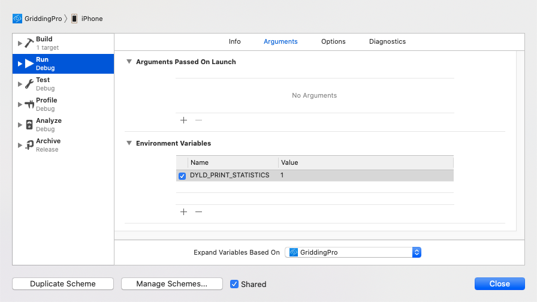
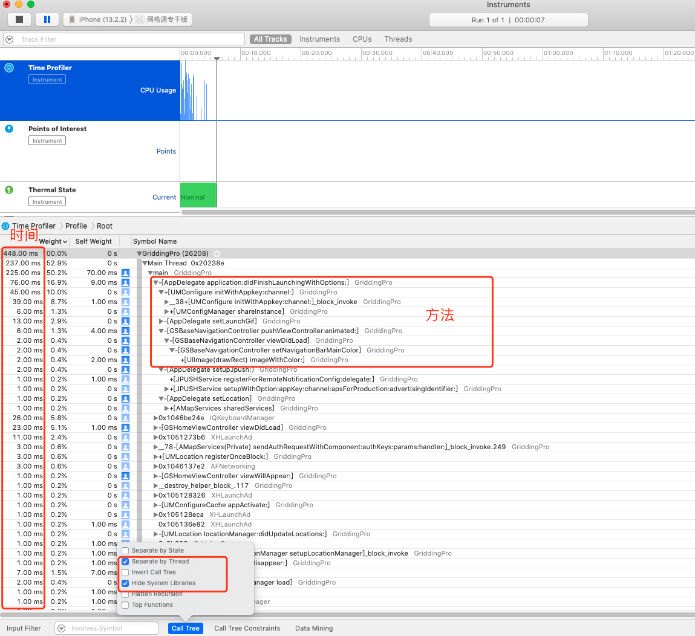

## 启动优化


>热启动与冷启动

- 热启动：当用户按下 home 键，iOS App 不会立刻被 kill，而是存活一段时间，这段时间里用户再打开 App，App 基本上不需要做什么，就能还原到退到后台前的状态。我们把 App 进程还在系统中，无需开启新进程的启动过程称为热启动。
- 冷启动：冷启动则是指 App 不在系统进程中，比如设备重启后，或是手动杀死 App 进程，又或是 App 长时间未打开过，用户再点击启动 App 的过程，这时需要创建一个新进程分配给 App。我们可以将冷启动看作一次完整的 App 启动过程。


### 冷启动

- App 启动最佳速度是400ms以内，因为从点击 App 图标启动，然后 Launch Screen 出现再消失的时间就是400ms；

- App 启动最慢不得大于20s，否则进程会被系统杀死；

  

冷启动的整个过程是指从用户唤起 App 开始到 `AppDelegate` 中的` didFinishLaunchingWithOptions` 方法执行完毕为止，并以执行 main() 函数的时机为分界点，分为` pre-main` 和 `main() `两个阶段。


**pre-main阶段**

pre-main 阶段指的是从用户唤起 App 到 main() 函数执行之前的过程。


通过Xcode查看

在 Xcode 中配置环境变量 DYLD_PRINT_STATISTICS 为 1

（Edit Scheme → Run → Arguments → Environment Variables）



运行Xcode后，打印结果如下：

```objective-c
Total pre-main time: 212.70 milliseconds (100.0%)
         dylib loading time:  59.10 milliseconds (27.7%)
        rebase/binding time:   7.77 milliseconds (3.6%)
            ObjC setup time:  34.79 milliseconds (16.3%)
           initializer time: 111.03 milliseconds (52.2%)
           slowest intializers :
             libSystem.B.dylib :   4.85 milliseconds (2.2%)
   libBacktraceRecording.dylib :   6.97 milliseconds (3.2%)
    libMainThreadChecker.dylib :  26.70 milliseconds (12.5%)
                  AFNetworking :  35.69 milliseconds (16.7%)
                   GriddingPro :  56.95 milliseconds (26.7%)
```

如果要更详细的信息，就设置 DYLD_PRINT_STATISTICS_DETAILS 为 1。

```objective-c
  total time: 772.00 milliseconds (100.0%)
  total images loaded:  444 (418 from dyld shared cache)
  total segments mapped: 101, into 3536 pages
  total images loading time: 385.71 milliseconds (49.9%)
  total load time in ObjC:  17.10 milliseconds (2.2%)
  total debugger pause time: 352.92 milliseconds (45.7%)
  total dtrace DOF registration time:   0.00 milliseconds (0.0%)
  total rebase fixups:  284,331
  total rebase fixups time:   3.30 milliseconds (0.4%)
  total binding fixups: 589,956
  total binding fixups time: 249.09 milliseconds (32.2%)
  total weak binding fixups time:   1.39 milliseconds (0.1%)
  total redo shared cached bindings time: 251.77 milliseconds (32.6%)
  total bindings lazily fixed up: 0 of 0
  total time in initializers and ObjC +load: 115.38 milliseconds (14.9%)
                         libSystem.B.dylib :   3.97 milliseconds (0.5%)
               libBacktraceRecording.dylib :   6.87 milliseconds (0.8%)
                           libobjc.A.dylib :   1.71 milliseconds (0.2%)
                libMainThreadChecker.dylib :  25.40 milliseconds (3.2%)
                              AFNetworking :  49.87 milliseconds (6.4%)
                        libswiftCore.dylib :   0.80 milliseconds (0.1%)
                               GriddingPro :  45.46 milliseconds (5.8%)
total symbol trie searches:    1433284
total symbol table binary searches:    0
total images defining weak symbols:  44
total images using weak symbols:  110
```


**mian()阶段**

对于 main() 阶段，主要测量的就是从 main() 函数开始执行到 didFinishLaunchingWithOptions 方法执行结束的耗时。


查看耗时方式有两种：

- 第一种方式（1）：手动插入代码，进行耗时计算

```objective-c
// 第一步：在 main() 函数里用变量 MainStartTime 记录当前时间
CFAbsoluteTime MainStartTime;
int main(int argc, char * argv[]) {
    MainStartTime = CFAbsoluteTimeGetCurrent();
    @autoreleasepool {
        return UIApplicationMain(argc, argv, nil, NSStringFromClass([AppDelegate class]));
    }
}

// 第二步：在 AppDelegate.m 文件中用 extern 声明全局变量 MainStartTime
extern CFAbsoluteTime MainStartTime;

// 第三步：在 didFinishLaunchingWithOptions 方法结束前，再获取一下当前时间，与 MainStartTime 的差值就是 main() 函数阶段的耗时
double mainLaunchTime = (CFAbsoluteTimeGetCurrent() - MainStartTime);
NSLog(@"main() 阶段耗时：%.2fms", mainLaunchTime * 1000);


打印结果：[26172:2104390] main() 阶段耗时：747.57ms
```

这种方式是比较简洁的一种耗时计算了


- 第一种方式（2）： 通过hook方式来进行耗时计算

也可以对 objc_msgSend 方法进行 hook 来掌握所有方法的执行耗时。

hook 方法的意思是，在原方法开始执行时换成执行其他你指定的方法，或者在原有方法执行前后执行你指定的方法，来达到掌握和改变指定方法的目的。

hook objc_msgSend 这种方式的优点是非常精确，而缺点是只能针对 Objective-C 的方法。当然，对于 c 方法和 block 也不是没有办法，你可以使用 libffi 的 ffi_call 来达成 hook，但缺点就是编写维护相关工具门槛高。


>为什么 hook 了 objc_msgSend 方法，就可以 hook 全部 Objective-C 的方法？

Objective-C 里每个对象都会指向一个类，每个类都会有一个方法列表，方法列表里的每个方法都是由 selector、函数指针和 metadata 组成的。

objc_msgSend 方法干的活儿，就是在运行时根据对象和方法的 selector 去找到对应的函数指针，然后执行。也就是说，objc_msgSend 是 Objective-C 里方法执行的必经之路，能够控制所有的 Objective-C 的方法。

objc_msgSend 本身是用汇编语言写的，这样做的原因主要有两个：

- 一个原因是，objc_msgSend 的调用频次最高，在它上面进行的性能优化能够提升整个 App 生命周期的性能。而汇编语言在性能优化上属于原子级优化，能够把优化做到极致。所以，这种投入产出比无疑是最大的。
- 另一个原因是，其他语言难以实现未知参数跳转到任意函数指针的功能。

[objc_msgSend 的源码](https://opensource.apple.com/source/objc4/objc4-723/runtime/Messengers.subproj/)

objc_msgSend 方法执行的逻辑是：先获取对象对应类的信息，再获取方法的缓存，根据方法的 selector 查找函数指针，经过异常错误处理后，最后跳到对应函数的实现。


Facebook 开源了一个库，可以在 iOS 上运行的 Mach-O 二进制文件中动态地重新绑定符号，这个库叫 [fishhook](https://github.com/facebook/fishhook)。

fishhook 实现的大致思路是，通过重新绑定符号，可以实现对 c 方法的 hook。dyld 是通过更新 Mach-O 二进制的 __DATA segment 特定的部分中的指针来绑定 lazy 和 non-lazy 符号，通过确认传递给 rebind_symbol 里每个符号名称更新的位置，就可以找出对应替换来重新绑定这些符号。


```
暂时未研究fishhook的使用，这种方式只能进行到这，
摘录戴铭《02 | App 启动速度怎么做优化与监控？》（https://time.geekbang.org/column/article/85331）
```


- 第二种方式：借助 Instruments 的 Time Profiler 工具查看耗时。

  使用Instruments之前先修改Xcode配置

  ```
  1、配置 Scheme。点击 Edit Scheme 找到 Profile 下的 Build Configuration，设置为 Debug。
  
  2、配置 PROJECT。点击 PROJECT，在 Build Settings 中找到 Build Options 选项里的 Debug Information Format，把 Debug 对应的值改为 DWARF with dSYM File。
  
  3、启动 Time Profiler，点击左上角红色圆形按钮开始检测，然后就可以看到执行代码的完整路径和对应的耗时。
  ```

为了方面查看应用程序中实际代码的执行耗时和代码路径实际所在的位置，可以勾选上 Call Tree 中的 Separate Thread 和 Hide System Libraries。



这种方式的优点是，开发类似工具成本不高，能够快速开发后集成到你的 App 中，以便在真实环境中进行检查。说到定时抓取，就会涉及到定时间隔的长短问题。

- 定时间隔设置得长了，会漏掉一些方法，从而导致检查出来的耗时不精确；
- 而定时间隔设置得短了，抓取堆栈这个方法本身调用过多也会影响整体耗时，导致结果不准确。

这个定时间隔如果小于所有方法执行的时间（比如 0.002 秒），那么基本就能监控到所有方法。但这样做的话，整体的耗时时间就不够准确。一般将这个定时间隔设置为 0.01 秒。

这样设置，对整体耗时的影响小，不过很多方法耗时就不精确了。但因为整体耗时的数据更加重要些，单个方法耗时精度不高也是可以接受的，所以这个设置也是没问题的。总结来说，定时抓取主线程调用栈的方式虽然精准度不够高，但也是够用的。


摘录：

[如何实现 iOS App 的冷启动优化](https://mp.weixin.qq.com/s/CIkpPlTrpMEV9lRTwcABrA)

戴铭 ： [02 | App 启动速度怎么做优化与监控？](https://time.geekbang.org/column/article/85331)

