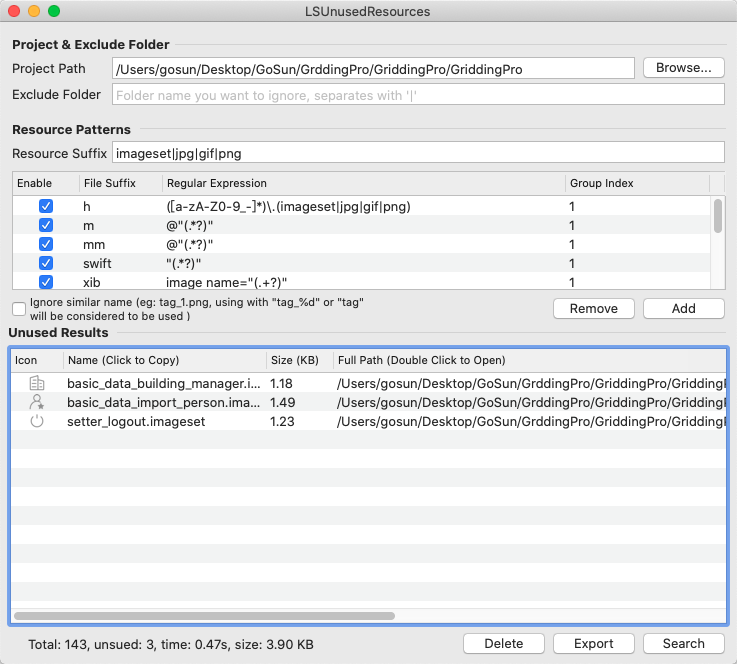
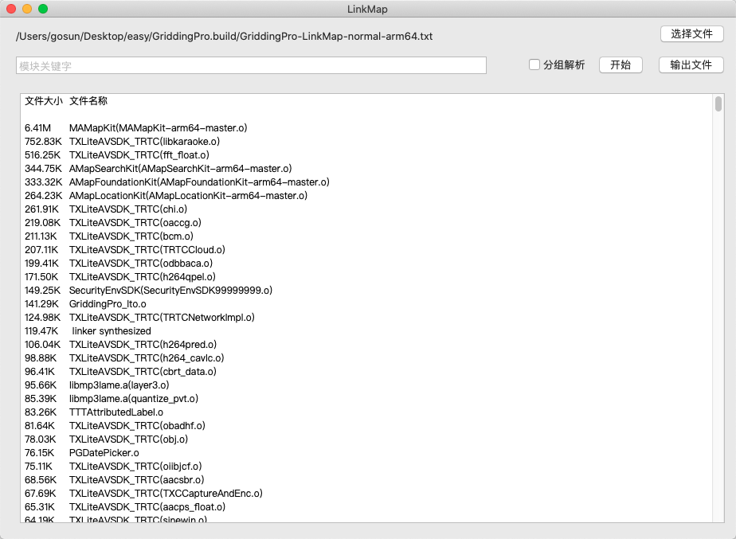
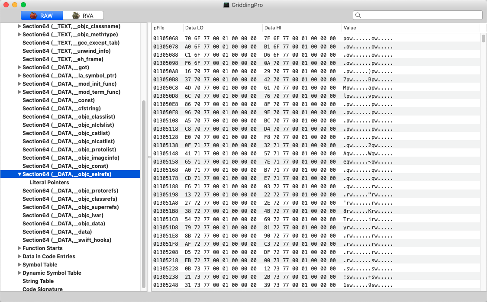

### App体积瘦身


iOS安装包是后缀为“ipa”的压缩包，解压后主要包含以下几部分：
  签名文件：里面的CodeResources包含对bundle中的所有资源文件的签名信息。
  资源文件：程序运行过程中需要的资源，比如图片、音频、视频、nib文件、配置文件等。
  可执行文件：是通过编译器、连接器将我们编写的代码、静态库、动态库编译成的文件，是程序的主体。其中静态库在链接时会被完整的复制到可执行文件中，被多次使用就有多份拷贝，动态库则是链接时不复制，程序运行时由系统动态加载到内存，系统只加载一次，多个程序共用。
  bundle文件：工程中使用的其他第三方或资源的bundle。


### 1.资源瘦身

- 无用图片删除    借助 [LSUnusedResources](https://github.com/tinymind/LSUnusedResources)

日积月累，项目中可能混有`未使用`或者`之前使用现在不需要使用`的图片，借助LSUnusedResources检测




需要注意最好进行一下手动的检察避免出现误删的情况，并且如果代码仅仅是注释掉，程序并不会认为资源是废弃的。


- 有用的图片压缩及按需分配清晰度

在切图片的时候请按需要切图，不必要每一张都是高清无码，在可接受的范围内可以压缩资源图片！


- 大图云端下载

不经常用到的大图资源可以采取下载的方式加载到APP上，不是非要打包到ipa里边！


### 2. 代码瘦身

当我们的App被打包成ipa的时候，代码会被打包成一个一个个的.o文件，而这些.o文件组成了MachO，而系统在编译MachO文件的时候会生成一个附带的文件LinkMap。


##### LinkMap组成

LinkMap由Object File、Section、Symbol三部分组成，描述了工程所有代码的信息。可以根据这些信息针对性的去优化空间。


##### LinkMap的获取

1.在XCode中开启编译选项`Write Link Map File \nXCode -> Project -> Build Settings -> 把Write Link Map File`设置为YES

2.在XCode中开启编译选项`Write Link Map File \nXCode -> Project -> Build Settings -> 把Path to Link Map File`的地方设置好地址

默认地址：`~/Library/Developer/Xcode/DerivedData/XXX-xxxxxxxxxxxxx/Build/Intermediates/XXX.build/Debug-iphoneos/XXX.build/`

3.运行项目在地址位置将生成.txt的文件


- #### LinkMap分析

  借助工具：[LinkMap](https://github.com/huanxsd/LinkMap)



针对性的进行代码的体积的优化，比如三方库占用空间巨量，有没其他的替代方案。在取舍两个相同库的时候也可以根据体积的比重做出取舍。

看到这里我们已经可以从宏观的角度上获取到需要优化哪些部分的代码，但是微观角度哪些是无用的类哪些是无用的方法，需要我们进一步从MachO的层面上去分析。


- ### MachO分析

  MachO文件可以说是App编译之后的最重要的部分，通过[MachOView](https://github.com/gdbinit/MachOView)这个软件我们可以更加直观看到MachO的组成。

  如果你的[MachOView运行的时候出现崩溃请按照这篇文章进行修改](https://blog.csdn.net/qq_22389025/article/details/80594300)。





##### MachO的组成

__objc_selrefs:记录了几乎所有被调用的方法

__ objc_classrefs和__objc_superrefs：记录了几乎所有使用的类

__objc_classlist:工程里所有的类的地址


##### 删除无用的类

...

##### 删除未使用的方法

...


- #### AppCode

如果你的工程不够巨大,借助AppCode这个工具的静态分析也可以查找到未使用的代码。方法极为简单`打开AppCode->选择Code->点击Inspect Code---等待静态分析`


- #### Architectures中删除不需要适配的arm等

  在Build Settings中搜索Architectures

armv6｜armv7｜armv7s｜arm64都是ARM处理器的指令集，这些指令集都是向下兼容的，例如armv7指令集兼容armv6，只是使用armv6的时候无法发挥出其性能，无法使用armv7的新特性，从而会导致程序执行效率没那么高。

i386｜x86_64 是Mac处理器的指令集，i386是针对intel通用微处理器32架构的。x86_64是针对x86架构的64位处理器。

Architectures：指定工程被编译成可支持哪些指令集类型，而支持的指令集越多，就会编译出包含多个指令集代码的数据包，对应生成二进制包就越大，也就是ipa包会变大。

Valid Architectures：限制可能被支持的指令集的范围，也就是Xcode编译出来的二进制包类型最终从这些类型产生，而编译出哪种指令集的包，将由Architectures与Valid Architectures（因此这个不能为空）的交集来确定，如：将Architectures支持arm指令集设置为：armv7,armv7s，对应的Valid Architectures的支持的指令集设置为：armv7s,arm64，那么此时，XCode生成二进制包所支持的指令集只有armv7s

Build Active Architecture Only： 指定是否只对当前连接设备所支持的指令集编译；其值设置为YES，这个属性设置为yes，是为了debug的时候编译速度更快，它只编译当前的architecture版本，而设置为no时，会编译所有的版本。 


目前iOS移动设备指令集

arm64：iPhone5S｜ iPad Air｜ iPad mini2(iPad mini with Retina Display)

armv7s：iPhone5｜iPhone5C｜iPad4(iPad with Retina Display)

armv7：iPhone3GS｜iPhone4｜iPhone4S｜iPad｜iPad2｜iPad3(The New iPad)｜iPad mini｜iPod Touch 3G｜iPod Touch4

armv6 设备： iPhone, iPhone2, iPhone3G, 第一代、第二代 iPod Touch（一般不需要去支持）

(测试删除armv7，ipa包少了10M，视不同项目而定)


- #### Optimization 修改为space

  在Build Settings中搜索Optimization

  

  1、Optimization Level：是指编译器的优化层度，优化后的代码效率比较高，但是可读性比较差，且编译时间更长。 它一共有以下几个选项:

  - None: 编译器不会尝试优化代码，当你专注解决逻辑错误、编译速度快时使用此项。

  - Fast: 编译器执行简单的优化来提高代码的性能，同时最大限度的减少编译时间，该选项在编译过程中会使用更多的内存。

  - Faster: 编译器执行所有优化，增加编译时间，提高代码的性能。

  - Fastest: 编译器执行所有优化，改善代码的速度，但会增加代码长度，编译速度慢。

  - Fastest, Smallest: 编译器执行所有优化，不会增加代码的长度，它是执行文件占用更少内存的首选方案

  所以说平时开发的时候可以选择使用None来不给代码执行优化，这样既可以减少编译时间，又可以看出你代码哪里有性能问题。
   而你的release版应该选择Fastest, Smalllest，这样既能执行所有的优化而不增加代码长度，又能使执行文件占用更少的内存。

  

  2、Optimization

  ```
  With no value, the compiler uses the default optimization. You can also specify time to optimize for speed of access or space to optimize for a smaller compiled asset catalogs.
  ```

官方的介绍说的是当Optimization设为time的时候会使存取的速度最优，而设为space的时候会使编译的包大小最小的优化。（测试发现少了0.1M）


摘录：

[看了这篇，面试官问你APP体积优化再也不用WTF了](https://juejin.im/post/5e969d816fb9a03c60188229)

[iOS代码瘦身实践:删除无用的类](https://juejin.im/post/5d5d1a92e51d45620923886a)