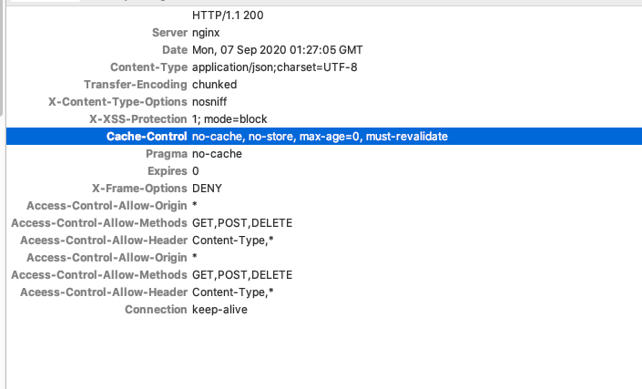

### NSURLCache


首先，`NSURLCache`提供的是内存以及磁盘的综合缓存机制。许多文章谈到，使用`NSURLCache`之前需要在`AppDelegate`中缓存空间的设置：

```objective-c
- (BOOL)application:(UIApplication *)application
    didFinishLaunchingWithOptions:(NSDictionary *)launchOptions
{
  NSURLCache *URLCache = [[NSURLCache alloc] initWithMemoryCapacity:4 * 1024 * 1024
                                                       diskCapacity:20 * 1024 * 1024
                                                           diskPath:nil];
  [NSURLCache setSharedURLCache:URLCache];
}
```

然而如果你不添加上面的代码，并且运行如下代码，可以看到：

```objective-c
print(NSURLCache.sharedURLCache().diskCapacity)
//output:
//10000000

print(NSURLCache.sharedURLCache().memoryCapacity)
//output:
//512000
```

也就是说，其实默认就已经设置好了512kb的内存缓存空间，以及10MB的磁盘缓存空间。可能你的代码中并没有写任何与`NSURLCache`有关的东西，但其实它已经默默的开始帮你进行缓存了。


#### 缓存策略

```objective-c
typedef NS_ENUM(NSUInteger, NSURLRequestCachePolicy)
{
    NSURLRequestUseProtocolCachePolicy = 0,// 默认值

    NSURLRequestReloadIgnoringLocalCacheData = 1,// 不使用缓存数据
    NSURLRequestReloadIgnoringLocalAndRemoteCacheData = 4,
    NSURLRequestReloadIgnoringCacheData = NSURLRequestReloadIgnoringLocalCacheData,

    NSURLRequestReturnCacheDataElseLoad = 2,// 无论缓存是否过期都是用缓存，没有缓存就进行网络请求
    NSURLRequestReturnCacheDataDontLoad = 3, // 无论缓存是否过期都是用缓存，没有缓存也不会进行网络请求

    NSURLRequestReloadRevalidatingCacheData = 5,
};
```

服务器返回的响应头中会有这样的字段：`Cache-Control: max-age` or `Cache-Control: s- maxage`，通过`Cache-Control`来指定缓存策略，`max-age`来表示过期时间。根据这些字段缓存机制再采用如下策略：

> - 如果本地没有缓存数据，则进行网络请求。
>
> - 如果本地有缓存，并且缓存没有失效，则使用缓存。
> - 如果缓存已经失效，则询问服务器数据是否改变，如果没改变，依然使用缓存，如果改变了则请求新数据。
> - 如果没有指定是否失效，那么系统将自己判断缓存是否失效。（通常认为是6-24小时的有效时间）

这也就是为什么，虽然`NSURLCache`一直在默默的缓存，但是我并没有感受到，当然或许你那里不一样。**no-cache表示不使用缓存，但是会缓存，no-store表示是不进行缓存。**


打开沙盒路径下的Library/Caches 中，你可以看到缓存文件：

Cache.db    Cache.db-shm	Cache.db-wal

在`Cache-Control: no-cache`的情况下，`NSURLCache`也会进行缓存，但是并不使用缓存数据。




**总结一下：**默认情况下`NSURLCache`的缓存策略是根据http协议来的，服务器通过`Cache-Control: max-age`字段来告诉`NSURLCache`是否需要缓存数据。

