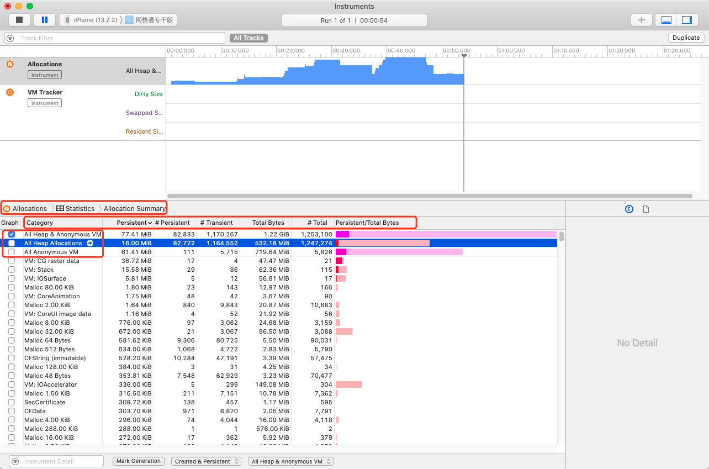
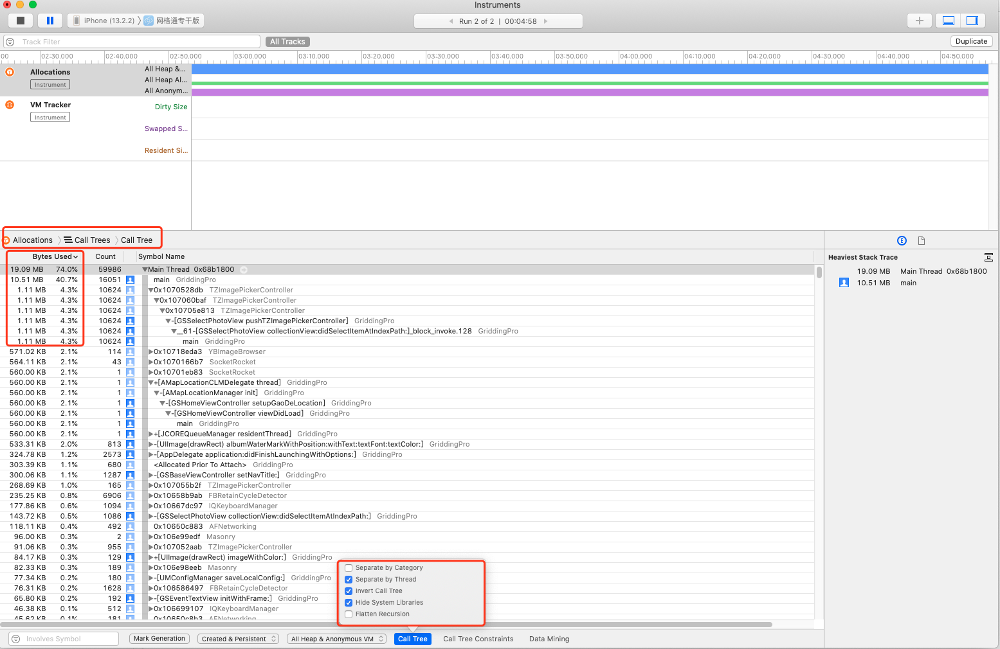
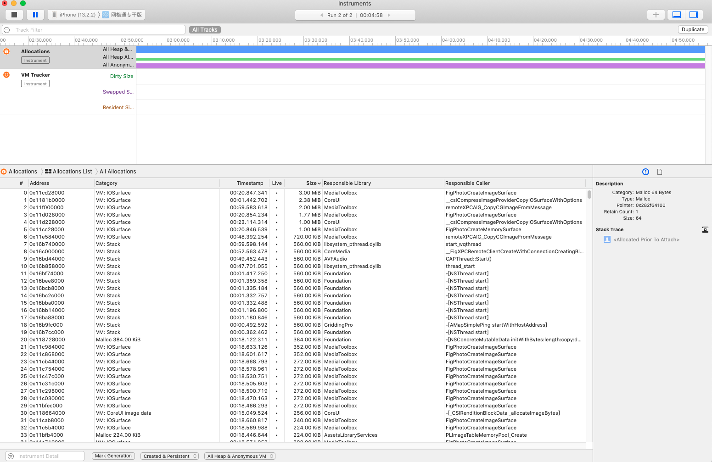

### Allcations : 内存分配

`All Heap & Anonymous VM` 堆内存+虚拟内存

`All Heap Allocations` 堆内存

`All Anonymous VM` 虚拟内存

VM:ImageIO_AppleJPEG -> 虚拟内存中占用最大的部分

- Category : 通常是一个 Core Foundation 对象、Objective-C 类、或原始 
内存块(block)

- Persistent Bytes ：净分配字节数 ，当前已经分配内存但是仍然没有被释放的字节的总数

- #Persistent : 净分配数，当前已经分配内存但仍然没有被释放的对象或内存块的数量

- #Transient : 临时分配数，当前已经分配内存但仍然没有被释放的对象或内存块的数量

- Total Bytes : 总分配字节数，所有已经分配内存,而且包括已经被释放了的 
字节的总数

- #Total : 总分配数，所有当前已经分配内存,包括已经被释放了的对象或内存 
块的总数

  

同样可以根据**CallTree**来查看，可以直接找到方法

Allcations List 

