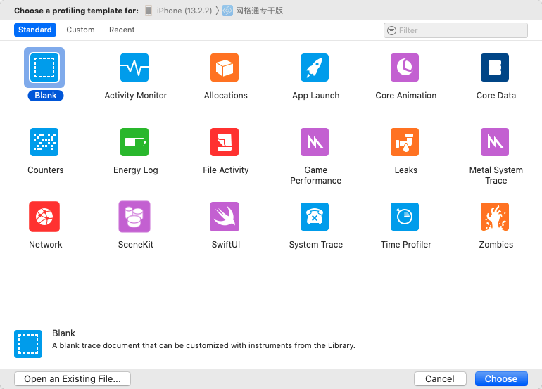

### Instruments

官方介绍：https://help.apple.com/instruments/mac/current/#//apple_ref/doc/uid/TP40004652-CH3-SW1

版本：11.3.1

#### 功能：

##### 1.追踪代码中的（甚至是那些`难以复现`的）问题；

##### 2.分析程序的性能（`CPU、内存性能等`）；

##### 3.实现程序的`自动化测试`；

##### 4.部分实现程序的`压力测试`；

##### 5.执行系统级别的通用问题追踪调试；

##### 6.了解程序的`内部运行`过程。

#### 常用模块：

**`Blank（空模板）`**：创建一个空的模板，可以从`Library 库`中添加其他模板；

**`Activity Monitor（活动监视器）`**：显示器处理的 CPU、内存和网络使用情况统计；

**`Allocations（内存分配）`**：跟踪过程的匿名虚拟内存和堆的对象提供类名和可选保留/释放历史；

**`Core Data`**：监测读取、缓存未命中、保存等操作，能直观显示是否保存次数远超实际需要。

**`Leaks（泄漏）`**：一般的查看内存`使用情况`，`检查泄漏`的内存，并提供了所有活动的分配和泄漏模块的类对象分配统计信息以及内存地址历史记录；

**`Network`**：跟踪 `TCP/IP`和 `UDP/IP` 连接。

**`Time Profiler（时间探查）`**：执行对系统的 CPU上运行的`进程低负载时间`为基础采样。

**`Automation（自动化）`**：这个模板执行它模拟`用户界面交互`为 iOS 手机应用从 instrument 启动的脚本；

**`Cocoa Layout`**：观察`约束`变化，找出`布局代码`的问题所在。

**`Automations`**：创建和编辑`测试脚本`来`自动化` iOS 应用的用户`界面测试`。

### Call Tree各个选项和功能：

**Separate by Thread：** 每个线程应该`分开考虑`。只有这样你才能揪出那些大量占用CPU的"重"线程

**Invert Call Tree：** `从上到下`跟踪堆栈，表中的方法将从第0帧开始取样，也就是说FuncA{FunB{FunC}} 勾选此项后堆栈以C->B-A 把`调用层级最深`的C显示在最外面

**Hide Missing Symbols：** 如果`dSYM`无法找到你的app或者系统框架的话，那么表中看不到`方法名`只能看到`十六进制`的数，如果`勾线`此项可以`隐藏`这些符号，便于`简化数据`

**Hide System Libraries：** 勾选此项会显示`app的代码`，这是非常有用的，因为通常你只关心cpu花在自己`代码上的时间`不是`系统上的时间`

**Show Obj-C Only：** `只显示oc代码`，如果你的程序是像OpenGl这样的程序，则不要勾选，因为他有可能是`C++`的

**Flatten Recursion：** `递归函数`， 每个堆栈跟踪一个条目

**Top Functions：** 这个选项让 Instruments 将一个函数的`整个CPU 时间`看成是在`该函数`中用去的 CPU 时间的`总合`，也就是该函数`调用`了的`所有函数`所花去的时间。比如函数 A 调用了函数 B，则 A 的时间就是 A 花去的时间加上 B 花去的时间。它允许你在追溯调用栈时获得`最大`的时间数，在你`最耗时`的方法上`归零`。

