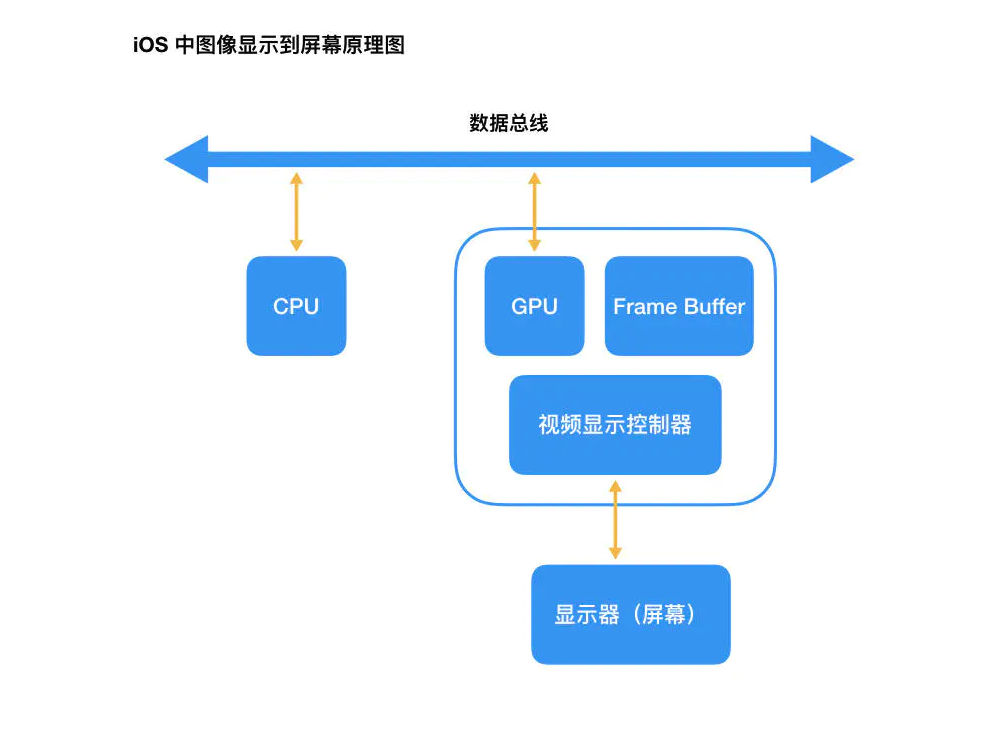

# iOS中图像显示原理

https://www.jianshu.com/p/72dd074728d8




#### 1.图像加载过程

iOS从磁盘加载一张图片，使用`UIImageView`显示在屏幕上，加载流程如下:

1. 我们使用 `+imageWithContentsOfFile:`(使用Image I/O创建`CGImageRef`内存映射数据)方法从磁盘中加载一张图片。此时，图片尚未解码。在这个过程中先从磁盘拷贝数据到内核缓冲区，再从内核缓冲区复制数据到用户空间。
2. 生成`UIImageView`，把图像数据赋值给`UIImageView`，如果图像数据未解码(PNG/JPG)，解码为位图数据。
3. 隐式`CATransaction `捕获到UIImageView layer树的变化。
4. 在主线程的下一个 runloop 到来时，`Core Animation` 提交了这个隐式的 `transaction` ，这个过程可能会对图片进行 `copy `操作，而受图片是否字节对齐等因素的影响，这个 `copy` 操作可能会涉及以下部分或全部步骤：

- 分配内存缓冲区用于管理文件 IO 和解压缩操作；
- 将文件数据从磁盘读到内存中；
- 将压缩的图片数据解码成未压缩的位图形式，这是一个非常耗时的 CPU 操作；
- 然后 `Core Animation` 中`CALayer`使用未压缩的位图数据渲染 `UIImageView` 的图层。
- 最后CPU计算好图片的`Frame`,对图片解压之后.就会交给GPU来做图片渲染。

5. 渲染流程

- GPU获取获取图片的坐标
- 将坐标交给顶点着色器(顶点计算)
- 将图片光栅化(获取图片对应屏幕上的像素点)
- 片元着色器计算(计算每个像素点的最终显示的颜色值)
- 从帧缓存区中渲染到屏幕上


在最简单的情况下，帧缓冲区只有一个，这时帧缓冲区的读取和刷新都都会有比较大的效率问题。为了解决效率问题，显示系统通常会引入两个缓冲区，即`双缓冲机制`。在这种情况下，GPU 会预先渲染好一帧放入一个缓冲区内，让视频控制器读取，当下一帧渲染好后，GPU 会直接把视频控制器的指针指向第二个缓冲器。如此一来效率会有很大的提升。

`双缓冲`虽然能解决效率问题，但会引入一个新的问题。当视频控制器还未读取完成时，即屏幕内容刚显示一半时，GPU 将新的一帧内容提交到帧缓冲区并把两个缓冲区进行交换后，视频控制器就会把新的一帧数据的下半段显示到屏幕上，造成画面撕裂现象。

为了解决这个问题，GPU 通常有一个机制叫做垂直同步（简写也是 `V-Sync`），当开启垂直同步后，GPU 会等待显示器的 VSync 信号发出后，才进行新的一帧渲染和缓冲区更新。这样能解决画面撕裂现象，也增加了画面流畅度，但需要消费更多的计算资源，也会带来部分延迟。

从上面我们也可以看到通常计算机在显示是CPU与GPU协同合作完成一次渲染.接下来我们了解一下CPU/GPU等在这样一次渲染过程中,具体的分工是什么?

- CPU: 计算视图`frame`，图片解码，需要绘制纹理图片通过数据总线交给GPU
- GPU: 纹理混合，顶点变换与计算,像素点的填充计算，渲染到帧缓冲区
- 时钟信号：垂直同步信号`V-Sync` / 水平同步信号`H-Sync`
- iOS设备双缓冲机制：显示系统通常会引入两个帧缓冲区，双缓冲机制（从相关资料可以知道，iOS 设备会始终使用双缓存，并开启垂直同步。而安卓设备直到 4.1 版本，Google 才开始引入这种机制，目前安卓系统是三缓存+垂直同步）
- 图片显示到屏幕上是CPU与GPU的协作完成 

对应用来说，图片是最占用手机内存的资源，将一张图片从磁盘中加载出来，并最终显示到屏幕上，中间其实经过了一系列复杂的处理过程。


#### 图片的解压缩

我们上面提到了图片的解压缩是一个非常耗时的 CPU 操作，并且它默认是在主线程中执行的。那么当需要加载的图片比较多时，就会对我们应用的响应性造成严重的影响，尤其是在快速滑动的列表上，这个问题会表现得更加突出。接下来就让我们来看下图片的解压缩过程。 


##### 1.为什么要解压缩 ?

图片的本质就是由许多的像素点构成的，而前面所说的`位图`实际上就是一个装着这些像素点的数组。而我们平时开发经常用的`PNG`或者`JPG`图片，都是一种压缩的位图图形格式。只不过 `PNG`图片是无损压缩，并且支持 alpha 通道。而 `JPEG` 图片则是有损压缩，可以指定 0-100% 的压缩比。苹果提供了以下这两个函数用来生成 `PNG `和 `JPEG` 图片，想必大家也不陌生：

```objective-c
// return image as PNG. May return nil if image has no CGImageRef or invalid bitmap format
UIKIT_EXTERN NSData * __nullable UIImagePNGRepresentation(UIImage * __nonnull image);

// return image as JPEG. May return nil if image has no CGImageRef or invalid bitmap format. compression is 0(most)..1(least)                           
UIKIT_EXTERN NSData * __nullable UIImageJPEGRepresentation(UIImage * __nonnull image, CGFloat compressionQuality);
```

从上面我们可以知道图片分辨率越高，图片包含的像素点就越高，从而图片解压缩成位图的过程耗时也就越长。这个解压缩的过程我们是必须经过的，因为图片显示的过程其实就是将构成图片的一个个像素点显示出来，从而组成我们的图片。 因此，在将磁盘中的图片渲染到屏幕之前，必须先要得到图片的原始像素数据（位图），才能执行后续的绘制操作。

#####  2.iOS 中图片解压缩的原理

 既然图片的解压缩不可避免，而我们也不想让它在主线程执行，影响我们应用的响应性，那么是否有比较好的解决方案呢？当然有，想必你也想到了，在主线程执行解压缩影响性能，那放在子线程不就可以了吗？

我们前面已经提到了，当未解压缩的图片将要渲染到屏幕时，系统会在主线程对图片进行解压缩，而如果图片已经解压缩了，系统就不会再对图片进行解压缩。因此，也就有了业内的解决方案，在子线程提前对图片进行强制解压缩。

而强制解压缩的原理就是对图片进行重新绘制，得到一张新的解压缩后的位图。其中，用到的最核心的函数是 `CGBitmapContextCreate` ：

```objective-c
CG_EXTERN CGContextRef __nullable CGBitmapContextCreate(void * __nullable data,
    size_t width, size_t height, size_t bitsPerComponent, size_t bytesPerRow,
    CGColorSpaceRef cg_nullable space, uint32_t bitmapInfo)
    CG_AVAILABLE_STARTING(__MAC_10_0, __IPHONE_2_0);
```

该函数相关参数说明：

- **data** ：如果不为 `NULL` ，那么它应该指向一块大小至少为 `bytesPerRow * height` 字节的内存；如果 为 `NULL` ，那么系统就会为我们自动分配和释放所需的内存，所以一般指定 `NULL` 即可；
- **width** 和**height** ：位图的宽度和高度，分别赋值为图片的像素宽度和像素高度即可；
- **bitsPerComponent** ：像素的每个颜色分量使用的 bit 数，在 RGB 颜色空间下指定 8 即可；
- **bytesPerRow**：位图的每一行使用的字节数，大小至少为 `width * bytes per pixel` 字节。当我们指定 `0/NULL` 时，系统不仅会为我们自动计算，而且还会进行 `cache line alignment` 的优化
- **space** ：就是我们前面提到的颜色空间，一般使用 RGB 即可；
- **bitmapInfo**：位图的布局信息.`kCGImageAlphaPremultipliedFirst`


常用的图片三方库YYImage和 SDWebImage中，均有使用的这个函数
用于解压缩图片的函数 `YYCGImageCreateDecodedCopy` 存在于 `YYImageCoder` 类中，核心代码如下

```objective-c
CGImageRef YYCGImageCreateDecodedCopy(CGImageRef imageRef, BOOL decodeForDisplay) {
    ...

    if (decodeForDisplay) { // decode with redraw (may lose some precision)
        CGImageAlphaInfo alphaInfo = CGImageGetAlphaInfo(imageRef) & kCGBitmapAlphaInfoMask;

        BOOL hasAlpha = NO;
        if (alphaInfo == kCGImageAlphaPremultipliedLast ||
            alphaInfo == kCGImageAlphaPremultipliedFirst ||
            alphaInfo == kCGImageAlphaLast ||
            alphaInfo == kCGImageAlphaFirst) {
            hasAlpha = YES;
        }

        // BGRA8888 (premultiplied) or BGRX8888
        // same as UIGraphicsBeginImageContext() and -[UIView drawRect:]
        CGBitmapInfo bitmapInfo = kCGBitmapByteOrder32Host;
        bitmapInfo |= hasAlpha ? kCGImageAlphaPremultipliedFirst : kCGImageAlphaNoneSkipFirst;

        CGContextRef context = CGBitmapContextCreate(NULL, width, height, 8, 0, YYCGColorSpaceGetDeviceRGB(), bitmapInfo);
        if (!context) return NULL;

        CGContextDrawImage(context, CGRectMake(0, 0, width, height), imageRef); // decode
        CGImageRef newImage = CGBitmapContextCreateImage(context);
        CFRelease(context);

        return newImage;
    } else {
        ...
    }
}
```

它接受一个原始的位图参数 `imageRef` ，最终返回一个新的解压缩后的位图 `newImage` ，中间主要经过了以下三个步骤：

- 使用 `CGBitmapContextCreate` 函数创建一个位图上下文；
- 使用 `CGContextDrawImage` 函数将原始位图绘制到上下文中；
- 使用 `CGBitmapContextCreateImage` 函数创建一张新的解压缩后的位图。

事实上，SDWebImage 中对图片的解压缩过程与上述完全一致，只是传递给 `CGBitmapContextCreate` 函数的部分参数存在细微的差别

**性能对比:**

- 在解压PNG图片,`SDWebImage`>`YYImage`
- 在解压JPEG图片,`SDWebImage`<`YYImage`


#### 总结：

1. 图片文件只有在确认要显示时,CPU才会对齐进行解压缩.因为解压是非常消耗性能的事情.解压过的图片就不会重复解压,会缓存起来.

2. 图片渲染到屏幕的过程: 

   a. CPU 读取文件->计算Frame->图片解码->解码后纹理图片位图数据通过数据总线交给GPU 

   b. GPU获取图片Frame->顶点变换计算->光栅化->根据纹理坐标获取每个像素点的颜色值(如果出现透明值需要将每个像素点的颜色*透明度值)->渲染到帧缓存区->渲染到屏幕

