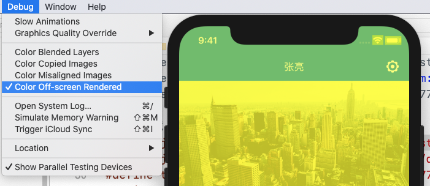
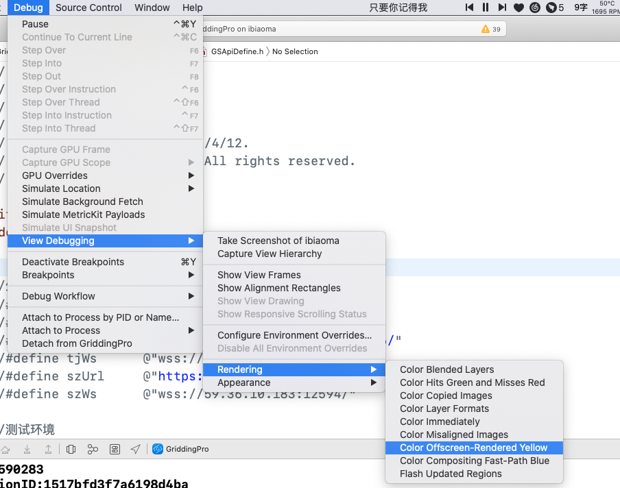
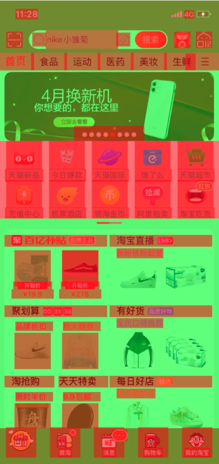
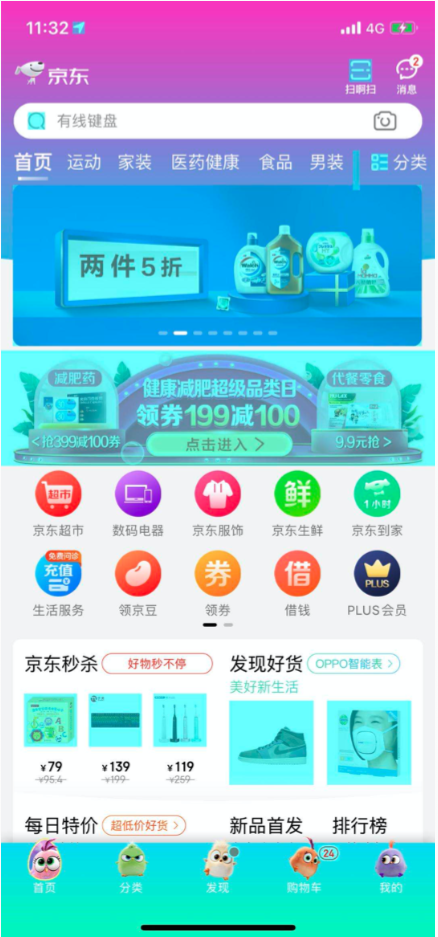
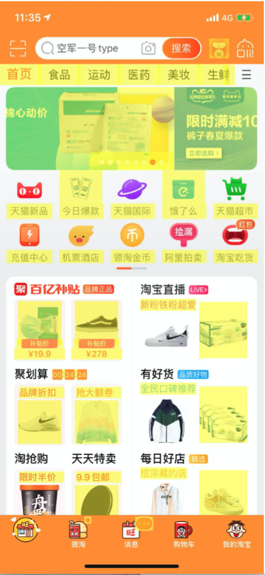

### 屏幕渲染的检测

首页阅读[iOS 保持界面流畅的技巧]()


名词解释

- **在屏渲染（On-Screen Rendering）**

  指的是GPU的渲染操作是在当前用于显示的屏幕缓冲区进行

- **离屏渲染**

  指的是在GPU在当前屏幕缓冲区以外开辟一个缓冲区进行渲染操作


**屏幕显示图像的原理**

显示器 显示出来的图像是经过 CRT电子枪一行一行的扫描.(可以是横向的也可以是纵向 ,具体CRT电子枪又是什么,百度文库介绍的很详细.),扫描出来就呈现了一帧画面,随后电子枪又会回到初始位置循环扫描,为了让显示器的显示跟视频控制器同步,当电子枪新扫描一行的时候.准备扫描的时候,会发送一个 水平同步信号(HSync信号),而当一帧画面绘制完成后,电子枪回复到原位，准备画下一帧前，显示器会发出一个垂直同步信号（vertical synchronization简称 VSync），显示器一般是固定刷新频率的,这个刷新的频率其实就是VSync信号产生的频率. 然后CPU计算好frame等属性,就将计算好的内容提交给GPU去渲染,GPU渲染完成之后就会放入帧缓冲区,然后视频控制器会按照VSync信号逐行读取帧缓冲区的数据,经过可能的数模转换传递给显示器.就显示出来了.


离屏渲染的代价很高,想要进行离屏渲染,首选要创建一个新的缓冲区,屏幕渲染会有一个上下文环境的一个概念,离屏渲染的整个过程需要切换上下文环境,先从 当前屏幕切换到离屏,等结束后,又要将上下文环境切换回来.这也是为什么会消耗性能的原因了.
 。由于垂直同步的机制，如果在一个 VSync 时间内，CPU 或者 GPU 没有完成内容提交，则那一帧就会被丢弃，等待下一次机会再显示，而这时显示屏会保留之前的内容不变。这就是界面卡顿的原因。


当使用圆角，阴影，遮罩的时候，图层属性的混合体被指定为在未预合成之前(下一个VSync信号开始前)不能直接在屏幕中绘制，所以就需要屏幕外渲染。


##### 哪些操作会触发 离屏渲染?

- shouldRasterize（光栅化）

  （将图转化为一个个栅格组成的图象。 光栅化特点：每个元素对应帧缓冲区中的一像素。）

- masks（遮罩）

- shadows（阴影）

- edge antialiasing（抗锯齿）

- group opacity（不透明）

- 复杂形状设置圆角等

- 渐变

- Text（UILabel, CATextLayer, Core Text, etc）...


#### 官方对离屏渲染产生性能问题也进行了优化：

##### iOS9.0之前UIImageView跟UIButton设置圆角都会触发离屏渲染。

##### iOS9.0之后UIButton设置圆角会触发离屏渲染，而UIImageView设置圆角不会触发离屏渲染了，但是如果设置其他阴影效果之类的还是会触发离屏渲染

##### 第二种方式：使用贝塞尔曲线UIBezierPath和Core Graphics框架画出一个圆角


### 检测屏幕渲染

> ### Xcode 自带Debug 


**模拟器**



**真机**




- ##### Color Blended Layer 图层混合

```
首先我们要明白像素的概念，屏幕上每一个点都是一个像素，像素有R、G、B三种颜色构成(有时候还带有alpha值)。如果某一块区域上覆盖了多个layer,最后的显示效果受到这些layer的共同影响。举个例子，上层是蓝色(RGB=0,0,1),透明度为50%，下层是红色(RGB=1,0,0)。那么最终的显示效果是紫色(RGB=0.5,0,0.5)。这种颜色的混合(blending)需要消耗一定的GPU资源，因为实际上可能不止只有两层。如果只想显示最上层的蓝色，可以把它的透明度设置为100%，这样GPU会忽略下面所有的layer，从而节约了很多不必要的运算。
```

标识区域使用多种混合图层：



红色：混合图层

绿色：没有使用混合

调优：减少红色区域

			1. 设置opaque属性为true【代码初始化默认值为true,xib或者nib默认值为false】
   			2.  给View设置一个不透明的颜色，

```
这个选项基于渲染程度对屏幕中的混合区域进行绿到红的高亮（也就是多个半透明图层的叠加）。由于重绘的原因，混合对GPU性能会有影响，同时也是滑动或者动画帧率下降的罪魁祸首之一。

GPU每一帧可以绘制的像素有一个最大限制（就是所谓的fill rate），这个情况下可以轻易地绘制整个屏幕的所有像素。但是如果由于重叠图层的关系需要不停地重绘同一区域的话，掉帧就可能发生了。

GPU会放弃绘制那些完全被其他图层遮挡的像素，但是要计算出一个图层是否被遮挡也是相当复杂并且会消耗处理器资源。同样，合并不同图层的透明重叠像素（即混合）消耗的资源也是相当客观的。所以为了加速处理进程，不到必须时刻不要使用透明图层。任何情况下，你应该这样做：

给视图的backgroundColor属性设置一个固定的，不透明的颜色
设置opaque属性为YES
如果用到了图像，尽量避免透明除非非常必要。如果图像要显示在一个固定的背景颜色或是固定的背景图之前，你没必要相对前景移动，你只需要预填充背景图片就可以避免运行时混色了。
如果是文本的话，一个白色背景的UILabel（或者其他颜色）会比透明背景要更高效。

Color Blended Layers”正是用于检测哪里发生了图层混合，并用红色标记出来。因此我们需要尽可能减少看到的红色区域。一旦发现应该想法设法消除它。
```


- ##### Color Hits green add Misses Red 光栅化（缓存layer）

检测layer是否使用shouldRasterize, 为true开启光栅化（默认），光栅化会将layer预先渲染为位图bitmap,然后缓存，从而提高性能。

注意：光栅化的核心在于缓存的思想。

红色： 光栅化

绿色：未光栅化 

```
调优：适用内容不变的layer,  不适合tableView，会造成多余离屏渲染降低性能（原因：系统给光栅化限制了内存，如果超过就会离屏渲染）。

这是因为layer进行光栅化后渲染成位图放在缓存中。当屏幕出现滑动时，我们直接从缓存中读取而不必渲染，所以会看到绿色。当新的label出现时，缓存中没有个这个label的位图，所以会变成红色。第三点比较关键，缓存中的对象有效期只有100ms，即如果在0.1s内没有被使用就会自动从缓存中清理出去。这就是为什么停留一会儿再滑动就会看到红色。当我们使用得当时，光栅化可以提供很大的性能优势，但是一定要避免作用在内容不断变动的图层上，否则它缓存方面的好处就会消失，而且会让性能变的更糟。
```


- ##### Color Copied Images 图片格式检测与复制

Shows images that are copied by Core Animation in blue苹果官方注释被拷贝给CPU进行转化的图片显示为绿色。那么这句话怎么理解呢？如果GPU不支持当前图片的颜色格式，那么就会将图片交给CPU预先进行格式转化，并且这张图片标记为蓝色。那么GPU支持什么格式呢？苹果的GPU只解析32bit的颜色格式，如果使用Color Copied Images去调试发现是蓝色。

CPU主要处理两件事：
（1）把图片从PNG或JPEG等格式中解压出来，得到像素数据
（2）如果GPU不支持这种颜色各式，CPU需要进行格式转换
比如应用中有一些从网络下载的图片，而GPU恰好不支持这个格式，这就需要CPU预先进行格式转化。



知识扩展：32bit指的是图片颜色深度，用“位”来表示，用来表示显示颜色数量，例如一个图片支持256种颜色，那么就需要256个不同的值来表示不同的颜色，也就是从0到255，二进制表示就是从00000000到11111111，一共需要8位二进制数，所以颜色深度是8。通常32bit色彩中使用三个8bit分别表示R红G绿B蓝,还有一个8bit常用来表示透明度（Alpha）


- ##### Color misaliged Images 图片尺寸匹配

目标像素与源像素不对齐的图像， 比如图片大小和UIImageView大小不一致。

**颜色标识**：洋红色（图片没有像素对齐）， 黄色（图片缩放）



调优：要尽可能保证无论是本地图片还是从网络或取得图片的大小，都与其frame保持一致。


- ##### Color Offscreen_Rendered Yellow 离屏渲染

离屏渲染就是GPU新开一个缓冲区进行渲染操作，渲染结束后再切换当前屏幕渲染，非常消耗性能，实际开发应该避免。

**标记颜色**：黄色(发生离屏渲染)


**优化**：尽量避免黄色，避免造成离屏渲染方法的调用。


- ##### Color Compositing Fast-Path Blue 快速路径

标记由硬件绘制的路径，显示蓝色，越多越好。 可以直接对OpenGL绘制的图像高亮。

```
离屏渲染的最后一步是把此前的多个路径组合起来。如果这个组合过程能由CPU完成，就会大量减少GPU的工作。这种技术在绘制地图中可能用到。
```

**颜色标记**：蓝色

这个选项会对任何直接使用OpenGL绘制的图层进行高亮。如果仅仅使用UIKit或者Core Animation的API，那么不会有任何效果。如果使用GLKView或者CAEAGLLayer，那如果不显示蓝色块的话就意味着你正在强制CPU渲染额外的纹理，而不是绘制到屏幕。


- ##### Flash updated Regions 重绘区域

这个选项会对重绘的内容高亮成黄色,重绘就是指使用Core Graphics绘制，绘制会损耗一定的性能，因此重绘区域应该越小越好。

**颜色标识**：黄色


- ##### Color Immediately 颜色刷新频率

当执行颜色刷新的时候移除10ms的延迟，因为可能在特定情况下你不需要这些延迟，所以使用此选项加快颜色刷新的频率。不过一般这个调试选项我们是用不到的。


