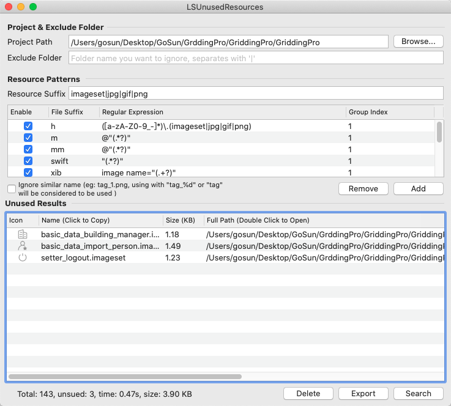
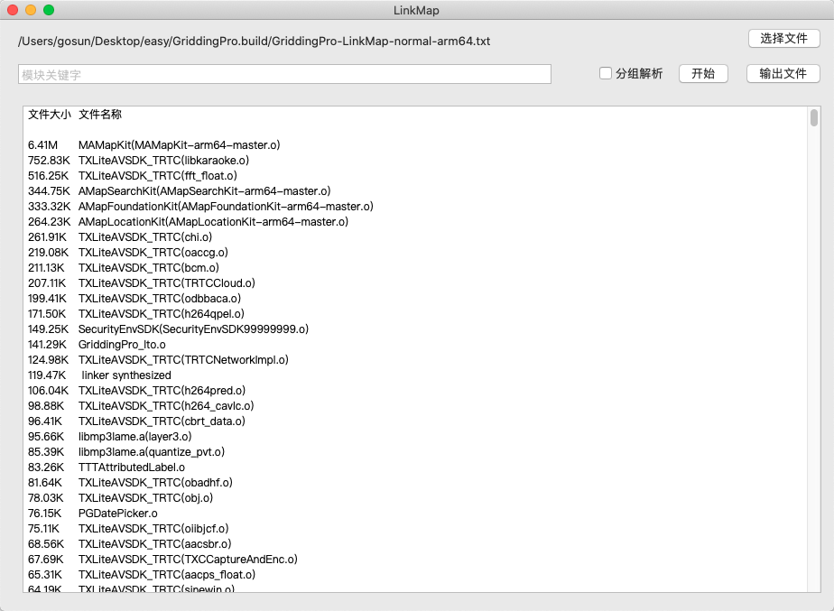
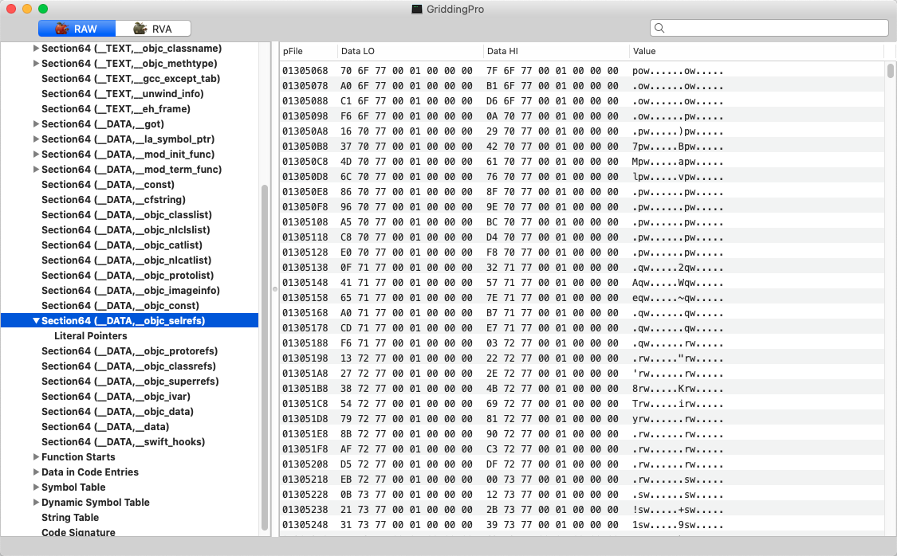

### App体积瘦身

### 1.资源瘦身

- 无用图片删除    借助 [LSUnusedResources](https://github.com/tinymind/LSUnusedResources)

日积月累，项目中可能混有`未使用`或者`之前使用现在不需要使用`的图片，借助LSUnusedResources检测

需要注意最好进行一下手动的检察避免出现误删的情况，并且如果代码仅仅是注释掉，程序并不会认为资源是废弃的。

- 有用的图片压缩及按需分配清晰度

在切图片的时候请按需要切图，不必要每一张都是高清无码，在可接受的范围内可以压缩资源图片！

- 大图云端下载

不经常用到的大图资源可以采取下载的方式加载到APP上，不是非要打包到ipa里边！

### 2. 代码瘦身

当我们的App被打包成ipa的时候，代码会被打包成一个一个个的.o文件，而这些.o文件组成了MachO，而系统在编译MachO文件的时候会生成一个附带的文件LinkMap。

##### LinkMap组成

LinkMap由Object File、Section、Symbol三部分组成，描述了工程所有代码的信息。可以根据这些信息针对性的去优化空间。

##### LinkMap的获取

1.在XCode中开启编译选项`Write Link Map File \nXCode -> Project -> Build Settings -> 把Write Link Map File`设置为YES

2.在XCode中开启编译选项`Write Link Map File \nXCode -> Project -> Build Settings -> 把Path to Link Map File`的地方设置好地址

默认地址：`~/Library/Developer/Xcode/DerivedData/XXX-xxxxxxxxxxxxx/Build/Intermediates/XXX.build/Debug-iphoneos/XXX.build/`

3.运行项目在地址位置将生成.txt的文件

- #### LinkMap分析

  借助工具：[LinkMap](https://github.com/huanxsd/LinkMap)

针对性的进行代码的体积的优化，比如三方库占用空间巨量，有没其他的替代方案。在取舍两个相同库的时候也可以根据体积的比重做出取舍。

看到这里我们已经可以从宏观的角度上获取到需要优化哪些部分的代码，但是微观角度哪些是无用的类哪些是无用的方法，需要我们进一步从MachO的层面上去分析。

- ### MachO分析

  MachO文件可以说是App编译之后的最重要的部分，通过[MachOView](https://github.com/gdbinit/MachOView)这个软件我们可以更加直观看到MachO的组成。

  如果你的[MachOView运行的时候出现崩溃请按照这篇文章进行修改](https://blog.csdn.net/qq_22389025/article/details/80594300)。

##### MachO的组成

__objc_selrefs:记录了几乎所有被调用的方法

__ objc_classrefs和__objc_superrefs：记录了几乎所有使用的类

__objc_classlist:工程里所有的类的地址

##### 删除无用的类

...

##### 删除未使用的方法

...

- #### AppCode

如果你的工程不够巨大,借助AppCode这个工具的静态分析也可以查找到未使用的代码。方法极为简单`打开AppCode->选择Code->点击Inspect Code---等待静态分析`

摘录：

[看了这篇，面试官问你APP体积优化再也不用WTF了](https://juejin.im/post/5e969d816fb9a03c60188229)

[iOS代码瘦身实践:删除无用的类](https://juejin.im/post/5d5d1a92e51d45620923886a)