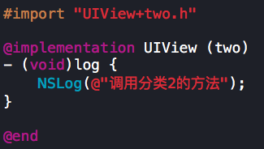
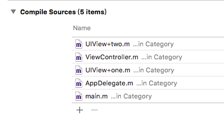
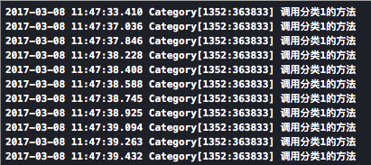
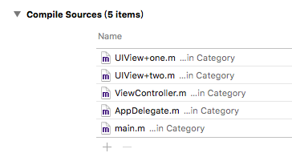
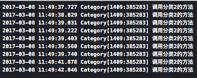

Category 与 Extension

### Category

运行时决议

1、独立于新的 .h .m文件

2、只能给某个已有的类扩充方法，不能扩充成员变量

3、Category的方法和类中原有方法同名，运行时会优先调用category中的方法。也就是，category中的方法会覆盖掉类中原有的方法。所以开发中尽量保证不要让分类中的方法和原有类中的方法名相同。避免出现这种情况的解决方案是给分类的方法名统一添加前缀。

4、如果多个category中存在同名的方法，运行时到底调用哪个方法由编译器决定，最后一个参与编译的方法会被调用。

例如：给UIView添加了两个category（one 和 two），并且给这两个分类都添加了名为log的方法：

调用log方法：

当编译顺序如下图所示时，调用UIView + one.m的log方法

将UIView + one.m移动到UIView + two.m上面，调用UIView + two.m的log方法

**调用优先级**

分类(category) > 本类 > 父类。即，优先调用cateory中的方法，然后调用本类方法，最后调用父类方法。

### Extension

编译时决议

只以声明的形式存在，往往写在.m中

方法属性均可添加，但都是私有的

可以为系统类添加分类，但不能添加扩展

参考：

[Category VS Extension 原理详解](http://www.cocoachina.com/ios/20170502/19163.html)
