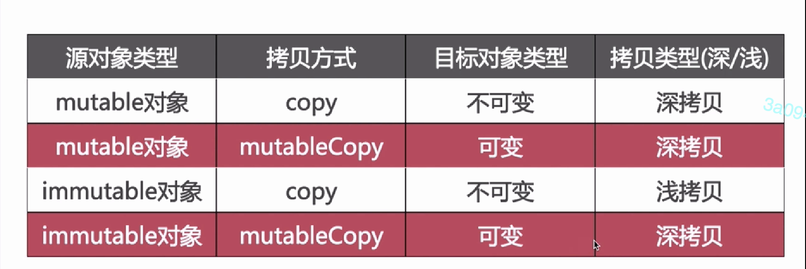

属性property中的那些修饰字

1、读写类

readwrite

readonly

2、原子类

atomic: 原子性，线程安全；会添加线程锁，但是做不到真正的、完全的线程安全。而且他还消耗资源。
如：atomic修饰一个数组,对数组赋值或获取是线程安全的，但是对这个数组进行操作（增加、删除）则不一定线程安全

nonatomic:    非原子性，线程不安全；也就是在多线程的环境下，不会给你添加线程锁，当然添加线程锁必定会消耗资源，所以如果没有特殊需求，还是用nonatomic。

3、引用计数

retain

strong 

weak
    不改变被i修饰对象的引用计数
    所指对象在被释放后会自动置为nil

assign
    修饰基本数据类型（int，BOOL）（可修饰对象）
    修饰对象类型时，不改变其引用计数
    所修饰的对象被释放后，assign会继续指向改内存地址，产生悬垂指针

copy

---

补充：

property （编译器）会自动帮助我们生成 getter方法、setter方法和带下划线的成员变量

如果重写getter方法和setter方法，编译器就不会帮助我们生成带下划线的成员变量

如果一个属性带有readonly且我们自己重写了getter方法，编译器又不会帮助我们生成带下划线的成员变量，需要自己补充上去（readonly只会生成getter方法）

##### 问：@property(copy) NSMutableArray *array;   会导致什么问题？

如果赋值过来的是NSMutableArray,copy之后是NSArray

 如果赋值过来的是NSArray,copy之后是NSArray

###### 一、weak实现原理：

Runtime维护了一个weak表，用于存储指向某个对象的所有weak指针。weak表其实是一个hash（哈希）表，Key是所指对象的地址，Value是weak指针的地址（这个地址的值是所指对象的地址）数组。

1、初始化时：runtime会调用objc_initWeak函数，初始化一个新的weak指针指向对象的地址。

2、添加引用时：objc_initWeak函数会调用 objc_storeWeak() 函数， objc_storeWeak() 的作用是更新指针指向，创建对应的弱引用表。

3、释放时，调用clearDeallocating函数。clearDeallocating函数首先根据对象地址获取所有weak指针地址的数组，然后遍历这个数组把其中的数据设为nil，最后把这个entry从weak表中删除，最后清理对象的记录。

###### 二、实现weak后，为什么对象释放后会自动为nil？

runtime对注册的类， 会进行布局，对于weak对象会放入一个hash表中。 用weak指向的对象内存地址作为key，当此对象的引用计数为0的时候会dealloc，假如weak指向的对象内存地址是a，那么就会以a为键， 在这个weak表中搜索，找到所有以a为键的weak对象，从而设置为nil。

###### 三、当weak引用指向的对象被释放时，又是如何去处理weak指针的呢？

1、调用objc_release

2、因为对象的引用计数为0，所以执行dealloc

3、在dealloc中，调用了_objc_rootDealloc函数

4、在_objc_rootDealloc中，调用了object_dispose函数

5、调用objc_destructInstance

6、最后调用objc_clear_deallocating,详细过程如下：

a. 从weak表中获取废弃对象的地址为键值的记录

b. 将包含在记录中的所有附有 weak修饰符变量的地址，赋值为 nil

c. 将weak表中该记录删除

d. 从引用计数表中删除废弃对象的地址为键值的记录

---
