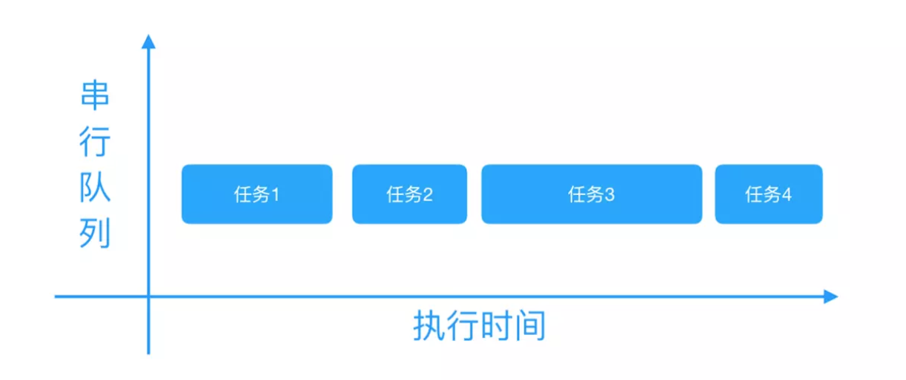
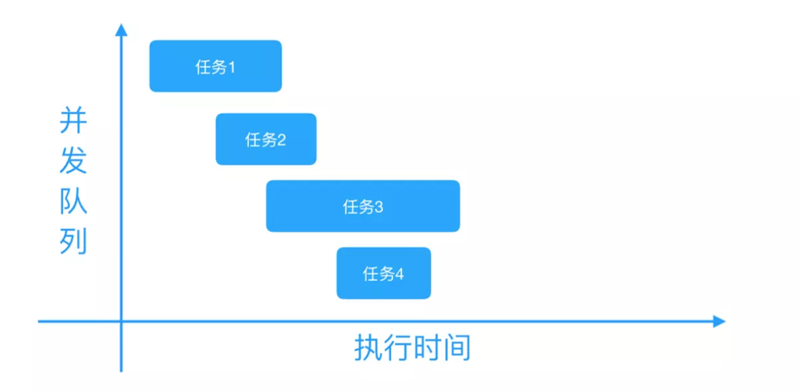
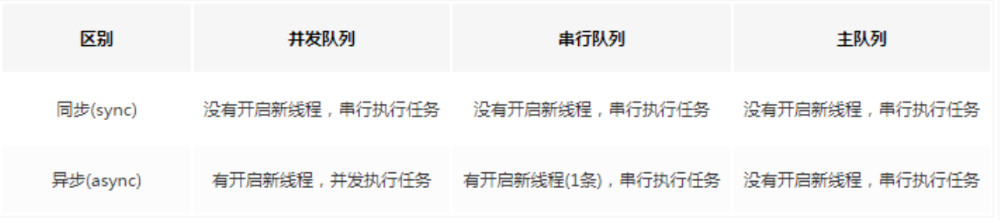
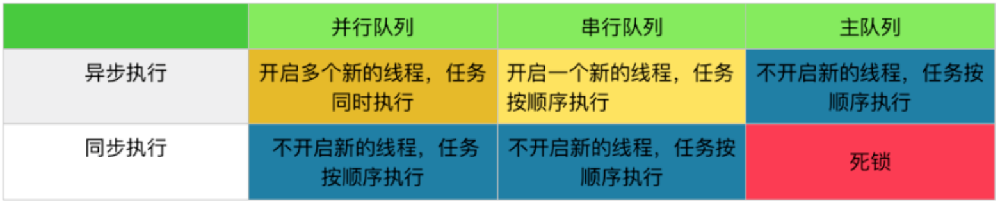

##### GCD


[https://bujige.net/blog/iOS-Complete-learning-GCD.html](https://bujige.net/blog/iOS-Complete-learning-GCD.html)

http://www.cocoachina.com/ios/20170707/19769.html

https://www.jianshu.com/p/2d57c72016c6

http://www.cocoachina.com/ios/20170829/20404.html

Grand Central Dispatch(GCD) 是 Apple 开发的一个多核编程的较新的解决方法。它主要用于优化应用程序以支持多核处理器以及其他对称多处理系统。它是一个在线程池模式的基础上执行的并发任务。

好处：

```
GCD 可用于多核的并行运算

GCD 会自动利用更多的 CPU 内核（比如双核、四核）

GCD 会自动管理线程的生命周期（创建线程、调度任务、销毁线程）

程序员只需要告诉 GCD 想要执行什么任务，不需要编写任何线程管理代码
```

- **同步执行（sync）：**

同步添加任务到指定的队列中，在添加的任务执行结束之前，会一直等待，直到队列里面的任务完成之后再继续执行。

只能在当前线程中执行任务，不具备开启新线程的能力

- **异步执行（async）：**

异步添加任务到指定的队列中，它不会做任何等待，可以继续执行任务。

可以在新的线程中执行任务，具备开启新线程的能力。

注意： 异步执行（async） 虽然具有开启新线程的能力，但是并不一定开启新线程。

#### **队列（Dispatch Queue）**：

这里的队列指执行任务的等待队列，即用来存放任务的队列。队列是一种特殊的线性表，采用 FIFO（先进先出）的原则，即新任务总是被插入到队列的末尾，而读取任务的时候总是从队列的头部开始读取。每读取一个任务，则从队列中释放一个任务。

在 GCD 中有两种队列：串行队列和并发队列。

- **串行队列（Serial Dispatch Queue）：**

每次只有一个任务被执行。让任务一个接着一个地执行。（只开启一个线程，一个任务执行完毕后，再执行下一个任务）

- **并发队列（Concurrent Dispatch Queue）：**

异步添加任务到指定的队列中，它不会做任何等待，可以继续执行任务。

注意：并发队列 的并发功能只有在异步（dispatch_async）函数下才有效





#### **队列的创建/获取**

1、可以使用dispatch_queue_create来创建队列，需要传入两个参数，第一个参数表示队列的唯一标识符，用于 DEBUG，可为空，Dispatch Queue 的名称推荐使用应用程序 ID 这种逆序全程域名；第二个参数用来识别是串行队列还是并发队列。**DISPATCH_QUEUE_SERIAL**表示串行队列，**DISPATCH_QUEUE_CONCURRENT**表示并发队列。

```
// 串行队列的创建方法
dispatch_queue_t queue = dispatch_queue_create("com.ibiaoma.gcdDemo", DISPATCH_QUEUE_SERIAL);
// 并发队列的创建方法
dispatch_queue_t queue = dispatch_queue_create("com.ibiaoma.gcdDemo", DISPATCH_QUEUE_CONCURRENT);
```

2、对于串行队列，GCD 提供了的一种特殊的串行队列：**主队列（Main Dispatch Queue）**。

- 所有放在主队列中的任务，都会放到主线程中执行。

- 可使用dispatch_get_main_queue()获得主队列。
  
  ```
  // 主队列的获取方法
  dispatch_queue_t queue = dispatch_get_main_queue();
  ```

3、对于并发队列，GCD 默认提供了**全局并发队列（Global Dispatch Queue）**

    可以使用dispatch_get_global_queue来获取。需要传入两个参数。第一个参数表示队列优先级，一般用DISPATCH_QUEUE_PRIORITY_DEFAULT。第二个参数暂时没用，用0即可。

```
// 全局并发队列的获取方法
dispatch_queue_t queue = dispatch_get_global_queue(DISPATCH_QUEUE_PRIORITY_DEFAULT, 0);
```

#### **任务的创建**

```
// 同步执行任务创建方法
dispatch_sync(queue, ^{
    // 这里放同步执行任务代码
});
// 异步执行任务创建方法
dispatch_async(queue, ^{
    // 这里放异步执行任务代码
});
```





### **基本使用**

##### 1、同步 + 并发队列

##### 在当前线程中执行任务，不会开启新线程，执行完一个任务，再执行下一个任务。

```
- (void)syncConcurrent
{
    NSLog(@"currentThread---%@",[NSThread currentThread]);  // 打印当前线程
    NSLog(@"syncConcurrent---begin");


    //    创建一个并发队列
    dispatch_queue_t queue = dispatch_queue_create("com.ibiaoma.gcdDemo", DISPATCH_QUEUE_CONCURRENT);

    //创建同步线程1
    dispatch_sync(queue, ^{
        for (int i = 0; i < 2; ++i) {
            [NSThread sleepForTimeInterval:2];  // 模拟耗时操作
            NSLog(@" 1 --- %@",[NSThread currentThread]);
        }
    });

    //创建同步线程2
    dispatch_sync(queue, ^{
        for (int i = 0; i < 2; ++i) {
            [NSThread sleepForTimeInterval:2];  // 模拟耗时操作
            NSLog(@" 2 --- %@",[NSThread currentThread]);
        }
    });

    //创建同步线程3
    dispatch_sync(queue, ^{
        for (int i = 0; i < 2; ++i) {
            [NSThread sleepForTimeInterval:2];  // 模拟耗时操作
            NSLog(@" 3 --- %@",[NSThread currentThread]);
        }
    });

    NSLog(@"syncConcurrent---end");
}

打印：
currentThread---<NSThread: 0x6040002624c0>{number = 1, name = main}
syncConcurrent---begin
 1 --- <NSThread: 0x6040002624c0>{number = 1, name = main}
 1 --- <NSThread: 0x6040002624c0>{number = 1, name = main}
 2 --- <NSThread: 0x6040002624c0>{number = 1, name = main}
 2 --- <NSThread: 0x6040002624c0>{number = 1, name = main}
 3 --- <NSThread: 0x6040002624c0>{number = 1, name = main}
 3 --- <NSThread: 0x6040002624c0>{number = 1, name = main}
syncConcurrent---end
```

从同步执行 + 并发队列中可看到：

- 所有任务都是在当前线程（主线程）中执行的，没有开启新的线程（同步执行不具备开启新线程的能力）。

- 所有任务都在打印的syncConcurrent---begin和syncConcurrent---end之间执行的（同步任务需要等待队列的任务执行结束）。

- 任务按顺序执行的。按顺序执行的原因：虽然并发队列可以开启多个线程，并且同时执行多个任务。但是因为本身不能创建新线程，只有当前线程这一个线程（同步任务不具备开启新线程的能力），所以也就不存在并发。而且当前线程只有等待当前队列中正在执行的任务执行完毕之后，才能继续接着执行下面的操作（同步任务需要等待队列的任务执行结束）。所以任务只能一个接一个按顺序执行，不能同时被执行

##### 2、**异步 + 并发队列**

```
- (void)asyncConcurrent
{
    NSLog(@"currentThread---%@",[NSThread currentThread]);  // 打印当前线程
    NSLog(@"asyncConcurrent---begin");

    //    创建一个并发队列
    dispatch_queue_t queue = dispatch_queue_create("com.ibiaoma.gcdDemo", DISPATCH_QUEUE_CONCURRENT);

    // 创建异步线程1
    dispatch_async(queue, ^{
        for (int i = 0; i < 2; ++i) {
            [NSThread sleepForTimeInterval:2];  // 模拟耗时操作
            NSLog(@"1 --- %@", [NSThread currentThread]);
        }
    });

    // 创建异步线程2
    dispatch_async(queue, ^{
        for (int i = 0; i < 2; ++i) {
            [NSThread sleepForTimeInterval:2];  // 模拟耗时操作
            NSLog(@" 2 --- %@",[NSThread currentThread]);
        }
    });

    // 创建异步线程3
    dispatch_async(queue, ^{
        for (int i = 0; i < 2; ++i) {
            [NSThread sleepForTimeInterval:2];  // 模拟耗时操作
            NSLog(@" 3 --- %@",[NSThread currentThread]);
        }
    });

    NSLog(@"syncConcurrent---end");
}

打印
currentThread---<NSThread: 0x6000000703c0>{number = 1, name = main}
asyncConcurrent---begin
syncConcurrent---end
 3 --- <NSThread: 0x604000270300>{number = 5, name = (null)}
 2 --- <NSThread: 0x60000027f080>{number = 4, name = (null)}
1 --- <NSThread: 0x604000270700>{number = 3, name = (null)}
1 --- <NSThread: 0x604000270700>{number = 3, name = (null)}
 2 --- <NSThread: 0x60000027f080>{number = 4, name = (null)}
 3 --- <NSThread: 0x604000270300>{number = 5, name = (null)}
```

在异步执行 + 并发队列中可以看出：

除了当前线程（主线程），系统又开启了3个线程，并且任务是交替/同时执行的。（异步执行具备开启新线程的能力。且并发队列可开启多个线程，同时执行多个任务）。

所有任务是在打印的syncConcurrent---begin和syncConcurrent---end之后才执行的。说明当前线程没有等待，而是直接开启了新线程，在新线程中执行任务（异步执行不做等待，可以继续执行任务）。

##### 3、**同步 + 串行队列**

```
- (void)syncSerial
{
    NSLog(@"currentThread---%@",[NSThread currentThread]);  // 打印当前线程
    NSLog(@"asyncConcurrent---begin");

    //创建一个串行队列
    dispatch_queue_t queue = dispatch_queue_create("com.ibiaoma.gcdDemo", DISPATCH_QUEUE_SERIAL);

    //创建同步线程1
    dispatch_sync(queue, ^{
        for (int i = 0; i < 2; ++i) {
            [NSThread sleepForTimeInterval:2];  // 模拟耗时操作
            NSLog(@"1 --- %@", [NSThread currentThread]);
        }
    });
    //创建同步线程2
    dispatch_sync(queue, ^{
        for (int i = 0; i < 2; ++i) {
            [NSThread sleepForTimeInterval:2];  // 模拟耗时操作
            NSLog(@"2 --- %@", [NSThread currentThread]);
        }
    });
    //创建同步线程3
    dispatch_sync(queue, ^{
        for (int i = 0; i < 2; ++i) {
            [NSThread sleepForTimeInterval:2];  // 模拟耗时操作
            NSLog(@"3 --- %@", [NSThread currentThread]);
        }
    });
    NSLog(@"syncConcurrent---end");
}

打印：
currentThread---<NSThread: 0x60000007d5c0>{number = 1, name = main}
asyncConcurrent---begin
1 --- <NSThread: 0x60000007d5c0>{number = 1, name = main}
1 --- <NSThread: 0x60000007d5c0>{number = 1, name = main}
2 --- <NSThread: 0x60000007d5c0>{number = 1, name = main}
2 --- <NSThread: 0x60000007d5c0>{number = 1, name = main}
3 --- <NSThread: 0x60000007d5c0>{number = 1, name = main}
3 --- <NSThread: 0x60000007d5c0>{number = 1, name = main}
syncConcurrent---end
```

在同步执行 + 串行队列可以看到：

- 所有任务都是在当前线程（主线程）中执行的，并没有开启新的线程（同步执行不具备开启新线程的能力）。

- 所有任务都在打印的syncConcurrent---begin和syncConcurrent---end之间执行（同步任务需要等待队列的任务执行结束）。

- 任务是按顺序执行的（串行队列每次只有一个任务被执行，任务一个接一个按顺序执行）。

##### 4、**异步 + 串行队列**

```
- (void)asyncSerial
{
    NSLog(@"currentThread---%@",[NSThread currentThread]);  // 打印当前线程
    NSLog(@"asyncConcurrent---begin");

    //创建一个串行队列
    dispatch_queue_t queue = dispatch_queue_create("com.ibiaoma.gcdDemo", DISPATCH_QUEUE_SERIAL);

    //创建一个异步线程1
    dispatch_async(queue, ^{
        for (int i = 0; i < 2; ++i) {
            [NSThread sleepForTimeInterval:2];  // 模拟耗时操作
            NSLog(@"1 --- %@", [NSThread currentThread]);
        }
    });
    //创建一个异步线程2
    dispatch_async(queue, ^{
        for (int i = 0; i < 2; ++i) {
            [NSThread sleepForTimeInterval:2];  // 模拟耗时操作
            NSLog(@"2 --- %@", [NSThread currentThread]);
        }
    });
    //创建一个异步线程3
    dispatch_async(queue, ^{
        for (int i = 0; i < 2; ++i) {
            [NSThread sleepForTimeInterval:2];  // 模拟耗时操作
            NSLog(@"3 --- %@", [NSThread currentThread]);
        }
    });
    NSLog(@"syncConcurrent---end");
}

打印：
currentThread---<NSThread: 0x604000261b40>{number = 1, name = main}
asyncConcurrent---begin
syncConcurrent---end
1 --- <NSThread: 0x60000047ee80>{number = 3, name = (null)}
1 --- <NSThread: 0x60000047ee80>{number = 3, name = (null)}
2 --- <NSThread: 0x60000047ee80>{number = 3, name = (null)}
2 --- <NSThread: 0x60000047ee80>{number = 3, name = (null)}
3 --- <NSThread: 0x60000047ee80>{number = 3, name = (null)}
3 --- <NSThread: 0x60000047ee80>{number = 3, name = (null)}
```

在异步执行 + 串行队列可以看到：

- 开启了一条新线程（异步执行具备开启新线程的能力，串行队列只开启一个线程）。

- 所有任务是在打印的syncConcurrent---begin和syncConcurrent---end之后才开始执行的（异步执行不会做任何等待，可以继续执行任务）。

- 任务是按顺序执行的（串行队列每次只有一个任务被执行，任务一个接一个按顺序执行）。

##### 5.1、**同步执行 + 主队列**

```
- (void)syncMain
{
    NSLog(@"currentThread---%@",[NSThread currentThread]);  // 打印当前线程
    NSLog(@"asyncConcurrent---begin");

    //获取主队列
    dispatch_queue_t queue = dispatch_get_main_queue();
    //创建同步线程1
    dispatch_sync(queue, ^{
        for (int i = 0; i < 2; ++i) {
            [NSThread sleepForTimeInterval:2];  // 模拟耗时操作
            NSLog(@"1 --- %@", [NSThread currentThread]);
        }
    });
    //创建同步线程2
    dispatch_sync(queue, ^{
        for (int i = 0; i < 2; ++i) {
            [NSThread sleepForTimeInterval:2];  // 模拟耗时操作
            NSLog(@"2 --- %@", [NSThread currentThread]);
        }
    });
    //创建同步线程3
    dispatch_sync(queue, ^{
        for (int i = 0; i < 2; ++i) {
            [NSThread sleepForTimeInterval:2];  // 模拟耗时操作
            NSLog(@"3 --- %@", [NSThread currentThread]);
        }
    });
    NSLog(@"syncConcurrent---end");
}

打印：
currentThread---<NSThread: 0x604000064ac0>{number = 1, name = main}
asyncConcurrent---begin
(lldb)
```

在同步执行 + 主队列可以惊奇的发现：

- 在主线程中使用同步执行 + 主队列，追加到主线程的任务1、任务2、任务3都不再执行了，而且syncMain---end也没有打印，在XCode 9上还会报崩溃。这是为什么呢？

这是因为我们在主线程中执行syncMain方法，相当于把syncMain任务放到了主线程的队列中。而同步执行会等待当前队列中的任务执行完毕，才会接着执行。那么当我们把任务1追加到主队列中，任务1就在等待主线程处理完syncMain任务。而syncMain任务需要等待任务1执行完毕，才能接着执行。

那么，现在的情况就是syncMain任务和任务1都在等对方执行完毕。这样大家互相等待，所以就卡住了，所以我们的任务执行不了，而且syncMain---end也没有打印。

```
补充：通常情况下，在一个线程正在执行一个串行队列sQueue上任务的过程中，再次调用dispatch_sync同步执行这个串行队列sQueue在上的任务，就会引起死锁

// 同一串行线程 sync死锁
- (void)deadLock
{
    NSLog(@"1");
    dispatch_queue_t queue = dispatch_queue_create("com.ibiaoma.gcdDemo", DISPATCH_QUEUE_SERIAL);
    dispatch_async(queue, ^{
        NSLog(@"2");
        dispatch_sync(queue, ^{
            NSLog(@"3");
        });
    });
    NSLog(@"4");
}

打印：
（界面卡死）
ThreadDemo[2042:59383] 1
ThreadDemo[2042:59383] 4
ThreadDemo[2042:59555] 2
```

##### 5.2**在其他线程中调用同步执行 + 主队列**

```
// 使用 NSThread 的 detachNewThreadSelector 方法会创建线程，并自动启动线程执行
 selector 任务
[NSThread detachNewThreadSelector:@selector(syncMain) toTarget:self withObject:nil];
```

在其他线程中使用同步执行 + 主队列可看到：

- 所有任务都是在主线程（非当前线程）中执行的，没有开启新的线程（所有放在主队列中的任务，都会放到主线程中执行）。

- 所有任务都在打印的syncConcurrent---begin和syncConcurrent---end之间执行（同步任务需要等待队列的任务执行结束）。

- 任务是按顺序执行的（主队列是串行队列，每次只有一个任务被执行，任务一个接一个按顺序执行）。

**为什么现在就不会卡住了呢？**

因为syncMain 任务放到了其他线程里，而任务1、任务2、任务3都在追加到主队列中，这三个任务都会在主线程中执行。syncMain 任务在其他线程中执行到追加任务1到主队列中，因为主队列现在没有正在执行的任务，所以，会直接执行主队列的任务1，等任务1执行完毕，再接着执行任务2、任务3。所以这里不会卡住线程。

##### 6、**异步 + 主队列**

```
- (void)asyncMain
{
    NSLog(@"currentThread---%@",[NSThread currentThread]);  // 打印当前线程
    NSLog(@"asyncConcurrent---begin");
    //获取主队列
    dispatch_queue_t queue = dispatch_get_main_queue();
    //创建异步线程1
    dispatch_async(queue, ^{
        for (int i = 0; i < 2; ++i) {
            [NSThread sleepForTimeInterval:2];  // 模拟耗时操作
            NSLog(@"1 --- %@", [NSThread currentThread]);
        }
    });
    //创建异步线程2
    dispatch_async(queue, ^{
        for (int i = 0; i < 2; ++i) {
            [NSThread sleepForTimeInterval:2];  // 模拟耗时操作
            NSLog(@"2 --- %@", [NSThread currentThread]);
        }
    });
    //创建异步线程3
    dispatch_async(queue, ^{
        for (int i = 0; i < 2; ++i) {
            [NSThread sleepForTimeInterval:2];  // 模拟耗时操作
            NSLog(@"3 --- %@", [NSThread currentThread]);
        }
    });
    NSLog(@"syncConcurrent---end");
}

打印：
currentThread---<NSThread: 0x60000007f500>{number = 1, name = main}
asyncConcurrent---begin
syncConcurrent---end
1 --- <NSThread: 0x60000007f500>{number = 1, name = main}
1 --- <NSThread: 0x60000007f500>{number = 1, name = main}
2 --- <NSThread: 0x60000007f500>{number = 1, name = main}
2 --- <NSThread: 0x60000007f500>{number = 1, name = main}
3 --- <NSThread: 0x60000007f500>{number = 1, name = main}
3 --- <NSThread: 0x60000007f500>{number = 1, name = main}
```

在异步 + 主队列可以看到：

- 所有任务都是在当前线程（主线程）中执行的，并没有开启新的线程（虽然异步执行具备开启线程的能力，但因为是主队列，所以所有任务都在主线程中）。

- 所有任务是在打印的syncConcurrent---begin和syncConcurrent---end之后才开始执行的（异步执行不会做任何等待，可以继续执行任务）。

- 任务是按顺序执行的（因为主队列是串行队列，每次只有一个任务被执行，任务一个接一个按顺序执行）。
