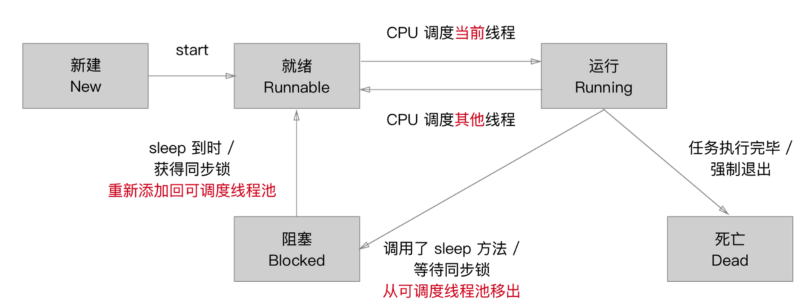

#### 线程与进程

##### 进程：

- 进程是指在系统中正在运行的一个应用程序，比如同时打开微信和Xcode，系统会分别启动2个进程;
- 每个进程之间是独立的，每个进程均运行在其专用且受保护的内存空间内;

##### 线程：

- 一个进程要想执行任务，必须得有线程（每一个进程至少要有一条线程)，是进程中执行运算的最小单位，是进程中的一个实体，是被系统独立调度和分派的基本单位;
- 一个进程（程序）的所有任务都在线程中执行;
- 一个程序有且只有一个主线程，程序启动时创建（调用main来启动），主线程的生命周期是和应用程序绑定，程序退出时，主线程也停止;
- 同一时间内，一个线程只能执行一个任务,若要在1个进程中执行多个任务，那么只能一个个的按顺序执行这些任务（线程的串行);
- 线程自己不拥有系统资源，只拥有在运行中必不可少的资源，但它可与同属一个进程的其它线程共享进程所拥有的全部资源;

##### 线程的几种状态：

- 新建状态：新创建一个线程对象；
- 就绪状态：线程对象创建之后，其他线程调用了该对象的start方法，该状态的线程位于可运行线程池中，变得可运行，等待获取CPU的使用权；
- 运行状态：就绪状态的线程获取了CPU，执行程序代码；
- 阻塞状态：因某种原因放弃CPU使用权，暂停运行，知道线程进入就绪状态，才有机会转到运行状态；
- 死亡状态：线程执行完了或者因异常退出了run方法，线程生命周期结束；

##### 进程和线程比较：

- 线程是CPU调度（执行任务）的最小单位，是程序执行的最小单元;
- 进程是CPU分配资源和调度的单位;
- 一个程序可以对应多个进程，一个进程可以有多个线程，但至少要有一个线程，而一个线程只能属于一个进程;
- 同一个进程内的线程共享进程的所有资源;

##### 多线程：

- 概念：一个进程中可以开启多条线程，每一条线程可以并行（同时）执行不同的任务;
- 原理：同一时间，CPU只能处理一条线程，只有一条线程在工作，多线程并发（同时）执行，其实是CPU快速的在多条线程之间调度（切换），如果CPU调度线程的时间足够快，就造成了多线程并发执行的假象;
- 注意：如果线程很多，CPU会在N多线程之间调度，会消耗大量CPU资源，每条线程被调度执行的频次会降低（线程的执行效率会降低);

##### 多线程的优缺点：

- 优点: 能适当的提高程序的执行效率以及资源利用率（CPU、内存利用率）
- 缺点: 创建线程是有开销的，iOS下主要成本包括：内核数据结构（大约1kb）、栈空间（子线程512kb，主线程1MB）、创建线程大约需要90毫秒的创建时间,如果开启大量的线程，会降低程序的性能（一般最多3到5个）;线程越多，CPU在调度线程上的开销就越大; 程序设计更加复杂(比如线程之间的通信、多线程的数据共享)

##### 主线程:

- 一个iOS程序运行后，默认会开启1条线程，称为“主线程”或“UI线程”
- 作用: 显示／刷新UI界面, 处理UI事件（点击事件，滚动事件，拖拽事件）
- 使用注意:不要将耗时的操作放到主线程中，耗时操作应放在子线程（后台线程，非主线程); 凡是和UI相关的操作应放在主线程中操作

##### iOS中多线程的实现方案：

- pthread ：一套通用的多线程API，适用于Unix、Linux、Windows等系统，跨平台、可移植，使用难度大，c语言，线程生命周期由程序员管理
- NSTread：oc语言，面向对象，简单易用，可直接操作线程对象 ，线程生命周期由程序员管理
- GCD:（常用）替代NSTread等线程技术，充分利用设备的多核，线程生命周期自动管理，c语言
- NSOperation:（常用）底层是GCD，比GCD多了一些更简单实用的功能，使用更加面向对象，线程生命周期自动管理
